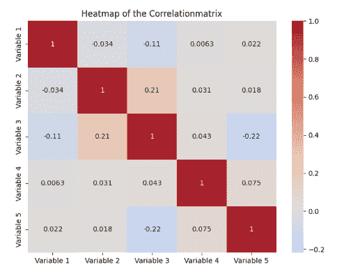
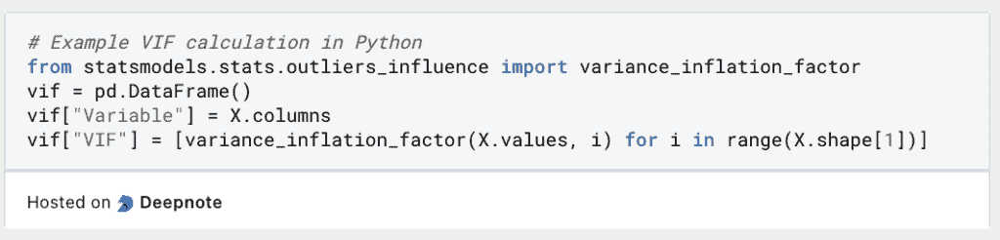
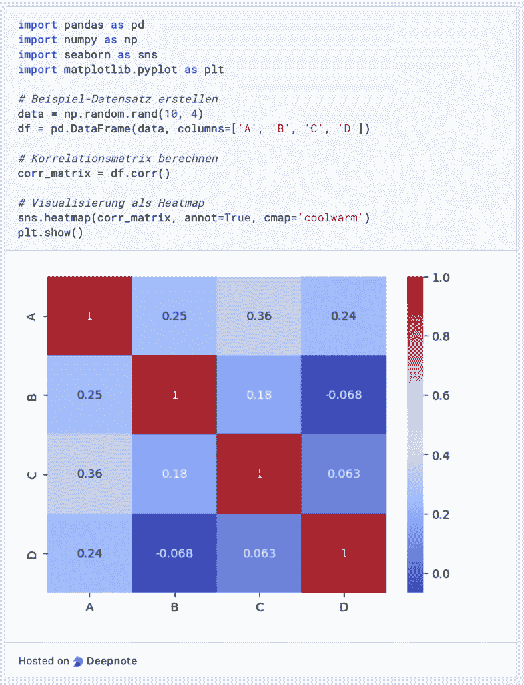

# 当预测变量冲突时：掌握多重共线性回归中的 VIF

> 原文：[`towardsdatascience.com/when-predictors-collide-mastering-vif-in-multicollinear-regression/`](https://towardsdatascience.com/when-predictors-collide-mastering-vif-in-multicollinear-regression/)

在<mdspan datatext="el1744829723173" class="mdspan-comment">回归模型</mdspan>中，自变量必须彼此不相关或只有轻微的相关性，即它们之间没有相关性。然而，如果存在这种相关性，这被称为多重共线性，会导致模型不稳定和难以解释的结果。方差膨胀因子是识别多重共线性的一个决定性指标，它表明与其他预测变量之间的相关性增加了回归系数的方差程度。这个指标的值越高，表明变量与模型中的其他自变量之间的相关性越高。

在以下文章中，我们详细探讨了多重共线性以及 VIF 作为测量工具。我们还展示了如何解释 VIF 以及可以采取哪些措施来降低它。我们还比较了该指标与其他测量多重共线性的方法。

## 什么是多重共线性？

[多重共线性](https://databasecamp.de/en/statistics/multicollinearity)是回归分析中的一种现象，当两个或更多变量彼此高度相关时发生，即一个变量的变化会导致另一个变量的变化。因此，一个自变量的发展可以完全或至少部分地由另一个变量预测。这使线性回归的预测复杂化，以确定自变量对因变量的影响。

可以区分两种类型的多重共线性：

+   **完全多重共线性**：一个变量是另一个变量的精确线性组合，例如当两个变量以不同的单位测量同一事物时，例如以千克和磅计量的重量。

+   **高度多重共线性**：在这种情况下，一个变量至少被另一个变量强烈解释，但不是完全解释。例如，一个人的教育与他们的收入之间存在高度相关性，但这不是完全多重共线性。

在回归中出现多重共线性会导致严重问题，例如，回归系数变得不稳定，对新数据反应非常强烈，从而使整体预测质量受损。可以使用各种方法来识别多重共线性，例如相关矩阵或方差膨胀因子，我们将在下一节中更详细地探讨。

## 什么是方差膨胀因子（VIF）？

方差膨胀因子（VIF）描述了回归模型的诊断工具，有助于检测多重共线性。它表示由于与其他变量的相关性，系数的方差增加的因子。高 VIF 值表明变量与其他自变量之间存在强烈的多重共线性。这会负面影响回归系数的估计，并导致高标准误差。因此，重要的是要计算 VIF，以便在早期识别多重共线性并采取对策。 <mdspan datatext="el1744829524858" class="mdspan-comment">单个变量 \(i\) 的 VIF 使用此公式计算</mdspan>：

\[\] \[VIF = \frac{1}{(1 – R²)}\]

这里 \(R²\) 是特征 \(i\) 对所有其他自变量的回归的所谓确定系数。一个高的 \(R²\) 值表明，变量的大部分可以由其他特征解释，因此怀疑存在多重共线性。

例如，在一个包含三个自变量 \(X_1\)、\(X_2\) 和 \(X_3\) 的回归中，人们会训练一个以 \(X_1\) 为因变量，\(X_2\) 和 \(X_3\) 为自变量的回归。借助这个模型，可以计算出 \(R_{1}²\) 并将其代入 VIF 的公式中。然后，将重复此过程，对三个自变量的剩余组合进行操作。

典型的阈值值是 VIF > 10，这表明存在强烈的多重共线性。在下一节中，我们将更详细地探讨方差膨胀因子的解释。

## 如何解释方差膨胀因子（VIF）的不同值？

计算 VIF 之后，重要的是能够评估该值对模型中情况的陈述，以及能够推断是否需要采取措施。这些值可以这样解释：

+   **VIF = 1**：这个值表明，分析变量与其他变量之间没有多重共线性。这意味着不需要采取进一步行动。

+   **VIF 在 1 到 5 之间**：如果值在这个范围内，那么变量之间存在多重共线性，但这并不足以表示一个真正的问题。相反，这种依赖性仍然足够适中，可以被模型本身吸收。

+   **VIF > 5**：在这种情况下，已经存在高度的多重共线性，无论如何都需要干预。预测器的标准误差可能显著过高，因此回归系数可能不可靠。应考虑将相关的预测变量合并为一个变量。

+   **VIF > 10**：具有这样的值，变量存在严重多重共线性，回归模型很可能非常不稳定。在这种情况下，应考虑删除变量以获得更强大的模型。

总体而言，高 VIF 值表明变量可能是冗余的，因为它与其他变量高度相关。在这种情况下，应采取各种措施来减少多重共线性。

## 有哪些措施有助于降低 VIF？

有各种方法可以规避多重共线性的影响，从而降低方差膨胀因子。最常用的措施包括：

+   **移除高度相关的变量**：特别是当 VIF 值很高时，移除具有高度多重共线性的单个变量是一个很好的工具。这可以提高回归的结果，因为冗余变量估计的系数更不稳定。

+   **[主成分分析 (PCA)](https://databasecamp.de/en/statistics/principal-component-analysis-en)**: 主成分分析的核心思想是数据集中的多个变量可能测量同一事物，即它们是相关的。这意味着可以将各种维度组合成更少的所谓主成分，而不会降低数据集的重要性。例如，身高与鞋码高度相关，因为高个子的人通常穿鞋码更大的鞋，反之亦然。这意味着相关的变量随后被组合成不相关的主成分，这减少了多重共线性，而没有丢失重要信息。然而，这也伴随着可解释性的损失，因为主成分并不代表真实特征，而是不同变量的组合。

+   **正则化方法**：正则化包括各种在统计学和机器学习中用于控制模型复杂性的方法。它有助于对新数据和未见数据做出稳健的反应，从而实现模型的泛化能力。这是通过向模型的优化函数添加惩罚项来实现的，以防止模型过度适应训练数据。这种方法减少了高度相关变量的影响，并降低了 VIF。然而，同时，模型的准确性不会受到影响。

这些方法可以有效地降低 VIF 并对抗回归中的多重共线性。这使得模型的结果更稳定，并且可以更好地控制标准误差。

## VIF 与其他方法相比如何？

方差膨胀因子是一种广泛使用的测量数据集中多重共线性的技术。然而，与其他方法相比，其他方法可以提供特定的优势和劣势，这取决于应用。

### **相关矩阵**

[相关矩阵](https://databasecamp.de/en/ml/correlation-matrix)是一种统计方法，用于量化并比较数据集中不同变量之间的关系。所有两个变量的组合之间的成对相关关系以表格结构显示。矩阵中的每个单元格包含列和行中定义的两个变量之间的所谓相关系数。

这个值介于 -1 和 1 之间，提供了两个变量之间关系的详细信息。正值表示正相关，意味着一个变量的增加会导致另一个变量的增加。相关系数的确切值提供了关于变量如何相互移动的信息。负的相关系数表示变量朝相反方向移动，意味着一个变量的增加会导致另一个变量的减少。最后，系数为 0 表示没有相关性。

相关矩阵示例 | 来源：作者

因此，相关矩阵以快速、易于理解的方式呈现数据集中的相关性，从而成为后续步骤（如模型选择）的基础。这使得有可能识别出可能对回归模型造成问题的多重共线性，因为要学习的参数被扭曲。

与 VIF 相比，相关矩阵只提供了变量之间相关性的表面分析。然而，最大的区别是相关矩阵只显示了变量之间的成对比较，而不是几个变量之间的同时效应。此外，VIF 在量化多重共线性对系数估计的影响程度方面更有用。

### 特征值分解

特征值分解是一种基于相关矩阵的方法，从数学上帮助识别多重共线性。可以使用相关矩阵或协方差矩阵。一般来说，小的特征值表明变量之间存在更强的线性依赖性，因此是多重共线性的迹象。

与 VIF 相比，特征值分解提供了更深入的数学分析，在某些情况下还可以帮助检测 VIF 可能隐藏的多重共线性。然而，这种方法更加复杂，也更难以解释。

VIF 是一种简单易懂的检测多重共线性（multicollinearity）的方法。与其他方法相比，它表现良好，因为它允许精确直接的分析，且分析水平达到个体变量。

## 如何在 Python 中检测多重共线性？

在机器学习中，识别多重共线性是数据预处理中的关键步骤，以训练尽可能有意义和健壮的模型。因此，在本节中，我们将更详细地探讨如何在 Python 中计算 VIF 以及如何创建相关矩阵。

### 在 Python 中计算方差膨胀因子

方差膨胀因子可以很容易地在 Python 中通过`statsmodels`库使用和导入。假设我们已经在变量`X`中有一个包含自变量的 Pandas DataFrame，我们可以简单地创建一个新的空 DataFrame 来计算 VIFs。然后，将变量名和值保存在这个框架中。

在“变量”列中为`X`中的每个自变量创建一个新行。然后，遍历数据集中的所有变量，计算变量的值对应的方差膨胀因子，并将其再次保存到列表中。然后，将此列表存储为 DataFrame 中的 VIF 列。

### 计算相关矩阵

在 Python 中，可以使用 Pandas 轻松计算相关矩阵，然后使用 Seaborn 将其可视化成热图。为了说明这一点，我们使用 NumPy 生成随机数据并将其存储在 DataFrame 中。一旦数据存储在 DataFrame 中，就可以使用`corr()`函数创建相关矩阵。

如果函数内部没有定义任何参数，则默认使用皮尔逊相关系数来计算相关矩阵。否则，也可以使用方法参数定义不同的相关系数。

最后，使用`seaborn`进行热图可视化。为此，调用`heatmap()`函数并将相关矩阵传递给它。除此之外，还可以使用参数确定是否添加标签以及指定颜色调色板。然后，借助`matplotlib`显示图表。

## 这是你应该带走的内容

+   方差膨胀因子是识别回归模型中多重共线性问题的关键指标。

+   使用自变量的确定系数进行计算。不仅可以测量两个变量之间的相关性，还可以测量变量组合。

+   通常情况下，如果方差膨胀因子（VIF）大于五，就应该采取相应的措施，并引入适当的措施。例如，可以将受影响的变量从数据集中移除，或者执行主成分分析。

+   在 Python 中，可以使用 statsmodels 直接计算 VIF。为此，数据必须存储在 DataFrame 中。也可以使用 Seaborn 计算相关矩阵以检测多重共线性。
