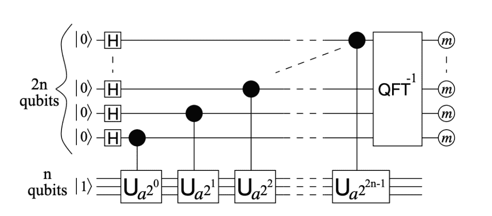
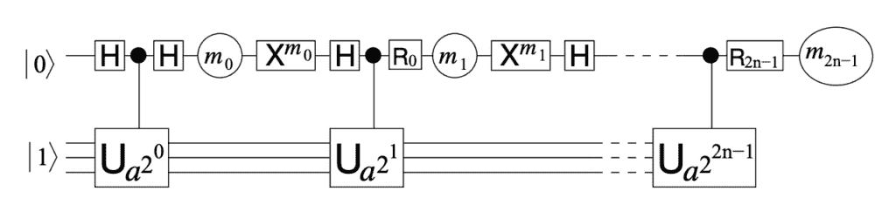
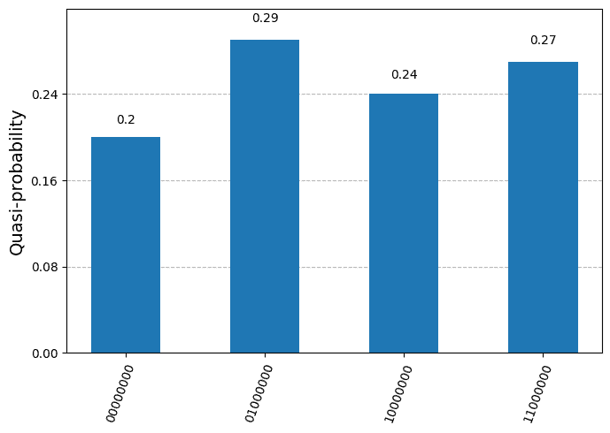
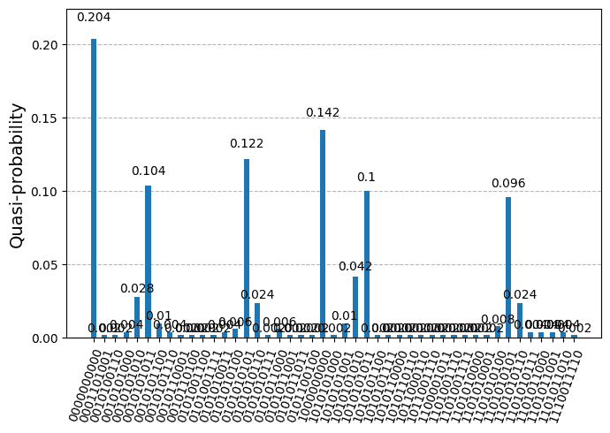
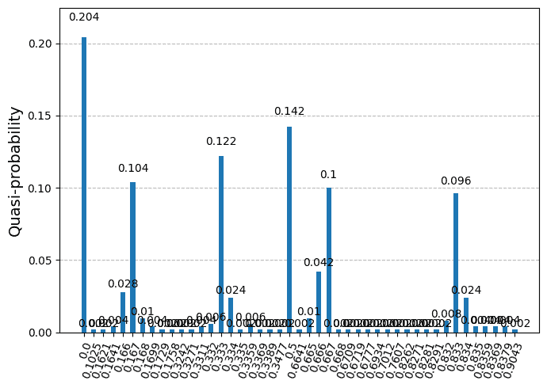
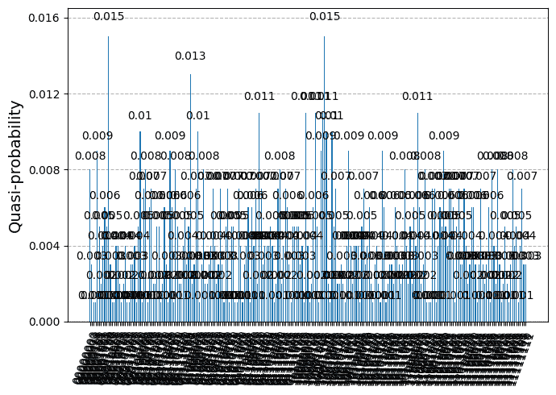
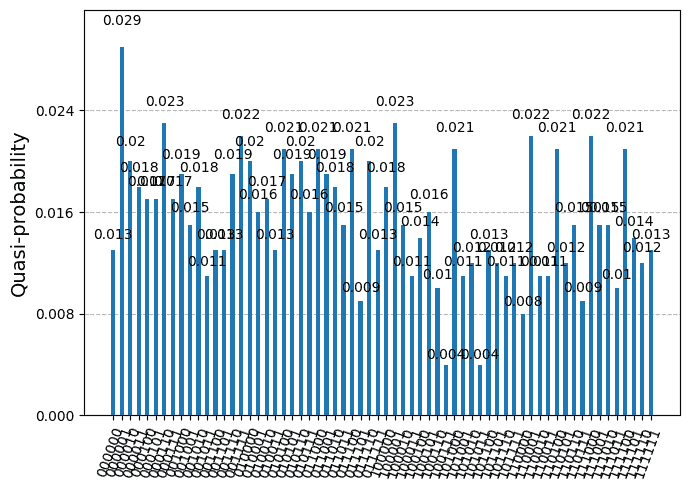

# Shor 算法的进展如何？

> 原文：[`towardsdatascience.com/where-are-we-with-shors-algorithm/`](https://towardsdatascience.com/where-are-we-with-shors-algorithm/)

<mdspan datatext="el1751674404623" class="mdspan-comment">Shor 算法</mdspan>由 Peter Shor 在 1995 年发表的开创性论文 [1] 中提出，作为一种使用量子计算分解大数的算法。到 2025 年，即 30 年后，早期的量子处理器被生产出来并公之于众，这使得测试该算法成为可能。我们能否在大型数字上成功运行 Shor 算法？答案众所周知是肯定的，因为这需要具有数千个量子比特和非常低量子噪声的量子处理器，但我们还没有达到那个水平。那么对于小数字呢？顺便问一下，我们如何具体实现 Shor 算法？

在这篇文章中，我们提供了一个关于 Shor 算法实现的指南，特别强调了实现寻找阶量子电路和算法核心的模运算。我们提供了一个 [git 仓库](https://github.com/benjamin-assel/qiskit-shor)，其中包含了 Qiskit 的完整实现。最后，我们进行了一些模拟，并提供了截至 2025 年在 IBM 量子硬件上实际计算的结果。

为了阅读这篇文章，如果你了解一些量子计算的基础知识，例如量子比特操作和标准幺正门操作，以及一些线性代数，那就再好不过了。

免责声明 1：尽管我力求达到科学严谨的水平，但这不是一篇学术论文，我也不假装自己是该领域的专家。

免责声明 2：本帖未使用人工智能生成。

## 一种用于数论分解的突破性算法

Shor 算法是一种旨在寻找整数 N 的非平凡因子的算法。虽然对于足够小的 N，例如通过尝试 N^(1/2) 的可能值，找到因子是容易的，但当 N 非常大时，例如 N ~ 2¹⁰⁰⁰，问题就变得不切实际了，因为搜索空间变得太大。使用经典计算机找到这样大整数的因子，人类一生的时间都不够。

如果我们用 n = ⌈log2⌉ 表示用二进制表示法写 N 所需的位数，[已知最佳 ***经典*** 算法](https://en.wikipedia.org/wiki/General_number_field_sieve)的时间复杂度为 exp(c n^(1/3) (log n)^(2/3))，其中 c 是某个常数，即 ***指数*** 时间复杂度。所谓“经典”算法，是指可以在传统计算机上运行的算法，即由数字的算术运算组成的算法。这基本上是所有算法，除了 *量子* 算法。

Shor 算法是一种 ***量子*** 算法，这意味着它涉及到对量子系统进行的操作，在这种情况下是对量子比特的操作。此外，它是一个概率算法，这意味着它以高概率保证能够工作，但偶尔可能会失败。

Shor 算法能够在时间复杂度 O(n² log n) 的高概率下找到 N 的一个因子，在其最有效的实现中，即 **多项式** 时间复杂度。这可能是迄今为止量子算法打败经典算法最令人印象深刻的例子。

此外，分解大整数的问题正是公开密钥加密的核心，比如广泛用于今天保护互联网通信的 [RSA 算法](https://en.wikipedia.org/wiki/RSA_cryptosystem)。如果 Shor 算法在拥有几千个量子比特的量子计算机上成功运行，就能破解这种加密方案。这使得它成为量子计算中最受欢迎的应用之一。

虽然我们离拥有能够运行 Shor 算法的大数量子计算机还有一段距离，但目前的进展使得我们可以在小数上尝试它。因此，现在是深入探讨 Shor 算法的时候了，看看它是如何工作的，我们如何能够在量子硬件上实际实现并运行它。

利用 [IBM 量子平台](https://quantum.cloud.ibm.com/)，该平台允许有限度地免费访问真实的量子处理器（QPUs），我已经使用 [Qiskit SDK](https://www.ibm.com/quantum/qiskit) 实现了完整的算法，并在小数上尝试了它。完整的实现可以在本 [qiskit-shor 仓库](https://github.com/benjamin-assel/qiskit-shor) 中找到。

现在，让我们深入算法。

## 算法

网上关于 Shor 算法的介绍很多（例如，参见 [Wikipedia](https://en.wikipedia.org/wiki/Shor%27s_algorithm)）。我们只写下算法本身，并解释其中涉及的思想，但 **我们不会解释它为什么有效，也不会给出每个陈述的证明**。

考虑一个 [合数](https://en.wikipedia.org/wiki/Composite_number) 整数 N，即一个可以接受非平凡质因子的整数。还要求 N 是奇数，并且不是质数的幂（在这些情况下，我们可以很容易地找到一个非平凡因子）。

然后，算法步骤如下：

1.  选择一个随机整数 1 < A < N 并计算 gcd(A, N)。如果 gcd(A, N) > 1，那么 gcd(A, N) 是 N 的一个非平凡因子，我们就可以结束了（幸运情况）。否则 A 和 N 是互质的（典型情况）。

1.  使用 ***相位估计*** 量子算法（见下文）在 *Z*[N] 中找到 A 的 ***阶***，即最小的整数 1 < r < N，使得 A^r ≡ 1 (mod N)。

1.  如果 r 是奇数，则回到步骤 1 并选择另一个 A。否则，计算 d = gcd(A^(r/2) − 1, N)。如果 d > 1，则 d 是 N 的一个非平凡因子。如果不是，则从步骤 1 重新开始。

彼得·肖尔在一份开创性的论文 [1] 中提出了这个算法，并证明了它可以在多项式时间内以高概率找到 N 的一个因子。

在上述步骤中，只有阶查找步骤需要量子操作。其他步骤是经典操作，可以在经典计算机上轻松执行。

量子算法包括对表示二进制表示中数字的一组量子比特应用单位算子。整数

\[ x = \sum_{i=0}^{m-1} x_i 2^i, \quad x_i \in \{0,1\} \,,\]

由 m 个量子比特状态表示

\[ |x\rangle = |x_0\rangle |x_1\rangle …|x_{m-1}\rangle \]

例如，数字 13 = 2⁰ +2² + 2³ 在“量子整数”（4-量子比特状态）|13⟩ = |1⟩|0⟩|1⟩|1⟩中表示。

要找到整数 A 在 *Z*[N] 中的阶 r，Shor 算法的想法是利用单位算子

\[ U_A : x \rightarrow Ax \,\, \text{mod} \,\, N \]

该算子接受形式为 *exp*(2*π*i j/r) 的特征值，其中 0 ≤ j < r，并且向量 |1⟩（“量子整数 1”）可以表示为相应特征向量的线性组合。算法试图估计至少一个分数 j/r。这被称为 *相位估计*，因为我们估计了算子 U[A] 的特征值 exp(iΦ) 的相位 Φ = 2*π* j/r。

我们将在下一节提供需要运行的量子电路的实际电路。量子算法包括运行这个电路并测量其 m 个输出比特，形成一个二进制表示的数字 k。这个数字 k 应该是 k/2^m 接近某个 0 ≤ j < r 的 j/r，以高概率。除非我们最终陷入某些不幸的情况（如 j=0），否则我们可以通过找到形式为 a/b 的分数，其中 b < N，最接近 k/2^m 并识别 r=b（有一些库可以有效地完成这项工作）来提取 r 的值（there are libraries doing this efficiently）。通常，人们会多次运行阶查找电路并测量其结果，以非常高的概率找到 r。预期输出 k/2^m 的分布应该在所有 0 ≤ j < r 的 j/r 值处有峰值（相同的大小）。

所有经典操作都很容易实现，并且它们可以在 log N 时间内运行，所以我们只需要担心阶查找量子电路的实现和运行。让我们看看它是什么样子。

## 阶查找量子电路

阶查找电路如图所示。可以对电路进行一些修改以提高其效率，但让我们留到以后再说。



阶查找电路。图来自 Beauregard [2]。变量 *a* 对应于文本中的整数 A。

有两组量子比特：一组 n 个量子比特初始化为量子整数状态 |1⟩，即 x=1 的 |x⟩，称为 *目标* 量子比特（图中的下量子比特），另一组 2n 个量子比特，称为 *控制* 量子比特（图中的上量子比特）。控制量子比特使用哈达玛门初始化为所有整数状态的叠加，

\[ (H|0\rangle)^{\otimes 2n} = \left( \frac{|0\rangle + |1\rangle}{\sqrt 2}\right)^{\otimes 2n} = \frac{1}{2^n} \sum_{x =0}^{2^{2n}-1} |x\rangle \]

然后用作对目标量子比特进行单位算子 U[D] 作用的控制量子比特，

\[

CU_{D}|b\rangle|x\rangle = \left\{

\begin{align}

& |0\rangle \, |x\rangle & \text{if $b = 0$} \\

& |1\rangle \, |Dx\, \text{mod}\, N\rangle & \text{if $b = 1$}

\end{align}

\right.

\,,

\]

D 取值

\[ D = A^{2^i} \, \text{mod} \, N \,, \quad i = 0, …, 2n-1, \]

最后，控制量子比特通过一个逆量子傅里叶变换门进行转换，并且都被测量（图中用带有“m”的圆圈表示）。

可以用另一个控制量子比特的数量 m 替换控制量子比特的数量 2n。控制量子比特越多，U[A] 操作符的估计相位 k/2^m 就越好。选择 m=2n 是在精度和电路大小之间的一种折衷。

为什么这个电路能执行相位估计是许多关于 Shor 算法介绍的课题。IBM 讲座([IBM lecture](https://learning.quantum.ibm.com/course/fundamentals-of-quantum-algorithms/phase-estimation-and-factoring))是研究这个主题的一个非常好的地方。

在上述电路中，所有成分都很容易在 Qiskit SDK 中实现，除了幺正操作符 U[A]（及其受控版本 CU[A]）。这正是所有困难所在。关于 Shor 算法的学术研究的大部分都围绕着优化 U[A] 的实现。上述顺序查找电路的描述表明，3n 个量子比特足以实现量子算法，但实际上 U[A] 门本身需要 n + c 个额外的量子比特，称为辅助或辅助量子比特（确切常数 c 取决于所选择的实现）。

在讨论 U[A] 的电路实现之前，让我们提一下上述电路的一个重要简化。2n 个控制量子比特可以被一个单独的量子比特替换（!），该量子比特经历一系列的幺正门操作、测量和重置，从而大大减少了运行 Shor 算法所需的量子比特数量，但代价是引入了控制流操作，即依赖于中间测量的门操作。虽然在理论上这可能看起来是一个微不足道的代价，但在实践中，控制流门在操作上比标准的幺正操作更复杂。以下图示的是“单控制量子比特”电路。



单控制量子比特的顺序查找电路。图来自 Beauregard [2]

其中 m[i] ∈ {0, 1} 是唯一控制量子比特的连续测量值，X^m 是 X 门（即非门）如果 m=1，或者如果 m=0 则是单位门。应用 X^m 将控制量子比特重置为 |0⟩。R[i] 是相位门（即 RZ 旋转门），其相位参数取决于所有之前的测量值。关于这种简化的详细内容和解释可以在[3]中找到。

## U[A] 门和量子模运算

*注意：本节较为技术性。一些读者可能希望在第一次阅读时跳过这部分，直接进入下一节。*

现在，让我们集中讨论实现幺正作用

\[ U_A : x \rightarrow Ax \,\, \text{mod} \,\, N \]

略具洞察力的读者可能会问这究竟是不是一个单位操作，因为这个操作看起来并不是非常双射，因为模 N 操作。这是一个相当重要的观点，因为，仅使用单位门，我们只能实现单位操作。事实上，U[A] 在 [0, N) 的整数空间上作用是一个双射函数，当且仅当 A 和 N 是互质的整数，这在 Shor 算法考虑的值中是正确的。逆操作是 U[B]，其中 B 是 *Z*[N] 中 A 的逆，即 B 是一个整数，使得 BA ≡ 1 (mod N)。A 和 N 互质保证了 B 的存在。

因此，从理论上讲，可以构建一个作用于由向量 |x⟩ 生成的空间 S 上的单位算子 U[A]，其中 0 ≤ x < N。在求序电路中，一系列（受控）U[D] 操作，具有不同的 D 值，被应用于初始状态 |1⟩，该状态位于 S 中。U[A] 在状态 |x⟩ 上的作用，其中 x ≥ N，并不重要，因为这种情况不会发生。我们可以忽略我们的 U[A] 电路如何作用于这些较大的整数状态。

为了使演示足够简短，我们只将展示 U[A] 实现的最重要特性，并将一些相关论文的引用留给感兴趣的读者。

需要实现的重要构建块是模加法：

\[ \text{add}(Y,N): \quad |x\rangle \rightarrow |(x+Y) \, \text{mod} \, N \rangle \]

其中 0 ≤ Y < N 是一个“经典”整数，即一个给定的参数，0 ≤ x < N 是一个“量子”整数，即由量子态 |x⟩ 表示的整数，如前几节所述。为了实现这个操作，我们需要至少 n = ⌈log2⌉ 个量子比特来表示模 N 的量子整数，因此我们将假设 n 是我们工作的量子寄存器的大小，即持有 x 的量子比特的数量。这意味着我们可以表示 0 到 2^n-1 之间的量子整数。

实现这个操作有两种“思想流派”。“Clifford+T”方法仅使用 NOT、H、S、S^(-1)、CNOT 和 Toffoli 门，而“量子傅里叶变换”（QFT）方法通过在输入整数的傅里叶空间表示上执行参数化的相位门 P(λ) 来进行加法（关于这一点下面会详细说明）。

Clifford+T 方法本质上使用了一种相当直接的“小学生”程序，将用二进制表示的两个量子数的位相加，并在辅助量子比特中跟踪进位单位。在实现[6]中，整个过程需要大约 10n 个门和 1 个辅助量子比特，深度大约为 2n（这些概念在下面的算法复杂度部分讨论）。这种方法可以适应添加一个经典数和一个量子数。

QFT 方法由 Draper [4] 的工作提出。它首先对 |x⟩ 应用一个 QFT 门，该门由 H 和 P(π/2^j) 门组成，产生一个状态叠加

\[ QFT|x\rangle = \frac{1}{2^{n/2}} \sum_{y=0}^{2^n-1} e^{2i\pi \frac{xy}{2^n}} |y\rangle \]

在这种表示法中，向经典数字 Y 的添加可以通过对寄存器的 n 个量子比特执行 n 个相位旋转门来实现

\[ \prod_{i=0}^{n-1} P\left(2\pi Y\frac{2^i}{2^n}\right) QFT|x\rangle = QFT|(x + Y) \, \text{mod} \, 2^n \rangle \]

因此，策略是在 QFT 和 QFT^(-1)之间夹入相位旋转来实现加法

\[ |(x + Y)\, \text{mod}\, 2^n \rangle = QFT^{-1} \prod_{i=0}^{n-1} P\left(2\pi Y\frac{2^i}{2^n}\right) QFT |x\rangle \]

通过将相位门替换为受控相位门，实现了*受控*添加的实现

虽然 QFT 和 QFT^(-1)操作中的基本门数量很大，实际上是 O(n²)，但在傅里叶空间中的后续加法只需要 n 个相位门，这些门可以并行操作。可以在量子整数 x 在傅里叶空间中通过一系列（受控）相位旋转表示的量子电路执行过程中，顺序地实现几个加法或受控加法。此外，整个 QFT-加法器门不需要辅助量子比特。这使得 QFT 方法在许多需要量子加法电路的项目中成为首选选择。

S. Wang 等人最近的一篇综述[5]比较了量子算术的不同最先进算法，并提供了关于该主题的广泛参考文献。

需要注意的是，上述描述的加法操作始终是 **模 2^n**。这是预期的，因为我们只能用 n 个量子比特表示范围 [0, 2^n) 内的整数。因此，到目前为止所实现的操作是

\[ \text{add}(Y): \quad |x\rangle_n \rightarrow |x+Y\rangle_n := |(x + Y)\, \text{mod}\, 2^n \rangle_n \]

其中下标 n 表示量子寄存器中的量子比特数量。

下一步是实现“模 N”部分。这要困难得多，需要一系列（受控）加法和（受控）减法。基本思想已在 Beauregard 的工作[2]中描述。

Beauregard 提出的步骤，对于 0 ≤ Y < N 和 0 ≤ x < N，如下所示：

+   当 n = ⌈log2⌉ 时，考虑 n+1 位量子态 |x⟩[n+1]。这比存储 x 所需的量子比特多一个，即有一个“溢出”量子比特初始化为 |0⟩。

+   使用 add(Y-N)操作添加 Y-N。如果 x+Y-N≥ 0，则得到 |x+Y-N⟩[n+1]，如果 x+Y-N < 0，则得到 |2^(n+1)-x+N)⟩。

+   在辅助量子比特 |a⟩ 中计算 x+Y-N 的符号。这是通过在 |a⟩ 上作用一个 CNOT 门并受控于 n+1 位寄存器的最高有效位（即溢出位）来完成的。在此步骤之后，如果 x+Y ≥ N，则 |a⟩ = |0⟩；如果 x+Y < N，则 |a⟩ = |1⟩。

+   使用受控加(N)操作，在 |a⟩ 上将 N 加回到 n+1 位寄存器中。结果状态是 |(x + Y) mod N⟩|a⟩。

以下步骤允许将辅助量子比特重置到其初始状态 |0⟩:

+   使用 add(-Y) 操作添加 -Y。在此步骤之后，n+1 个寄存器处于 |x\rangle 状态，如果 x + Y < N，或者处于 |2^(n+1)+x-N)⟩ 状态，如果 x+Y ≥ N。

+   使用 CNOT 门反转控制于 n+1 个量子比特寄存器最高位的辅助比特。在此步骤之后，辅助比特始终处于 |a⟩ = |1\rangle 状态。我们通过作用 NOT 门将其重置为 |0\rangle：|a⟩ = NOT|1\rangle = |0\rangle。

+   使用 add(Y) 操作将 Y 添加回来。这导致最终状态 |(x + Y) mod N\rangle|0\rangle。

这可能看起来有些复杂，但这是迄今为止找到的执行模加法最简单的量子算法。

最后三个步骤，将辅助量子比特 |a⟩ 恢复到其初始状态 |0⟩，如果辅助量子比特要在后续的模加法操作中重新使用，这在 Shor 算法中是这种情况。或者，可以为每个模加法使用新的辅助量子比特，这会减少全阶查找电路的深度和门计数，但会增加量子比特的数量。最小化量子比特的数量通常是主要目标，因为当前的量子处理器具有有限的量子比特数量（更多内容见下文）。

通过将每个因子的加法/减法替换为受控加法/减法，得到受控模加法的实现。

下一步是实现以下操作

\[ |x\rangle |y\rangle -> |x\rangle|(y+Ax) \,\text{mod}\, N\rangle \]

其中 0 ≤ y < N 是另一个量子整数。这是通过将模加法 y ↦ (y + Ax) mod N 分解为一系列模加法 y ↦ (y + 2^iA) mod N 来实现的，作为 add(2^iA, N)|y⟩ = |(y + 2^iA) mod N\rangle，受控于 x = Σ[i] x[i] 2^i 的 i-th 位 |x[i]⟩。正如我们所见，模加法需要一个溢出量子比特和一个辅助量子比特，因此我们根据这个规定实施的真正操作是

\[ V_A: |x\rangle_n |y\rangle_{n+1} |0\rangle \rightarrow |x\rangle |(y+Ax) \, \text{mod}\, N\rangle_{n+1} |0\rangle \]

使用下标表示量子比特的数量。

最后，U[A] 操作是通过以下方式实现的

\[

\begin{align}

U_A \, : \quad

|x\rangle_n |0\rangle_{n+1} |0\rangle  &\rightarrow |x\rangle_n |Ax\,\text{mod}\, N\rangle_{n+1} |0\rangle \\

&\rightarrow |Ax\,\text{mod}\, N\rangle_n |x\rangle_{n+1} |0\rangle \\

&\rightarrow |Ax\,\text{mod}\, N\rangle_n |0\rangle_{n+1} |0\rangle

\end{align}

\]

第一步是 V[A] 操作。第二步使用 SWAP 门交换两组 n 个量子比特。请注意，中间状态的溢出量子比特没有交换（它目前处于 |0> 状态）。第三步是 V[-B] 操作，其中 B = A^(-1)，是 A 在 *Z*[N] 中的逆，利用了 (x – BAx) mod N = (x – x) mod N = 0 的性质。这是 A 和 N 是互质整数时使用的第一个也是唯一的位置（否则 B 不存在）。

计算使用的量子比特数量，我们看到完整的 U[A] 操作需要 2n+2 个量子比特。

## 量子复杂度分析

量子算法的“复杂度”通常用三个量来表示：使用的量子比特数、使用的门数和电路的深度。

**量子比特数**是一个明确的概念。它很重要，因为量子处理器仍然有有限的量子比特可以工作（截至 2025 年，通常在数百个左右）。

**门数**是一个较为模糊的概念，通常指的是单量子比特和双量子比特门（如 H、NOT、P、SWAP、CNOT）的数量。这可能会产生误导，因为那些门的物理实现可能需要几个“物理”门，代表在硬件级别上实现的量子比特操作。通常，远距离量子比特之间的双量子比特门（如 SWAP 和 CNOT）需要一系列作用于邻近量子比特的物理双量子比特门。物理门的数量取决于量子处理器的“连通性”，即哪些双量子比特操作是物理上允许的。这些对应于邻近量子比特的操作。甚至单量子比特门，如 Hadamard 门，也可能需要几个物理单量子比特门。

由于物理门集合和硬件连通性因提供商而异，大多数学术研究只是简单地关注计算“基本”单量子比特和双量子比特门的数量。

量子电路的**深度**指的是达到最终测量步骤所需的量子比特的顺序操作数。量子比特上的并行操作越多，深度就越低。深度可以大致想象为电路在图示表示中的长度。最小化量子电路的深度很重要，因为量子比特的量子相干性会随着深度的增加而减弱。顺序操作越多，在测量结果之前运行电路所需的时间就越长，量子比特与环境相互作用并失去相干性的时间也就越多。

如果我们看看我们实现的 U[A]，我们会发现它至少需要 2n+2 个量子比特。我们使用的门数是 O(n³)（n² 的因子来自于使用 QFT 门），深度是 O(n²)（n 的因子来自于使用 QFT 门）。

如果使用 1 控制量子比特的简化，总阶数查找电路需要额外一个辅助量子比特，并执行 O(n) 个顺序 U[A] 操作，因此所需的量子比特总数是 2n+3（如果使用 2n 控制量子比特的电路，则是 4n+2），总门数是 O(n⁴)，深度是 O(n³)。

还有一个标准的简化方法，就是使用仅需要 O(n log n) 个门的近似量子场论（QFT）变换，而不是 O(n²)。这使得求出阶数分数 k/2^(2n) 的精度略有降低，但对于以高成功概率运行 Shor 算法来说仍然足够好。这降低了门的数量到 O(n³ log n)。

许多研究论文都带来了这些数字的小幅改进，但据我所知，没有出现重大的突破。

总体而言，运行该算法的成本，无论是从量子比特的数量还是从操作的数量来看，都是 n 的多项式，这正是 Shor 算法的承诺，展示了在分解非常大的整数 N 的任务上的量子优势。

## 在 IBM 量子硬件上的模拟和运行

到目前为止，我们讨论的一切都是理论性的，并且 20 年前就已经为人所知。如今，有几家公司正在尝试开发量子处理器，这些处理器原则上可以运行 Shor 算法。特别是[IBM 量子平台](https://quantum.cloud.ibm.com/)提供了在具有 128 个量子比特的量子处理器（QPUs）上免费执行一定数量的量子计算的可能性。

Qiskit SDK 提供了一个方便的接口来实现量子电路、执行模拟和在 IBM 量子硬件上运行电路。学习平台为新用户提供了一个[Qiskit 简介](https://learning.quantum.ibm.com/learning-path/getting-started-with-qiskit)。

```py
$ pip install qiskit qiskit-ibm-runtime qiskit-aer qiskit[visualization]
```

要运行 Shor 算法，我们使用作者开发的开源[qiskit-shor](https://github.com/benjamin-assel/qiskit-shor)库。我们邀请任何对精确实现感兴趣的读者查看链接的仓库。

[qiskit-shor](https://github.com/benjamin-assel/qiskit-shor) API 有两个函数：*find_order(A, N)*运行顺序查找电路，并返回 A 在*Z*[N]中的顺序 r，以及测量输出的分布，还有*find_factor(N)*，它运行完整的 Shor 算法，如果找到了因子，则返回 N 的一个因子。

为了增加成功的可能性，我们多次运行顺序查找电路，在 100 到 1000 次之间，并观察测量输出的分布。从这个分布中，我们考虑最频繁出现的 10 个值，以尝试提取顺序。

该库实现了包含 2n 个控制量子比特的顺序查找电路和包含一个控制量子比特的优化版本。然而，我们主要使用 2n 个控制量子比特的较不优版本，因为 IBM 平台对使用控制流操作的电路有更严格的限制。

### 模拟

在克隆[qiskit-shor](https://github.com/benjamin-assel/qiskit-shor)仓库后，我们可以开始运行模拟，使用 qiskit Aer 模拟器。我们进行无噪声模拟，以测试代码。我们只使用小整数，因为在经典计算机上模拟许多量子比特的量子状态计算量很大，我们只想用简单的例子来说明上述演示。

```py
from qiskit.transpiler.preset_passmanagers import generate_preset_pass_manager
from qiskit.visualization import plot_distribution
from qiskit_aer import AerSimulator
from qiskit_aer.primitives import SamplerV2 as AerSampler
from qiskit_shor.shor import find_order

aer_sim = AerSimulator()
pm = generate_preset_pass_manager(backend=aer_sim, optimization_level=1)
sampler = AerSampler()

# Find the order of 7 in Z_15.
r, dist = find_order(A=7, N=15, sampler=sampler, pass_manager=pm, num_shots=100)
plot_distribution(dist)
```

```py
Start search for the order of 7 in Z_15
Found value 4 for order of 7 in Z_15.
```



使用 Qiskit Aer 模拟的顺序查找电路的测量输出值的直方图，其中 A=7，N=15（100 次运行）

函数返回了正确的阶数 4，7⁴ = 1 mod 15。输出分布显示了返回整数 k 的四个值：00000000、01000000、1000000、11000000，分别对应于整数 0、2⁶、2⁷和 2⁶+2⁷的二进制表示。输出有 2n=8 个量子位，其中 n=⌈log2⌉=4。近似分数 k/2⁸的分布值为 0、1/4、1/2、3/4，出现次数相似。这些对应于算子 U[7]的预期相位估计 j/4，j=0, 1, 2, 3。这些分数的公共分母 4 给出了 7 在*Z*[15]中的阶数。

让我们看第二个例子，并搜索*Z*[21]中 5 的阶数。

```py
r, dist = find_order(A=5, N=21, sampler=sampler, pass_manager=pm, num_shots=500)
plot_distribution(dist)
```

```py
Start search for the order of 5 in Z_21
Found value 6 for the order of 5 in Z_21.
```



阶数查找电路输出的分布（500 次运行）对于 A=5，N=21。

量子搜索返回了正确的值 6。输出分布有更多的结果，并且更重要的是显示出一些峰值。将直方图箱标签替换为相应的分数 k/2¹⁰（四舍五入到小数点后四位），直方图变为



同样的分布，标记为估计相位 k/2¹⁰

我们看到在 0、1/6、1/3、1/2、2/3 和 5/6 处有峰值，这些值都是 j/6 的形式，其中 j=0, 1, 2, 3, 4, 5（由于零结果的出现不规律，图中的峰值分布不均匀）。j/6 对应于单位算子 U[5]的特征值，6 是 5 在 Z[21]中的阶数，正如预期的那样。

为了完整性，我们可以模拟整个算法，并提取 N=15 和 N=21 的非平凡因子。以下代码运行 Shor 算法，对 A 进行最多 3 次尝试，如果找到 N 的因子则停止。每次尝试包括运行 100 次阶数查找电路。

```py
from qiskit_shor.shor import find_factor

f = find_factor(
    N=15, sampler=sampler, pass_manager=pm, num_tries=3, num_shots_per_trial=100
)
```

```py
Start search for the order of 4 in Z_15
Found value 2 for the order of 4 in Z_15
Factor found: 3
```

随机选择了 A=4 的值，然后找到了阶数 2，最后返回了 N=15 的因子 3。

```py
f = find_factor(
    N=21, sampler=sampler, pass_manager=pm, num_tries=3, num_shots_per_trial=100
)
```

```py
Start search for the order of 17 in Z_21
Found value 6 for the order of 17 in Z_21
Start search for the order of 19 in Z_21
Found value 6 for the order of 19 in Z_21
Factor found: 3
```

首先尝试了 A=17 的值，得到了阶数 6，但 gcd(A^(r/2) – 1, N) = gcd(4912, 21) = 1，所以这不会给出 21 的因子。接下来尝试了 19 的值，又得到了阶数 6。这次 gcd(A^(r/2) – 1, N) = gcd(6858, 21) = 3，给出了 21 的因子 3。

### 量子运行

既然我们已经确信阶数查找电路被正确实现，我们就可以尝试在真实的量子处理器（QPUs）上运行它。

```py
from qiskit_ibm_runtime import QiskitRuntimeService
from qiskit_ibm_runtime import SamplerV2 as Sampler

# For this to run, you need to setup an IBM Cloud account and generate 
# an API token. See https://cloud.ibm.com

# Load default saved credentials
service = QiskitRuntimeService()

backend = service.least_busy(operational=True, simulator=False, min_num_qubits=127)
print(f"backend: {backend.name}")
pm = generate_preset_pass_manager(target=backend.target, optimization_level=1)
sampler = Sampler(mode=backend)
```

```py
backend: ibm_brisbane
```

现在我们尝试在*Z*[15]中找到 7 的阶数，就像上面的模拟一样。

```py
r, dist = find_order(A=7, N=15, sampler=sampler, pass_manager=pm, num_shots=1000)
plot_distribution(dist)
```

```py
Start search for the order of 7 in Z_15
Found value 4 for order of 7 in Z_15
```



返回了 Z[15]中 7 的正确阶数 4，但结果分布与模拟中的分布大相径庭，模拟中只有 4 个观察到的值。这里几乎所有的值都在 0 到 2⁸-1 之间，使得图表难以阅读。有一些小的峰值，但结果主要受噪声主导。从 10 个最频繁的值中，算法能够提取出正确的阶数。

对于 N=15 或 N=21 的不同 A 值的其他运行，产生相似的有噪声数据。这是因为量子硬件容易受到量子噪声的干扰，影响单位门操作。门越多，噪声就越大。在 N=15 的阶数查找电路中，我们的实现已经有 2482 个门。这对于当前的量子计算能力来说已经太多了。

```py
from qiskit_shor.shor import order_finding_circuit

qc = order_finding_circuit(A=7, N=15)
print(f"Number of qubits: {qc.num_qubits}")  # 4n+2 qubits, with n = ceil(log2(N)) = 4
print(f"Number of gates: {qc.size()}")
print(f"Circuit depth: {qc.depth()}")
```

```py
Number of qubits: 18
Number of gates: 2482
Circuit depth: 1632
```

我们可以通过搜索 *Z*[6] 中 5 的阶数，使用单控制比特优化电路来尝试一个具有较少量子比特的案例。

```py
from qiskit_shor.shor import order_finding_circuit_one_control

qc = order_finding_circuit_one_control(A=5, N=6)
print(f"Number of qubits: {qc.num_qubits}")  # 2n+3 qubits, with n = ceil(log2(N)) = 3
print(f"Number of gates: {qc.size()}")
print(f"Circuit depth: {qc.depth()}")
```

```py
Number of qubits: 9
Number of gates: 1246
Circuit depth: 861
```

```py
r, dist = find_order(A=5, N=6, sampler=sampler, pass_manager=pm, num_shots=1000, one_control_circuit=True)
plot_distribution(dist)
```

```py
Start search for the order of 5 in Z_6
Found value 2 for the order of 5 in Z_6
```



返回了正确的阶数 2，但分布仍然主要由量子噪声主导。

## 结论性思考

我们已经对 Shor 算法的实现给出了一个试探性的完整展示，包括对涉及的量子同余运算的某种详细描述。使用 [qiskit-shor](https://github.com/benjamin-assel/qiskit-shor) 模块的实现，我们在 IBM Quantum 平台上进行了一些模拟和一些实际的量子计算。这些量子计算结果主要由量子噪声主导，使得目前无法运行 Shor 算法并提取有意义的成果。

我们使用的实现是原始的，从某种意义上说，它没有包括最先进的优化。但是，当运行 Shor 算法时，对于非常小的 N 值，观察到的这种原始实现的噪声输出表明，即使有额外的电路优化，也会得到类似的结果。

在未来，成功运行 Shor 算法可能会变得更加现实。近年来在量子硬件能力方面的巨大进步，让我们有理由相信，在几年内这种情况可能会发生。

## 参考文献

[1] [原始论文](https://arxiv.org/abs/quant-ph/9508027): Shor, P. W. (1999). *量子计算机上的素数分解和离散对数的多项式时间算法*。SIAM review，41(2)，303-332。

[2] S. Beauregard，*使用 2n+ 3 量子比特的 Shor 算法电路*。arxiv: quant-ph/0205095。

[3] Parker, S.，& Plenio, M. B. (2000). *使用单个纯量子比特和 log N 个混合量子比特进行高效分解*。Physical Review Letters，85(14)，3049。arxiv: quant-ph/0001066。

[4] T. Draper，*量子计算机上的加法*，arxiv 预印本：quant-ph/0008033

[5] S. Wang 等人，*量子算术电路的全面研究*，arxiv: quant-ph/2406.03867。

[6] S. Cuccaro 等人，*一种新的量子进位加法电路*，arxiv: quant-ph/0410184。

* * *

*除非另有说明，所有图像均由作者提供*。
