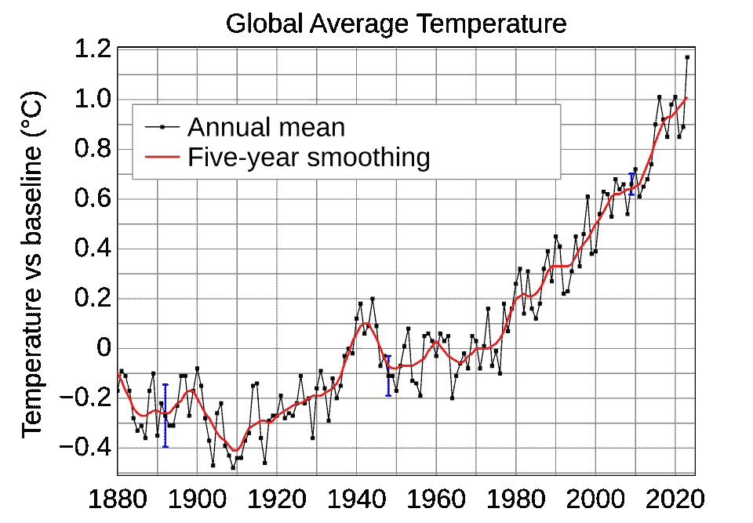
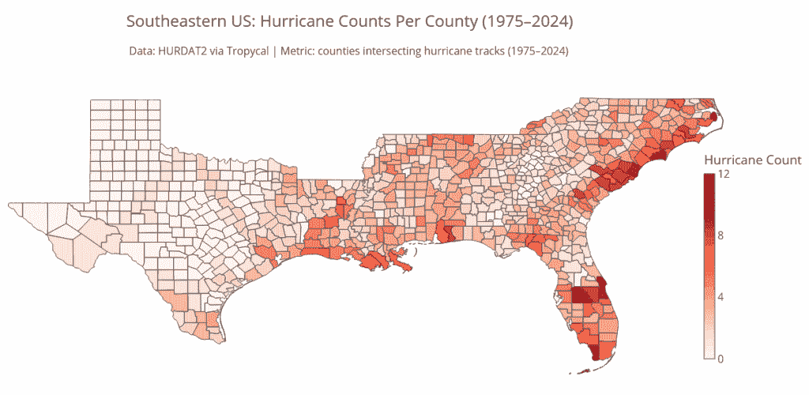
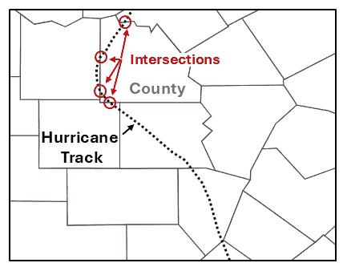
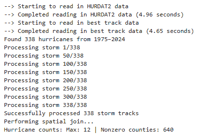
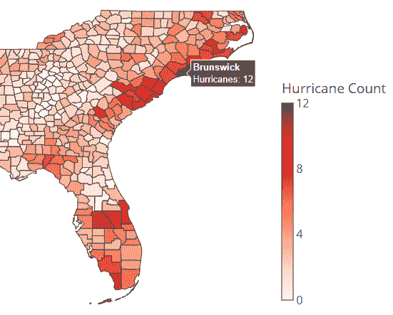
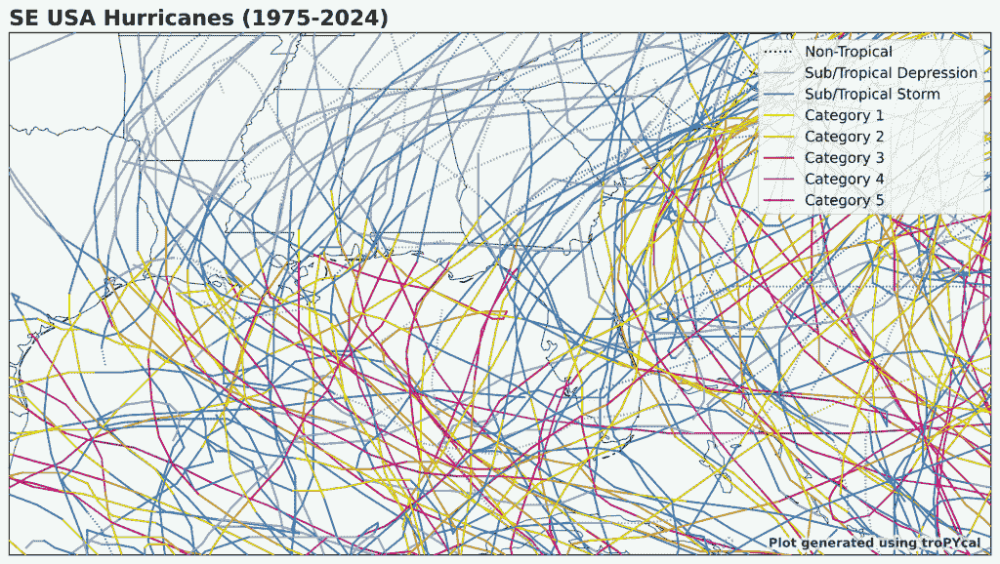
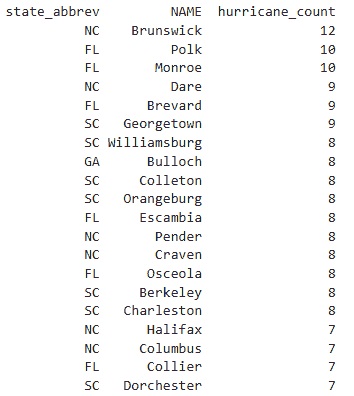
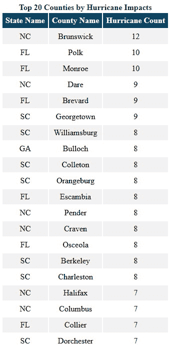

# 飓风最严重的袭击地点：使用 Python 进行县级分析

> 原文：[`towardsdatascience.com/where-hurricanes-hit-hardest-a-county-level-analysis-with-python/`](https://towardsdatascience.com/where-hurricanes-hit-hardest-a-county-level-analysis-with-python/)

<mdspan datatext="el1755806169266" class="mdspan-comment">想象一下：你</mdspan>被一家保险公司聘请，帮助改进美国东南部各州的住宅保险费率。他们的问题简单但风险很高：*哪些县最常受到飓风的袭击*？他们不仅指的是*登陆*，还想计算那些持续*内陆*行驶、带来破坏性降雨并引发龙卷风的暴风雨。

为了应对这个问题，你需要两个关键要素：

+   **可靠的暴风雨轨迹数据库**

+   **县边界形状文件**

使用这些工具，工作流程变得清晰：识别并计算每条穿过县边界的飓风轨迹，然后以地图和列表形式可视化结果，以获得最大洞察力。

**Python** 是这项工作的理想选择，因为它拥有丰富的地理空间和科学库：

+   **[Tropycal](https://tropycal.github.io/tropycal/)** 用于提取开源政府飓风数据

+   **[GeoPandas](https://geopandas.org/en/stable/docs.html)** 用于加载和操作地理空间文件

+   **[Plotly Express](https://plotly.com/python/plotly-express/)** 用于构建交互式、可探索的地图

在深入代码之前，让我们来审视一下结果。我们将关注 1975 年至 2024 年这一时期，全球变暖，*被认为*会影响大西洋飓风，变得根深蒂固。



全球平均温度变化（NASA via [Wikimedia Commons](https://commons.wikimedia.org/wiki/File:Global_Temperature_Anomaly.svg))

在过去的 49 年里，飓风袭击了美国东南部的 640 个县。沿海县承受着风力和风暴潮的冲击，而内陆地区则遭受暴雨和偶尔由飓风引发的龙卷风的侵袭。这是一个复杂且影响广泛的危险，有了合适的工具，你可以按县绘制它。

下面的地图使用 **Tropycal** 库构建，记录了 1975 年至 2024 年期间在美国登陆的所有飓风的轨迹。


1975-2024 年影响美国东南部的飓风轨迹（作者提供）

虽然这张地图很有趣，但对保险理赔员来说并不太有用。我们需要通过添加县级分辨率并计算穿过每个县的*唯一*轨迹数量来量化它。以下是它的样子：



美国东南部县级行星路径计数（1975-2024）（作者）

现在，我们更有了解哪些县是“飓风磁铁”。在整个东南部，飓风“打击”计数从每个县的零到十二不等——但风暴分布远非均匀。热点集中在路易斯安那州海岸、佛罗里达州中部和卡罗来纳州沿岸。东海岸承受了巨大的打击，北卡罗来纳州的布伦瑞克县保持着最不欢迎的记录，即最多的飓风袭击次数。

一眼望去，路径图上的模式就很清晰。佛罗里达州、乔治亚州、南卡罗来纳州和北卡罗来纳州位于两条风暴高速公路的交叉点——一条来自大西洋，另一条来自墨西哥湾。主要西风带，从墨西哥湾沿岸向北开始，通常会向北弯曲，将追踪北向的风暴推向大西洋海岸。幸运的是，对于乔治亚州和卡罗来纳州来说，许多这些系统在陆地上失去强度，在横扫之前降至飓风力量以下。

对于保险公司来说，这些可视化不仅仅是天气奇观；它们是决策工具。并且加入历史损失数据可以提供更完整的真实财务成本居住在岸边的情况。

* * *

## Choropleth 代码

以下代码，使用 JupyterLab 编写，创建了一个县级行星路径计数的 choropleth 地图。它使用来自 **Plotly** 绘图库的地理空间数据，并使用 **Tropycal** 库从国家海洋和大气管理局（[NOAA](https://www.noaa.gov/)）获取开源天气数据。

代码使用了以下包：

python 3.10.18

numpy 2.2.5

geopandas 1.0.1

plotly 6.0.1 (plotly_express 0.4.1)

tropical 1.4

shapely 2.0.6

### 导入库

首先导入以下库。

```py
import json
import numpy as np
import geopandas as gpd
import plotly.express as px
from tropycal import tracks
from shapely.geometry import LineString
```

### 配置常量

现在，我们设置了一些常量。第一个是一组州的“FIPS”代码。简称为 *Federal Information Processing Series*，这些“州的邮政编码”在地理空间文件中常用。在这种情况下，它们代表美国东南部的阿拉巴马州、佛罗里达州、乔治亚州、路易斯安那州、密西西比州、北卡罗来纳州、南卡罗来纳州和德克萨斯州。稍后，我们将使用这些代码来过滤整个美国的单个文件。

```py
# CONFIGURE CONSTANTS
# State: AL, FL, GA, LA, MS, NC, SC, TX:
SE_STATE_FIPS = {'01', '12', '13', '22', '28', '37', '45', '48'}  
YEAR_RANGE = (1975, 2024)
INTENSITY_THRESH = {'v_min': 64}  # Hurricanes (>= 64 kt)
COUNTY_GEOJSON_URL = (
 'https://raw.githubusercontent.com/plotly/datasets/master/geojson-counties-fips.json'
)
```

接下来，我们定义一个年份范围（1975-2024）作为一个元组。然后，我们为风速分配一个强度阈值常量。**Tropycal** 将根据风速过滤风暴，风速为 64 节或以上的风暴被归类为飓风。

最后，我们提供了 **Plotly** 库的县地理空间形状文件的 URL 地址。稍后，我们将使用 **GeoPandas** 将其加载为 GeoDataFrame，这本质上是一个带有几何列用于地理空间映射信息的 **pandas** DataFrame。

> 注意：飓风在登陆陆地后迅速变成热带风暴和低压。然而，这些仍然具有破坏性，因此我们将继续跟踪它们。

### 定义辅助函数

为了简化飓风制图工作流程，我们将定义三个轻量级辅助函数。这些函数将帮助保持代码模块化、可读性和适应性，尤其是在处理可能因结构或规模不同而变化的现实世界地理空间数据时。

```py
# Define Helper Functions:
def get_hover_name_column(df: gpd.GeoDataFrame) -> str:
    # Prefer proper-case county name if available:
    if 'NAME' in df.columns:
        return 'NAME'
    if 'name' in df.columns:
        return 'name'
    # Fallback to id if no name column exists:
    return 'id'

def storm_to_linestring(storm_obj) -> LineString | None:
    df = storm_obj.to_dataframe()
    if len(df) < 2:
        return None
    coords = [(lon, lat) for lon, lat in zip(df['lon'], df['lat'])
              if not (np.isnan(lon) or np.isnan(lat))]
    return LineString(coords) if len(coords) > 1 else None

def make_tickvals(vmax: int) -> list[int]:
    if vmax <= 10:
        step = 2
    elif vmax <= 20:
        step = 4
    elif vmax <= 50:
        step = 10
    else:
        step = 20
    return list(range(0, int(vmax) + 1, step)) or [0]
```

**Plotly Express** 创建 *交互式* 可视化。我们将能够在 choropleth 地图上悬停鼠标，并弹出县名和经过该县的飓风数量。`get_hover_name_column(df)` 函数选择最可读的列名用于地图悬停标签。它检查 GeoDataFrame 中的 `'NAME'` 或 `'name'`，如果两者都没有找到，则默认为 `'id'`。这确保了跨数据集的一致性标签。

`storm_to_linestring(storm_obj)` 函数通过提取有效的经纬度对将风暴的轨迹数据转换为 `LineString` 几何形状。如果风暴有两个以下的有效点，则返回 'None'。这对于空间连接和可视化风暴路径至关重要。

最后，`make_tickvals(vmax)` 函数根据最大飓风计数生成一组干净的刻度，用于 choropleth 颜色条。它动态调整步长以保持图例可读，无论范围大小。

### 准备县地图

下一个单元格加载地理空间数据，并使用我们准备的 FIPS 代码集过滤东南部各州。在这个过程中，它创建了一个 GeoDataFrame 并添加了一个用于 **Plotly Express** 鼠标悬停数据的列。

```py
# Load and filter county boundary data:
counties_gdf = gpd.read_file(COUNTY_GEOJSON_URL)

# Ensure FIPS id is string with leading zeros:
counties_gdf['id'] = counties_gdf['id'].astype(str).str.zfill(5)

# Derive state code from id's first two digits:
counties_gdf['STATE_FIPS'] = counties_gdf['id'].str[:2]
se_counties_gdf = (counties_gdf[counties_gdf['STATE_FIPS'].
                   isin(SE_STATE_FIPS)].copy())
hover_col = get_hover_name_column(se_counties_gdf)

print(f"Loading county data...")
print(f"Loaded {len(se_counties_gdf)} southeastern counties")
```

首先，我们使用 **GeoPandas** 加载县级别的 GeoJSON 文件，并为其分析做准备。每个县都由一个 FIPS 代码标识，我们将其格式化为 5 位字符串以确保一致性（前两位数字代表州代码）。然后，我们提取每个 FIPS 代码的州部分，并过滤数据集以仅包括我们八个东南部的县。最后，我们选择一个用于悬停文本中县标签的列，并确认已加载的县数量。

### 获取和处理飓风数据

现在是时候使用 **Tropycal** 来获取和处理来自 *[国家飓风中心](https://www.nhc.noaa.gov/)* 的飓风数据了。这是我们通过编程将县与飓风轨迹叠加并计算每个县中轨迹的独特发生次数的地方。

```py
# Get and process hurricane data using Tropycal library:
try:
    atlantic = tracks.TrackDataset(basin='north_atlantic', 
                                   source='hurdat', 
                                   include_btk=True)

    storms_ids = atlantic.filter_storms(thresh=INTENSITY_THRESH,
                                                  year_range=YEAR_RANGE)

    print(f"Found {len(storms_ids)} hurricanes from "
    f"{YEAR_RANGE[0]}–{YEAR_RANGE[1]}")

    storm_names = []
    storm_tracks = []

    for i, sid in enumerate(storms_ids, start=1):
        if i % 50 == 0 or i == 1 or i == len(storms_ids):
            print(f"Processing storm {i}/{len(storms_ids)}")
        try:
            storm = atlantic.get_storm(sid)
            geom = storm_to_linestring(storm)
            if geom is not None:
                storm_tracks.append(geom)
                storm_names.append(storm.name)
        except Exception as e:
            print(f"  Skipped {sid}: {e}")

    print(f"Successfully processed {len(storm_tracks)} storm tracks")

    hurricane_tracks_gdf = gpd.GeoDataFrame({'name': storm_names}, 
                                            geometry=storm_tracks,
                                            crs="EPSG:4326")

    # Pre-filter tracks to the bounding box of the SE counties for speed:
    xmin, ymin, xmax, ymax = se_counties_gdf.total_bounds
    hurricane_tracks_gdf = hurricane_tracks_gdf.cx[xmin:xmax, ymin:ymax]

    # Check that county data and hurricane tracks are same CRS:
    assert se_counties_gdf.crs == hurricane_tracks_gdf.crs, \
    f"CRS mismatch: {se_counties_gdf.crs} vs {hurricane_tracks_gdf.crs}"

    # Spatial join to find counties intersecting hurricane tracks:
    print("Performing spatial join...")
    joined = gpd.sjoin(se_counties_gdf[['id', hover_col, 'geometry']],
                       hurricane_tracks_gdf[['name', 'geometry']],
                       how="inner",
                       predicate="intersects")

    # Count unique hurricanes per county:
    unique_pairs = joined[['id', 'name']].drop_duplicates()
    hurricane_counts = (unique_pairs.groupby('id', as_index=False).size().
                                    rename(columns={'size': 'hurricane_count'}))

    # Merge counts back
    se_counties_gdf = se_counties_gdf.merge(hurricane_counts, 
                                            on='id', 
                                            how='left')
    se_counties_gdf['hurricane_count'] = (se_counties_gdf['hurricane_count'].
                                          fillna(0).astype(int))

    print(f"Hurricane counts: Max: {se_counties_gdf['hurricane_count'].max()} | "
          f"Nonzero counties: {(se_counties_gdf['hurricane_count'] > 0).sum()}")

except Exception as e:
    print(f"Error loading hurricane data: {e}")
    print("Creating sample data for demonstration...")
    np.random.seed(42)
    se_counties_gdf['hurricane_count'] = np.random.poisson(2, 
                                                           len(se_counties_gdf))
```

下面是主要步骤的分解：

+   **加载数据集**：使用 HURDAT 数据初始化 `TrackDataset`，包括最佳轨迹 (`btk`) 点。

+   **过滤风暴**：选择符合特定强度阈值且在给定年份范围内的飓风。

+   **提取轨迹**：遍历每个风暴 ID，将其路径转换为 `LineString` 几何形状，并存储轨迹和风暴名称。每 50 个风暴打印一次进度。

+   **创建 GeoDataFrame**：将风暴名称和几何形状合并到一个具有 WGS84 坐标的 GeoDataFrame 中。

+   **空间过滤**：将飓风路径裁剪到东南县边界框内以提高性能。

+   **断言坐标参考系统**：检查县和飓风数据是否使用相同的坐标参考系统（如果您想使用不同的地理空间和/或飓风路径文件）。

+   **空间连接**：使用空间连接识别与飓风路径相交的县。

执行空间连接可能很棘手。例如，如果路径折回并重新进入一个县，您不希望将其计数两次。



飓风路径多次与县边界相交的示意图（作者）

为了处理这个问题，代码首先识别唯一名称对，然后从 GeoDataFrame 中删除重复行，在执行计数之前。

+   **按县统计飓风数量**：

    +   删除重复的暴风雨-县对。

    +   按县 ID 分组以计数独特的飓风。

    +   将结果合并回县 GeoDataFrame。

    +   用零填充缺失值并将其转换为整数。

+   **回退处理**：如果飓风数据加载失败，将使用泊松分布生成合成飓风计数以供演示目的。这只是为了学习过程，仅此而已！

> 加载飓风数据时出现错误是常见的情况，所以请留意打印输出。如果数据加载失败，请持续重新运行单元格，直到成功为止。

成功运行将产生以下确认信息：



### 构建等值线地图

下一个单元格将生成一个定制的东南部美国各县飓风数量等值线地图。

```py
# Build the choropleth map:
print("Creating choropleth map...")

se_geojson = json.loads(se_counties_gdf.to_json())
max_count = int(se_counties_gdf['hurricane_count'].max())
tickvals  = make_tickvals(max_count)

fig = px.choropleth(se_counties_gdf, 
                    geojson=json.loads(se_counties_gdf.to_json()),
                    locations='id',
                    featureidkey='properties.id',
                    color='hurricane_count',
                    color_continuous_scale='Reds',
                    range_color=[0, max_count],
                    title=(f"Southeastern US: Hurricane Counts Per County "
                           f"({YEAR_RANGE[0]}–{YEAR_RANGE[1]})"),
                    hover_name=hover_col,
                    hover_data={'hurricane_count': True, 'id': False})

# Adjust the map layout and clean the Plotly hover data:
fig.update_geos(fitbounds="locations", visible=False)
fig.update_traces(
    hovertemplate="<b>%{hovertext}</b><br>Hurricanes: %{z}<extra></extra>"
)

fig.update_layout(
    width=1400,
    height=1000,
    title=dict(
        text=(f"Southeastern US: Hurricane Counts Per County "
              f"({YEAR_RANGE[0]}–{YEAR_RANGE[1]})"),
        x=0.5,
        xanchor='center',
        y=0.85,
        yanchor='top',
        font=dict(size=24),
        pad=dict(t=0, b=10)
    ),
    coloraxis_colorbar=dict(
        x=0.96,
        y=0.5,
        len=0.4,
        thickness=16,
        title='Hurricane Count',
        outlinewidth=1,
        tickvals=tickvals,
        tickfont=dict(size=16)
    )
)

fig.add_annotation(
    text="Data: HURDAT2 via Tropycal | Metric: counties intersecting hurricane "
         f"tracks ({YEAR_RANGE[0]}–{YEAR_RANGE[1]})",
    x=0.521,
    y=0.89,
    showarrow=False,
    font=dict(size=16),
    xanchor='center'
)

fig.show()
```

这里关键步骤包括：

+   **GeoJSON 转换**：将县 GeoDataFrame 转换为 GeoJSON 格式，以便使用 Plotly Express 进行轻松映射。

+   **颜色尺度**：确定最大飓风数量并调用辅助函数为颜色条创建刻度值。

+   **地图渲染**：

    +   使用 `px.choropleth` 可视化每个县的飓风数量。

        +   `locations='id'` 参数告诉 Plotly GeoDataFrame 中哪一列包含每个县的唯一标识符（县级 FIPS 代码）。这些值将数据行的每一行与 GeoJSON 文件中的相应形状匹配。

        +   `featureidkey='properties.id'` 参数指定在 GeoJSON 结构中找到匹配标识符的位置。GeoJSON 特征有一个包含 `'id'` 字段的 `properties` 字典。这确保了每个县的几何形状与其飓风计数正确配对。

        +   应用红色颜色尺度，设置范围，并定义悬停行为。

+   **布局与样式**：

    +   居中并样式化标题。

    +   调整地图边界并隐藏地理轮廓。

        +   `fig.update_geos(fitbounds="locations", visible=False)`这一行关闭了基础地图，以获得更干净的图形。

    +   精炼悬停工具提示以提高清晰度。

    +   使用刻度和标签自定义颜色条。

+   **注释**：添加了一个数据来源注释，引用了 HURDAT2 和分析指标。

+   **显示**：使用`fig.show()`显示最终的交互式地图。

使用 Plotly Express 而不是静态工具（如 Matplotlib）的决定性因素是动态悬停数据的添加。由于没有实际的方法可以标记数百个县，悬停数据允许你在需要时查询地图，同时将所有额外信息隐藏起来。



在北卡罗来纳州布伦瑞克县（由作者）上操作的悬停窗口示例

* * *

## 路径地图代码

虽然这不是必需的，但查看实际的飓风路径也是一个很好的补充，同时也是检查渐变图结果的一种方式。此地图可以完全使用**Tropycal**库生成，如下所示。

```py
# Plot tracks colored by category:
title = 'SE USA Hurricanes (1975-2024)'
ax = atlantic.plot_storms(storms=storms_ids,
                          title=title,
                          domain={'w':-97.68,'e':-70.3,'s':22,'n':ymax},
                          prop={'plot_names':False, 
                                'dots':False,
                                'linecolor':'category',
                                'linewidth':1.0}, 
                          map_prop={'plot_gridlines':False})

# plt.savefig('counties_tracks.png', dpi=600, bbox_inches='tight')
```

注意，`domain`参数指的是地图的边界。虽然你可以使用我们之前的`xmin`、`xmax`、`ymin`和`ymax`变量，但我对它们进行了轻微调整，以获得更美观的地图。以下是结果：



1975-2024 年影响美国东南部的飓风路径（由作者）

关于使用**Tropycal**库的更多信息，请参阅我的上一篇文章：[使用 Tropycal 轻松追踪飓风 | 作者：Lee Vaughan | TDS 存档 | Medium](https://medium.com/data-science/easy-hurricane-tracking-with-tropycal-4eaa9412382f)。

* * *

## 飓风列表代码

任何保险理赔员都不愿意在地图上逐个查找数据。因为 GeoDataFrames 是一种**pandas** DataFrame 的形式，所以很容易对数据进行切片和切块，并以表格的形式展示。以下代码按飓风数量对县进行排序，然后为了简洁起见，显示了基于其数量的前 20 个县。

下面是生成此表的快速简单方法；我为州简称添加了一些额外的代码：

```py
# Map FIPS to state abbreviation:
fips_to_abbrev = {'01': 'AL', '12': 'FL', '13': 'GA', '22': 'LA', 
                  '28': 'MS', '37': 'NC', '45': 'SC', '48': 'TX'}

# Add state abbreviation column:
se_counties_gdf['state_abbrev'] = se_counties_gdf['STATE'].map(fips_to_abbrev)

# Sort and select top 20 counties by hurricane count
top20 = (se_counties_gdf.sort_values(by='hurricane_count', 
                                     ascending=False) 
         [['state_abbrev', 'NAME', 'hurricane_count']].head(20))

# Display result
print(top20.to_string(index=False))
```

下面是结果：



虽然这样做可以工作，但看起来并不专业。我们可以使用 HTML 方法来改进：

```py
# Print out the top 20 counties based on hurricane impacts:
# Map FIPS to state abbreviation:
fips_to_abbrev = {'01': 'AL', '12': 'FL', '13': 'GA', '22': 'LA', 
                  '28': 'MS', '37': 'NC', '45': 'SC', '48': 'TX'}

gdf_sorted = se_counties_gdf.copy()

# Add new column for state abbreviation:
gdf_sorted['State Name'] = gdf_sorted['STATE'].map(fips_to_abbrev)

# Rename Existing Columns:
# Multiple columns at once
gdf_sorted = gdf_sorted.rename(columns={'NAME': 'County Name', 
                                        'hurricane_count': 'Hurricane Count'})

# Sort by hurricane_count:
gdf_sorted = gdf_sorted.sort_values(by='Hurricane Count', ascending=False)

# Create an attractive HTML display:
df_display = gdf_sorted[['State Name', 'County Name', 'Hurricane Count']].head(20)
df_display['Hurricane Count'] = df_display['Hurricane Count'].astype(int)

# Create styled HTML table without index:
styled_table = (
    df_display
        .style
        .set_caption("Top 20 Counties by Hurricane Impacts")
        .set_table_styles([
            # Hide the index
            {'selector': 'th.row_heading',
             'props': [('display', 'none')]},
            {'selector': 'th.blank',
             'props': [('display', 'none')]},

            # Caption styling:
            {'selector': 'caption',
             'props': [('caption-side', 'top'),
                       ('font-size', '16px'),
                       ('font-weight', 'bold'),
                       ('text-align', 'center'),
                       ('color', '#333')]},

            # Header styling:
            {'selector': 'th.col_heading',
             'props': [('background-color', '#004466'),
                       ('color', 'white'),
                       ('text-align', 'center'),
                       ('padding', '6px')]},

            # Cell styling:
            {'selector': 'td',
             'props': [('text-align', 'center'),
                       ('padding', '6px')]}
        ])
        # Add zebra striping:
        .apply(lambda col: [
            'background-color: #f2f2f2' if i % 2 == 0 else ''
            for i in range(len(col))
        ], axis=0)
)

# Save styled HTML table to disk:
styled_table.to_html("top20_hurricane_table.html")
styled_table
```

此单元格将我们的原始地理空间数据转换成一份干净、可供发表的飓风暴露县汇总。它准备并展示了一个受飓风影响最严重的 20 个县的排名表：

+   **州简称映射**：它首先将每个县的 FIPS 州代码映射到其两位字母缩写（例如，`'48' → 'TX'`），并将其作为新列添加。

+   **列重命名**：将县名（`'NAME'`）和飓风数量（`'hurricane_count'`）列重命名为 `'County Name'` 和 `'Hurricane Count'` 以提高可读性。

+   **排序和选择**：GeoDataFrame 按飓风数量降序排列，并选择了前 20 行。

+   **样式化表格创建**：使用 pandas 的 **Styler**，代码构建了一个视觉格式化的 HTML 表格：

    +   添加居中标题

    +   隐藏索引列

    +   应用自定义表头和单元格样式

    +   添加斑马条纹以提高可读性

+   **导出为 HTML**：样式化表格被保存为 `top20_hurricane_table.html`，这使得将其嵌入报告或外部共享变得容易。

这是结果：



按飓风数量排序的前 20 个县的格式化列表（作者）

此表格可以通过包括交互式排序或直接嵌入仪表板来进一步改进。

* * *

## 摘要

在这个项目中，我们解决了一个每个精算师桌上都有的问题：*哪些县每年都受到飓风的严重打击？* Python 丰富的第三方包生态系统是使这变得简单有效的关键。**Tropycal** 使访问政府飓风数据变得轻而易举，**Plotly** 提供了县边界，**GeoPandas** 合并了两个数据集并计算了每个县的飓风数量。最后，**Plotly Express** 生成了一张动态的交互式地图，使得可视化并探索县级飓风数据变得容易。
