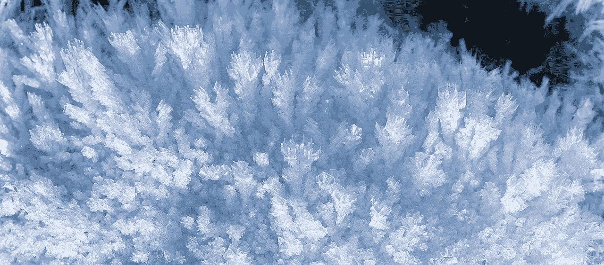
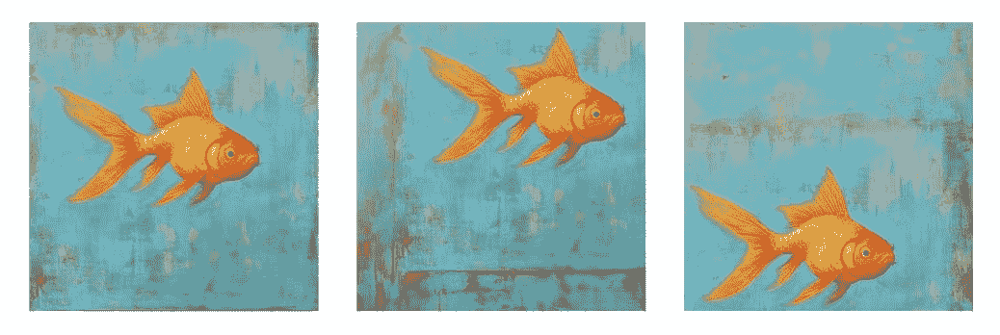
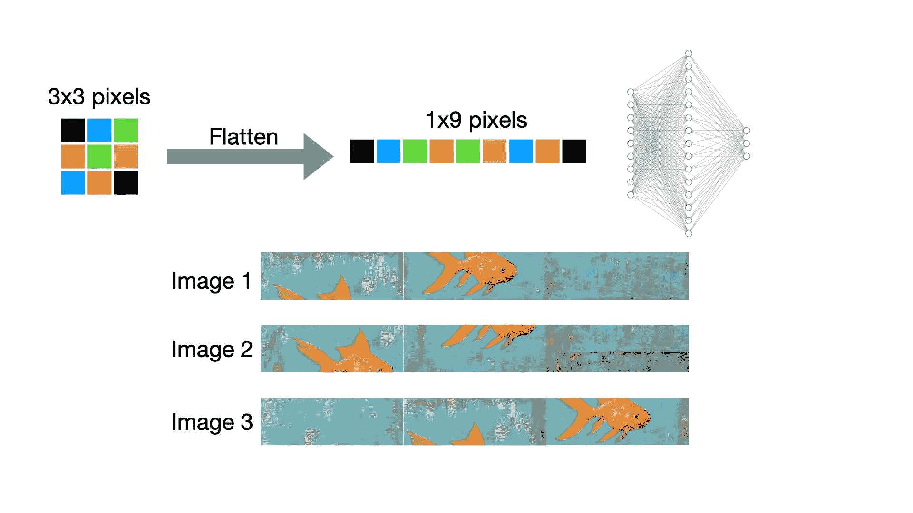
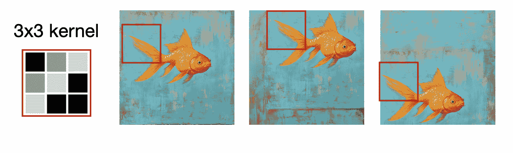

# 为什么卷积神经网络非常适合图像？

> 原文：[`towardsdatascience.com/why-are-convolutional-neural-networks-great-for-images/`](https://towardsdatascience.com/why-are-convolutional-neural-networks-great-for-images/)

<mdspan datatext="el1746060965933" class="mdspan-comment">这个</mdspan> [通用逼近定理](https://www.sciencedirect.com/science/article/abs/pii/0893608089900208?via%3Dihub) 表明，具有单个隐藏层和非线性激活函数的神经网络可以逼近任何连续函数。

不考虑实际的问题，比如这个隐藏层中的神经元数量会变得非常大，我们不需要其他网络架构。一个简单的前馈神经网络就能解决问题。

估计已经开发了多少种网络架构是一项挑战。

当你今天打开流行的 AI 模型平台[Hugging Face](https://huggingface.co/models)时，你会找到超过一百万个预训练模型。根据任务的不同，你会使用不同的架构，例如，用于自然语言处理的 transformers 和用于图像分类的卷积网络。

那么，我们为什么需要这么多神经网络架构呢？

在这篇文章中，我想从物理学的角度回答这个问题。是数据中的结构启发了新的神经网络架构。

### 对称性和不变性

物理学家喜欢对称性。物理的基本定律使用了对称性，例如，粒子的运动可以用相同的方程来描述，无论它在时间和空间中的位置如何。

对称性总是意味着对某些变换的不变性。这些冰晶是平移不变性的一个例子。较小的结构无论在更大的背景中出现在哪里，看起来都是一样的。

By Photo by PtrQs, CC BY-SA 4.0, [`commons.wikimedia.org/w/index.php?curid=127396876`](https://commons.wikimedia.org/w/index.php?curid=127396876)

### 利用对称性：卷积神经网络

如果你已经知道你的数据中存在某种对称性，你可以利用这个事实来简化你的神经网络架构。

让我们以图像分类为例来解释这一点。面板显示了包括金鱼在内的三个场景。金鱼可以出现在图像的任何位置，但图像应该始终被分类为*金鱼*。

作者使用 Midjourney 创建的图像。

如果有足够的训练数据，前馈神经网络当然可以实现这一点。

这个网络架构需要一个展平的输入图像。然后，在每个输入层神经元（代表图像中的一个像素）和每个隐藏层神经元之间分配权重。此外，隐藏层和输出层中的每个神经元之间也分配权重。

与此架构一起，面板显示了上面三个金鱼图像的“展平”版本。它们在你看来还相似吗？

由作者创建的图像。使用作者创建的 Midjourney 图像和[`alexlenail.me/NN-SVG/`](https://alexlenail.me/NN-SVG/)创建的 ANN 架构。

通过展平图像，我们产生了两个问题：

+   包含相似对象的图像一旦被展平，看起来就不一样了，

+   对于高分辨率图像，我们需要训练大量连接输入层和隐藏层的权重。

相反，卷积网络使用核。核大小通常在 3 到 7 像素之间，核参数在训练过程中是可学习的。

核像栅格一样应用于图像。卷积层将拥有多个核，允许每个核专注于图像的不同方面。

由作者创建的图像。

* * *

例如，一个核可能捕捉到图像中的水平线，而另一个核可能捕捉到凸曲线。

卷积神经网络保留了像素的顺序，非常适合学习局部结构。卷积层可以嵌套以创建深层层。结合池化层，可以学习高级特征。

结果网络的大小远小于使用全连接神经网络时的大小。卷积层只需要 *kernel_size x kernel_size x n_kernel* 个可训练参数。

你可以通过利用你的对象可能位于图像中任何位置的事实来节省内存和计算预算！

利用对称性的更高级深度学习架构包括图神经网络和物理信息神经网络。

### 摘要

卷积神经网络非常适合图像处理，因为它们保留了图像中的局部信息。而不是将所有像素展平，使图像失去意义，具有可学习参数的核捕捉局部特征。

* * *

### 进一步阅读

+   [通用逼近定理](https://www.sciencedirect.com/science/article/abs/pii/0893608089900208?via%3Dihub)

+   [Torch](https://pytorch.org/docs/stable/generated/torch.nn.Conv2d.html)中卷积层的文档
