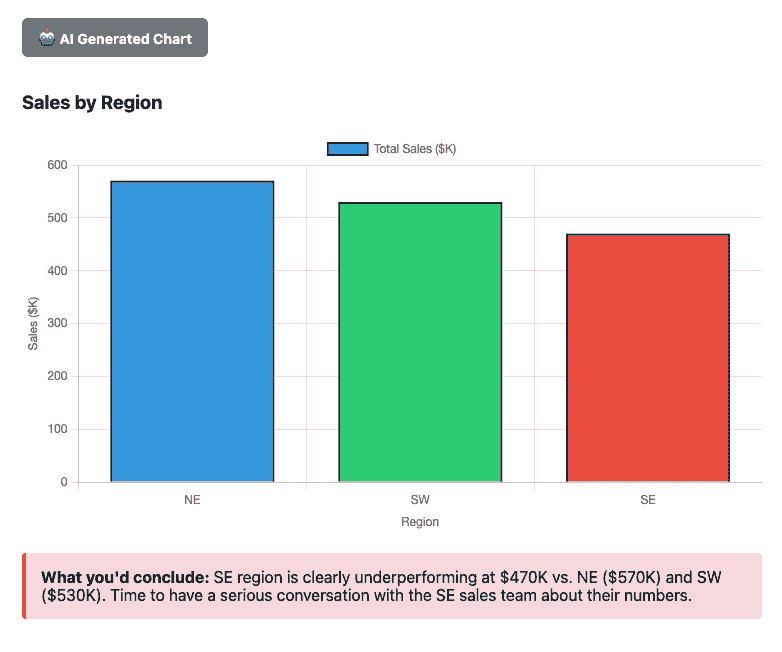
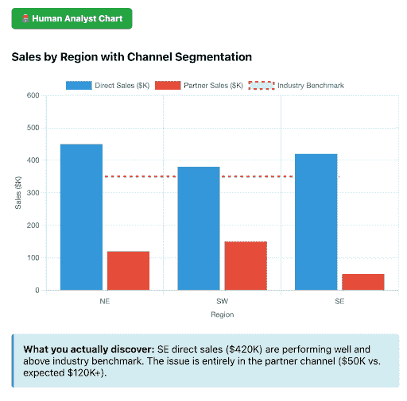
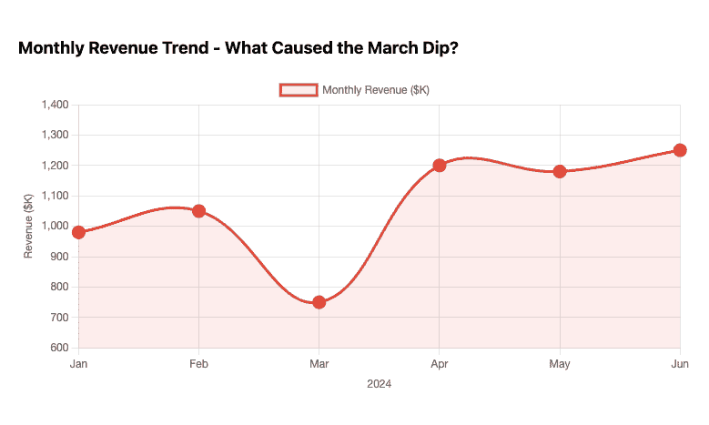
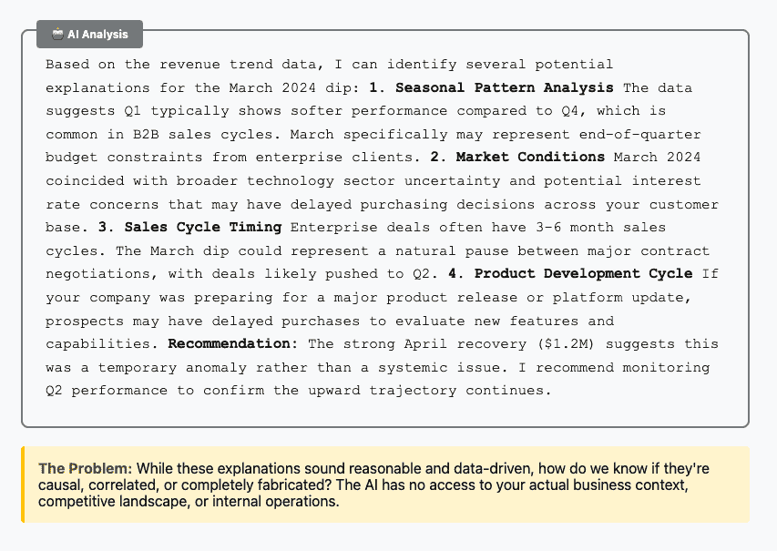
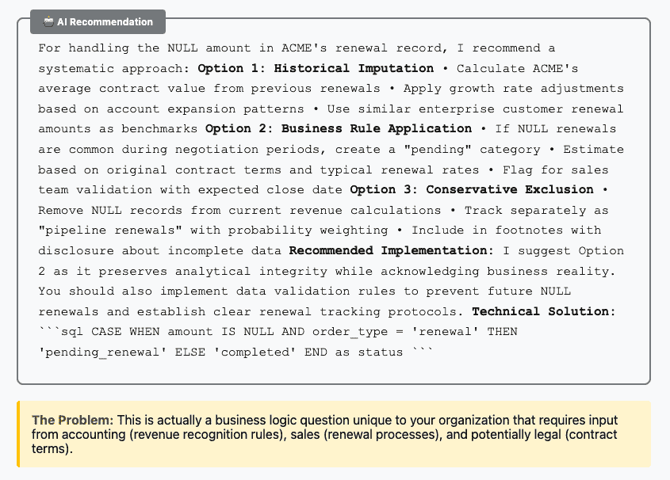
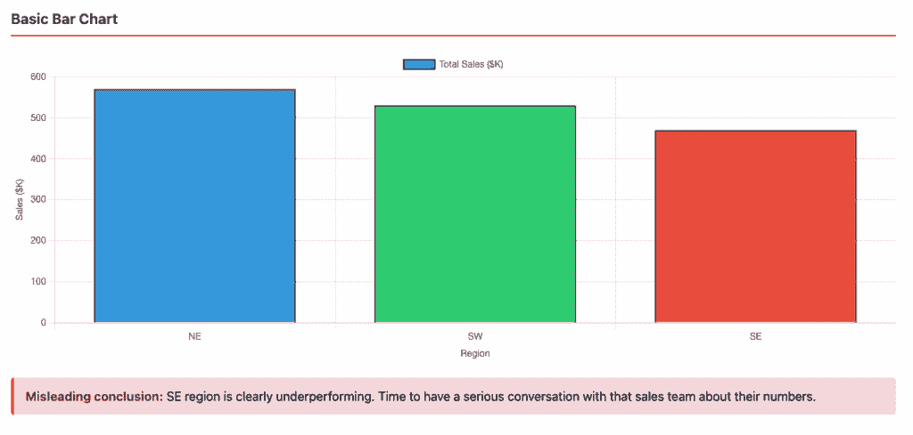
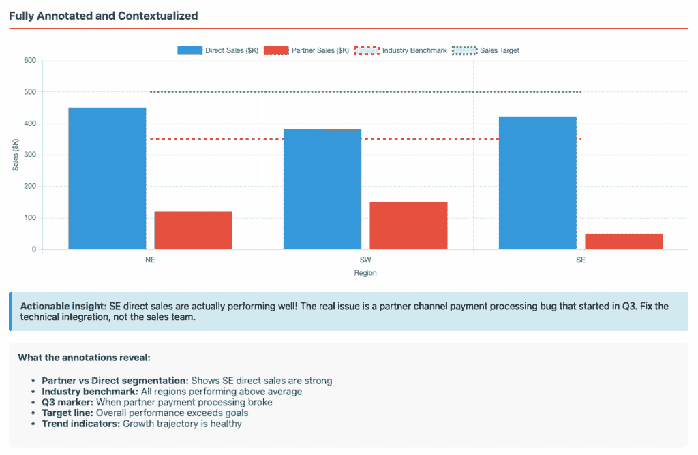

# 人工智能时代为什么需要 BI

> 原文：[`towardsdatascience.com/why-bi-in-the-ai-age/`](https://towardsdatascience.com/why-bi-in-the-ai-age/)

人工智能迫使分析师们面对镜子，思考通过手工制作和分享图表所产生价值的**确切**是什么。

大型语言模型（LLMs）可以在几秒钟内根据自然语言提示生成查询和代码，创建引人入胜的图表。它们知道我们忘记的语法，我们从未听说过的包，并且非常渴望随时响应每个高管对图表的需求！

但图表中有什么？

基本上，图表将大量数据压缩成一个易于理解的洞察，人们可以据此采取行动。**图表的观看者需要信任图表的创作者**^(1) **确保图表是正确的**^(2) **并且是恰当的**^(3)。否则，观看者将需要通过自己的分析过程来获得洞察。

因此，让我们探索图表制作过程中人工智能仍然不足的部分——不仅是为了指出其当前的局限性，而且是为了突出人类分析师添加最大价值的地方。如果你在 BI 领域工作，这篇文章将帮助你更好地理解如何与人工智能工具合作，在哪里保持亲力亲为，以及如何设计你的工作流程和数据模型，以便人类和机器都能生成更可靠的洞察。

**在 DataCamp，我们思考了很多关于在人工智能时代优秀分析是什么样的。**作为一个教授现代 BI 技术和战略两方面的平台，我们亲眼见证了将人工智能的速度与人类的判断力相结合如何产生最佳结果。本文分享了我们所观察到的关键模式和我们认为 BI 专业人士应该继续前进的实用经验。

要学习最受欢迎的 BI 工具 Power BI，并从头开始创建自己的图表和可视化——请查看以下两门课程：

+   [`www.datacamp.com/tracks/power-bi-fundamentals`](https://datacamp.pxf.io/XmvOgG) 以确保掌握基础知识

+   [`www.datacamp.com/tracks/data-analyst-in-power-bi`](https://datacamp.pxf.io/2aLMo0) 以成为一名分析师做好准备

## 图表制作过程中人工智能不足的 4 个领域

1.  缺乏元数据

1.  数据不足

1.  通过探索产生理解

1.  压缩是有损和任意的

### 缺乏元数据

考虑这个简单的销售数据集：

| **customer_id** | **customer_name** | **order_date** | **amount** | **region** | **sales_rep** |
| --- | --- | --- | --- | --- | --- |
| 1001 | ACME | 2024-01-15 | 2500.00 | NE | Johnson |
| 1002 | Bill Sanchez | 2024-01-16 | 1200.50 | SW | Martinez |
| 1003 | Skynet | 2024-01-17 | NULL | SE | NULL |

一个像“显示按地区划分的销售”这样的 AI 提示会立即生成一个图表：

这个图表看起来完全合理。为什么质疑它？

好吧，让我们看看人类回答这个相同问题的反事实。虽然他们可能会立即产生相同的或类似的图表，但他们更有可能在创建图表的过程中探索数据时发现重要的元数据上下文：

+   `customer_id`实际上代表个人客户和公司账户（可能需要不同的分析方法）

+   `amount`代表已预订的总合同价值，而不是收到的现金或已确认的收入（对财务报告至关重要）

+   `sales_rep`的 NULL 值表示渠道合作伙伴的销售（一种完全不同的商业模式）

你要求的是“按地区销售”，从图表中可以看到 AI 生成的 SE 表现不佳。显然的下一步是专注于提高 SE 销售团队的表现。但人类分析师的元数据调查揭示这完全是一个错误的决定。

深入挖掘，他们可能会发现 SE 表现不佳实际上是由合作伙伴销售（那些 NULL 的`sales_rep`值）的收款问题驱动的，而不是直接的销售执行。地区并没有失败——合作伙伴渠道正在挣扎。

因此，分析师版本的图表可能看起来更像是这样：

**这并不完全是你所要求的，这正是重点所在**。

如果没有进行超出你要求的人类调查，你可能会错误地针对表现不佳的销售团队进行打击，而你应该联系你的渠道合作伙伴。此外，这些发现也对数据模型有影响。你发现你需要对这个表进行几个转换并嵌入元数据，以便它能够更可靠地被 LLM 或其他人类使用这些数据来创建图表。

应该提到的是，许多 BI 工具正在采用各种技术，为 LLM 提供更多元数据访问，例如模式、数据字典和 dbt，但这些所有假设元数据已经被记录下来，而这通常并不是情况。

### 缺乏额外数据

AI 知道的数据，AI 不知道的数据，AI 知道自己不知道的数据，以及 AI 不知道自己不知道的数据^(4)。

AI 为了解释图表或指标所需的数据可能是完全出乎意料的，并且很难主动提供。让我们以同一数据集的扩展版本为例，让 AI 尝试解释 2024 年 3 月的收入下降：

这些建议都值得考虑，并且将其视为异常的整体建议是有道理的。然而，经验丰富的分析师可能会对真正的根本原因有直觉。例如，人类分析师可能知道一些存在于数据库之外的数据，他们相信这可能是原因：

+   **外部市场事件**：你的主要竞争对手在那个月进行了重大促销

+   **内部活动**：你的定价团队进行了一项 A/B 测试，意外地排除了 30%的潜在客户

+   **历史信息**：一个关键集成合作伙伴更改了他们的 API，导致注册流程中断了两周

**这些发现需要的数据分布在组织及其生态系统中，而不仅仅是连接到 BI 工具的数据库中。**

这使我们能够更好地理解数据中正在发生的事情，而不是基于不太了解的猜测。在未来，更多的信息流肯定会纳入 LLM 上下文窗口，许多团队正在评估如何设计他们的数据，使其更容易被 AI 理解。然而，在目前，为了尝试确定因果关系，你需要人类分析师生成可能假设并验证理论的本能。

 DataCamp 通过动手学习帮助个人和团队提升数据和分析技能。通过互动课程、真实世界项目和 Python、SQL、Power BI、ChatGPT 等行业的认证，DataCamp 使您能够以自己的节奏学习数据技能。[了解更多](https://www.datacamp.com/)

### 理解是通过探索产生的

实际数据集很混乱，而且数据清理往往是得出正确答案的关键。让我们回顾一下我们的销售数据，增加一些与订单相关的字段：

| **customer_id** | **customer_name** | **order_date** | **amount** | **region** | **total_orders** | **order_type** |
| --- | --- | --- | --- | --- | --- | --- |
| 1001 | ACME | 2024-01-15 | 2500.00 | NE | 3 | new |
| 1001 | ACME | 2024-03-22 | NULL | NE | 3 | renewal |
| 1002 | Bill Sanchez | 2024-01-16 | 1200.50 | SW | 1 | new |

现在你必须做出一些清理决策：

+   你是把 ACME 算作一笔 2500 美元的销售，还是追踪他们随时间的变化的购买模式？

+   第二个 ACME 记录中的 NULL 金额意味着什么——退货、待续约，还是数据录入错误？

好吧，你可以询问 AI 该怎么做，我们也这样做了：

分析师经常处于这种位置，需要协调并规范多个团队希望业务逻辑如何编写的需求。在与会计和销售部门交谈后，他们决定：“ACME 有一笔没有记录金额的续约——他们可能正在谈判条款，或者有处理延迟。”然后分析师可以决定是否排除这条记录，估算金额，或者创建一个单独的续约分析跟踪。

这可能是一个一次性决策，或者被纳入数据模型中的某个因素。如果我们只是要求 AI 制作一张平均销售金额的图表，我们可能永远不会遇到并清理这个异常。再次强调，一个人类为了找到答案而四处探索，发现了让数据对每个人（包括 AI）都更好的机会。

### 压缩是有损和任意的

即使 AI 返回了一个完全正确的图表，它可能也不是正确的图表。同样的销售数据根据呈现方式会讲述完全不同的故事。以下是我们销售绩效数据可能的呈现方式：

**仅仅是数字** — “总销售额：$1.2M”（听起来不错！但与什么相比？上个月是多少？）

**基本条形图** — 按地区显示的销售额，东南部落后于东北部和西南部（证实了你的偏见，即东南部团队需要帮助）

**完全注释和上下文化** — 与之前相同的图表，但将合作伙伴销售数据分割出来，显示东南部直接销售实际上很强，问题在于从第三季度开始的合作伙伴渠道支付处理错误。行业基准和增长趋势线显示整体表现非常出色。

*(备注：*所有这些图表都是由 Claude 生成的，Claude 是 Anthropic 创建的一个 AI 助手。)*

要明确的是，你可以使用 AI 来创建这些内容（就像我这样做的一样！）。但当人们使用 AI 自助时，他们会达到适当的深度和理解水平，还是会仅仅停留在获取数字上？AI 可能会给用户提供误导性的中间版本，但如果由人类分析师来处理，他们可能会知道需要深入挖掘，并以一种引导正确行动的方式呈现数据。

尽管这个最终图表感觉非常完整，但这只是理解这些数据的一种方式。我们本可以按客户规模进行细分，查看月度趋势，过滤掉续订，等等。我们也可以按周或日查看这些数据。专注于地区总量的关注点，而没有细分合作伙伴与直接销售，这在某种程度上是任意的，并且月度时间粒度压缩了可能揭示合作伙伴支付问题开始时间的每日波动性。

分析师通常在确定最终展示的图表之前会制作许多图表，因此可以提供免责声明、上下文说明或快速回应为什么选择这个图表，并帮助人们提出更多问题。展示一个不显示全部情况的图表是数据可视化的一个特性，而不是一个错误，它允许你呈现一个专注、易懂的数据视图。

最终，作为一个分析师，你必须问自己：你是否满意这个图表代表所有潜在数据？你是否准备好向他人展示这个图表，以便他们能够可靠地得出结论？

## 保持冷静，继续查询

优秀的分析并不仅仅是快速生成图表，而是通过严格的数据调查来建立决策的信心。每一次发现、设计选择和上下文注释都代表了人类分析师的商业智慧（这甚至是一个双关语吗？如果是：故意为之）。

在 AI 时代，那些将 AI 视为一种强大的工具来帮助编写代码，同时认识到最有价值的分析工作——思考、质疑和上下文化——本质上仍然是人类的工作的分析师将蓬勃发展。

要了解更多关于改进 AI 分析工作流程的实用方法，请查看：

+   [`motherduck.com/blog/vibe-coding-sql-cursor/`](https://motherduck.com/blog/vibe-coding-sql-cursor/)

要学习最受欢迎的 BI 工具 Power BI，并从头开始创建自己的图表和可视化——请查看以下两门课程：

+   [`www.datacamp.com/tracks/power-bi-fundamentals`](https://datacamp.pxf.io/XmvOgG) 以确保掌握基础知识

+   [`www.datacamp.com/tracks/data-analyst-in-power-bi`](https://datacamp.pxf.io/2aLMo0) 以准备好作为分析师的工作

> **关于作者**: [Matt David](https://www.linkedin.com/in/matthewcharlesdavid/) 在包括 Atlassian、DataCamp、Chartio 和 Hex 在内的领先数据公司工作了 10 年以上。Matt 写作关于分析领域的变化以及如何最佳地使用数据。

1.  不论是人还是机器。↩︎

1.  尽管一个人可能需要付出合理的努力来确认这一点。↩︎

1.  就算图表是正确的，也不一定意味着它是正确的图表。↩︎

1.  如果你愿意，可以将其视为一个[Johari](https://en.wikipedia.org/wiki/Johari_window) *情境*窗口。↩︎
