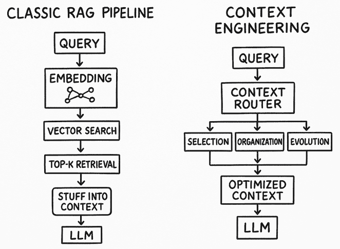
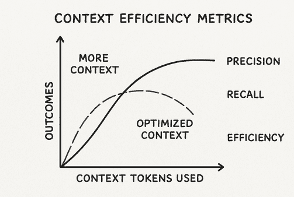

# 为什么上下文是 AI 的新货币：从 RAG 到上下文工程

> 原文：[`towardsdatascience.com/why-context-is-the-new-currency-in-ai-from-rag-to-context-engineering/`](https://towardsdatascience.com/why-context-is-the-new-currency-in-ai-from-rag-to-context-engineering/)

<mdspan datatext="el1757615783460" class="mdspan-comment">三个月前</mdspan>，我看到了我们的生产系统彻底失败。不是代码错误，也不是基础设施错误，而是简单地误解了我们的 AI 系统的优化目标。我们构建了我们认为很酷的文档分析管道，包括检索增强生成（RAG）、向量嵌入、语义搜索和微调重排序。当我们展示系统时，它对我们的客户监管文件的问答非常有说服力。但在生产中，系统回答问题完全不考虑上下文。

这个启示是在一次事后会议上给我的：我们不是在管理信息检索，而是在管理上下文分布。而且我们在这方面做得非常糟糕。

这种失败让我意识到，在 AI 行业中越来越清晰的一个观点：上下文不仅仅是另一个需要优化的输入参数。相反，它是定义 AI 系统是否提供真正价值或仅仅是一个昂贵花招的核心货币。与传统软件工程不同，我们在其中优化速度、内存或吞吐量，上下文工程要求我们像人类一样看待信息：分层、相互依赖，并依赖于情境意识。

## 现代 AI 系统中的上下文危机

在我们探讨潜在解决方案之前，确定上下文为何成为如此关键的瓶颈至关重要。这不仅仅是一个技术问题。它更多的是一个设计和哲学问题。

目前大多数 AI 实现都将上下文视为一个固定大小的缓冲区，在处理之前填充相关信息。这种方法在聊天机器人和问答系统的早期实现中效果不错。然而，随着 AI 应用的日益复杂化以及它们融入工作流程，基于缓冲区的方法已被证明严重不足。

让我们以一个典型的企业 RAG 系统为例。当用户输入问题时，系统会执行以下操作：

1.  将问题转换为嵌入

1.  在向量数据库中搜索相似内容

1.  获取最相似的 top-k 个文档

1.  将所有内容塞入上下文窗口

1.  生成答案

这种流程基于这样一个假设：在某个相似性空间中对嵌入进行聚类可以被视为上下文推理，但在实践中不仅偶尔失败，而且持续失败。

更基本的缺陷是将上下文视为静态的。在人类的对话中，上下文是灵活的，并在对话过程中变化，随着你对话的进展而移动和演变。例如，如果你要问一个同事“约翰逊报告”，这个搜索不仅仅是在他们的记忆中寻找包含这些术语的文档。它与你在做什么工作以及什么项目相关。

## 从检索到上下文编排

从考虑检索到考虑上下文编排的转变，代表了我们在架构 AI 系统时的一种根本性变化。我们不再问“什么信息与这个查询最相似？”而是需要问“什么组合的信息，以什么顺序提供，将能实现最有效的决策？”

*上下文工程整合了多个信息流——用户意图、指令分层、上下文注入和外部数据——到一个统一的处理框架中*。

*使用 AI 生成的作者图像*

这种区别很重要，因为上下文不是累加的，而是组合的。将更多文档投入上下文窗口并不会以线性方式提高性能。在许多情况下，它实际上会由于一些研究人员所说的“注意力稀释”而降低性能。模型注意力的焦点过于分散，结果是对重要细节的关注减弱。

这是我开发文档分析系统时亲身体验到的事情。我们最早的版本会为每个查询检索每个适用的案例、法规甚至规则。虽然结果会涵盖每一个可能的方面，但它们完全没有实用性。想象一下一个人在决策场景中，被大量相关信息读给他听而感到不知所措。

当我们开始将上下文视为一种叙事结构而不是单纯的信息堆砌时，洞察的时刻就出现了。法律推理以系统的方式进行：阐述事实、确定适用的法律原则、将它们应用于事实，并预测反论。

| **方面** | **RAG** | **上下文工程** |
| --- | --- | --- |
| 专注点 | 检索 + 生成 | 全生命周期：检索、处理、管理 |
| 内存处理 | 无状态 | 分层（短期/长期） |
| 工具集成 | 基础（可选） | 原生（TIR、代理） |
| 可扩展性 | 适用于问答 | 适用于代理、多轮对话 |
| 常用工具 | FAISS、Pinecone | LangGraph、MemGPT、GraphRAG |
| 示例用例 | 文档搜索 | 自动编码助手 |

## 上下文工程的架构

有效的上下文工程需要我们考虑三个不同但相互关联的层次：信息选择、信息组织和上下文演变。

### 信息选择：超越语义相似性

第一层重点在于开发更高级的方法来定义上下文包含的内容。传统的 RAG 系统过于强调嵌入相似性。这种方法忽略了缺失的关键元素，以及缺失信息如何有助于理解。

我的经验是，最有用的选择策略结合了许多不同的下。

**相关性级联**从更广泛的语义相似性开始，然后专注于更具体的过滤器。为了说明，在合规性系统中，首先选择语义相关的文档，然后过滤出相关监管管辖区的文档，接着优先考虑最近监管时期的文档，最后按最近引用频率进行排名。

**时间上下文**权重认识到信息的相关性随时间变化。五年前的法规可能与当代问题在语义上相关联。然而，如果法规过时，将其纳入上下文中就会在上下文上不准确。我们可以实施衰减函数，自动降低过时信息的权重，除非明确标记为基本或先例。

**用户上下文集成**不仅考虑即时查询，还涉及用户的角色、当前项目和历史交互模式。当合规官员询问数据保留要求时，系统应优先考虑与软件工程师询问相同问题时不同的信息，即使语义内容相同。

### 信息组织：上下文的语法

一旦我们提取了相关信息，如何在上下文窗口中呈现它就很重要。这是典型 RAG 系统可能不足的地方——它们将上下文窗口视为一个无结构的桶，而不是一个深思熟虑的叙事集合。

在组织有效上下文的情况下，框架还应要求理解认知科学家所知的“信息块化”过程。人类工作记忆可以同时维持大约七个离散的信息块。一旦超过这个数量，我们的理解就会急剧下降。对于 AI 系统来说也是如此，不是因为它们的认知缺陷相同，而是因为它们的训练迫使它们模仿人类的推理方式。

在实践中，这意味着开发上下文模板，以反映领域专家自然组织信息的方式。对于财务分析，这可能意味着从市场背景开始，然后转向特定公司的信息，接着是正在分析的特定指标或事件。对于医学诊断，这可能意味着患者病史，然后是当前症状，最后是相关的医学文献。

但这里有趣的是：最佳组织模式不是固定的。它应根据查询的复杂性和类型进行调整。简单的事实性问题可以处理较为松散组织的上下文，而复杂的分析任务则需要更结构化的信息层次。

### 上下文演变：使 AI 系统具备对话能力

第三层上下文演变是最具挑战性但也是最重要的。大多数现有系统认为每次交互都是独立的；因此，它们在每个查询时从零开始重新创建上下文。然而，提供有效的人类沟通需要将共享上下文的保存和演变作为对话或工作流程的一部分。

但是，使 AI 系统运行的上下文演变的架构将是另一回事；需要转移的是如何在一种可能性空间中管理其状态。我们不仅维护数据状态，也在维护理解状态。

这种“上下文记忆”——对系统在过去交互中确定的结构化表示——成为了我们文档响应系统的一部分。当用户提出后续问题时，系统不会将新查询视为孤立存在的。

它考虑了新查询与先前建立的上下文之间的关系，可以向前携带哪些假设，以及需要整合哪些新信息。

这种方法对用户体验有深远的影响。用户不必在每次互动时重新建立上下文，他们可以基于之前的对话，提出假设共享理解的后续问题，并参与那种表征有效人机协作的迭代探索。

## 上下文的经济学：为什么效率很重要

读取上下文的成本与计算能力成正比，并且很快可能因为维护复杂且在读取上下文方面无效的 AI 应用而变得成本过高。

做数学题：如果你的上下文窗口涉及 8,000 个标记，而你每天有大约 1,000 个查询，你每天仅上下文就消耗了 800 万个标记。在目前的定价系统中，上下文效率低下的成本可能会轻易超过任务生成的成本本身。

但是，经济学不仅限于计算的直接成本。不良的上下文管理直接导致响应时间变慢，从而造成更差的用户体验和更少的系统使用。它还增加了重复错误的概率，这会在用户的信心和为修复问题而创建的手动补丁中产生下游成本。

我观察到的最成功的 AI 实现将上下文视为一种受限的资源，需要仔细优化。它们实施上下文预算——根据查询特征，明确地将上下文空间分配给不同类型的信息。它们使用上下文压缩技术来最大化信息密度。并且它们实施上下文缓存策略以避免重新计算频繁使用的信息。

## 衡量上下文有效性

在上下文工程中，一个挑战是开发与系统有效性真正相关的指标。传统的信息检索指标，如精确率和召回率，是必要的，但并不充分。它们衡量我们是否检索到了相关信息，但它们并不衡量我们是否提供了有用的上下文。

*上下文效率在优化上下文中达到顶峰。增加更多标记并不总是提高精确率或召回率，有时甚至可能降低整体效率。* *作者使用 AI 生成的图像*

在我们的实现中，我们发现最具预测性的指标通常是行为性的，而不是基于准确性的。上下文有效性与用户参与模式密切相关：用户提出后续问题的频率，他们执行系统推荐的频率，以及他们返回使用系统执行类似任务的频率。

我们还实施了所谓的“上下文效率指标”；它衡量的是我们每消耗一个上下文标记所能提取的价值。表现优异的上下文策略始终以最小的信息开销提供可操作见解。

也许最重要的是，我们通过跟踪会话中系统性能的改进来衡量上下文演化的有效性。有效的上下文工程应该随着对话的进行而提高答案质量，因为系统对用户需求和情境要求的理解变得更加复杂。

## 上下文工程的工具和技术

开发有效的上下文工程需要新的工具和思考旧工具的新方法。新工具每月都在开发和可用，但最终在生产中奏效的策略似乎符合熟悉的模式：

**上下文路由器**根据识别查询元素动态做出决策。而不是固定的检索策略，它们评估查询的组件，如意图、努力复杂性和情境考虑。这是为了基于某种形式的优化来选择和组织信息。

**上下文压缩器**借鉴信息理论，创建了我认为的最大逻辑，以在上下文窗口内最大程度地推断密度因子。这些不仅仅是文本摘要工具，它们是关注存储最丰富上下文信息并减少噪声以及冗余的系统。

**上下文状态管理器**开发关于对话状态和工作流程状态的有序表示——这样 AI 系统就可以学习，而不是每次干预或交互的组件都重新开始。

上下文工程需要将 AI 系统视为持续对话中的合作伙伴，而不是仅对孤立查询做出响应的先知系统。这改变了我们设计界面、结构化数据和衡量成功的方式。

## 展望未来：上下文作为竞争优势

随着 AI 功能的标准化，上下文工程正成为我们的差异化因素。

AI 应用可能不会采用更先进的模型架构或更复杂的算法。相反，它们通过更好的上下文工程进一步增强现有能力，以实现更大的价值和可靠性。

其影响远不止于实施的具体环境，还涉及到组织的战略。那些将上下文工程作为核心能力的一部分，作为其差异化组织战略的公司，将优于那些仅仅强调其模型能力而不强调其信息架构、用户工作流程和特定领域推理模式竞争力的竞争对手。

一项分析超过 1400 篇 AI 论文的新调查（[链接](https://arxiv.org/pdf/2507.13334)）发现了一些相当有趣的事情：我们一直对 AI 上下文的理解完全错误。当每个人都沉迷于更大的模型和更长的上下文窗口时，研究人员发现，我们的 AI 在理解复杂信息方面已经非常出色，但它们在正确使用这些信息方面却做得不好。真正的瓶颈不是模型智能；而是我们如何向这些系统提供信息。

## 结论

导致这次探索失败的经验教会我，构建有效的 AI 系统并不仅仅在于拥有最好的模型或最复杂的算法。它关乎理解和工程化信息流动，以便实现有效的决策。

上下文工程正在成为提供真正价值的 AI 系统与仅仅保持有趣演示的 AI 系统之间的差异化因素。

AI 的未来不是创建理解一切的系统，而是创建能够准确理解系统应该关注什么、何时关注以及如何将这种关注转化为行动和洞察的系统。
