# 为什么 CrewAI 的经理-员工架构失败——以及如何修复它

> 原文：[`towardsdatascience.com/why-crewais-manager-worker-architecture-fails-and-how-to-fix-it/`](https://towardsdatascience.com/why-crewais-manager-worker-architecture-fails-and-how-to-fix-it/)

<mdspan datatext="el1764096085630" class="mdspan-comment">多智能体编排</mdspan>是 LLM（大型语言模型）最有希望的应用之一，CrewAI 迅速成为构建智能体团队的热门框架。但其中最重要的功能——分层**经理-员工**流程——简单地没有按[文档](https://docs.crewai.com/en/learn/hierarchical-process)所述那样工作。在实际的工作流程中，经理无法有效地协调智能体；相反，CrewAI 按顺序执行任务，导致推理错误、不必要的工具调用和极高的延迟。这个问题在几个在线论坛中被突出显示，但没有明确的解决方案。

在这篇文章中，我演示了 CrewAI 分层流程失败的原因，展示了来自实际 Langfuse 跟踪的证据，并提供了使用自定义提示使经理-员工模式可靠工作的可重复路径。

## 多智能体编排

在我们深入细节之前，让我们了解在智能体环境中编排意味着什么。简单来说，编排就是在工作流程中管理和协调多个相互依赖的任务。但工作流程管理工具（例如；RPA）不是一直都在做这件事吗？那么 LLM（大型语言模型）带来了什么变化？

答案是 LLM（大型语言模型）理解自然语言指令中的意义和意图的能力，就像团队中的人一样。虽然早期的流程工具是基于规则的且僵化，但随着 LLM 作为智能体的作用，预期它们将能够理解用户查询的意图，使用推理来创建多步计划，推断要使用的工具，以正确的格式推导其输入，并在精确响应用户查询的过程中综合所有不同的中间结果。编排框架旨在通过适当的提示来指导 LLM 进行规划、工具调用、生成响应等。

在编排框架中，CrewAI 以其基于自然语言的任务、智能体和团队定义，最依赖于 LLM（大型语言模型）理解语言和管理工作流程的能力。虽然不如 LangGraph（因为 LLM 的输出不能完全确定）那样确定，但它将路由、错误处理等大多数复杂性抽象为简单、用户友好的参数化结构，用户可以根据适当的行为进行调整。因此，它是一个很好的框架，用于产品团队甚至非开发人员创建原型。

*除了经理-员工模式没有按预期工作…*

为了说明这一点，让我们考虑一个用例来工作。并基于以下标准评估响应：

1.  编排的质量

1.  最终响应的质量

1.  可解释性

1.  延迟和使用成本

## 用例

以客户支持代理团队解决技术或计费工单为例。当工单到来时，分类代理对工单进行分类，然后分配给技术或计费支持专家进行解决。有一个客户支持经理负责协调团队，委派任务并验证响应质量。

一起解决以下查询：

1.  为什么我的笔记本电脑会过热？

1.  为什么上个月我被收费两次？

1.  我的笔记本电脑过热了，而且，上个月我多被收费了两次？

1.  系统故障后，我的发票金额不正确？

第一个查询完全是技术性的，因此只有技术支持代理应由经理调用，第二个查询仅涉及计费，第三个和第四个查询需要技术和计费代理的回答。

让我们构建这个 CrewAI 代理团队，看看它的工作效果如何。

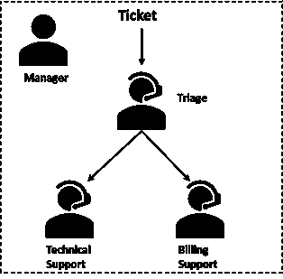

客户支持代理团队

## 分层流程

根据 CrewAI 文档，“*采用分层方法允许在任务管理中实现清晰的层次结构，其中‘经理’代理协调工作流程，委派任务，并验证结果，以实现流畅和有效的执行*。” 此外，经理代理可以通过两种方式创建，由 CrewAI 自动创建或由用户明确设置。在后一种情况下，您对经理代理的指令有更多的控制。我们将尝试两种方式来处理我们的用例。

## CrewAI 代码

<details class="wp-block-details is-layout-flow wp-block-details-is-layout-flow"><summary>以下是用例的代码。我使用了 gpt-4o 作为 LLM 和 Langfuse 进行可观察性。</summary>

```py
from crewai import Agent, Crew, Process, Task, LLM
from dotenv import load_dotenv
import os
from observe import * # Langfuse trace

load_dotenv()
verbose = False
max_iter = 4

API_VERSION = os.getenv(API_VERSION')
# Create your LLM
llm_a = LLM(
    model="gpt-4o",
    api_version=API_VERSION,
    temperature = 0.2,
    max_tokens = 8000,
)

# Define the manager agent
manager = Agent(
    role="Customer Support Manager",
    goal="Oversee the support team to ensure timely and effective resolution of customer inquiries. Use the tool to categorize the user query first, then decide the next steps.Syntesize responses from different agents if needed to provide a comprehensive answer to the customer.",
    backstory=( """
        You do not try to find an answer to the user ticket {ticket} yourself. 
        You delegate tasks to coworkers based on the following logic:
        Note the category of the ticket first by using the triage agent.
        If the ticket is categorized as 'Both', always assign it first to the Technical Support Specialist, then to the Billing Support Specialist, then print the final combined response. Ensure that the final response answers both technical and billing issues raised in the ticket based on the responses from both Technical and Billing Support Specialists.
        ELSE
        If the ticket is categorized as 'Technical', assign it to the Technical Support Specialist, else skip this step.
        Before proceeding further, analyse the ticket category. If it is 'Technical', print the final response. Terminate further actions.
        ELSE
        If the ticket is categorized as 'Billing', assign it to the Billing Support Specialist.
        Finally, compile and present the final response to the customer based on the outputs from the assigned agents.
        """
    ),
    llm = llm_a,
    allow_delegation=True,
    verbose=verbose,
)

# Define the triage agent
triage_agent = Agent(
    role="Query Triage Specialist",
    goal="Categorize the user query into technical or billing related issues. If a query requires both aspects, reply with 'Both'.",
    backstory=(
        "You are a seasoned expert in analysing intent of user query. You answer precisely with one word: 'Technical', 'Billing' or 'Both'."
    ),
    llm = llm_a,
    allow_delegation=False,
    verbose=verbose,
)

# Define the technical support agent
technical_support_agent = Agent(
    role="Technical Support Specialist",
    goal="Resolve technical issues reported by customers promptly and effectively",
    backstory=(
        "You are a highly skilled technical support specialist with a strong background in troubleshooting software and hardware issues. "
        "Your primary responsibility is to assist customers in resolving technical problems, ensuring their satisfaction and the smooth operation of their products."
    ),
    llm = llm_a,
    allow_delegation=False,
    verbose=verbose,
)

# Define the billing support agent
billing_support_agent = Agent(
    role="Billing Support Specialist",
    goal="Address customer inquiries related to billing, payments, and account management",
    backstory=(
        "You are an experienced billing support specialist with expertise in handling customer billing inquiries. "
        "Your main objective is to provide clear and accurate information regarding billing processes, resolve payment issues, and assist with account management to ensure customer satisfaction."
    ),
    llm = llm_a,
    allow_delegation=False,
    verbose=verbose,
)

# Define tasks
categorize_tickets = Task(
    description="Categorize the incoming customer support ticket: '{ticket} based on its content to determine if it is technical or billing-related. If a query requires both aspects, reply with 'Both'.",
    expected_output="A categorized ticket labeled as 'Technical' or 'Billing' or 'Both'. Do not be verbose, just reply with one word.",
    agent=triage_agent,
)

resolve_technical_issues = Task(
    description="Resolve technical issues described in the ticket: '{ticket}'",
    expected_output="Detailed solutions provided to each technical issue.",
    agent=technical_support_agent,
)

resolve_billing_issues = Task(
    description="Resolve billing issues described in the ticket: '{ticket}'",
    expected_output="Comprehensive responses to each billing-related inquiry.",
    agent=billing_support_agent,
)

# Instantiate your crew with a custom manager and hierarchical process
crew_q = Crew(
    agents=[triage_agent, technical_support_agent, billing_support_agent],
    tasks=[categorize_tickets, resolve_technical_issues, resolve_billing_issues],
    # manager_llm = llm_a, # Uncomment for auto-created manager
    manager_agent=manager, # Comment for auto-created manager
    process=Process.hierarchical,
    verbose=verbose,
)
```</details>

如同显而易见的那样，程序反映了人类代理团队。不仅有一个经理、分类代理、技术和计费支持代理，而且 CrewAI 对象如 Agent、Task 和 Crew 在其含义上不言自明，且易于可视化。另一个观察是，Python 代码非常少，大部分推理、计划和行为都是基于自然语言的，这取决于 LLM 从语言中推导意义和意图的能力，然后为目标进行推理和计划。

因此，CrewAI 代码在开发简便性方面得分很高。这是一种低代码快速创建流程的方式，其中工作流程的大部分繁重工作由编排框架而不是开发者来完成。

## 它的工作效果如何？

由于我们正在测试分层流程，因此在 Crew 定义中将流程参数设置为 *Process.hierarchical*。我们将尝试 CrewAI 的不同功能如下，并衡量性能：

1.  由 CrewAI 自动创建的经理代理

1.  使用我们定制的经理代理

### 1. 自动创建的经理代理

*输入查询：为什么我的笔记本电脑会过热？*

这里是 Langfuse 跟踪信息：

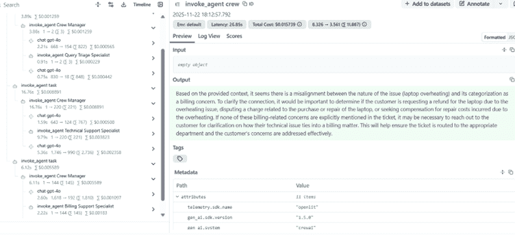

为什么我的笔记本电脑会过热？

关键观察如下：

1.  首先，输出是*“根据提供的情况，似乎问题的性质（笔记本电脑过热）与其作为计费问题的分类之间存在不一致。为了澄清联系，确定客户是否因过热问题要求退还笔记本电脑，对与笔记本电脑购买或维修相关的费用提出争议，或寻求因过热而产生的维修费用补偿……*”对于显然是技术问题的查询，这是一个糟糕的回复。**

1.  为什么会发生这种情况？左侧面板显示，执行首先转向分类专家，然后是技术支持，然后奇怪的是，还转向了计费支持专家。以下图形也描绘了这一点：

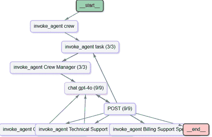

Langfuse 跟踪图

仔细观察，我们发现分类专家正确地将工单识别为“技术”，技术支持代理给出了以下出色的回复：

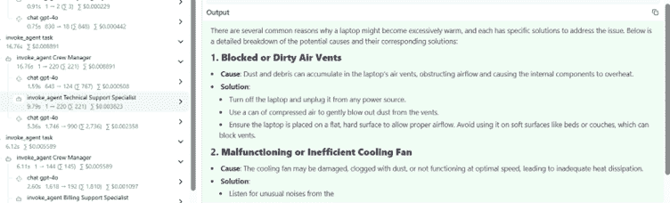

技术支持代理响应

但是，机组经理没有停止并以上述内容作为回复，而是转向计费支持专家，试图在纯粹的技术用户查询中*找到不存在的计费问题。*

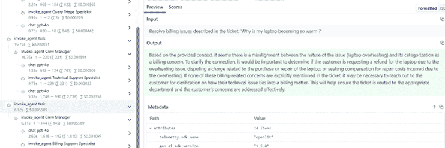

计费支持代理响应

这导致计费代理的响应覆盖了技术代理的响应，而机组经理在验证最终响应质量方面对用户查询的验证工作做得不够理想。

为什么会发生这种情况？

*因为在机组任务定义中，我指定了任务为分类工单、解决技术问题、解决计费问题，尽管过程应该是分层的，但机组经理并没有进行任何编排，而是简单地按顺序执行所有任务。*

```py
crew_q = Crew(
    agents=[triage_agent, technical_support_agent, billing_support_agent],
    tasks=[categorize_tickets, resolve_technical_issues, resolve_billing_issues],
    manager_llm = llm_a,
    process=Process.hierarchical,
    verbose=verbose,
)
```

如果你现在提出一个与计费相关的查询，它看起来会给出正确的答案，因为*解决计费问题*是序列中的最后一个任务。

那么对于需要技术和计费支持的查询，比如*“我的笔记本电脑过热，而且上个月我多付了两次费用*？”在这种情况下，分类代理也正确地将工单类型分类为“两者”，技术和计费代理针对各自的查询给出了正确答案，但经理无法将所有响应组合成一个连贯的回复来回答用户的查询。相反，最终响应只考虑了计费响应，因为那是序列中最后要调用的任务。

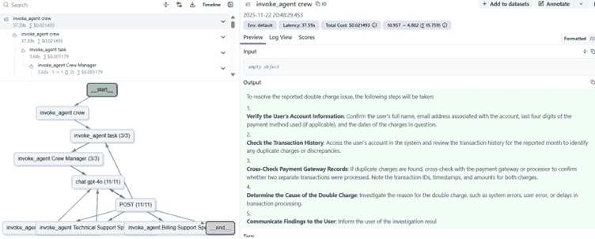

对综合查询的回复

**延迟和用量**：如上图所示，船员执行过程耗时近 38 秒，消耗了 15759 个 token。最终输出只有大约 200 个 token。其余的 token 都花在了所有思考、代理调用、生成中间响应等上——所有这些只是为了在最后生成一个不满意的响应。性能可以归类为“**差**”。

#### 对此方法的评估

+   编排质量：*差*

+   最终输出质量：*差*

+   可解释性：*差*

+   延迟和用量：*差*

但也许，上述结果是由于我们依赖于 CrewAI 的内置经理，它没有我们的自定义指令。因此，在接下来的方法中，我们将 CrewAI 自动化经理替换为我们自定义的经理代理，该代理具有关于在技术、计费或两者票据的情况下应做什么的详细说明。

### 2. 使用自定义经理代理

我们的客户支持经理定义了以下*非常具体*的指示。请注意，这需要一些实验才能使其工作，并且像 CrewAI 文档中提到的通用经理提示将给出与上述内置经理代理相同的错误结果。

```py
 role="Customer Support Manager",
    goal="Oversee the support team to ensure timely and effective resolution of customer inquiries. Use the tool to categorize the user query first, then decide the next steps.Syntesize responses from different agents if needed to provide a comprehensive answer to the customer.",
    backstory=( """
        You do not try to find an answer to the user ticket {ticket} yourself. 
        You delegate tasks to coworkers based on the following logic:
        Note the category of the ticket first by using the triage agent.
        If the ticket is categorized as 'Both', always assign it first to the Technical Support Specialist, then to the Billing Support Specialist, then print the final combined response. Ensure that the final response answers both technical and billing issues raised in the ticket based on the responses from both Technical and Billing Support Specialists.
        ELSE
        If the ticket is categorized as 'Technical', assign it to the Technical Support Specialist, else skip this step.
        Before proceeding further, analyse the ticket category. If it is 'Technical', print the final response. Terminate further actions.
        ELSE
        If the ticket is categorized as 'Billing', assign it to the Billing Support Specialist.
        Finally, compile and present the final response to the customer based on the outputs from the assigned agents.
        """
```

在船员定义中，我们使用自定义经理而不是内置的：

```py
crew_q = Crew(
    agents=[triage_agent, technical_support_agent, billing_support_agent],
    tasks=[categorize_tickets, resolve_technical_issues, resolve_billing_issues],
    # manager_llm = llm_a,
    manager_agent=manager,
    process=Process.hierarchical,
    verbose=verbose,
)
```

#### 让我们重复测试用例

*输入查询：为什么我的笔记本电脑会过热？*

跟踪如下：

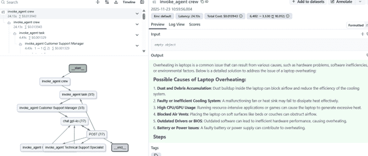

为什么我的笔记本电脑会过热？

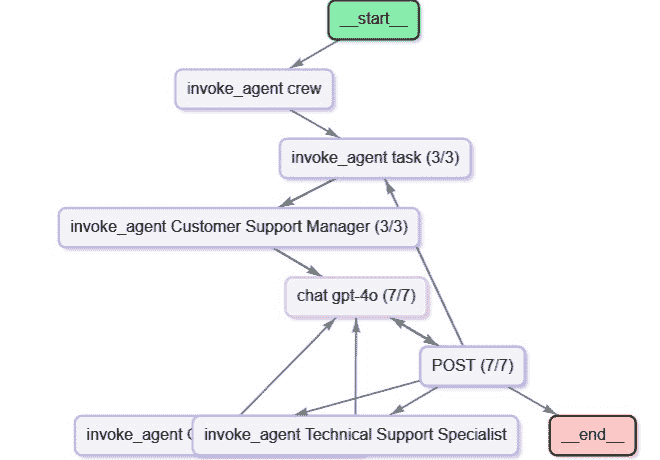

为什么我的笔记本电脑会过热的图表？

最重要的观察结果是，对于这个技术查询，流程没有流向计费支持专家代理。经理正确地遵循了指示，将查询归类为技术，并在技术支持专家生成响应后停止执行。从显示的响应预览来看，这是一个针对用户查询的好响应。此外，延迟为 24 秒，token 使用量为 10k。

*输入查询：为什么我上个月被收费两次？*

跟踪如下：

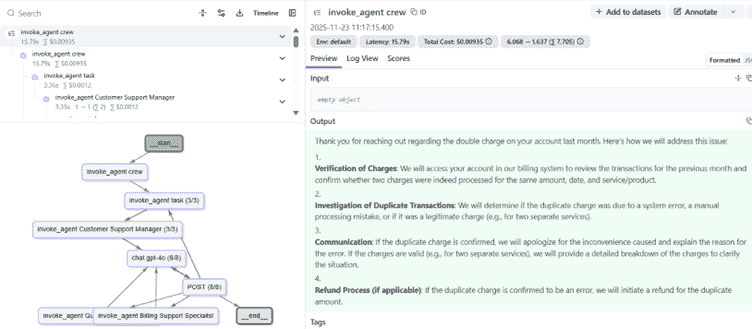

对“为什么我上个月被收费两次？”的响应

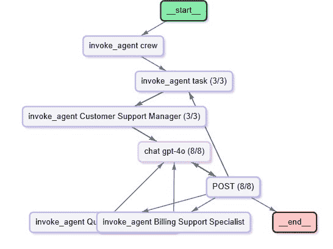

为什么我上个月被收费两次的图表？

如上图所示，经理正确地跳过了执行技术支持专家，尽管这在船员定义中是在计费代理之前。相反，生成的响应仅来自计费支持专家，质量良好。延迟为 16 秒，token 使用量仅为*7,700*。

*输入查询：我的笔记本电脑过热，而且上个月我也被收费两次？*

跟踪显示经理执行了技术和计费支持代理，并提供了综合响应。

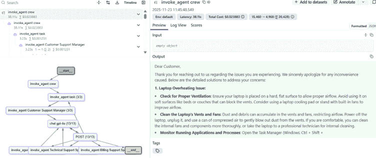

对多代理查询的响应

<details class="wp-block-details is-layout-flow wp-block-details-is-layout-flow"><summary>上图中的响应预览没有显示完整的响应，如下所示，并结合了两个支持代理的响应。延迟为 38 秒，令牌使用量为 20k，这与多个代理编排和生成的详细响应相称。</summary>

```py
Dear Customer,

Thank you for reaching out to us regarding the issues you are experiencing. We sincerely apologize for any inconvenience caused. Below are the detailed solutions to address your concerns:

**1\. Laptop Overheating Issue:**
   - **Check for Proper Ventilation**: Ensure your laptop is placed on a hard, flat surface to allow proper airflow. Avoid using it on soft surfaces like beds or couches that can block the vents. Consider using a laptop cooling pad or stand with built-in fans to improve airflow.
   - **Clean the Laptop's Vents and Fans**: Dust and debris can accumulate in the vents and fans, restricting airflow. Power off the laptop, unplug it, and use a can of compressed air to gently blow out dust from the vents. If you are comfortable, you can clean the internal fans and components more thoroughly, or take the laptop to a professional technician for internal cleaning.
   - **Monitor Running Applications and Processes**: Open the Task Manager (Windows: Ctrl + Shift + Esc, macOS: Activity Monitor) and check for processes consuming high CPU or GPU usage. Close unnecessary applications or processes to reduce the load on the system.
   - **Update Drivers and Software**: Update your operating system, drivers (especially graphics drivers), and any other critical software to the latest versions.
   - **Check for Malware or Viruses**: Run a full system scan using a reputable antivirus program to detect and remove any malware.
   - **Adjust Power Settings**: Adjust your power settings to "Balanced" or "Power Saver" mode (Windows: Control Panel > Power Options, macOS: System Preferences > Energy Saver).
   - **Inspect the Laptop's Hardware**: If the laptop is still overheating, there may be an issue with the hardware, such as a failing fan or thermal paste that needs replacement. Consult a professional technician to inspect and replace the thermal paste or faulty hardware components if necessary.
   - **Environmental Factors**: Operate the laptop in a cool, well-ventilated environment. Avoid using the laptop in direct sunlight or near heat sources.
   - **Consider Upgrading Components**: If the laptop is older, consider upgrading components such as RAM or switching to an SSD to reduce the strain on the system and help with heat management.
   - **Monitor Temperature Levels**: Install a temperature monitoring tool (e.g., HWMonitor, Core Temp, or Macs Fan Control) to keep track of the CPU and GPU temperatures. This can help identify if the laptop is consistently running at high temperatures and provide insights into when the overheating occurs.

If the problem persists after trying all the above solutions, please contact the laptop manufacturer’s support team or a certified repair technician for further assistance.

**2\. Duplicate Billing Issue:**
   - **Verification of Account Details**: I reviewed your account information to ensure accuracy and confirmed that the account is active and matches the reported issue.  
   - **Billing Records Check**: Upon examining the billing records for last month, I identified two identical charges processed on the same day. This confirms the duplicate billing issue.  
   - **Payment Method Details**: I verified the payment method used for the transactions and confirmed that both charges were processed using the same payment method.  
   - **Resolution**:  
       - Since the duplicate charge was confirmed, I have initiated a refund for the second transaction. The refund will be processed back to the original payment method within 5-7 business days.  
       - Additionally, I have applied a credit to your account as a gesture of goodwill for the inconvenience caused.  
   - **Customer Communication**: You will receive an email or phone call from us to inform you of the resolution, including the refund timeline and the applied credit.  

We sincerely apologize for the inconvenience caused by these issues. Please let us know if you need further assistance or have any additional questions. We are here to help 
```</details>

我们的最终、更为细致的查询如下：

*输入查询：系统故障后我的发票金额不正确*？

跟踪显示，查询被正确分类为“两者”，需要技术代理和计费代理的响应，并提供了综合响应。延迟为 24 秒，使用的令牌为 12k。

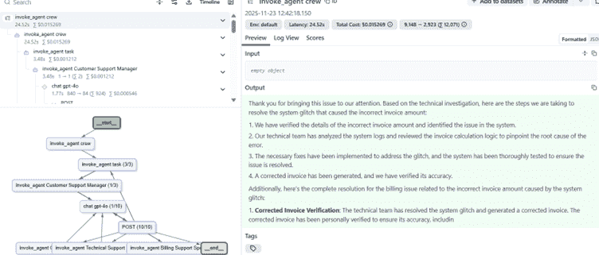

多智能体查询响应

<details class="wp-block-details is-layout-flow wp-block-details-is-layout-flow"><summary>完整的响应如下：</summary>

```py
Thank you for bringing this issue to our attention. Based on the technical investigation, here are the steps we are taking to resolve the system glitch that caused the incorrect invoice amount:

1\. We have verified the details of the incorrect invoice amount and identified the issue in the system.
2\. Our technical team has analyzed the system logs and reviewed the invoice calculation logic to pinpoint the root cause of the error.
3\. The necessary fixes have been implemented to address the glitch, and the system has been thoroughly tested to ensure the issue is resolved.
4\. A corrected invoice has been generated, and we have verified its accuracy.

Additionally, here’s the complete resolution for the billing issue related to the incorrect invoice amount caused by the system glitch:

1\. **Corrected Invoice Verification**: The technical team has resolved the system glitch and generated a corrected invoice. The corrected invoice has been personally verified to ensure its accuracy, including cross-checking the amounts, dates, and any applicable charges or credits.

2\. **Customer Communication**: We will promptly notify you about the resolution of the issue. This communication includes:
   - An apology for the inconvenience caused by the incorrect invoice.
   - Confirmation that the system glitch has been resolved.
   - Assurance that the corrected invoice has been thoroughly reviewed for accuracy.
   - A copy of the corrected invoice for your records.

3\. **Additional Steps Taken**: To prevent similar issues in the future, the technical team has implemented measures to ensure system stability and accuracy in invoice generation.

4\. **Account Adjustment (if applicable)**: If the incorrect invoice resulted in any overpayment or underpayment, the necessary adjustments will be made to your account. This includes issuing a refund for any overpayment or providing clear instructions for settling any outstanding balance.

5\. **Follow-Up**: We are here to assist you with any further questions or concerns regarding your account or billing. Please do not hesitate to reach out to us, and we will be happy to help. For your convenience, we have provided direct contact information for further communication.

We sincerely apologize for any inconvenience this may have caused and assure you that we are taking steps to prevent similar issues in the future. Thank you for your understanding and patience. 
```</details>

#### 对此方法的评估

+   编排质量：**良好**

+   最终输出质量：**良好**

+   可解释性：**良好**（我们理解它为什么这样做）

+   延迟和用量：**尚可**（与输出的复杂性相称）

## 吸取教训

总结来说，CrewAI 中的分层管理-工作模式并未按文档所述运行。核心编排逻辑较弱；CrewAI 不是允许管理者选择性委派任务，而是顺序执行所有任务，导致代理调用错误、输出被覆盖和延迟/令牌使用增加。它失败的原因在于框架的内部路由——分层模式不强制执行条件分支或真正的委派，因此最终响应实际上由最后运行的任何任务决定。修复方法是引入一个具有明确、逐步指令的自定义管理代理：它使用分类结果，有条件地调用所需的代理，综合他们的输出，并在正确的点终止执行——恢复正确的路由，提高输出质量，并显著优化令牌成本。

## 结论

CrewAI 秉承将 LLM 置于编排核心的精神，依赖它来完成大部分编排的重活，利用用户提示与框架中嵌入的详细脚手架提示相结合。与 LangGraph 和 AutoGen 不同，这种方法牺牲了确定性以换取开发友好性。有时会导致关键特性（如管理-工作模式）出现意外的行为，这对于许多实际用例至关重要。本文试图通过仔细提示展示实现该模式所需编排的途径。在未来的文章中，我打算探讨 CrewAI、LangGraph 和其他工具在实用用例中的更多功能。

您可以使用 CrewAI 在文档存储上设计一个交互式对话助手，并进一步使响应真正实现多模态。请参考我的文章**[GraphRAG 设计](https://towardsdatascience.com/do-you-really-need-graphrag-a-practitioners-guide-beyond-the-hype/)**和[多模态 RAG](https://towardsdatascience.com/building-a-multimodal-rag-with-text-images-tables-from-sources-in-response/)**。**

*在[www.linkedin.com/in/partha-sarkar-lets-talk-AI](http://www.linkedin.com/in/partha-sarkar-lets-talk-AI)*上与我联系并分享您的评论。

[本文中所有图像均由我绘制或使用 Copilot 或 Langfuse 生成。共享的代码均由我编写。]
