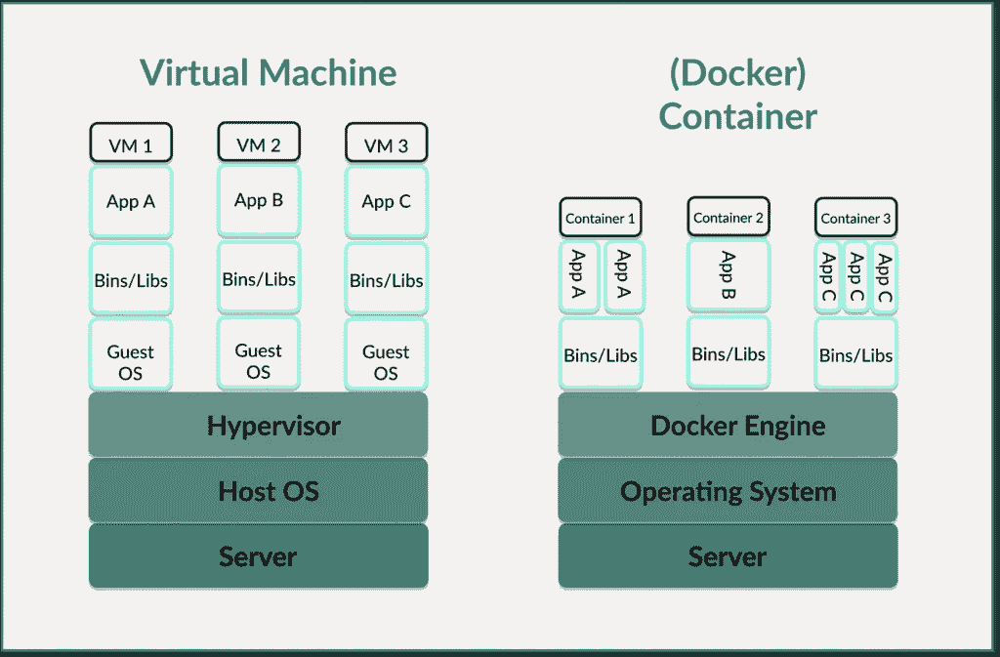
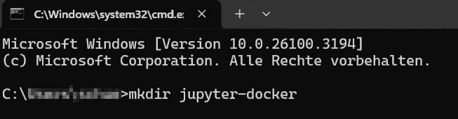
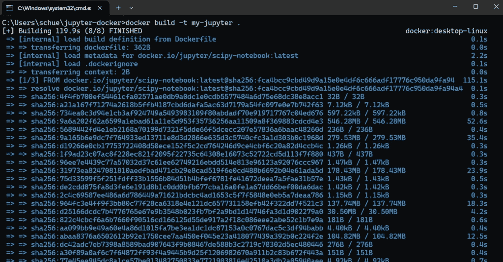
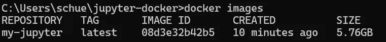
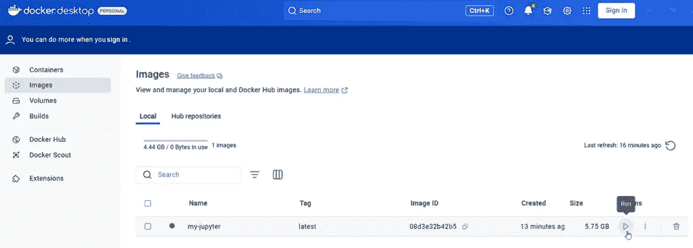
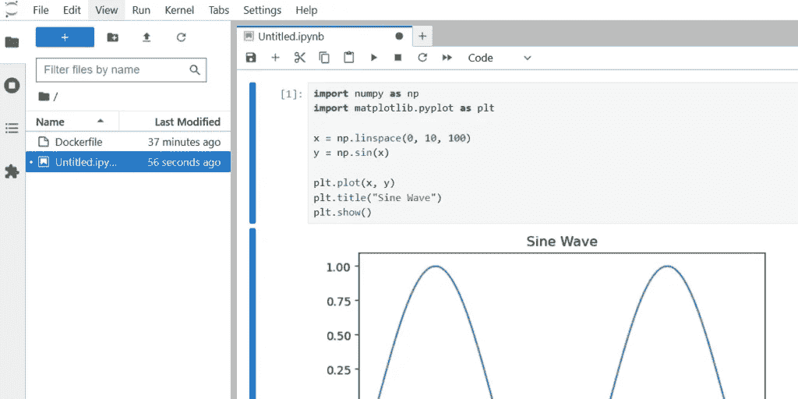
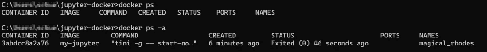

# 为什么数据科学家应该关注容器——并凭借这一知识脱颖而出

> 原文：[`towardsdatascience.com/why-data-scientists-should-care-about-containers-and-stand-out-with-this-knowledge/`](https://towardsdatascience.com/why-data-scientists-should-care-about-containers-and-stand-out-with-this-knowledge/)

“我训练模型、分析数据并创建仪表板——为什么我应该关心容器？”

许多刚进入数据科学领域的人都会问自己这个问题。但想象一下，你已经训练了一个在笔记本电脑上运行完美的模型。然而，当其他人访问云时，错误信息不断弹出——例如，因为他们使用不同的库版本。

这就是容器发挥作用的地方：它们使我们能够使机器学习模型、数据处理管道和开发环境稳定、便携和可扩展——无论它们在哪里执行。

让我们更深入地了解一下。

> **目录**
> 
> 1 — 容器与虚拟机：为什么容器比虚拟机更灵活
> 
> 2 — 容器与数据科学：我真的需要容器吗？以及四个理由说明答案是否定的。
> 
> 3 — 先实践后理论：即使没有太多先验知识也能创建容器
> 
> 4 — 你的 101 速查表：一瞥最重要的 Docker 命令和概念
> 
> 结语：作为数据科学家的关键要点
> 
> 你可以在哪里继续学习？

## 1 — 容器与虚拟机：为什么容器比虚拟机更灵活

容器是轻量级的隔离环境。它们包含应用程序及其所有依赖项。它们还共享宿主操作系统的内核，这使得它们快速、便携且资源高效。

我在“[虚拟化与容器数据科学新手指南](https://towardsdatascience.com/virtualization-containers-for-data-science-newbies/)”中广泛地讨论了虚拟机（VMs）和虚拟化。但最重要的是，虚拟机模拟完整的计算机，并在虚拟机管理程序上拥有自己的操作系统及其自己的内核。这意味着它们需要更多的资源，但也提供了更大的隔离。

容器和虚拟机都是虚拟化技术。

它们都使得在隔离环境中运行应用程序成为可能。

但在这两种描述中，你还可以看到 3 个最重要的区别：

+   架构：虽然每个虚拟机都有自己的操作系统（OS）并在虚拟机管理程序上运行，但容器共享宿主操作系统的内核。然而，容器仍然相互隔离运行。虚拟机管理程序是管理虚拟机并从物理硬件抽象虚拟机操作系统的软件或固件层。这使得在单个物理服务器上运行多个虚拟机成为可能。

+   资源消耗：每个虚拟机都包含一个完整的操作系统，因此需要大量的内存和 CPU。另一方面，容器由于共享宿主操作系统而更加轻量级。

+   可移植性：您必须为不同的环境定制虚拟机，因为它需要一个具有特定驱动程序和配置的自己的操作系统，这些配置依赖于底层硬件。另一方面，容器一旦创建，就可以在任何容器运行时可用的地方运行（Linux、Windows、云、本地）。容器运行时是创建、启动和管理容器的软件——最著名的例子是 Docker。



由作者创建

您可以使用 Docker 更快地进行实验——无论是测试新的机器学习模型还是设置数据管道。您可以将所有内容打包到容器中并立即运行。而且您不会有任何“在我的机器上运行正常”的问题。您的容器在所有地方运行方式相同——因此您可以简单地共享它。

## 2 — 容器与数据科学：我真的需要容器吗？以及 4 个回答是肯定的的原因。

作为数据科学家，您的首要任务是分析、处理和建模数据以获得有价值的见解和预测，这些见解和预测反过来对管理很重要。

当然，您不需要像 DevOps 工程师或站点可靠性工程师（SRE）那样对容器、Docker 或 Kubernetes 有同样深入的了解。尽管如此，在基本层面上拥有容器知识是值得的——因为这些是您迟早会接触到的 4 个例子：

### 模型部署

您正在训练一个模型。您不仅希望在本地上使用它，还希望使其对他人可用。为此，您可以将它打包到容器中并通过 REST API 使其可用。

让我们看看一个具体的例子：您的训练模型在 FastAPI 或 Flask 的 Docker 容器中运行。服务器接收请求，处理数据，并实时返回机器学习预测。

### 可重复性和更易于协作

机器学习模型和管道需要特定的库。例如，如果您想使用像 Transformer 这样的深度学习模型，您需要 TensorFlow 或 PyTorch。如果您想训练和评估经典机器学习模型，您需要 Scikit-Learn、NumPy 和 Pandas。Docker 容器现在确保您的代码在每台计算机、服务器或云上以完全相同的依赖关系运行。您还可以将 Jupyter Notebook 环境作为容器部署，以便其他人可以访问它并使用完全相同的包和设置。

### 云集成

容器包含应用程序所需的所有包、依赖项和配置。因此，它们在本地计算机、服务器或云环境中以统一的方式运行。这意味着您不需要重新配置环境。

例如，您编写一个数据管道脚本。这个脚本在本地对您来说工作正常。一旦您将其作为容器部署，您就可以确信它将在 AWS、Azure、GCP 或 IBM 云上以完全相同的方式运行。

### 使用 Kubernetes 进行扩展

Kubernetes 帮助你编排容器。但关于这一点，我们将在下面详细说明。如果你现在对你的 ML 模型有大量的请求，你可以使用 Kubernetes 自动扩展它。这意味着将启动更多容器的实例。

## 3 — 先实践，再理论：即使没有太多先验知识，也能创建容器

让我们看看一个任何人都可以在极短的时间内运行通过的例子——即使你对 Docker 和容器了解不多。这花了我 30 分钟。

我们将在 Docker 容器内设置一个 Jupyter Notebook，创建一个便携且可重复的 Data Science 环境。一旦启动并运行，我们就可以轻松与他人共享，并确保每个人都使用完全相同的设置。

### 0 — 安装 Docker 桌面并创建项目目录

为了能够使用容器，我们需要 Docker 桌面。为此，我们[从官方网站下载 Docker 桌面](https://www.docker.com/products/docker-desktop/)。

现在，我们为项目创建一个新的文件夹。你可以在所需的文件夹中直接这样做。我通过终端来做这件事——在 Windows 上使用 Windows + R 打开 CMD。

我们使用以下命令：



作者截图

### 1. 创建 Dockerfile

现在，我们打开 VS Code 或其他编辑器，创建一个名为“Dockerfile”的新文件。我们在这个目录下保存这个没有扩展名的文件。**为什么它不需要扩展名？**

我们将以下代码添加到该文件中：

```py
# Use the official Jupyter notebook image with SciPy
FROM jupyter/scipy-notebook:latest  

# Set the working directory inside the container
WORKDIR /home/jovyan/work  

# Copy all local files into the container
COPY . .

# Start Jupyter Notebook without token
CMD ["start-notebook.sh", "--NotebookApp.token=''"]
```

因此，我们已经定义了一个基于官方 Jupyter SciPy Notebook 镜像的容器环境。

首先，我们使用 `FROM` 定义容器基于哪个基础镜像构建。`jupyter/scipy-notebook:latest` 是一个预配置的 Jupyter Notebook 镜像，包含 NumPy、SciPy、Matplotlib 或 Pandas 等库。或者，我们也可以在这里使用不同的镜像。

使用 `WORKDIR` 我们设置容器内的工作目录。`/home/jovyan/work` 是 Jupyter 默认使用的路径。用户 `jovyan` 是 Jupyter Docker 镜像中的默认用户。也可以选择另一个目录——但这个目录是 Jupyter 容器的最佳实践。

使用 `COPY . .` 我们将本地目录中的所有文件（在这个例子中是位于 `jupyter-docker` 目录中的 Dockerfile）复制到容器中的工作目录 `/home/jovyan/work`。

使用 `CMD [“start-notebook.sh”, “ — NotebookApp.token=‘’’”]` 我们指定容器的默认启动命令，指定 Jupyter Notebook 的启动脚本，并定义笔记本启动时不需要令牌——这允许我们直接通过浏览器访问它。

### 2. 创建 Docker 镜像

接下来，我们将构建 Docker 镜像。请确保您已打开之前安装的 Docker 桌面。现在我们回到终端，使用以下命令：

```py
cd jupyter-docker
docker build -t my-jupyter .
```

使用 `cd jupyter-docker` 我们导航到我们之前创建的文件夹。使用 `docker build` 我们从 Dockerfile 创建一个 Docker 镜像。使用 `-t my-jupyter` 我们给镜像起一个名字。点号表示镜像将基于当前目录构建。这是什么意思？注意镜像名称和点号之间的空格。

Docker 镜像是容器的模板。这个镜像包含了应用程序所需的一切，例如操作系统基础（例如 Ubuntu、Python、Jupyter），依赖项如 Pandas、Numpy、Jupyter Notebook、应用程序代码和启动命令。当我们“构建”一个 Docker 镜像时，这意味着 Docker 读取 Dockerfile 并执行我们定义在那里的步骤。然后，可以从这个模板（Docker 镜像）启动容器。

我们现在可以在终端中观察 Docker 镜像的构建过程。



作者截图

我们使用 `docker images` 来检查镜像是否存在。如果输出中出现 `my-jupyter`，则创建成功。

```py
docker images
```

如果是的话，我们可以看到创建的 Docker 镜像的数据：



作者截图

### 3. 启动 Jupyter 容器

接下来，我们想要启动容器，并使用以下命令来执行：

```py
docker run -p 8888:8888 my-jupyter
```

我们使用 `docker run` 启动一个容器。首先，我们输入我们想要启动的容器的特定名称。然后，使用 `-p 8888:8888` 我们将本地端口（8888）与容器中的端口（8888）连接起来。Jupyter 就运行在这个端口上。我不明白。

或者，你也可以在 Docker Desktop 中执行此步骤：



作者截图

## 4. 打开 Jupyter Notebook 并创建一个测试笔记本

现在，我们在浏览器中打开 URL [`localhost:8888`](http://localhost:8888/)。你现在应该能看到 Jupyter Notebook 界面。

在这里，我们将创建一个 Python 3 笔记本，并将以下 Python 代码插入其中。

```py
import numpy as np
import matplotlib.pyplot as plt

x = np.linspace(0, 10, 100)
y = np.sin(x)

plt.plot(x, y)
plt.title("Sine Wave")
plt.show()
```

运行代码将显示正弦曲线：



作者截图

### 5. 终止容器

最后，我们可以在终端中使用 ‘CTRL + C’ 或在 Docker Desktop 中结束容器。

使用 `docker ps` 我们可以在终端中检查容器是否仍在运行，使用 `docker ps -a` 我们可以显示刚刚终止的容器：



作者截图

### 6. 分享你的 Docker 镜像

如果你现在想将你的 Docker 镜像上传到仓库，可以使用以下命令。这将把你的镜像上传到 Docker Hub（你需要一个 Docker Hub 账户来做这件事）。你也可以将其上传到 AWS Elastic Container、Google Container、Azure Container 或 IBM Cloud Container 的私有仓库。

```py
docker login

docker tag my-jupyter your-dockerhub-name/my-jupyter:latest

docker push dein-dockerhub-name/mein-jupyter:latest
```

如果你随后打开 Docker Hub 并进入你的个人资料中的仓库，应该可以看到该镜像。

这是一个非常简单的 Docker 入门示例。如果你想深入了解，你可以通过容器部署一个训练好的 ML 模型。

## 4 — 你的 101 速查表：一瞥最重要的 Docker 命令和概念

实际上，你可以把容器想象成货柜。无论你把它装上船（本地计算机）、卡车（云服务器）还是火车（数据中心）——内容总是相同的。

### 最重要的 Docker 术语

+   容器：包含所有依赖项的轻量级、隔离的应用程序环境。

+   Docker：允许你创建和管理容器的最受欢迎的容器平台。

+   Docker 镜像：包含代码、依赖项和系统库的只读模板。

+   Dockerfile：包含创建 Docker 镜像的命令的文本文件。

+   Kubernetes：自动管理许多容器的编排工具。

### 容器背后的基本概念

+   隔离：每个容器都包含自己的进程、库和依赖项

+   可移植性：容器可以在安装了容器运行时的地方运行。

+   可重复性：你可以创建一个容器一次，它会在任何地方以完全相同的方式运行。

### **最基本的 Docker 命令**

```py
docker --version # Check if Docker is installed
docker ps # Show running containers
docker ps -a # Show all containers (including stopped ones)
docker images # List of all available images
docker info # Show system information about the Docker installation

docker run hello-world # Start a test container
docker run -d -p 8080:80 nginx # Start Nginx in the background (-d) with port forwarding
docker run -it ubuntu bash # Start interactive Ubuntu container with bash

docker pull ubuntu # Load an image from Docker Hub
docker build -t my-app . # Build an image from a Dockerfile 
```

## 最后的想法：作为数据科学家的重要收获

👉 使用容器可以解决“在我的机器上运行”的问题。容器确保 ML 模型、数据管道和环境在不受操作系统或依赖项影响的情况下在任何地方都能以相同的方式运行。

👉 容器比虚拟机更轻量级和灵活。虽然虚拟机有自己的操作系统并消耗更多资源，但容器共享宿主操作系统并且启动更快。

👉 在处理容器时有三个关键步骤：创建一个 Dockerfile 来定义环境，使用 docker build 来创建镜像，然后使用 docker run 运行它——可选地使用 docker push 将其推送到注册表。

然后是 Kubernetes。

在这个背景下经常出现的一个术语：一个自动化容器管理的编排工具，确保可伸缩性、负载均衡和故障恢复。这对于微服务和云应用特别有用。

在 Docker 出现之前，虚拟机是首选的解决方案（更多内容请参阅‘[虚拟化与数据科学新手容器](https://towardsdatascience.com/virtualization-containers-for-data-science-newbies/)’）。虚拟机提供了强大的隔离性，但需要更多资源并且启动较慢。

因此，Docker 是在 2013 年由 Solomon Hykes 开发的，以解决这个问题。它不是虚拟化整个操作系统，而是容器独立于环境运行——无论是在你的笔记本电脑上、服务器上还是在云中。它们包含所有必要的依赖项，以确保它们在任何地方都能一致地工作。

我为好奇心强的人简化技术🚀 如果你喜欢我在 Python、数据科学、数据工程、机器学习和 AI 方面的技术洞察，请考虑订阅我的 [substack](https://sarahleaschrch.substack.com/)。

## 你在哪里可以继续学习？

+   [Towards Data Science — 为数据科学新手讲解虚拟化和容器](https://towardsdatascience.com/virtualization-containers-for-data-science-newbies/)

+   [Docker 文档 — 开始使用](https://docs.docker.com/get-started/)

+   [Kubernetes — 学习 Kubernetes 基础](https://kubernetes.io/docs/tutorials/kubernetes-basics/)

+   [FreeCodeCamp — 容器、虚拟机与 Docker](https://www.freecodecamp.org/news/a-beginner-friendly-introduction-to-containers-vms-and-docker-79a9e3e119b/)

+   [DataCamp 博客 — 从零开始学习 Docker](https://www.datacamp.com/blog/learn-docker)

+   [DataCamp — 课程：容器化和虚拟化概念](https://www.datacamp.com/courses/containerization-and-virtualization-concepts) (第一部分免费 — 没有联盟链接)

+   [IBM 博客和视频 — 容器是什么？](https://www.ibm.com/think/topics/containers)
