# Why Generative-AI Apps’ Quality Often Sucks and What to Do About It

> 原文：[`towardsdatascience.com/why-generative-ai-apps-quality-often-sucks-and-what-to-do-about-it-f84407f263c3/`](https://towardsdatascience.com/why-generative-ai-apps-quality-often-sucks-and-what-to-do-about-it-f84407f263c3/)

Image licensed from elements.envato.com, edit by Marcel Müller, 2025

过去两年中，生成式 AI 的热潮席卷了商业世界。这项技术可以使业务流程执行更高效，减少等待时间，并减少流程缺陷。一些界面，如 ChatGPT，使与 LLM 交互变得简单易用。任何有使用聊天应用程序经验的用户都可以轻松地键入查询，ChatGPT 总是会生成**一个**响应。然而，您生成的内容的**质量**和**适用性**对于**预期用途**可能会有所不同。这对于想要在其业务运营中使用生成式 AI 技术的**企业**尤其如此。

我与无数未能将高质量的生成式 AI 应用投入生产并从非确定性模型中获得可重复结果的经理和企业家交谈过。另一方面，我也构建了三十多个 AI 应用，并意识到人们在考虑生成式 AI 应用的质量时存在的一个共同误解：他们认为这完全取决于底层模型有多强大。但这只是整个故事的三分之一。

但有数十种技术、模式和架构有助于创建具有影响力的基于 LLM 的应用程序，其质量符合企业需求。不同的基础模型、微调模型、具有检索增强生成（RAG）和高级处理管道的架构只是冰山一角。

本文展示了我们如何在**具体业务流程的背景下****定性**和**定量**地评估生成式 AI 应用。我们不会止步于通用的基准，而是介绍评估具有生成式 AI 的应用程序的方法。在对生成式 AI 应用及其业务流程进行快速分析后，我们将探讨以下问题：

+   在**什么情况下**我们需要评估生成式 AI 应用，以评估其在企业应用中的端到端质量和实用性？

+   在具有生成式 AI 的应用程序的开发生命周期中**何时**，我们使用不同的评估方法，目标是什么？

+   **我们**如何在不同情况下和在生产中单独使用不同的指标来选择、监控和改进生成式 AI 应用的质量？

这个概述将为我们提供一个生成式 AI 在企业场景中的应用的端到端评估框架，我称之为 PEEL（_p_erformance _e_valuation for _e_nterprise _L_LM applications）。基于本文中创建的概念框架，我们将介绍一个实现概念，作为 entAIngine 平台的一部分，作为 entAIngine 测试床模块的补充。

## 1. 背景：业务流程和生成式 AI

一个组织依靠其业务流程生存。公司中的每一件事都可以是一个业务流程，例如客户支持、软件开发和运营流程。生成式 AI 可以通过使它们更快、更高效来改进我们的业务流程，减少等待时间并提高我们流程的结果质量。然而，我们可以进一步将每个使用生成式 AI 的业务流程活动进一步细分。

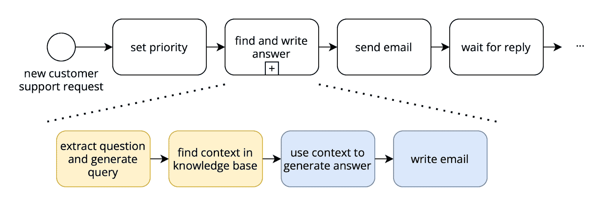

生成式 AI 应用的流程。© 2025, Marcel Müller

该插图显示了电信公司客户支持代理必须经历的简单业务开始。每当有新的客户支持请求进来时，客户支持代理必须给它一个优先级。当列表上的工作项达到请求具有优先级的时候，客户支持代理必须找到正确的答案并撰写答案电子邮件。之后，他们需要将电子邮件发送给客户并等待回复，他们迭代直到请求得到解决。

我们可以使用生成式 AI 工作流程来使“查找和撰写答案”活动更加高效。然而，这项活动通常不是一个对 ChatGPT 或其他 LLM 的单次调用，而是一系列不同的任务。在我们的例子中，电信公司使用 entAIngine 流程平台构建了一个管道，包括以下步骤。

+   **提取问题并向向量数据库生成查询**。示例公司有一个向量数据库作为检索增强生成（RAG）的知识库。我们需要从客户的请求电子邮件中提取客户问题的精髓，以获得最佳查询，并找到与问题在语义上尽可能接近的知识库部分。

+   **在知识库中查找上下文**。语义搜索活动是我们流程中的下一步。检索重排序结构通常用于获取与查询相关的最相关的 k 个上下文块，并使用 LLM 对它们进行排序。这一步骤的目的是检索正确的上下文信息，以生成最佳答案。

+   **使用上下文生成答案**。这一步骤通过提示和选定的上下文作为输入到提示中，协调使用大型语言模型。

+   **撰写答案电子邮件**。最后一步将预先制定的答案转换成公司期望的语气和复杂度的正式电子邮件，并包含正确的开头和结尾。

这种流程的执行被称为高级 LLM 工作流的**编排**。在企业环境中还有数十种其他编排架构。使用当前提示和聊天历史的聊天界面也是一种简单的编排类型。然而，对于涉及敏感公司数据的可重复性企业工作流，在很多情况下，简单的聊天编排是不够的，需要像上面展示的高级工作流。

因此，当我们评估企业场景中生成式 AI 编排的复杂过程时，仅仅关注基础模型（或微调模型）的能力，在很多情况下，只是开始。下一节将深入探讨我们需要评估哪些上下文和编排来生成 AI 应用。

## 2. 概念

以下几节介绍了我们方法的核心概念。

我的团队构建了[entAIngine](http://www.entaingine.com)平台，从这个意义上讲，它相当独特，因为它能够以低代码方式生成具有生成式 AI 任务的应用程序，这些任务不一定是聊天机器人应用程序。我们还在 entAIngine 上实现了以下方法。如果你想尝试它，给我发消息。或者，如果你想构建自己的测试平台功能，你可以从下面的概念中获取灵感。

## 2.1. 生成式 AI 应用性能评估的上下文和编排

当评估生成式 AI 应用在编排中的性能时，我们有以下选择：我们可以独立评估基础模型，微调模型，或者将这两个选项之一作为更大编排的一部分，包括对多个模型和 RAG 的多次调用。这有以下影响。

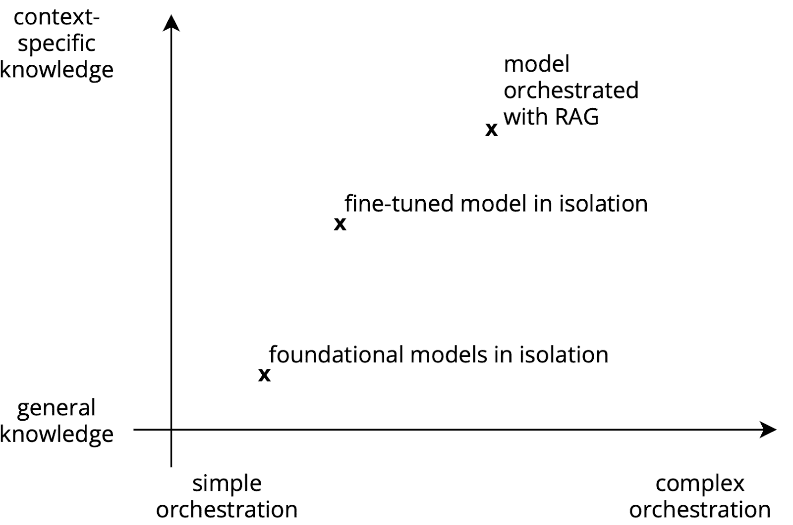

LLM 应用的上下文和编排。© Marcel Müller, 2025

公共可用的生成式 AI 模型，如（针对 LLM 的）GPT-4o、Llama 3.2 等许多其他模型，都是在“互联网的公共智慧”上训练的。它们的训练集包括来自书籍、世界文学、维基百科文章和其他来自论坛和块帖子的互联网爬虫的大量知识库。基础模型中没有任何公司内部知识编码。因此，当我们评估基础模型的能力时，我们只能评估查询回答的**一般能力**。然而，公司特定知识库的广泛性，即“模型知道多少”的量，是无法判断的。在具有高级编排的基础模型中，只有公司特定的知识被插入到公司特定的上下文中。

例如，使用 ChatGPT 的免费账户，任何人都可以问，“歌德是如何去世的？”模型将提供答案，因为关于歌德生平和死亡的关键信息在模型的知识库中。然而，对于“我们公司在去年第三季度在 EMEA 地区的收入是多少？”这样的问题，很可能会得到一个高度虚构的答案，这对于缺乏经验的用户来说似乎很有说服力。然而，我们仍然可以评估答案的形式和表达，包括风格和语气，以及与推理和逻辑推理相关的语言能力和技能。ARC、HellaSwag 和 MMLU 等合成基准为这些维度提供了比较指标。我们将在下一节中更深入地探讨这些基准。

微调模型建立在基础模型之上。它们使用额外的数据集，通过进一步训练底层机器学习模型，将基础知识添加到之前没有的知识库中。微调模型具有更多上下文特定的知识。假设我们在没有其他摄入数据的情况下单独编排它们。在这种情况下，我们可以评估知识库在特定业务流程中的适用性，以评估其实际场景的适用性。微调通常用于将特定领域的词汇和句子结构添加到基础模型中。

假设我们在一个法律法院判决的语料库上训练一个模型。在这种情况下，一个微调后的模型将开始使用法律领域常见的词汇和句子结构。该模型可以结合一些旧案例的摘录，但无法正确引用来源。

使用检索增强（RAG）编排基础模型或微调模型会产生高度上下文相关的结果。然而，这也需要一个更复杂的编排管道。

例如，像我们上面例子中的电信公司一样，可以使用语言模型创建其客户支持知识库的嵌入，并将它们存储在向量存储中。现在，我们可以通过语义搜索高效地查询向量存储中的知识库。通过跟踪检索到的文本片段，我们可以非常精确地显示检索到的文本块来源，并将其用作对大型语言模型调用的上下文。这使得我们能够端到端地回答我们的问题。

我们可以评估我们的应用程序在端到端服务其预期目的方面做得如何，对于这种具有不同数据处理管道步骤的大型编排。

评估这些不同类型的设置为我们提供了不同的见解，我们可以在生成式人工智能应用程序的开发过程中使用这些见解。我们将在下一节中更深入地探讨这一方面。

## 2.2 生成式人工智能在开发生命周期中的应用评估

我们在不同的阶段开发生成式 AI 应用：1) 在构建之前，2) 在构建和测试期间，以及 3) 在生产中。采用敏捷方法，这些阶段不是按线性顺序执行，而是迭代执行。然而，不同阶段的评估目标和方法是相同的，无论它们的顺序如何。

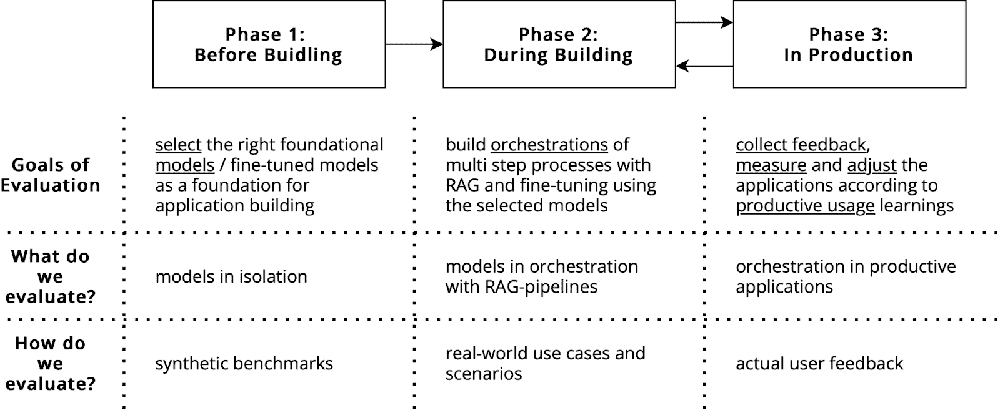

**在构建之前**，我们需要评估选择哪个基础模型，或者是否从头开始创建一个新的模型。因此，我们首先必须定义我们的期望和要求，特别是关于执行时间、效率、价格和质量。目前，由于成本和更新努力，只有极少数公司决定从头开始构建自己的基础模型。微调和检索增强生成是构建高度个性化的管道的标准工具，这些管道具有可追溯的内部知识，从而产生可重复的输出。在这个阶段，合成基准测试是实现可比性的首选方法。例如，如果我们想构建一个帮助律师准备案件的程序，我们需要一个擅长逻辑论证和特定语言理解的模型。

**在构建过程中**，我们的评估需要关注满足应用示例案例的质量和性能要求。在为律师构建应用的案例中，我们需要从有限的旧案例中进行代表性选择。这些案例是定义应用**标准场景**的基础，基于这些场景我们实现应用。例如，如果律师专长于金融法和税收，我们会选择几个标准案例，律师必须为这些案例创建场景。在这个阶段，我们进行的每一个构建和评估活动都只具有代表性场景的**有限视角**，并不涵盖每一个实例。然而，我们需要评估应用开发过程中的场景。

**在生产中**，我们的评估方法侧重于定量评估真实世界应用的使用情况，以符合活用户的期望。在生产中，我们将找到在构建场景中未涵盖的场景。这一阶段评估的目标是发现这些场景，并从活用户那里收集反馈，以进一步改进应用。

生产阶段应始终反馈到开发阶段，以迭代改进应用。因此，这三个阶段不是线性序列，而是交错进行的。

## 2.3. 评估基准指标

评估的“什么”和“何时”已经确定，我们必须问“如何”评估我们的生成式 AI 应用。因此，我们有三种不同的方法：合成基准测试、有限场景和在生产中的反馈循环评估。

对于合成基准测试，我们将探讨最常用的方法并进行比较。

**AI2 Reasoning Challenge (ARC**) 通过一个包含 7787 个多项选择题的科学问题数据集来测试一个 LLM 的知识和推理能力。这些问题从 3 年级到 9 年级不等，分为简单和挑战集。ARC 对于评估不同知识类型和推动模型整合多句信息非常有用。其主要优点是全面的推理评估，但它仅限于科学问题。

**HellaSwag** 通过基于现实场景的句子完成练习来测试常识推理和自然语言推理。每个练习包括一个视频字幕上下文和四个可能的结尾。这个基准衡量一个 LLM 对日常场景的理解。其主要优点是通过对立筛选增加的复杂性，但它主要关注一般知识，限制了专业领域的测试。

**MMLU (大规模多任务语言理解) 基准**衡量一个 LLM 在涵盖各种主题的 57 个任务中的自然语言理解能力，从 STEM 到人文科学。它包括从小学到高级水平的 15,908 个问题。MMLU 对于全面的知识评估非常理想。其广泛的覆盖范围有助于识别缺陷，但有限的构建细节和错误可能影响可靠性。

**TruthfulQA** 评估一个 LLM 生成真实答案的能力，解决语言模型中的幻觉问题。它衡量一个 LLM 的响应准确性，尤其是在训练数据不足或质量低时。这个基准对于评估准确性和真实性很有用，主要优点是专注于事实正确的答案。然而，其通用知识数据集可能无法反映在专业领域的真实性。

**RAGAS 框架**旨在评估检索增强生成（RAG）管道。这是一个特别适用于一类利用外部数据来增强 LLM 上下文的 LLM 应用框架。该框架引入了用于评估检索输出质量的忠实度、答案相关性、上下文召回、上下文精确度、上下文相关性、上下文实体召回和摘要得分的指标，可以用来从不同的视角评估检索输出的质量。

**WinoGrande** 通过基于 Winograd Schema Challenge 的代词解析问题来测试一个 LLM 的常识推理能力。它展示了基于触发词的不同答案的几乎相同的句子。这个基准对于解决代词引用中的歧义有益，具有大量数据集和减少偏差的特点。然而，注释错误仍然是一个限制。

**GSM8K** 基准通过大约 8,500 个小学水平的数学问题来衡量一个 LLM 的多步数学推理能力。每个问题都需要多个步骤，涉及基本的算术运算。这个基准突出了数学推理中的弱点，具有多样化的问题框架。然而，问题的简单性可能限制了它们的长期相关性。

**SuperGLUE** 通过测试一个 LLM 在八个不同的子任务上的 NLU 能力来增强 GLUE 基准，包括布尔问题和 Winograd Schema 挑战。它提供了对语言和常识知识的全面评估。SuperGLUE 非常适合广泛的 NLU 评估，提供全面的任务，可以提供详细的见解。然而，与 MMLU 类似的基准相比，测试的模型较少。

**HumanEval** 通过编码挑战和单元测试来衡量 LLM 生成功能正确代码的能力。它包括 164 个编码问题，每个问题有几个单元测试。这个基准评估编码和问题解决能力，重点关注与人类评估类似的功能正确性。然而，它只覆盖了一些实际编码任务，限制了其全面性。

**MT-Bench** 通过模拟现实生活中的对话场景来评估 LLM 在多轮对话中的能力。它衡量聊天机器人如何有效地参与对话，遵循自然的对话流程。使用精心策划的数据集，MT-Bench 对于评估对话能力很有用。然而，其小数据集和模拟真实对话的挑战仍需改进。

所有这些指标都是合成的，旨在在不同 LLM 之间提供相对比较。然而，它们在一家公司中的具体影响取决于场景中挑战的**分类**与基准的关系。例如，在需要大量数学的税务会计用例中，GSM8K 将是评估该能力的好候选。HumanEval 是选择在编码相关场景中使用 LLM 的初始工具。

## 2.4. 基于现实场景的评估

然而，这些基准的影响相当抽象，只能提供一个**指示**，说明它们在企业用例中的性能。这正是需要与**现实场景**合作的地方。

现实场景由以下组件组成：

+   案例特定的上下文数据（输入），

+   案例无关的上下文数据，

+   一系列要完成的任务，

+   预期的输出。

通过现实测试场景，我们可以模拟不同的情况，如

+   多步骤聊天交互，有几个问题和答案，

+   需要多个 AI 交互的复杂自动化任务，

+   涉及 RAG 的过程，

+   多模态过程交互。

换句话说，如果因为你的分块策略不好，RAG 管道总是返回平庸的结果，那么即使拥有世界上最好的模型对任何人都没有帮助。同样，如果你没有正确的数据来回答你的查询，你总是会得到一些可能或可能不接近真相的幻觉。同样，你的结果将根据你选择的模型（温度、频率惩罚等）的超参数而变化。而且，如果这是一个昂贵的模型，我们不可能为每个用例使用最强大的模型。

标准基准主要关注单个模型而不是整体情况。这就是为什么我们引入 PEEL 框架来评估企业 LLM 应用的表现，它为我们提供了一个端到端视图。

PEEL 的核心概念是**评估场景**。我们区分**评估场景定义**和**评估场景执行**。概念图示用黑色表示整体概念，用蓝色表示一个示例定义，用绿色表示执行实例的结果。

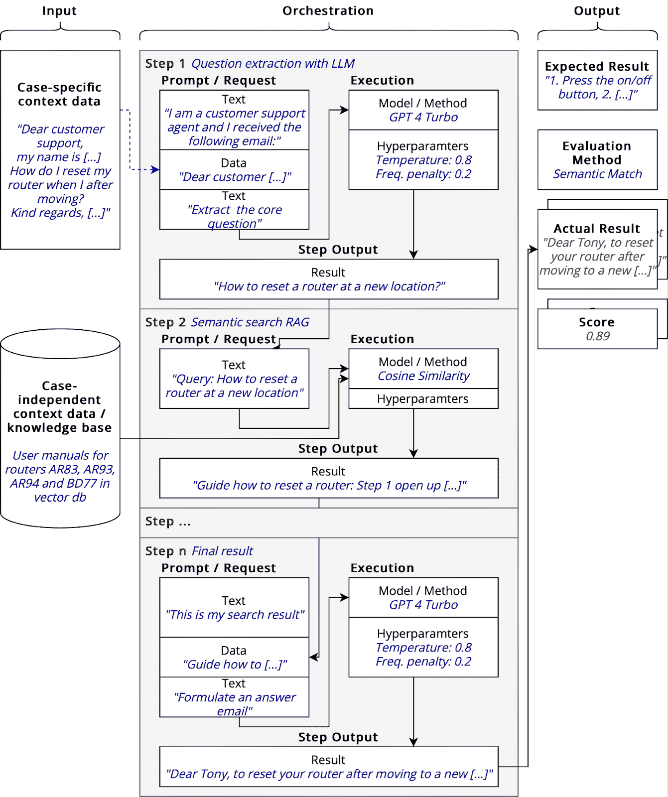

PEEL 框架中引入的评估场景概念 © Marcel Müller

评估场景定义由**输入定义**、**编排定义**和预期的**输出定义**组成。

对于输入，我们区分特定案例和独立案例的上下文数据。特定案例的上下文数据因案例而异。例如，在客户支持用例中，客户提出的问题因客户案例而异。在我们的示例评估执行中，我们描绘了一个案例，其中电子邮件询问如下：

"尊敬的客户支持，

我的名字是[……]。当我搬到不同的公寓时，我如何重置我的路由器？

敬上，[……] "

然而，包含问题答案的知识库位于大型文档中，是独立案例的。在我们的示例中，我们有一个包含路由器 AR83、AR93、AR94 和 BD77 的 pdf 手册的知识库，这些手册存储在向量存储中。

评估场景定义有一个编排。编排由一系列 n >= 1 个步骤组成，这些步骤按顺序执行在评估场景中。每个步骤都有从任何前一个步骤或从场景执行的输入中获取的输入。步骤可以是与 LLM（或其他模型）的交互、上下文检索任务（例如，从向量数据库中）或其他对数据源的调用。对于每个步骤，我们区分提示/请求和执行参数。执行参数包括需要执行的模式或方法以及超参数。提示/请求是一系列不同的静态或动态数据片段，这些数据片段被连接起来（见插图）。

在我们的示例中，我们有一个三步编排。在第 1 步中，我们从特定案例的输入上下文中提取一个问题（客户的电子邮件询问）。我们使用这个问题在第 2 步中，在我们的向量数据库中使用余弦相似度指标创建语义搜索查询。最后一步使用 LLM（大型语言模型）根据搜索结果撰写电子邮件。

在评估场景定义中，我们有一个预期的输出和评估方法。在这里，我们定义对于每个场景，我们如何评估实际结果与预期结果。我们有以下选项：

+   完全匹配/正则表达式匹配：我们检查特定一系列术语/概念的出现，并给出一个布尔值作为答案，其中 0 表示定义的术语没有出现在执行输出中，1 表示它们确实出现了。例如，在新位置安装路由器的核心概念是按重置按钮 3 秒钟。如果“重置按钮”和“3 秒钟”这些术语不是答案的一部分，我们将评估为失败。

+   语义匹配：我们检查文本是否与我们期望的答案在语义上接近。因此，我们使用一个 LLM 并分配任务，用 0 到 1 之间的一个有理数来判断答案与期望答案匹配的程度。

+   手动匹配：人类在 0 到 1 的范围内对输出进行评估。

**评估场景应该执行多次，因为 LLMs 是非确定性模型**。我们希望有足够多的执行次数，以便我们可以汇总分数并得到一个**具有统计学意义**的输出。

使用此类场景的好处是，我们可以在构建和调试我们的编排时使用它们。当我们看到在 100 次相同的提示执行中，有 80 次得分为 0.3 以下时，我们使用这个输入来调整提示或添加其他数据到我们的微调中，在编排之前。

## 2.5. 生产中的反馈收集和调整

在生产中收集反馈的原则类似于场景方法。我们将每个用户交互映射到一个场景。如果用户有更大的交互自由度，我们可能需要创建在构建阶段没有预料到的新的场景。

用户获得一个介于 0 和 1 之间的滑块，他们可以通过它来表示对结果输出的满意度。从用户体验的角度来看，这个数字也可以简化为不同的媒体，例如，一个笑的、中性的和悲伤的表情符号。因此，这种评估是我们之前介绍的手动匹配方法。

在生产中，我们必须创建与之前相同的聚合和指标，只是使用实时用户和可能更大的数据量。

## 3. 作为 entAIngine 测试平台一部分的示例实现

与[entAIngine](http://www.entaingine.com)团队一起，我们在平台上实现了该功能。本节旨在向您展示如何完成这些操作，并为您提供灵感。或者，如果您想使用我们所实现的功能，请随意使用。

我们将我们的评估场景和评估场景定义的概念映射到软件测试的经典概念。创建新测试的任何交互的起点都是通过 entAIngine 应用程序仪表板。

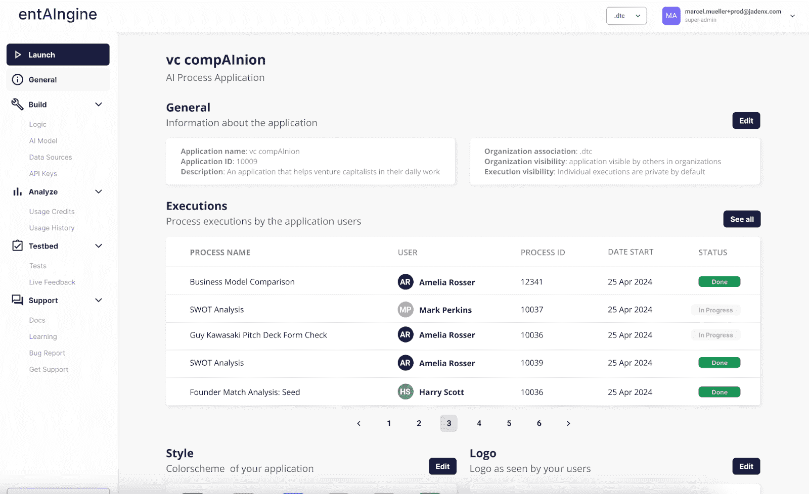

entAIngine 仪表板 © Marcel Müller

在 entAIngine 中，用户可以创建许多不同的应用程序。每个应用程序是一组定义无代码界面的工作流程的流程。流程由输入模板（变量）、RAG 组件、对 LLMs、TTS、图像和音频模块的调用、与文档和 OCR 的集成组成。使用这些组件，我们构建可重用的流程，可以通过 API 集成，用作聊天流程，用作文本编辑器中的动态文本生成块，或在显示答案来源的知识管理搜索界面中使用。目前，这一功能已经在 entAIngine 平台上完全实现，可以作为 SaaS 使用，或者 100%部署在本地。它通过 API 与现有的网关、数据源和模型集成。我们将使用流程模板生成器来评估场景定义。

当用户想要创建一个新的测试时，他们前往“测试床”和“测试”。

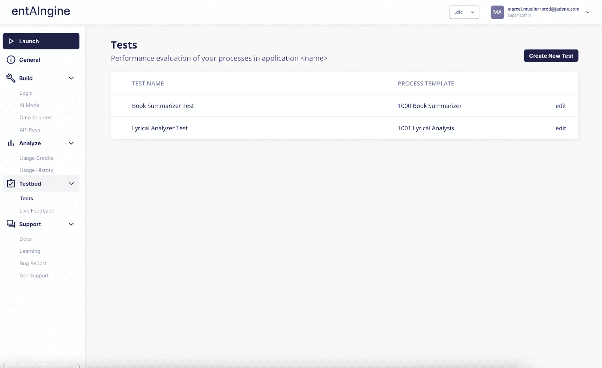

在测试屏幕上，用户可以创建新的评估场景或编辑现有的场景。在创建新的评估场景时，必须定义编排（entAIngine 流程模板）和一组指标。我们假设我们有一个需要使用 RAG 检索数据以回答问题的第一步的客户支持场景，然后在第二步中制定答案电子邮件。然后，我们使用新模块来命名测试，定义/选择一个流程模板，并选择一个评估者，该评估者将为每个单独的测试案例创建分数。

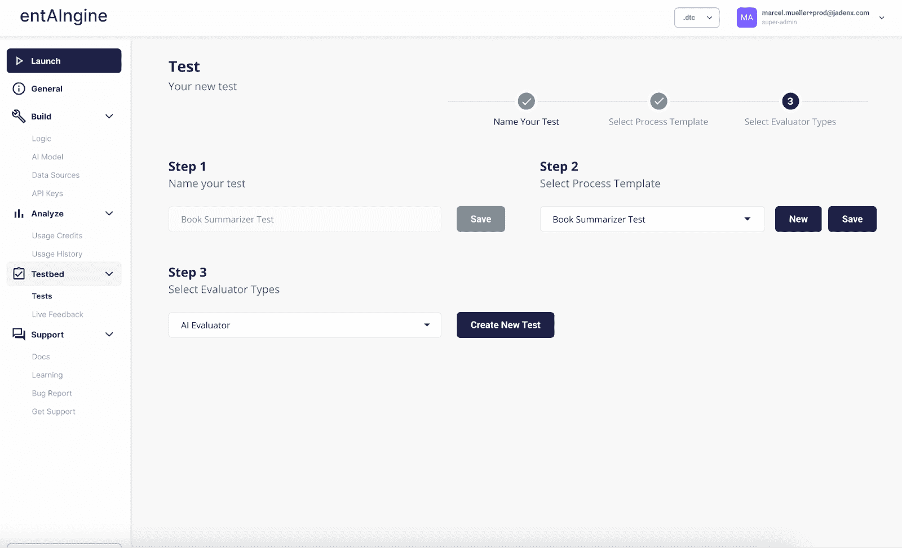

测试定义 © Marcel Müller, 2025

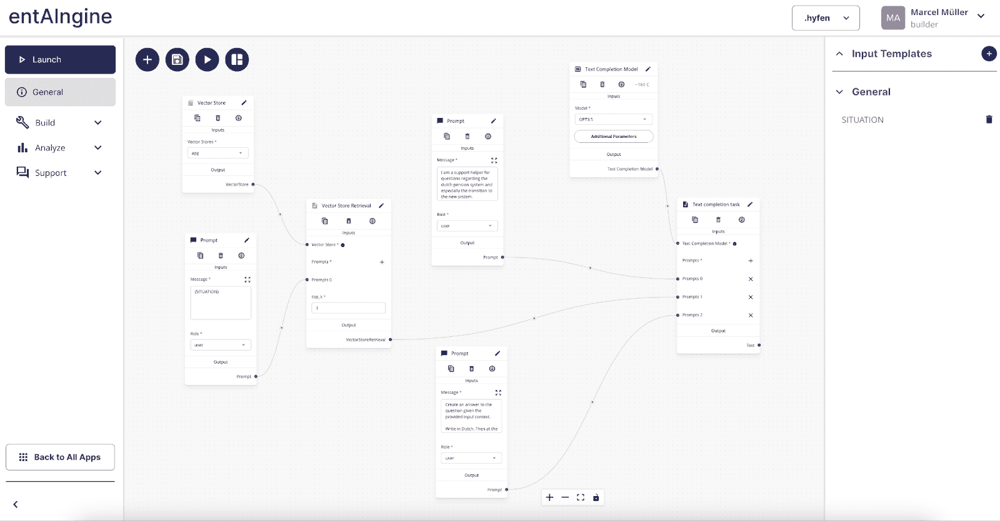

测试案例（流程模板）定义 © Marcel Müller, 2025

指标定义如上所述：正则表达式匹配、语义匹配和人工匹配。包含流程定义的屏幕已经存在并且功能正常，包括编排。如下所示，在 bull 中定义测试的功能是新的。

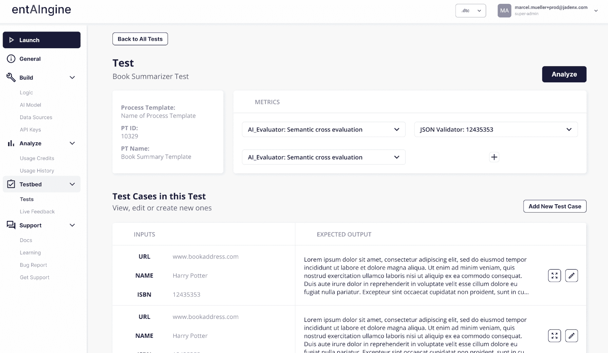

测试和测试案例 © Marcel Müller, 2025

在测试编辑器中，我们工作在评估场景定义（“评估我们的客户支持回答 RAG 的好坏”）上，并在该场景中定义不同的测试案例。测试案例将数据值分配给测试中的变量。我们可以尝试 50 或 100 个不同的测试案例实例，并对它们进行评估和汇总。例如，如果我们评估我们的客户支持回答，我们可以定义 100 个不同的客户支持请求，定义我们期望的结果，然后执行它们并分析答案的好坏。一旦我们设计了一套测试案例，我们可以使用现有的编排引擎和正确的变量执行它们的场景，并对它们进行评估。

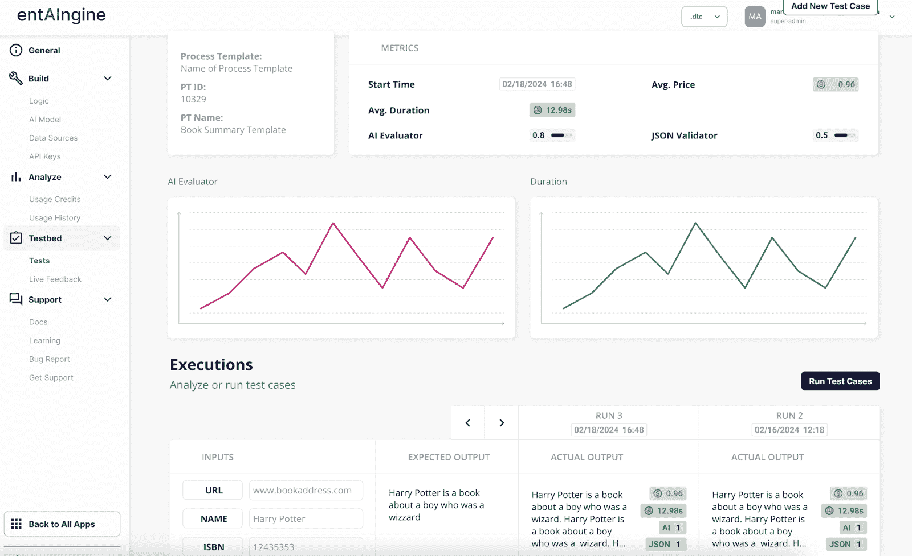

指标和评估 © Marcel Müller, 2025

这种测试发生在构建阶段。我们有一个额外的屏幕，用于在生产阶段评估真实用户反馈。内容是从真实用户反馈（通过我们的引擎和 API）收集的。

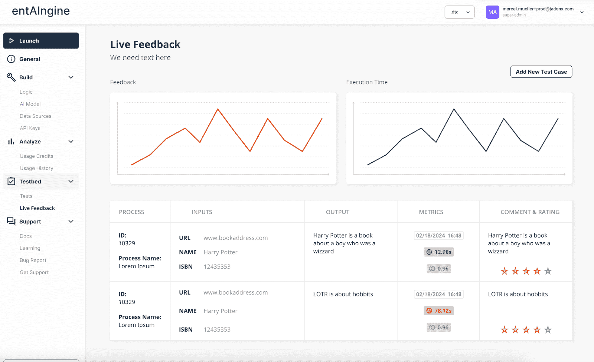

我们在实时反馈部分可用的指标是通过用户星级评分收集的。

## 结论：测试和质量

在本文中，我们探讨了生成式人工智能应用的先进测试和质量工程概念，特别是那些比简单的聊天机器人更复杂的。所介绍的 PEEL 框架是一种基于场景测试的新方法，它比我们测试模型的通用基准更接近实现层面。对于优秀应用来说，不仅要在隔离状态下测试模型，还要在协同中测试。

* * *

联系我

我正在我的日常现实世界应用中使用生成式人工智能，尤其是在企业领域。如果您想建立联系，请随意添加我或在 [LinkedIn](https://www.linkedin.com/in/the-real-marcel-mueller/) 上发消息。
