# 为什么我要转向 marimo 笔记本

> 原文：[`towardsdatascience.com/why-im-making-the-switch-to-marimo-notebooks/`](https://towardsdatascience.com/why-im-making-the-switch-to-marimo-notebooks/)

<mdspan datatext="el1763526882652" class="mdspan-comment">**TL;DR:** 经过多年的 Jupyter Lab 使用，我将大部分工作迁移到了 marimo 笔记本，这是一种新型的 Python 笔记本，解决了传统笔记本许多长期存在的问题。本文涵盖了转换背后的原因，以及 marimo 如何自然地融入我的当前工作流程，并对 Project Jupyter 构建塑造数据科学、研究和教育的笔记本生态系统表示衷心的感谢。

## 一些背景信息

我在笔记本里度过了多年。长期以来，我的设置是本地实验使用 Jupyter Notebooks/Lab，云端或 GPU 工作使用 Google Colab，多亏了它们免费层选项。我甚至[撰写了许多博客](https://towardsdatascience.com/jupyter-lab-evolution-of-the-jupyter-notebook-5297cacde6b/)，分享如何充分利用这些笔记本的技巧，其中我分享了超越常规使用方式的建议。

话虽如此，这些传统笔记本确实存在一些问题，最大的问题是反应性（或者说，缺乏反应性）。隐藏状态、执行顺序混乱和手动重新运行是我使用这些笔记本时的痛点。

当我发现 **marimo** 时，这一切都改变了，它是 Jupyter 笔记本的开源替代品，在其中你可以运行单元格、执行计算和创建图表，就像在 Jupyter 中做的一样。但它在底层工作方式非常不同，并解决了许多长期存在的问题。关键区别在于，marimo 笔记本只是一个 Python 文件，这使得它对于任何使用 Python 的人来说都是一个更好的笔记本和更好的编码环境。在这篇文章中，我分享了转换背后的十个原因，以及为什么自从转向 marimo 后，我的笔记本工作变得更加顺畅。

> *如果你想跟上，按照以下步骤安装 marimo。这个命令启动 marimo 编辑器，并以**沙盒模式**打开笔记本，它就像一个轻量级虚拟环境，将你的笔记本与系统其他部分隔离开来。你也可以使用* `marimo.new` *在在线游乐场中启动一个新的笔记本。有关详细说明，请参阅* [*文档*](https://docs.marimo.io/)*.*

```py
pip install marimo
marimo edit --sandbox notebook.py
```

## 1. 最终解决隐藏状态问题的反应性

传统笔记本不具备反应性。这意味着如果我在一个单元格中更改了某些内容，其他内容不会自动更新。我经常不得不重新运行它们，只是为了保持输出的一致性。例如，考虑下面的 Jupyter Notebook，在左边我定义了两个变量 `a` 和 `b`，将它们相加得到第三个变量 `c`，然后显示 `c` 的值，它是 `30`。

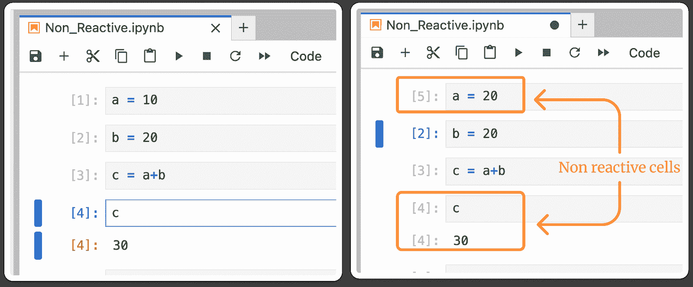

在传统的笔记本中，更改变量 a 的值不会自动更新 c。输出保持不变，直到你自己重新运行单元格，这就是隐藏状态问题在起作用。| 图片由作者提供

现在，如果我将`a`更改为右侧所示 20，除非我重新运行单元格，否则`c`仍然会显示`30`。这种代码与输出之间的不匹配是经典隐藏状态问题。

Marimo 通过**响应式执行**解决这个问题，其中每个单元格都是**依赖图（DAG）**的一部分。一个单元格的变化会自动触发依赖单元格的更新。所以，当`a`变化时，marimo 会重新评估任何依赖单元格。看看当`a`的值改变时，`c`是如何自动更新的。

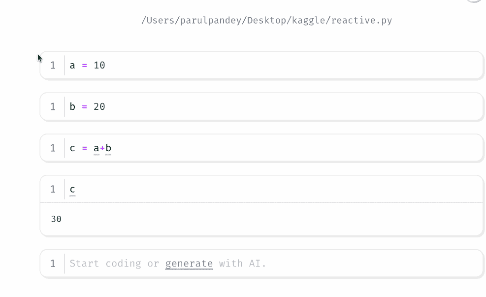

在 marimo 中，更改一个变量会立即更新 c，因为笔记本是响应式的，并且保持所有单元格同步。| 图片由作者提供

这使我的代码和输出保持完美同步，这意味着我可以与他人共享我的笔记本，而不用担心它们执行的顺序。

但**是否每个单元格都应该自动更新？**不一定。有些单元格运行起来很昂贵，比如涉及机器学习训练或大量数据处理。好消息是 marimo 支持**延迟执行**，这让你可以在需要时才关闭自动更新并触发这些单元格。

## 2. 单元格顺序不再打断我的工作流程

由于 marimo 笔记本根据变量关系而不是页面上的顺序来执行单元格，这让我有自由以对我有意义的方式组织我的代码。例如，我可以将所有导入和辅助函数放在底部，以保持工作空间整洁。

这也打开了一些有趣的使用场景。我已用它创建小型自动评分测验，其中答案键位于笔记本底部。测验仍然可以正常工作，因为单元格顺序无关紧要，答案对参加测验的人不可见。（是的，marimo 也有暗黑模式 😃。）

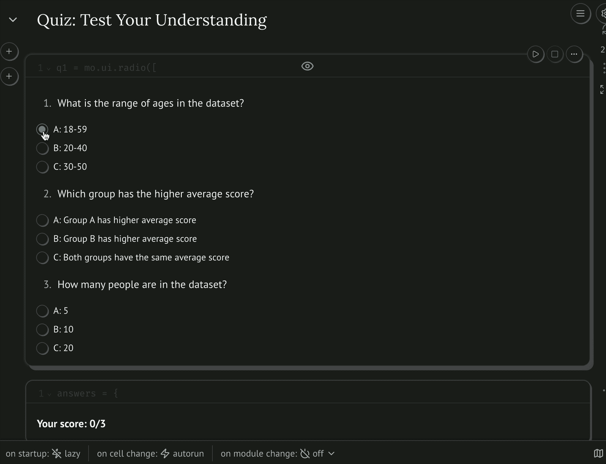

一个自动评分测验的快速演示，这得益于单元格顺序无关紧要。| 图片由作者提供

## 3. 它本质上是一个 Python 文件

由于每个 marimo 笔记本都存储为纯 Python 文件，这解决了我在 Git 中版本控制方面长期存在的问题。我最终可以干净地跟踪更改，而不必处理混乱的 JSON 差异。笔记本也变得更加灵活。我可以将其用作脚本，从命令行运行它，甚至可以将其转换为小型交互式应用程序，而无需进行任何更改。

下面，右侧显示了 marimo 笔记本视图，而左侧显示了在编辑器中作为普通 Python 文件打开的相同笔记本。

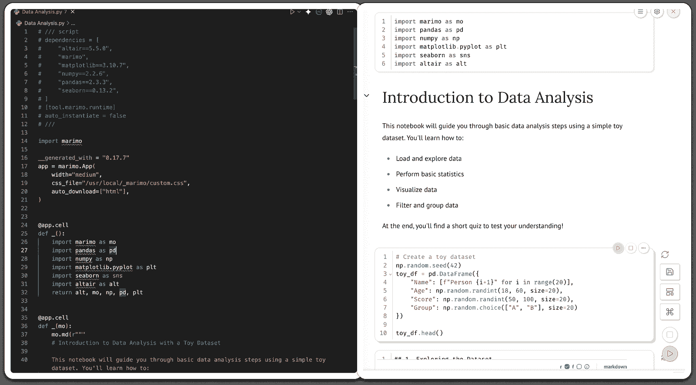

同一个笔记本，两种视图：左侧的 Python 源代码和右侧的交互式 marimo 笔记本 | 图片由作者提供

## 4. 我可以轻松地将我的笔记本转换为应用程序

将 Marimo 笔记本转换为交互式应用也很简单。我可以通过单次点击在**编辑模式**和**应用视图**之间切换，而且我永远不需要重写代码或添加任何额外内容。

这里有一个将温度从`摄氏度`转换为`华氏度`的示例笔记本。该笔记本可以在**应用模式**中使用默认垂直布局查看。

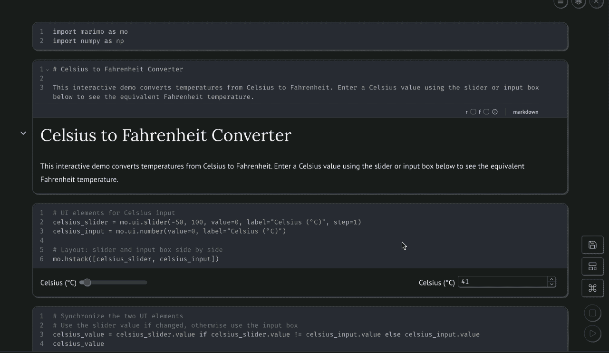

通过单次点击在编辑模式和应用程序视图之间切换 | 图片由作者提供

这个功能对于创建交互式博客、教程和教育性指南特别有用。如果你曾经阅读过[*AI Explorables*](https://pair.withgoogle.com/explorables/)，你就知道与内容互动而不是仅仅阅读的感觉。Marimo 提供了类似的感觉，而**网格布局**使它变得更好，因为我可以拖放输出以按我的意愿排列应用。

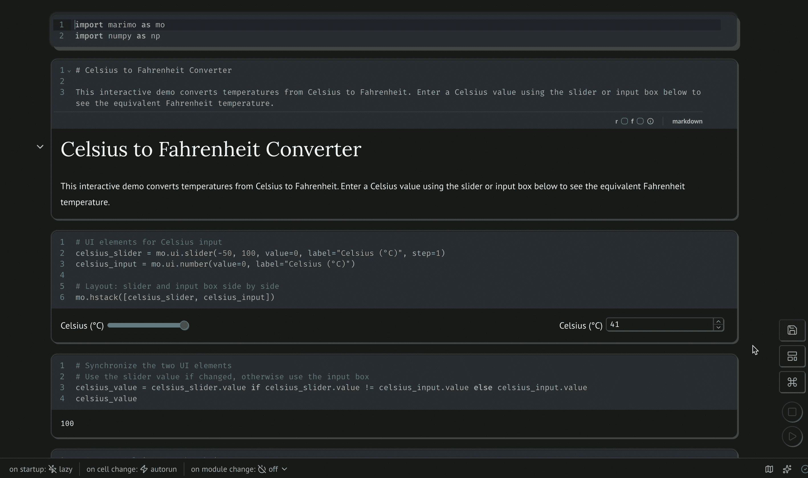

使用网格布局在 Marimo 中自定义应用显示 | 图片由作者提供

## 5. 高效的包管理器，因此不再有依赖问题的烦恼

Marimo 内置了一个包管理器，允许我直接从笔记本中安装缺失的库。如果某个模块不可用，Marimo 会显示一个小提示，我可以点击安装。这消除了与终端的常规来回操作。

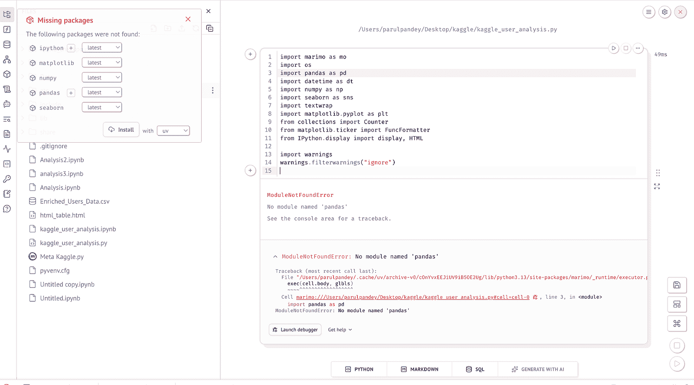

Marimo 内置的包管理器 | 图片由作者提供

Marimo 还为我处理可重复性。当我使用`--sandbox`标志运行笔记本时，它会跟踪所有包及其确切版本，并将它们作为顶级注释保存在笔记本文件中。不需要单独的`requirements.txt`文件，因为笔记本已经包含了它所需的一切。

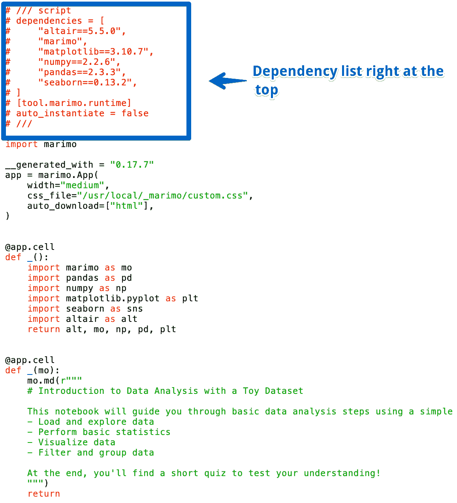

依赖元数据位于笔记本内部，当你以正常 Python 脚本打开 Marimo 文件时，它会清晰地显示出来。 | 图片由作者提供

## 6. 用于处理 DataFrames 的内置工具。

如果你花很多时间探索数据，这个功能会让你感觉像是天赐之物。当你将 dataFrame 显示在 Marimo 中时，默认视图是完全交互式的，并且自带一些有用的工具，如滚动、分页、数值列的自动直方图以及从列标题进行简单的排序和过滤。这加快了我的数据探索过程，因为视觉探索往往能提供更好的洞察。

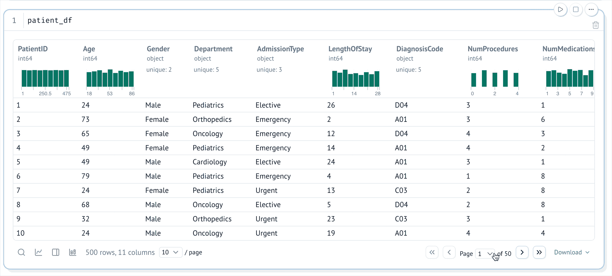

Marimo 中带有内置排序、过滤和直方图的交互式 DataFrame 视图 | 图片由作者提供

Marimo 还允许我将 DataFrame 转换为交互式输入元素。使用`mo.ui.table`，我可以选择行，并在下游计算中使用这些选择。选择会自动更新，这意味着我的笔记本的其他部分也会自动更新。

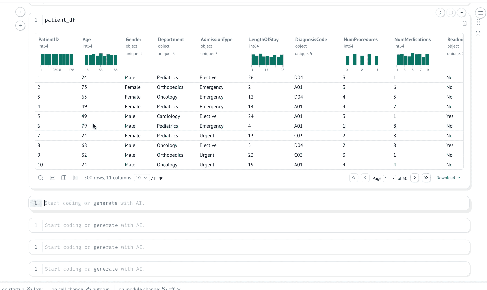

使用 **mo.ui.table** 进行交互式行选择，直接输入到下游单元格中 | 图片由作者提供

如果我想与业务利益相关者分享一个笔记本，marimo 包含一个 **UI 数据框编辑器**，让他们可以拖放聚合和转换而无需编写任何代码。它甚至为每个步骤生成等效的 Python 代码。

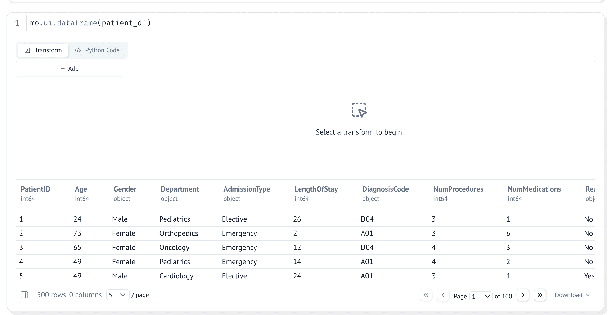

Marimo 的 UI 数据框编辑器让业务用户无需编写代码即可探索数据 | 图片由作者提供

等等，这还不是全部。还有一个 **数据探索器** 工具，让我可以直接从 DataFrame 中构建快速的可视化。

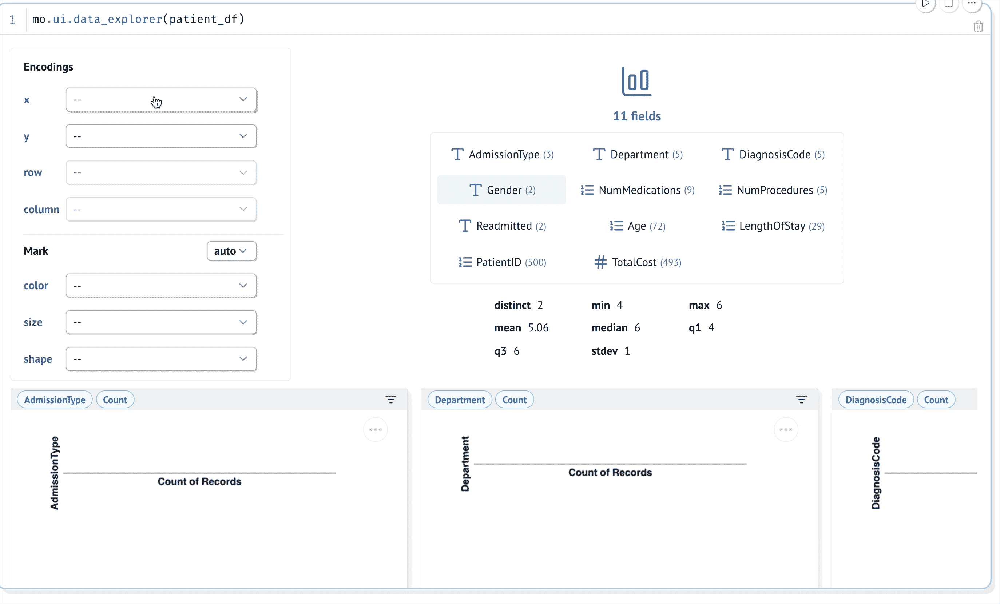

使用数据探索器选择列并生成即时可视化 | 图片由作者提供

所有这些使得早期数据探索变得更快。无需在库之间切换或编写样板代码来理解数据集，我可以在笔记本内立即开始分析和可视化。

## 7. 边打字边查看文档

对于我来说，marimo 笔记本最被低估的功能之一就是实时文档面板。我可以看到函数的 docstrings、参数和示例，而无需调用帮助工具。

该面板也是交互式的，因此我可以滚动查看长的 docstrings、检查示例，并将片段复制到我的笔记本中。如果 docstring 有格式化的示例，marimo 会检测到它们，并允许我直接将它们复制到一个新的单元格中，这在学习新库时非常有用。

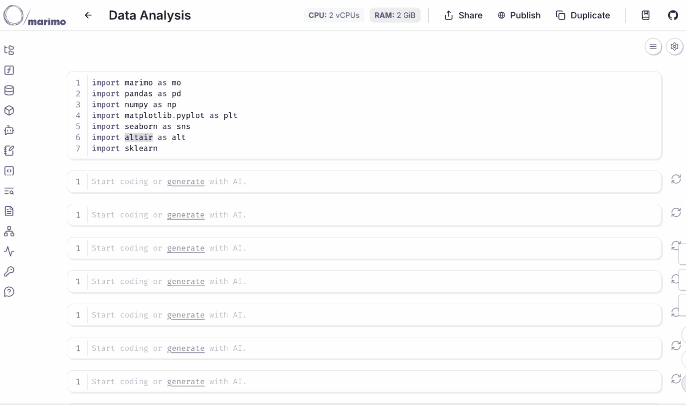

实时文档操作，显示我在打字时的实时文档 | 图片由作者提供

## 8. 笔记本内的 SQL

Marimo 对 SQL 的支持非常强大。我可以在一个笔记本中非常自然地混合使用 SQL 和 Python。我可以在 SQL 单元格内编写一个 SQL 查询，运行它，并得到 marimo 为 DataFrame 提供的相同整洁的表格视图。

我还可以通过 DuckDB 在本地文件上运行 SQL。简单的 `select * from "file.csv"` 就可以工作。如果我想连接到真实的数据库，我可以在侧面板中做到这一点。Marimo 允许我添加不同的数据源，一旦添加，表格就会直接显示在笔记本中。

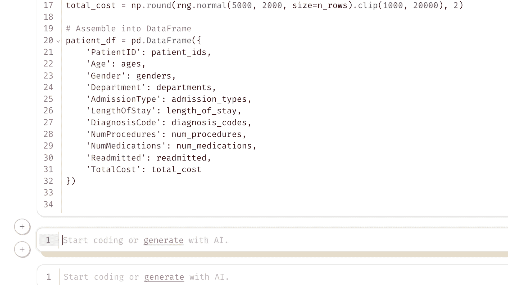

在 Marimo 内部直接在笔记本上运行 SQL，对 DataFrame 和本地文件进行操作，无需离开笔记本 | 图片由作者提供

## 9. Molab：marimo 笔记本云服务

Molab 是 marimo 笔记本的服务，就像 Google Colab 是 Jupyter 笔记本的服务一样。你可以在云端获得 marimo 笔记本的所有优点。你可以在 `molab.marimo.io` 打开 Molab，创建新的笔记本，或者打开之前创建的笔记本。当我需要快速启动笔记本或避免在我的机器上运行东西时，这是一个很好的选择。许多流行的 Python 包都是预先安装的，笔记本有持久存储，我可以轻松地分享、下载或上传它们。

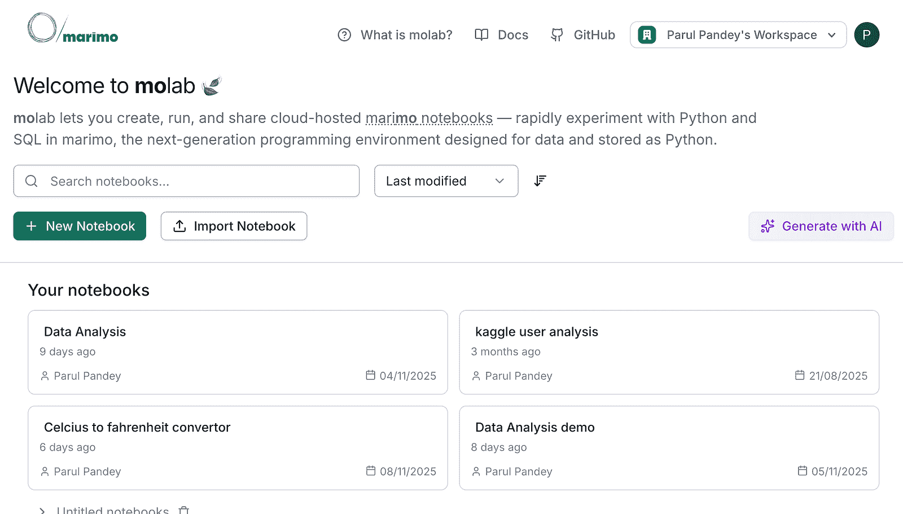

molab：marimo 笔记本云服务 | 图片由作者提供

另一个很酷的功能是 GitHub 集成。你可以访问 Molab 网址，将`molab.marimo.io/notebooks`替换为`molab.marimo.io/github`，这样你就可以在 Molab 中打开任何 GitHub 上托管在 Molab 中的笔记本，无论是 Jupyter 还是 marimo。然而，目前还没有 GPU 支持，就像在 Colab 中一样，但我相信团队将会着手解决这个问题。

## 10. 可定制的 LLM 集成

Marimo 还内置了一些非常实用的 AI 辅助编码功能，这对我很有帮助。说实话，Jupyter 也有一个名为**JupyterAI**的 AI 功能扩展，叫做 JupyterLab 扩展（是的，[我也写过关于这个的](https://towardsdatascience.com/build-your-own-ai-coding-assistant-in-jupyterlab-with-ollama-and-hugging-face/))，但将 AI 支持内置到 marimo 中，为我省去了很多麻烦。

我主要在 marimo 中使用 AI 做两件事。第一是当我想要尝试一个新的库或快速演示时，生成新的笔记本。这为我节省了时间，因为我不必寻找玩具数据集或从头开始设置一切。

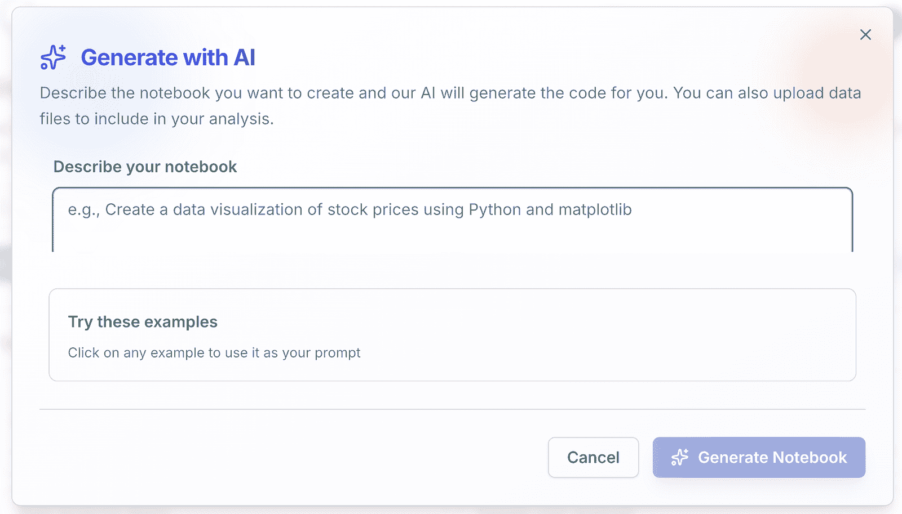

通过 marimo 中的 AI 生成整个笔记本 | 图片由作者提供

第二点是重构和调试。Marimo 的 AI 助手拥有我笔记本的完整上下文，因此它可以读取我的代码，并帮助我在笔记本内直接修复或清理它。

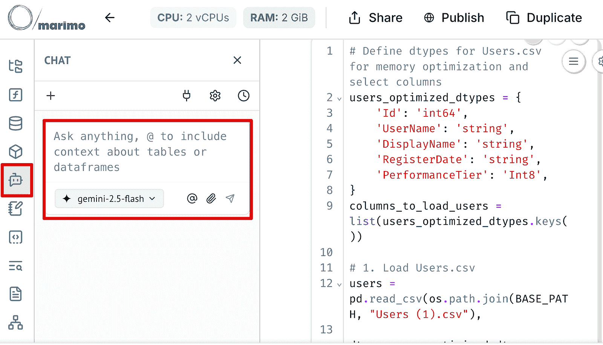

marimo 中的 AI 助手 | 图片由作者提供

我还喜欢可以为我想要聊天的模型和编辑的模型选择不同的模型，并为自己想要代码如何编写的规则设定。如果我想避免专有模型，Ollama 也可以作为一个提供者工作。

## 结论

我与 marimo 团队没有关联，这也不是一篇付费文章，这只是我在实际项目中使用它的体验。这是一篇长篇大论，因为我想要分享 marimo 是如何让我的笔记工作更加顺畅的。我只指出对我帮助最大的部分。文档内容更为深入，是探索 marimo 所能提供一切的最佳地点。
