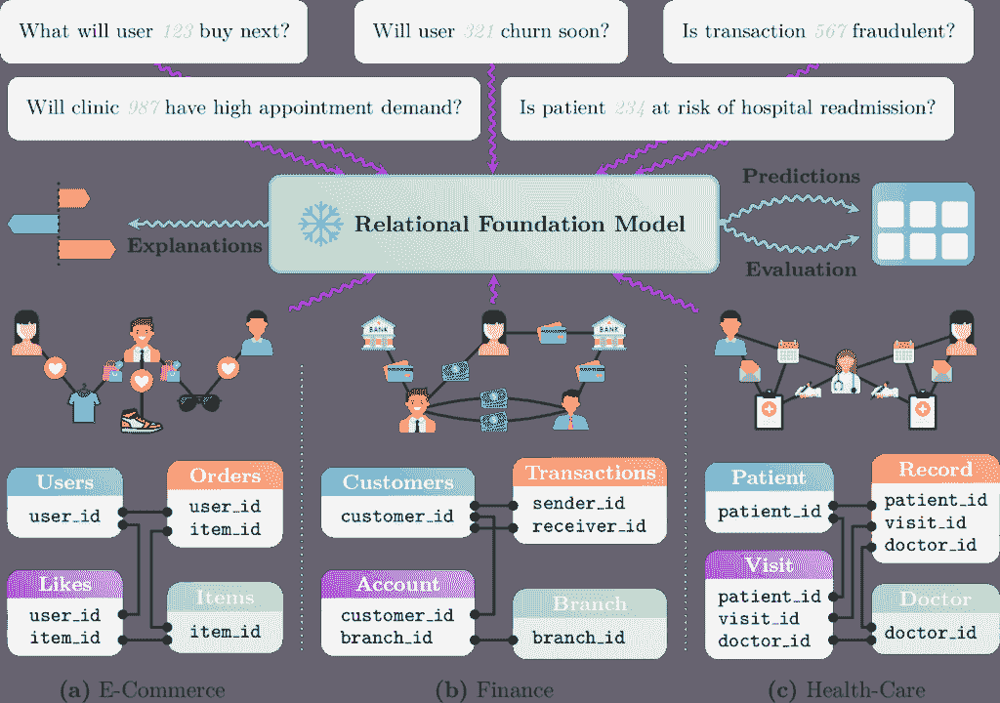
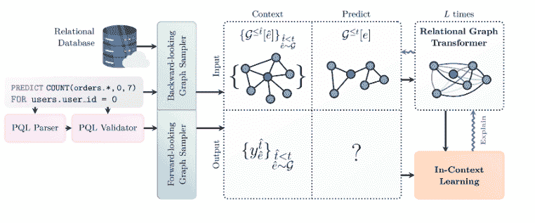

# 为什么大型语言模型不是企业的一站式解决方案

> 原文：[`towardsdatascience.com/why-llms-arent-a-one-size-fits-all-solution-for-enterprises/`](https://towardsdatascience.com/why-llms-arent-a-one-size-fits-all-solution-for-enterprises/)

<mdspan datatext="el1763427290024" class="mdspan-comment">世界各地的管理者</mdspan>都在竞相使用大型语言模型，但往往用于不适合的任务。实际上，根据麻省理工学院最近的研究，[95%的通用人工智能试点项目失败](https://mlq.ai/media/quarterly_decks/v0.1_State_of_AI_in_Business_2025_Report.pdf)——他们没有获得任何回报。

在通用人工智能的风暴中被忽视的一个领域是结构化数据，这不仅从采用的角度来看，也从技术的角度来看。实际上，从结构化数据中可以挖掘出大量的潜在价值，尤其是以预测的形式。

在这篇文章中，我将探讨大型语言模型能做什么和不能做什么，从运行在您的结构化数据上的 AI 中您可以获得什么价值，特别是针对预测建模，以及今天使用的行业方法——包括我和我的团队开发的一个方法。

## 为什么大型语言模型没有针对业务数据和流程进行优化

尽管大型语言模型已经彻底改变了文本和通信，但在从推动实际业务成果的、结构化的、关系型数据中进行预测方面，它们却显得力不从心——这些成果包括客户生命周期管理、销售优化、广告和营销、推荐、欺诈检测和供应链优化。

企业数据，企业所依赖的数据，本质上是结构化的。它通常驻留在表格、数据库和工作流程中，其中意义来自于实体之间的关系，如客户、交易和供应链。换句话说，这些都是关系型数据。

大型语言模型席卷全球，并在推进人工智能方面发挥了关键作用。然而，它们被设计用来处理非结构化数据，并不自然地适合对行、列或连接进行推理。因此，它们难以捕捉关系型数据中的深度和复杂性。另一个挑战是，关系型数据是实时变化的，而大型语言模型通常是在静态的文本快照上进行训练的。它们还将数字和数量视为序列中的标记，而不是“理解”它们数学上的含义。在实践中，这意味着大型语言模型优化于预测下一个最可能的标记，它在这方面做得非常好，但并不用于验证计算是否正确。因此，无论模型输出的是 3 还是 200，当正确答案是 2 时，模型所受到的惩罚是相同的。

大型语言模型（LLMs）能够通过基于思维链的推理进行多步推理，但它们在某些情况下可能会面临可靠性挑战。因为它们可能会产生幻觉，而且自信地产生幻觉，我必须补充一点，即使在多步工作流程中存在很小的错误概率，也可能在步骤之间累积。这降低了正确结果的整体可能性，在诸如批准贷款或预测供应短缺等商业流程中，仅仅一个小错误就可能是灾难性的。

由于所有这些原因，今天的企业依赖于传统的机器学习管道，这些管道需要数月时间来构建和维护，从而限制了人工智能对收入的可衡量影响。当你想要将人工智能应用于这种表格数据时，你实际上被传送回三十年前，需要人类辛苦地构建特征并从头开始构建定制模型。对于每个单独的任务！这种方法很慢，成本高昂，无法扩展，维护此类模型是一场噩梦。

## 我们是如何构建我们的关系型基础模型的

我的职业生涯围绕着图结构数据的 AI 和机器学习。一开始，我就认识到数据点并不是孤立存在的。相反，它们是连接到其他知识点的图的一部分。我将这种观点应用于我的在线社交网络和信息病毒性工作，使用来自 Facebook、Twitter、LinkedIn、Reddit 和其他来源的数据。

这个洞察力使我帮助在斯坦福大学开创了图神经网络，这是一个框架，它使机器能够从实体之间的关系而不是实体本身学习。我在担任 Pinterest 首席科学家期间应用了这一点，一个名为[PinSage](https://arxiv.org/abs/1806.01973)的算法改变了用户在 Pinterest 上的体验。这项工作后来演变为图变换器，它将变换器架构的能力带到了图结构数据。这使得模型能够捕捉复杂网络中的局部连接和长距离依赖。

随着我的研究深入，我看到计算机视觉被卷积网络所改变，语言被 LLMs 所重塑。但是，我意识到企业依赖的结构化关系数据的预测仍然等待着它们的突破，受到二十多年来没有改变的机器学习技术的限制！几十年！

这项研究和远见卓识的结晶使我团队和我创造了第一个针对商业数据的关系型基础模型（RFM）。其目的是使机器能够直接对结构化数据进行推理，理解实体，如客户、交易和产品，是如何连接的。通过了解这些实体之间的关系，我们然后使用户能够从那些特定的关系和模式中做出准确的预测。

关系型基础模型的关键能力。图片由作者提供

与 LLMs 不同，RFMs（关系基础模型）是为结构化关系数据设计的。RFMs 在多个（合成）数据集以及多个结构化业务数据任务上进行预训练。像 LLMs 一样，RFMs 可以简单地提示以对给定数据库中的各种预测任务产生即时响应，所有这些都不需要特定于任务或数据库的训练。

我们希望有一个能够直接从真实数据库的结构中学习的系统，而不需要所有通常的手动设置。为了实现这一点，我们将每个数据库视为一个图：表变成了节点类型，行变成了节点，外键将所有内容连接在一起。这样，模型实际上可以“看到”客户、交易和产品如何连接和随时间变化。

在其核心，该模型结合了一个列编码器和一个关系图转换器。表格中的每个单元格都根据其包含的数据类型（无论是数字、类别还是时间戳）转换为一个小型的数值嵌入。然后，转换器在图中查看，从相关的表中提取上下文，这有助于模型适应新的数据库模式和数据类型。

为了让用户输入他们想要做出的预测，我们构建了一个简单的界面，称为预测查询语言（PQL）。它允许用户描述他们想要预测的内容，而模型则负责其余部分。模型提取正确的数据，从过去的例子中学习，并通过推理得出答案。因为它使用上下文学习，所以也不需要为每个任务重新训练！我们确实有一个微调的选项，但这仅适用于非常专业的任务。

架构概述。图片由作者提供

但这只是一个方法。在整个行业中，还在探索几种其他策略：

## 行业方法

### 1. 内部基础模型

[Netflix](https://netflixtechblog.com/foundation-model-for-personalized-recommendation-1a0bd8e02d39) 等公司正在构建他们自己的大规模基础模型以用于推荐。正如他们在博客中描述的，目标是摆脱数十个专用模型，转向一个单一的集中式模型，该模型可以在整个平台上学习会员的偏好。与大型语言模型（LLMs）的类比是明显的：就像一个句子被表示为一系列单词的序列一样，一个用户被表示为用户与之互动的一系列电影。这允许通过处理大量的交互历史来支持长期个性化创新。

拥有此类模型的好处包括控制、差异化以及根据特定领域需求定制架构的能力（例如，为了降低延迟使用稀疏注意力，为了冷启动使用元数据驱动的嵌入）。然而，这些模型的训练和维护成本极高，需要大量的数据、计算和工程资源。此外，它们是在单个数据集（例如，Netflix 用户行为）上针对单个任务（例如，推荐）进行训练的。

### 2. 使用 AutoML 或数据科学代理自动化模型开发

平台如 DataRobot 和 SageMaker Autopilot 推动了机器学习管道部分自动化的想法。它们通过处理特征工程、模型选择和训练等部分，帮助团队加快速度。这使得实验更容易进行，减少重复性工作，并使机器学习能够超越仅限于高度专业化的团队。在类似的方向上，数据科学家代理正在出现，其理念是数据科学家代理将执行所有经典步骤并迭代它们：数据清洗、特征工程、模型构建、模型评估，最后是模型开发。虽然这是一个真正的创新壮举，但关于这种方法在长期内是否有效，人们仍然意见不一。

### 3. 使用图数据库处理关联数据

Neo4j 和 TigerGraph 等公司推动了图数据库的使用，以更好地捕捉数据点之间的连接。这在欺诈检测、网络安全和供应链管理等领域产生了特别显著的影响，在这些领域，实体之间的关系往往比实体本身更重要。通过将数据建模为网络而不是表格中的孤立行，图系统为解决复杂、现实世界问题开辟了新的推理方式。

## 得到的教训

当我们着手构建我们的技术时，我们的目标很简单：开发能够直接从原始数据学习的神经网络架构。这种方法与当前由直接从图像中的像素或文档中的单词学习的神经网络推动的 AI（字面）革命相呼应。

实际上，我们对产品的愿景还包括一个人简单地连接到数据并做出预测。这导致我们设定了一个雄心勃勃的目标，即从头开始创建一个为商业数据设计的预训练基础模型（如上所述），从而消除了手动创建特征、训练数据集和定制特定任务模型的必要性。这确实是一项雄心勃勃的任务。

在构建我们的关系型基础模型时，我们开发了新的 Transformer 架构，这些架构关注于一系列相互连接的表格，即数据库模式。这需要扩展经典的 LLM 注意力机制，该机制关注于线性序列的标记，到一个关注于数据图的注意力机制。关键的是，注意力机制必须能够泛化到不同的数据库结构以及不同类型的表格，无论是宽表还是窄表，具有不同的列类型和含义。

另一个挑战是发明一种新的训练方案，因为预测下一个标记不是正确的目标。相反，我们生成了许多模拟数据库和预测任务，模仿了诸如欺诈检测、时间序列预测、供应链优化、风险评估、信用评分、个性化推荐、客户流失预测和销售线索评分等挑战。

最终，这导致了一个预训练的关系型基础模型，可以提示解决业务任务，无论是金融欺诈与保险欺诈，还是医疗与信用风险评估。

## 结论

机器学习将长期存在，随着该领域的发展，作为数据科学家，我们有责任激发更多深思熟虑和坦率的讨论，关于我们技术的真正能力——它擅长什么，以及它的不足之处。

我们都知道 LLM 是多么具有变革性，并且继续如此，但往往在考虑内部目标或需求之前，它们被仓促实施。作为技术人员，我们应该鼓励高管们更仔细地审视他们专有的数据，这些数据是他们公司独特性的基石，并花时间深思熟虑地确定哪些技术将最好地利用这些数据来推进他们的商业目标。

在这篇文章中，我们探讨了 LLM 的能力，以及（通常）被忽视的结构化数据中的价值，以及应用 AI 于结构化数据的行业解决方案——包括我自己的解决方案和从构建过程中学到的经验。

感谢您的阅读。

* * *

## 参考文献：

[1] R. Ying, R. He, K. Chen, P. Eksombatchai, W. L. Hamilton 和 J. Leskovec，Graph Convolutional Neural Networks for Web-Scale Recommender Systems (2018)，KDD 2018。

## 作者简介：

Jure Leskovec 博士是 Kumo 的首席科学家和联合创始人，Kumo 是一家领先的预测 AI 公司。他是斯坦福大学的计算机科学教授，在那里他已经教授了超过 15 年。Jure 共同创建了图神经网络，并将他的职业生涯致力于推进 AI 如何从连接信息中学习。他之前曾担任 Pinterest 的首席科学家，并在 Yahoo 和微软进行了获奖研究。

图片由 Jeff Cable 提供
