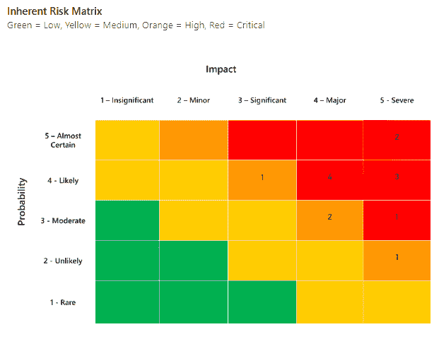
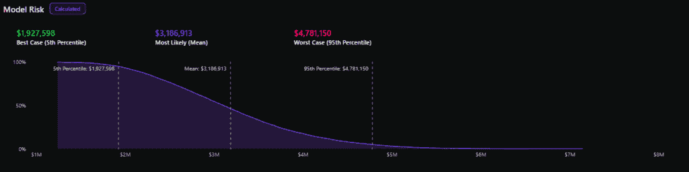

# 为什么大多数网络风险模型在开始之前就失败了

> 原文：[`towardsdatascience.com/why-most-cyber-risk-models-fail-before-they-begin/`](https://towardsdatascience.com/why-most-cyber-risk-models-fail-before-they-begin/)

<mdspan datatext="el1745179522576" class="mdspan-comment">网络安全领导者正在被问一些不可能的问题。“今年发生数据泄露的可能性有多大？”</mdspan> “这会花费多少？”以及“我们应该花费多少来阻止它？”

<mdspan datatext="el1745439023455" class="mdspan-comment">然而，目前大多数风险模型仍然建立在猜测、直觉和色彩丰富的热图上，而不是数据上。

事实上，[普华永道 2025 年全球数字信任洞察调查](https://www.pwc.com/us/en/services/consulting/cybersecurity-risk-regulatory/library/global-digital-trust-insights.html)发现，只有 15%的组织在相当大的程度上使用定量风险建模。

本文探讨了为什么传统的网络风险模型存在不足，以及应用一些轻量级统计工具，如概率建模，如何提供更好的前进方式。

## 网络风险建模的两种学派

信息安全专业人员主要在风险评估过程中使用两种不同的方法来建模风险：定性和定量。

### 定性风险建模

> 想象有两个团队评估相同的风险。一个团队将其可能性评分定为 4/5，影响评分定为 5/5。另一个团队将其可能性评分定为 3/5，影响评分定为 4/5。两个团队都在矩阵上绘制了它。但没有人能回答 CFO 的问题：“这种情况实际发生的可能性有多大，我们会损失多少？*“*

定性方法分配主观风险值，主要来源于评估者的直觉。定性方法通常会导致对风险的可能性和影响的分类，例如在 1-5 的序数尺度上。

然后将风险绘制在风险矩阵中，以了解它们在这个序数尺度上的位置。

来源：Securemetrics 风险登记册

通常，将两个序数尺度相乘可以帮助根据概率和影响优先考虑最重要的风险。乍一看，这似乎是合理的，因为信息安全中常用的风险定义是：

\[\text{风险} = \text{可能性} \times \text{影响}\]

然而，从统计学的角度来看，定性风险建模存在一些相当重要的陷阱。

第一种方法是使用序数尺度。虽然将数字分配给序数尺度给模型带来了某种数学支持的假象，但这仅仅是一种错觉。

序数尺度仅仅是标签——它们之间没有定义的距离。具有“2”影响和“3”影响的之间的距离是不可量化的。将序数尺度上的标签改为“A”、“B”、“C”、“D”和“E”并没有什么区别。

这反过来意味着，当我们使用定性建模时，我们的风险公式是有缺陷的。将“B”的可能性乘以“C”的影响是无法计算的。

另一个关键陷阱是建模不确定性。当我们建模网络风险时，我们正在建模未来可能发生的事件。事实上，可能发生一系列结果。

将网络风险简化为单点估计（如“20/25”或“高”）并不能表达“最可能的年度损失为一百万美元”和“有 5%的可能性损失超过一千万美元”之间的重要区别。

### 定量风险建模

> 想象一个团队正在评估风险。他们估计了一系列可能的结果，从 10 万美元到 1000 万美元。通过运行蒙特卡洛模拟，他们得出每年损失超过 100 万美元的概率为 10%，预期损失为 48 万美元。现在当首席财务官问，“这种情况发生的可能性有多大，成本会是多少？”时，团队可以用数据而不是直觉来回答。

这种方法将对话从模糊的风险标签转向**概率和潜在的财务影响**，这是高管们能够理解的语言。

如果你具备统计学背景，以下概念在这里应该特别突出：

**可能性。**

网络风险建模在本质上是一种尝试量化某些事件发生的可能性以及它们发生时的影响的尝试。这为各种统计工具打开了大门，如蒙特卡洛模拟，这些工具可以比序数尺度更有效地模拟不确定性。

定量风险建模使用统计模型为损失分配美元价值，并模拟这些损失事件发生的可能性，捕捉未来的不确定性。

虽然定性分析偶尔可以近似最可能的结果，但它无法捕捉到整个不确定性范围，例如罕见但具有影响力的事件，称为“长尾风险”。

来源：Securemetrics 网络风险量化

损失超过曲线图显示了在 y 轴上超过一定年度损失金额的可能性，以及在 x 轴上各种损失金额，从而形成一条向下倾斜的线。

从损失超过曲线中提取不同的分位数，如第 5 分位数、平均值和第 95 分位数，可以提供一个具有 90%置信度的风险可能年度损失的概念。

虽然定性分析的单点估计可能接近最可能的风险（取决于评估者判断的准确性），但定量分析捕捉了结果的不确定性，包括那些罕见但仍然可能发生的事件（称为“长尾风险”）。

## 看向网络风险之外

为了改进信息安全中的风险模型，我们只需要关注其他领域使用的技巧。风险建模在各种应用中已经成熟，如金融、保险、航空航天安全和供应链管理。

金融团队使用类似的贝叶斯统计方法来建模和管理投资组合风险。保险团队使用成熟的精算模型来建模风险。航空航天行业使用可能性建模来模拟系统故障的风险。供应链团队使用概率模拟来建模风险。

工具存在。数学原理已被充分理解。其他行业已经铺平了道路。现在轮到网络安全行业拥抱定量风险建模，以推动更好的决策。

## 关键要点

| **定性** | **定量** |
| --- | --- |
| 序数量表（1-5） | 概率建模 |
| 主观直觉 | 统计严谨性 |
| 单点评分 | 风险分布 |
| 热图与颜色编码 | 损失超出曲线 |
| 忽略罕见但严重的事件 | 捕获长尾风险 |
