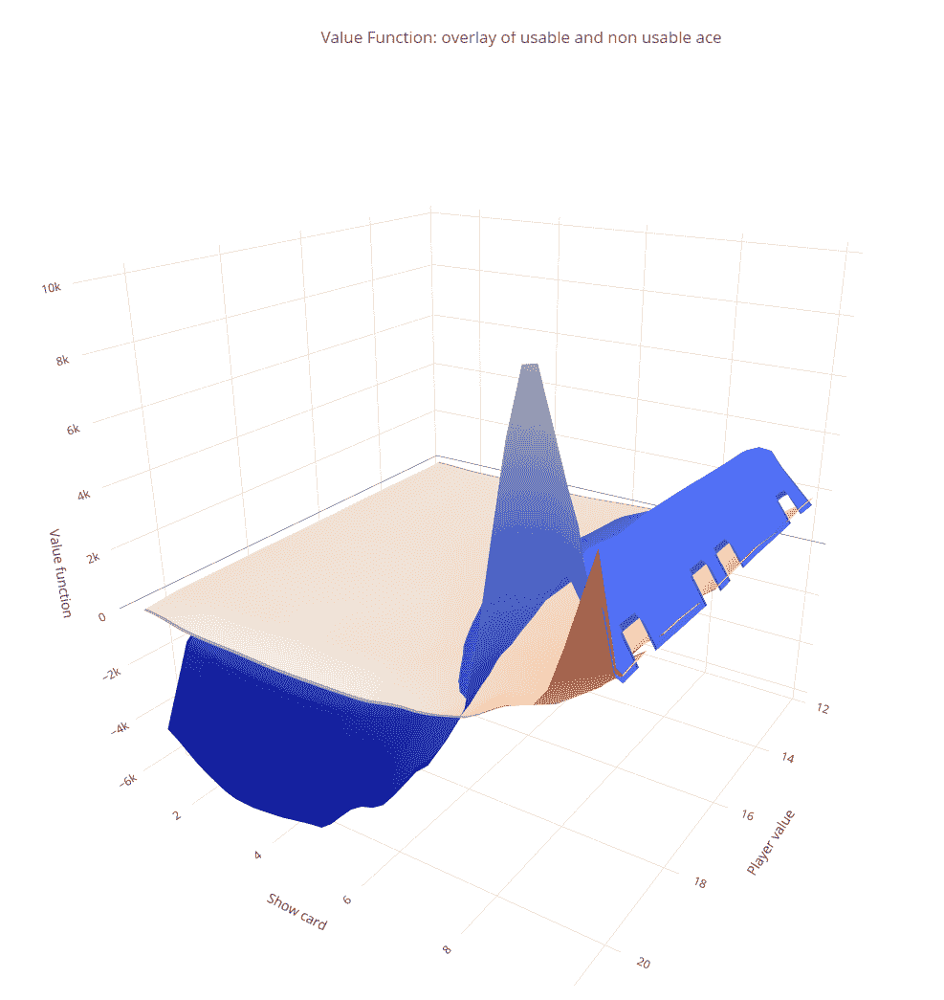
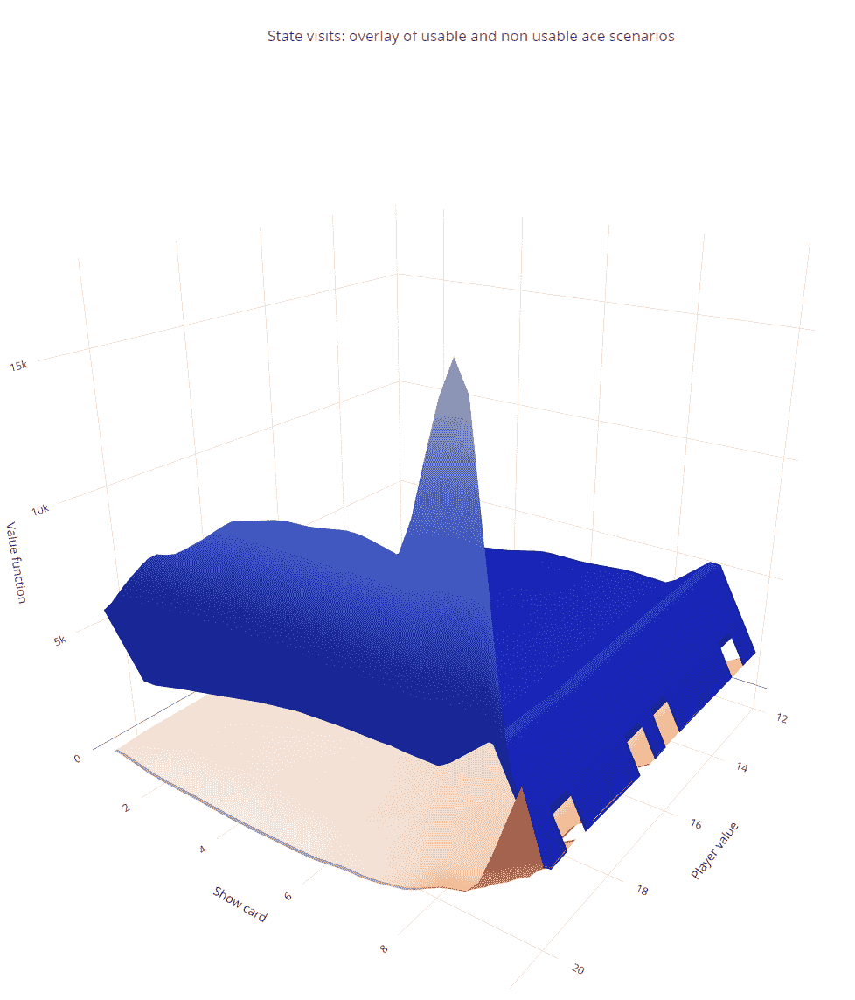
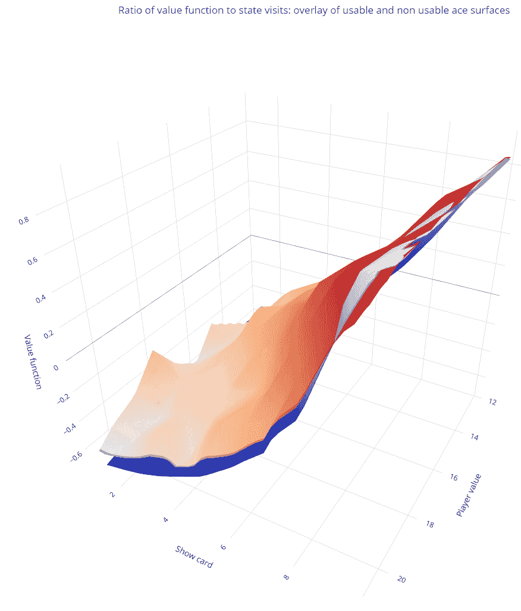

# 译文：[`towardsdatascience.com/为什么归一化对于强化学习中的策略评估至关重要-a4e79d393ac2/`](https://towardsdatascience.com/为什么归一化对于强化学习中的策略评估至关重要-a4e79d393ac2/)

> 原文：[`towardsdatascience.com/why-normalization-is-crucial-for-policy-evaluation-in-reinforcement-learning-a4e79d393ac2/`](https://towardsdatascience.com/why-normalization-is-crucial-for-policy-evaluation-in-reinforcement-learning-a4e79d393ac2/)

由于与大型语言模型（LLM）的相关应用，强化学习（RL）最近变得非常流行。强化学习被定义为围绕代理通过与环境的交互来学习做出决策的一组算法。学习过程的目的是最大化时间上的奖励。

代理每次尝试学习都可能影响价值函数，该函数估计代理从特定状态（或状态-动作对）开始，遵循特定策略所能获得的预期累积奖励。策略本身作为评估不同状态或动作可取性的指南。

从概念上讲，强化学习算法包含两个步骤，即策略评估和策略改进，它们迭代运行以实现价值函数的最佳可达到水平。在本篇文章中，我们限制我们的关注点在策略评估框架中的归一化概念。

* * *

策略评估与状态的概念密切相关。状态代表代理观察到的环境当前情况或条件，并用于决定下一步动作。状态通常由一组变量描述，其值表征环境的当前条件。

策略评估是通过对每个状态估计策略价值函数来确定给定策略的好坏。

算法需要计算代理如果从某种特定情况开始并继续遵循该策略，所能获得的预期奖励。这有助于理解策略是否有效，并可以作为使其更好的步骤之一。

* * *

**归一化**通常与很少访问的状态的上下文相关联。它涉及将奖励或状态值等指标除以访问这些状态的频率。这种方法有助于平均每个状态的奖励，并在学习过程中确保频繁访问和很少访问的状态之间的平衡，促进价值函数的更稳定和公平的更新。

没有归一化，策略评估可能会存在偏差，因为很少访问的状态的奖励可能不稳定或不成比例地影响学习过程。通过按访问次数归一化奖励，我们得到一个更具代表性的平均值。

显著的是，归一化对于频繁访问的状态同样重要，尤其是在比较不同的环境场景时。我们使用黑杰克游戏来阐述这一概念，黑杰克是强化学习中的一个经典决策问题，由于其有限的状态空间，在研究中经常被强调。

* * *

**黑杰克**是一种对抗庄家的纸牌游戏。我们在此呈现了巴博亚努（2022 年）对该游戏定义的表述。在一轮游戏的开始时，玩家和庄家各被发两张牌。玩家只能看到庄家的一张牌。游戏的目标是使你手中的牌的点数尽可能接近 21，但不能超过 21。牌有不同的点数：10/杰克/皇后/国王 → 10；2 到 9 → 与牌面相同；A → 1 或 11（玩家选择）。请注意，当 A 可以计为 11 而不超过 21 时，称为有用的 A。

如果玩家的点数小于 21，他们可以选择“加注”并从牌堆中随机抽取一张牌。他们也可以选择“停牌”并保留手中的牌，而不冒超过 21 的风险。如果玩家超过 21，她将输掉这一轮。如果玩家正好有 21，她自动获胜。否则，如果玩家的点数比庄家更接近 21，玩家获胜。

* * *

游戏中可能发生两种情况，被称为**可用的 A**和**不可用的 A**情况。除非这样做会使玩家的总分超过 21，否则 A 计为 11（不可用的 A 情况），否则计为 1（可用的 A 情况）。

文献中（包括萨顿和巴特罗所著的开创性书籍）用不同的值函数来表示这两种情况。本帖附带的代码实现了策略评估的蒙特卡洛方法（这种方法在上文提到的书中得到了很好的记录）。

这里评估的策略假设庄家和玩家都根据他们心中确定的某个随机阈值来决定是否要“加注”或“停牌”。这代表了对更常见的策略的轻微修改，该策略假设玩家在总分达到 20 时停牌，庄家在总分达到 17 时停牌。

下面的图描绘了两个表面，每个表面分别对应于可用 A 和不可用 A 情况的值函数。每个状态由一对（玩家总分，庄家可见的牌）表示。

可用（红色）和不可用（蓝色）A 情况的值函数表面。

有趣的是，在庄家展示的牌点数较高的区域，不可用 A 表面（蓝色）高于相应的可用 A 表面。这是反直觉的，因为 A 的可用性为玩家提供了在决策中的更多灵活性，并且在这个场景中，与不可用 A 相比，提供了更高的获胜概率，无论状态如何。那么，这种现象是从哪里来的？

正则化在解释这一现象中证明是有用的。正如引言中提到的，状态访问的频率在策略评估中起着重要作用。在二十一点游戏中，价值函数基于玩家在总游戏次数中获胜的次数。然而，这种方法没有考虑到从分布的角度来看，某些状态访问的频率远低于其他状态，仅仅是因为它们发生的可能性较小。

下面的图展示了在 500,000 个游戏回合中记录的状态访问次数的表面。它突出了在可用的 A 牌场景中相对于不可用的 A 牌场景中状态的显著低表示。

可用（红色）和不可用 A 牌（蓝色）场景的状态访问表面。

现在我们通过除以访问频率来正则化价值函数。结果如下面的图中所示，其中表面现在被正确排序。

可用（红色）和不可用 A 牌（蓝色）场景的正则化价值函数表面。

这个简单的例子表明，在策略评估中的正则化是至关重要的！然而，在状态空间较大的情况下，访问分布可能无法准确估计，这可能会带来挑战。尽管如此，在设计采样状态空间的算法时，必须考虑这个因素。

* * *

## 结论

强化学习中策略评估的蒙特卡洛方法是一个极其强大的工具。它相对于基于 Bellman 方程的方法提供了显著的优势，因为后者需要完全先验知识的状态概率。相比之下，蒙特卡洛方法在采样过程中近似这些概率。然而，这种方法对价值函数估计有重要的含义。为了基于价值函数进行准确的推理和决策，必须使用相应事件或状态的概率对其进行正则化。总之，状态概率必须始终纳入强化学习模型中——要么作为已知值，要么作为在程序中导出的估计值。在运行蒙特卡洛采样后未能正则化价值函数可能会引入重大的决策偏差，尤其是在强化学习过程的策略改进阶段。

* * *

以下代码展示了上述结果。

*除非另有说明，所有图像均为作者提供。*

## 参考文献

Sutton, R.S. & Barro, A.G. (1998), 强化学习，麻省理工学院出版社。

Barboianu, C (2022), 理解你的游戏：理性且安全的赌博数学建议，INFAROM PhilScience 出版社。
