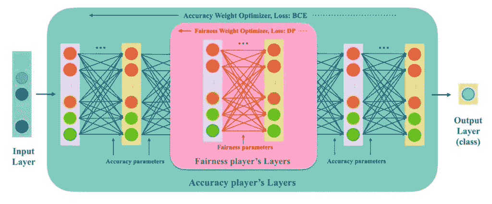
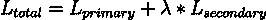

# 为什么正则化不够：以两种目标训练神经网络的更好方法

> 原文：[`towardsdatascience.com/why-regularization-isnt-enough-a-better-way-to-train-neural-networks-with-two-objectives/`](https://towardsdatascience.com/why-regularization-isnt-enough-a-better-way-to-train-neural-networks-with-two-objectives/)

<mdspan datatext="el1748303089072" class="mdspan-comment">在训练神经网络时，我们经常要处理**两个相互竞争的目标**。例如，在最大化预测性能的同时，还要满足次要目标，如公平性、可解释性或能源效率。**默认方法**通常是把次要目标作为加权正则化项折叠到损失函数中。这种**一刀切损失**可能易于实现，但并不总是理想的。事实上，研究表明，**仅仅添加一个正则化项可能会忽略目标之间的复杂相互依赖性，导致次优权衡**。

进入**双层优化**，这是一种将问题视为两个相关联的子问题（一个领导者和一个追随者）而不是单一混合目标的方法。在这篇文章中，我们将探讨为什么简单的正则化方法对于多目标问题可能不足，以及如何通过为每个目标提供专用模型组件的双层公式在实践中有显著提高清晰度和收敛性。我们将使用公平性之外的例子（如可解释性对性能，或生物信息学和机器人学中的特定领域约束）来说明这一点。我们还将深入研究来自开源*FairBiNN*项目的**实际代码片段**，该项目使用双层策略来平衡公平性与准确性，并讨论原始论文中的实际考虑，包括其可扩展性、连续性假设以及基于注意力的模型挑战。

**TL;DR:** 如果你一直在调整权重参数以平衡神经网络中的冲突目标，有一个更原则性的替代方案。双层优化为每个目标提供自己的“空间”（层、参数，甚至优化器），从而实现更清晰的设计，并在满足次要目标的同时，在主要任务上通常能获得更好的性能。让我们看看这是如何以及为什么有效。



FairBiNN 网络架构

## 双目标困境：为什么加权正则化不足

多目标学习——比如说你想要高精度**并且**低偏差通常被设定为一个单一的损失：



其中 L 二级是一个惩罚项（例如，公平性或简单性指标）和 λ 是一个可调的权重。这种**拉格朗日方法**将问题视为一个大的优化问题，将目标与一个旋钮混合。从理论上讲，通过调整 λ，你可以绘制出平衡两个目标的帕累托曲线。然而，在实践中，这种方法有几个**陷阱**：

+   **选择权衡很棘手**：结果对权重λ非常敏感。λ的微小变化可能会使解决方案从一个极端摆动到另一个极端。没有直观的方法来选择“正确”的值，而不进行大量的试错以找到一个可接受的权衡。这个超参数搜索本质上是对帕累托前沿的手动探索。

+   **冲突梯度**：在结合损失的情况下，*同一组模型参数*负责两个目标。主项和次项的梯度可能指向相反的方向。例如，为了提高公平性，模型可能需要调整权重的方式损害准确性，反之亦然。优化器的更新变成了对同一权重的拉锯战。这可能导致训练不稳定或效率低下，因为模型在试图同时满足两个标准时会产生振荡。

+   **性能妥协**：因为网络的权重必须同时满足两个目标，主要任务可能会被**过度妥协**。你通常不得不降低模型拟合数据的容量，以减少惩罚。确实，我们注意到基于正则化的方法可能“忽视了两个目标之间的复杂相互依赖性”。简单来说，单个加权损失可能会掩盖提高一个指标真正如何影响另一个指标。有时它是一个钝工具，次级目标的改进可能会以对主要目标的巨大代价为代价，反之亦然。

+   **缺乏理论保证**：加权求和方法将找到一种解决方案，但在特殊凸情况下，除了找到帕累托最优解外，没有保证。如果问题是非凸的（如神经网络训练通常那样），你收敛到的解可能被另一个解支配（即另一个模型可能在某个目标上严格更好，而在另一个目标上并不更差）。事实上，我们证明了在一定的假设下， bilevel 公式可以确保**帕累托最优解**，并且损失的上限不比拉格朗日方法更差（并且可能更好）。

总结来说，添加惩罚项通常是一种**简单而模糊的解决方案**。是的，它将次级目标烘焙到训练过程中，但它也使目标在单个黑盒模型中纠缠在一起。你失去了对每个目标如何被处理的清晰度，并且你可能付出了比满足次要目标所必需的更多的主要性能代价。

**示例陷阱**：想象一个必须对各个群体**准确**且**公平**的健康诊断模型。一种标准的方法可能是向损失函数中添加一个公平性惩罚（例如，不同群体之间假阳性率的差异）。如果这个惩罚的权重（λ）过高，模型可能会几乎使群体结果相等，但代价是整体准确率大幅下降。如果权重过低，那么你将得到高准确率，但存在不可接受的偏差。即使经过仔细调整，单一模型的方法可能收敛到一个点，在这个点上，两个目标都没有真正得到优化：也许模型牺牲了比所需更多的准确率，而没有完全关闭公平性差距。实际上，FairBiNN 论文证明了双层方法与加权方法相比，可以达到相等或更低的损失界限，这表明简单的组合损失可能会留下性能空间。

## 双层优化故事：双层学习是如何工作的

**双层优化**将问题重新构造成两个“玩家”之间的博弈，这两个“玩家”通常被称为**领导者**（上层）和**跟随者**（下层）。我们不是将目标混合在一起，而是将每个目标分配给不同的层级，并使用**专用参数**（例如，独立的权重集，甚至独立的子网络）。从概念上讲，就像有两个模型在交互：一个专门关注主要任务，另一个专门关注次要任务，并且有一个明确的优化顺序。

在**两个**目标的情况下，双层设置通常如下所示：

+   **领导者（上层）**：根据其自己的参数优化主要损失（例如，准确率），**假设**跟随者将针对次要目标做出最优反应。领导者通过设定条件“领导”游戏（通常这意味着它知道跟随者会尽可能做好自己的工作）。

+   **跟随者（下层）**：根据其自己的参数优化次要损失（例如，公平性或其他约束），作为对领导者选择的响应。跟随者将领导者的参数视为固定（对于那个迭代），并试图尽可能满足次要目标。

这种安排与**Stackelberg 博弈**相一致：领导者先行动，跟随者做出反应。但在实践中，我们通常通过**交替优化**来解决这个问题：在每个训练迭代中，我们更新一组参数，同时保持另一组参数不变，然后反过来。经过多次迭代，这种交替会收敛到一个平衡点，在这个平衡点上，没有更新能够显著改善其目标，除非另一个更新进行补偿。理想情况下，Stackelberg 平衡点对于联合问题也是 Pareto 最优的。

**关键的是，每个目标现在在模型中都有自己的“槽位”**。这可以带来几个实际和理论上的优势：

+   **专用模型容量**：主要目标参数可以自由地专注于预测性能，而无需同时考虑公平性/可解释性等。同时，次要目标有自己的专用参数来应对那个目标。在表示能力方面内部竞争较少。例如，可以将一个小子网络或一组层专门用于编码公平性约束，而网络的其他部分则专注于准确性。

+   **分开优化器和超参数**：没有任何规定这两组参数必须使用相同的优化器或学习率进行训练。实际上，FairBiNN 为准确性和公平性参数使用**不同的学习率**（例如，公平性层使用较小的步长）。如果合理，你甚至可以使用完全不同的优化算法（例如，一个使用 SGD，另一个使用 Adam 等）。这种灵活性让你可以根据每个目标的需求调整训练动态。我们强调，“**领导者和追随者可以根据每个任务的最佳选择利用不同的网络架构、正则化器、优化器等**”，这是一种强大的自由。

+   **不再有梯度拉锯战**：当我们更新主要权重时，我们**仅**使用主要损失梯度。次要目标不会直接拉扯这些权重（至少不在同一更新中）。相反，当更新次要权重时，我们只关注次要损失。这种解耦意味着每个目标可以按照自己的条件进步，而不是在每一个梯度步骤中相互干扰。结果是通常更稳定的训练。正如 FairBiNN 论文所说，“**领导者问题仍然是主要损失的纯最小化，没有任何可能减缓或阻碍其进展的正则化项**”。

+   **改进的权衡（帕累托最优）**：通过在领导者-追随者结构中显式地建模两个目标之间的交互，双层优化可以比简单的加权求和找到更好的平衡解决方案。直观地说，追随者会持续微调次要目标以适应主要目标的任何给定状态。领导者预见到这一点，可以选择一个设置，以获得最佳的主要性能，同时知道次要目标将尽可能得到照顾。在一定的数学条件下（例如，平滑性和最优响应），可以证明这会产生帕累托最优解。事实上，FairBiNN 工作中的理论结果表明，如果双层方法收敛，在某些情况下它可能比拉格朗日方法实现更严格的**主要损失性能**。换句话说，你可能会得到**更高的准确性**（对于相同的公平性）或**更好的公平性**（对于相同的准确性），与传统的惩罚方法相比。

+   **角色清晰度和可解释性：**从架构上讲，为每个目标设置独立的模块使设计对工程师来说更可解释（尽管不一定对最终用户如模型可解释性那样可解释）。你可以**指向网络的一部分并说“这部分处理次要目标。”**这种模块化提高了模型设计的透明度。例如，如果你有一组针对公平性的特定层，你可以监控它们的输出或权重来了解模型是如何调整以满足公平性的。如果需要调整权衡，你可能需要调整该子网络的尺寸或学习率，而不是猜测新的损失权重。这种关注点的分离类似于良好的软件工程实践，每个组件都有一个单一的责任。正如 FairBiNN 的一个总结所指出的，*“双层框架通过明确分离准确性和公平性目标来增强可解释性。”*即使在公平性之外，这个想法也适用：一个平衡准确性和可解释性的模型可能有一个专门的模块来强制执行稀疏性或单调性（使模型更可解释），这比一个不透明的正则化项更容易推理。

为了使这一点更具体，让我们看看**公平双层神经网络（FairBiNN）**是如何实现这些想法来解决公平性（次要）与准确率（主要）问题的。FairBiNN 是一个 NeurIPS 2024 项目，它证明了双层训练策略比标准方法实现了更好的公平性/准确率权衡。这是一个在神经网络中应用双层优化的优秀案例研究。

## 双层架构的实际应用：FairBiNN 示例

FairBiNN 的模型设计有**两组参数**：一组θa 用于与准确率相关的层，另一组θf 用于与公平性相关的层。这些被整合到一个单一的网络架构中，但从逻辑上讲，你可以将其视为两个子网络：

+   **准确率网络**（权重为θa）生成主要预测（例如，正类的概率）。

+   **公平性网络**（权重为θf）以促进公平性的方式影响模型（特别是群体公平性如人口统计学上的平等）。

这些是如何组合的？FairBiNN 在网络中的某个位置插入以公平性为重点的层。例如，在一个用于表格数据的 MLP 中，你可能会有：

> ***输入 → [准确率层] → [公平性层] → [准确率层] → 输出***

FairBiNN 中的`--fairness_position`参数控制公平性层在层堆栈中的插入位置。例如，`--fairness_position 2`表示在准确率子网络的两个层之后，管道通过公平性子网络，然后返回到剩余的准确率层。这形成了一个**“干预点”**，在此处公平性模块可以调节中间表示以减少偏差，在最终预测之前。

让我们看看一个简化的代码草图（类似于 PyTorch 的伪代码），它受到了 FairBiNN 实现的启发。这定义了一个具有单独准确性和公平性组件的模型：

```py
import torch
import torch.nn as nn

class FairBiNNModel(nn.Module):
    def __init__(self, input_dim, acc_layers, fairness_layers, fairness_position):
        super(FairBiNNModel, self).__init__()
        # Accuracy subnetwork (before fairness)
        acc_before_units = acc_layers[:fairness_position]      # e.g. first 2 layers
        acc_after_units  = acc_layers[fairness_position:]      # remaining layers (including output layer)

        # Build accuracy network (before fairness)
        self.acc_before = nn.Sequential()
        prev_dim = input_dim
        for i, units in enumerate(acc_before_units):
            self.acc_before.add_module(f"acc_layer{i+1}", nn.Linear(prev_dim, units))
            self.acc_before.add_module(f"acc_act{i+1}", nn.ReLU())
            prev_dim = units

        # Build fairness network
        self.fair_net = nn.Sequential()
        for j, units in enumerate(fairness_layers):
            self.fair_net.add_module(f"fair_layer{j+1}", nn.Linear(prev_dim, units))
            if j < len(fairness_layers) - 1:
                self.fair_net.add_module(f"fair_act{j+1}", nn.ReLU())
            prev_dim = units

        # Build accuracy network (after fairness)
        self.acc_after = nn.Sequential()
        for k, units in enumerate(acc_after_units):
            self.acc_after.add_module(f"acc_layer{fairness_position + k + 1}", nn.Linear(prev_dim, units))
            # If this is not the final output layer, add an activation
            if k < len(acc_after_units) - 1:
                self.acc_after.add_module(f"acc_act{fairness_position + k + 1}", nn.ReLU())
            prev_dim = units
        # Note: For binary classification, the final output could be a single logit (no activation here, use BCEWithLogitsLoss).

    def forward(self, x):
        x = self.acc_before(x)      # pass through initial accuracy layers
        x = self.fair_net(x)        # pass through fairness layers (may transform representation)
        out = self.acc_after(x)     # pass through remaining accuracy layers to get prediction
        return out
```

在这个结构中，`acc_before`和`acc_after`共同构成了网络中关注准确性的部分（θa 参数），而`fair_net`包含关注公平性的参数（θf）。公平性层接受中间表示，并可以将其推向产生公平结果的形式。例如，这些层可能会抑制与敏感属性相关的信息，或者以其他方式调整特征分布以最小化偏差。

**为什么要在中间插入公平性？** 一个原因是它让公平性模块能够直接控制模型学习到的表示，而不仅仅是后处理输出。当数据流过几层时，网络已经学习了一些特征；在那些地方插入公平性子网络意味着它可以在最终预测之前修改这些特征以消除偏差（尽可能多）。剩下的准确度层随后使用这个“去偏差”的表示来尝试预测标签，而不会重新引入偏差。

现在，训练循环设置了**两个优化器**，一个用于θa，一个用于θf，并交替更新，如下所述。这是一个说明双级更新方案的示意图训练循环：

```py
model = FairBiNNModel(input_dim=INPUT_DIM, 
                      acc_layers=[128, 128, 1],       # example: 2 hidden layers of 128, then output layer
                      fairness_layers=[128, 128],    # example: 2 hidden fairness layers of 128 units each
                      fairness_position=2)
criterion = nn.BCEWithLogitsLoss()        # binary classification loss for accuracy
# Fairness loss: we'll define demographic parity difference (details below)

# Separate parameter groups
acc_params = list(model.acc_before.parameters()) + list(model.acc_after.parameters())
fair_params = list(model.fair_net.parameters())
optimizer_acc = torch.optim.Adam(acc_params, lr=1e-3)
optimizer_fair = torch.optim.Adam(fair_params, lr=1e-5)  # note: smaller LR for fairness

for epoch in range(num_epochs):
    for X_batch, y_batch, sensitive_attr in train_loader:
        # Forward pass
        logits = model(X_batch)
        # Compute primary loss (e.g., accuracy loss)
        acc_loss = criterion(logits, y_batch)
        # Compute secondary loss (e.g., fairness loss - demographic parity)
        y_pred = torch.sigmoid(logits.detach())  # use detached logits for fairness calc
        # Demographic Parity: difference in positive prediction rates between groups
        group_mask = (sensitive_attr == 1)
        pos_rate_priv  = y_pred[group_mask].mean()
        pos_rate_unpriv = y_pred[~group_mask].mean()
        fairness_loss = torch.abs(pos_rate_priv - pos_rate_unpriv)  # absolute difference

        # Update accuracy (leader) parameters, keep fairness frozen
        optimizer_acc.zero_grad()
        acc_loss.backward(retain_graph=True)   # retain computation graph for fairness backprop
        optimizer_acc.step()

        # Update fairness (follower) parameters, keep accuracy frozen
        optimizer_fair.zero_grad()
        # Backprop fairness loss through fairness subnetwork only
        fairness_loss.backward()
        optimizer_fair.step()
```

在这个训练片段中需要注意以下几点：

+   我们将`acc_params`和`fair_params`分开，并将每个分配给其自己的`optimizer`。在上面的例子中，我们选择了 Adam 作为两者，但学习率不同。这反映了 FairBiNN 的策略（他们在表格数据上使用了 1e-3 与 1e-5 的分类器与公平性层）。公平性目标通常从较小的学习率中受益，以确保稳定的收敛，因为它正在优化一个微妙的统计属性。

+   我们像往常一样计算**准确度损失**（`acc_loss`）（在这种情况下是二元交叉熵）。这里的**公平性损失**被表示为*人口统计平等（DP）差异*——特权组和未特权组之间正预测率的绝对差异。在实践中，FairBiNN 通过插入不同的`fairness_loss`公式来支持多个公平性指标（如等概率机会等）。关键是这个损失相对于公平性网络的参数是可微分的。我们使用`logits.detach()`来确保公平性损失的梯度不会传播回准确度权重（只传播到`fair_net`），这与在公平性更新期间将准确度权重视为固定的想法一致。

+   展示的更新顺序是：首先更新**准确性权重**，然后更新**公平性权重**。这相当于将准确性视为领导者（上层），将公平性视为追随者。有趣的是，人们可能会认为公平性（约束条件）应该领先，但 FairBiNN 的公式将准确性设置为领导者。在实践中，这意味着我们首先采取一步来提高分类准确性（保持当前的公平性参数不变），然后我们采取一步来提高公平性（保持新的准确性参数不变）。这种交替过程会重复进行。在每次迭代中，公平性参与者都在对准确性参与者的最新状态做出反应。从理论上讲，如果我们能够针对每个领导者的更新（例如，在当前准确性参数下找到完美的公平性参数）精确地解决追随者的优化问题，我们将更接近真正的双层解决方案。在实践中，交替进行一次梯度步骤是一种有效的启发式方法，逐渐将系统带到平衡状态。（FairBiNN 的作者指出，在特定条件下，展开追随者优化并计算领导者的精确超梯度可以提供保证，但在实现中他们使用了更简单的交替更新。）

+   我们在准确性损失上调用`backward(retain_graph=True)`，因为我们需要稍后通过（部分）相同的图反向传播公平性损失。公平性损失也取决于模型的预测，这些预测既取决于θa，也取决于θf。通过保留图，我们避免了在公平性反向传播中重新计算前向传递。（或者，一个人可以在准确性步骤之后重新计算 logits – 最终结果相似。FairBiNN 的代码可能像上面显示的那样，每个批次使用一次前向传递和两次反向传递。）

在训练过程中，你会看到两个梯度流动：一个进入准确性层（来自`acc_loss`），另一个进入公平性层（来自`fairness_loss`）。它们被保持分开。随着时间的推移，这应该导致一个模型，其中θa 已经学会了在θf 不断推动表示向公平性靠近的情况下做出良好的预测，而θf 已经学会了根据θa 的偏好行为来减轻偏差。它们都不需要直接妥协其目标；相反，它们通过这种相互作用达到平衡的解决方案。

**实践中的清晰性**：这种设置的一个直接好处是，对每个目标的行为进行**诊断和调整**要清晰得多。如果在训练后您发现模型不够公平，您可以检查公平性网络：可能它能力不足（可能层数太少或学习率太低），您可以提升其容量或训练的积极性。相反，如果准确性下降太多，您可能会意识到公平性目标被过分重视（在双层术语中，可能给它分配了太多的层数或太大的学习率）。这些是不同于主网络的独立的高层次调节器。在单一网络 + 正则项方法中，您只有 λ 权重可以调整，而且并不明显知道**为什么**某个 λ 会失败（模型是否无法表示公平的解决方案，或者优化器是否陷入困境，或者只是错误的权衡？）。在双层方法中，劳动分工是明确的。这使得它在实际工程流程中**更容易采用**，您可以分配团队分别处理“公平性模块”或“安全模块”，并且他们可以在某种程度上独立地对其组件进行推理。

为了给出结果的感觉：FairBiNN，采用这种架构，能够在他们的实验中实现**帕累托最优的公平性与准确性权衡**，这些权衡优于标准单损失训练的结果。事实上，在平滑性和最优跟随者响应的假设下，他们证明了他们方法中的任何解决方案都不会产生比相应的拉格朗日解更高的损失（并且通常在主要损失上更少）。经验上，在 UCI Adult（收入预测）和 Heritage Health 等数据集上，与使用公平性正则项训练的模型相比，双层训练的模型在相同的公平性水平上具有**更高的准确性**。它实际上**有效地弥合了准确性与公平性之间的差距**。值得注意的是，这种方法在训练时间上并没有带来沉重的性能惩罚，作者报告称，在相同的数据上运行时，“FairBiNN（双层）和拉格朗日方法之间的平均 epoch 时间没有实质性的差异”。换句话说，将它们分成两个优化器和网络并不会加倍您的训练时间；多亏了现代库，每个 epoch 的训练几乎和单目标情况一样快。

## 超越公平性：双目标优化的其他用例

虽然 FairBiNN 展示了在公平性与准确性对比的背景下进行双层优化，但其**原则具有广泛的应用性**。每当您有两个部分冲突的目标时，尤其是如果其中一个是一个特定领域的约束或辅助目标，双层设计可能是有益的。以下是一些不同领域的例子：

+   **可解释性与性能之间的权衡：** 在许多情况下，我们寻求既高度准确又**可解释**的模型（例如，医生可以信任并理解的医疗诊断工具）。可解释性通常意味着诸如稀疏性（使用较少的特征）、单调性（尊重已知的方向关系）或模型结构的简单性等约束。我们不必将这些约束嵌入到一个损失函数中（这可能是一个复杂的混合物，包括 L1 惩罚、单调性正则化器等），我们可以将模型分为两部分。

    *示例:* 领导网络关注准确性，而跟随网络可以管理输入特征上的掩码或门控机制以强制稀疏性。一种实现方式可能是一个小型的子网络，它输出特征权重（或选择特征），旨在最大化可解释性得分（如高稀疏性或遵循已知规则），而主网络则采用修剪后的特征来预测结果。在训练过程中，主预测器根据当前的特性选择进行优化以获得准确性，然后特性选择网络根据预测器的行为进行优化，以提高可解释性（例如，增加稀疏性或删除不重要的特征）。这反映了人们可能通过双层优化（在低级问题中学习特性掩码指示符作为连续参数）来进行特性选择的方式。其优势是预测器不会因复杂性而直接受到惩罚；它只需与可解释部分允许的任何特征一起工作。同时，可解释性模块找到预测器仍然可以做得很好的最简单特征子集。随着时间的推移，它们会收敛到准确性与简单性之间的平衡。这种方法在一些元学习文献中有所暗示（将特性选择视为内部优化）。在实践中，这意味着我们得到了一个更容易解释的模型（因为跟随者进行了修剪），而不会对准确性造成巨大打击，因为跟随者只会修剪到领导者可以容忍的程度。如果我们只做了单个 L1 正则化损失，我们就必须调整 L1 的权重，可能会降低准确性或得不到足够的稀疏性！在双层优化中，稀疏性水平会动态调整以保持准确性。

+   **机器人技术：能量或安全性与任务性能的权衡**：考虑一个需要快速完成任务（性能目标）但同时也需要**安全且高效**（次要目标，例如，最小化能量消耗或避免危险动作）的机器人。这些目标往往相互冲突：最快的轨迹可能对电机有攻击性且不太安全。一种双层方法可能包括一个**主控制器网络**，它试图最小化时间或跟踪误差（领导者），以及一个**次要控制器或修改器**，它调整机器人的动作以节省能量或保持在安全限制内（跟随者）。例如，跟随者可能是一个网络，它向动作输出添加小的纠正偏差或调整控制增益，目标是最小化测量的能量消耗或冲击。在训练过程中（可能在模拟中），你会交替进行：在当前的安全/能量校正下训练主要控制器以实现任务性能，然后训练安全/能量模块以最小化这些成本，考虑到控制器的行为。随着时间的推移，控制器学会以安全模块可以轻松调整以保持安全的方式完成任务，而安全模块学会满足约束所需的最小干预。结果可能是一个比无约束最优轨迹略慢的轨迹，但使用的能量要少得多，而你实现这一点而不必调整混合时间和能量的单个加权奖励（强化学习奖励设计中常见的痛点）。相反，每个部分都有一个明确的目标。事实上，这个想法类似于强化学习中的“保护”，其中次要策略确保安全约束，但双层训练将**学习**与主要策略一起学习“保护”。

+   **生物信息学：领域约束与预测准确性：**在生物信息学或计算生物学中，您可能会预测结果（如蛋白质功能、基因表达等），但同时也希望模型尊重领域知识。例如，您训练一个神经网络从遗传数据中预测疾病风险（主要目标），同时确保模型的行为与已知的生物途径或约束一致（次要目标）。一个具体的场景：我们可能希望模型的决定取决于有意义的基因组（途径），而不是任意的组合，以帮助科学解释和信任。我们可以实现一个跟随网络，如果模型使用无意义的基因分组，则对其进行惩罚，或者鼓励它利用某些已知的生物标志物基因。双层训练将允许主要预测器最大化预测准确性，然后一个次要的“调节器”网络可以稍微调整权重或输入，以强制执行约束（例如，抑制不应在生物学上重要的基因相互作用产生的信号）。交替更新将产生一个预测良好的模型，但可能依赖于生物学上合理的信号。这比硬编码这些约束或添加可能导致模型无法学习细微但有效的信号（这些信号略微偏离已知生物学）的严格惩罚要好。本质上，模型本身通过两组参数的相互作用，在数据驱动学习与先验知识之间找到一个折衷方案。

这些例子有些推测性，但它们突出了一个模式：**每当您有一个可以通过专门机制处理的次要目标时，考虑给它自己的模块，并以双层方式进行训练。**而不是将所有内容都烘焙到一个单一模型中，您将得到一个与每个关注点对应的架构部分。

## 实践中的注意事项和警告

在您匆忙将所有损失函数重构为双层优化之前，了解这种方法的优势和需求非常重要。FairBiNN 论文——虽然非常鼓舞人心——坦率地提到了适用于双层方法的几个**警告**：

+   **连续性与可微性假设：** 双层优化，尤其是基于梯度的方法，通常假设次要目标是相对于模型参数而言合理平滑且可微的。在 FairBiNN 的理论中，我们假设诸如神经网络函数和损失的**Lipschitz 连续性**等问题。简单来说，梯度不应该爆炸或极度无序，跟随者的最优响应应该随着领导者的参数变化而平滑变化。如果你的次要目标不可微（例如，一个硬约束或像准确度这样的度量，它是分段常数的），你可能需要用一个平滑的替代品来近似它以使用这种方法。FairBiNN 特别关注*具有 sigmoid 输出的二分类*，避免了多类分类中 argmax 的非可微性。事实上，我们指出常用的*softmax 激活函数不是 Lipschitz 连续的*，这*“限制了我们的方法直接应用于多类分类问题”*。这意味着如果你有很多类别，当前的理论可能不成立，除非你找到一种解决方案（他们建议探索替代激活或归一化以在多类设置中强制执行 Lipschitz 连续性）。因此，一个注意事项：**双层优化在两个目标都是参数的平滑函数时效果最佳**。不连续的跳跃或高度非凸的目标可能仍然可以通过启发式方法工作，但理论保证就会消失。

+   **注意与复杂架构：** 现代深度学习模型（如具有注意力机制的 Transformer）带来了额外的挑战。我们指出，**注意力层也不是 Lipschitz 连续的**，这*“为我们将方法扩展到 NLP 和其他高度依赖注意力的最先进架构带来了挑战。”*有研究试图使注意力 Lipschitz（例如，LipschitzNorm 用于自注意力([arxiv.org](https://arxiv.org/html/2410.16432v2#:~:text=extending%20our%20method%20to%20state,performance%20of%20deep%20attention%20models))），但截至目前，将双层公平性应用于 Transformer 将是一个非平凡的任务。担忧的是，注意力可能会放大小的变化很多，破坏稳定领导者-跟随者更新所需的平滑交互。如果你的应用使用具有注意力或其他非 Lipschitz 操作等组件的架构，你可能需要谨慎行事。这并不意味着双层不会工作，但理论并没有直接涵盖它，你可能需要通过经验调整来更多地进行。我们可能会看到未来的研究解决如何结合这样的组件（可能通过约束或正则化它们以更好地表现）。

    **底线：** 当前的双层成功主要是在相对简单的网络（MLPs、简单的 CNNs、GCNs）中。额外的花哨架构可能需要额外的关注。

+   **没有银弹保证：**虽然双层方法在适当的条件下可以证明达到帕累托最优解，但这并不意味着你的模型最终是“完美公平”或“完全可解释”的。在“最优平衡目标”和“绝对满足目标”之间存在差异。FairBiNN 的理论提供了相对于最佳权衡的保证（以及相对于拉格朗日方法的保证），它**不保证绝对公平**或零偏差。在我们的案例中，我们仍然有残留偏差，但与基线相比，我们实现的准确性要低得多。因此，如果你的次要目标是硬约束（例如，“绝不能违反安全条件 X”），软双层优化可能不足以！你可能需要以更严格的方式强制执行它或在训练后验证结果。此外，FairBiNN 到目前为止一次只处理**一个**公平性指标（在大多数实验中是人口统计学的平等）。在现实世界场景中，你可能会关注多个约束（例如，多个属性的公平性，或者公平性、可解释性和准确性三目标问题）。将双层扩展以处理**多个**跟随者或更复杂的层次结构是一个开放挑战（它可能成为一个多级或多跟随者游戏）。一个想法是将多个指标合并为一个次要目标（可能是一个加权总和或某些最坏情况指标），但这又重新引入了内部加权问题。或者，可以拥有多个跟随者网络，每个网络针对不同的指标，并轮流通过它们，但理论和实践尚未完全建立。

+   **超参数调整和初始化：**虽然我们在直接意义上避开了λ的调整，但双层方法引入了其他超参数：每个优化器的学习率、两个子网络的相对容量，可能还有训练跟随者与领导者所需的步数等。在 FairBiNN 的情况下，我们必须选择公平层的数量以及它们的位置，以及学习率。这些设置基于一些直觉和一些保留的验证（例如，我们为公平性选择了非常低的学习率 LR 以确保稳定性）。一般来说，你仍然需要调整这些方面。然而，这些往往更容易解释的超参数，例如，“我的公平模块有多大的表达能力”比“这个虚幻的公平项的正确权重是什么”更容易推理。在某种程度上，架构超参数取代了权重调整。此外，两个部分的初始化也可能很重要；一个启发式的方法是在引入次要目标（或反之）之前对主模型进行一点预训练，以提供一个良好的起点。FairBiNN 不需要单独的预训练；我们同时从零开始训练。但这种情况可能并不总是适用于其他问题。

尽管有这些警告，但值得强调的是，双层方法**在今天的工具中是可行的**。FairBiNN 的实现是在 PyTorch 中完成的，使用了自定义的训练循环，这是大多数实践者都感到舒适的，它可以在 GitHub 上找到以供参考（[Github](https://github.com/yazdanimehdi/FairBiNN)）。考虑到性能和清晰度的潜在收益，额外的努力（编写带有两个优化器的循环）相对较小。如果你有一个具有两个竞争性指标的关键应用，回报可以非常显著。

## 结论：设计理解权衡的模型

使用多个目标的优化神经网络总会涉及固有的权衡。但**我们如何处理这些权衡则在我们掌控之中**。传统的“只是将它与权重一起投入损失函数”的智慧常常让我们与那个权重搏斗，并怀疑我们是否可以做得更好。正如我们讨论的，**双层优化提供了一种更结构化和原则性的方法来处理双目标问题**。通过为每个目标分配其自己的专用参数、层和优化过程，我们允许每个目标尽可能充分地追求，而不会与另一个目标永无休止地冲突。

FairBiNN 的例子表明，这种方法不仅仅是学术上的花哨，它在公平性与准确性权衡方面实现了最先进的结果，**从数学上证明了**它可以与旧的正则化方法相匹配甚至超越，在损失实现方面。更重要的是，对于实践者来说，它以相当直接的方式实现，并且训练成本合理。模型架构变成了两部分之间的对话：一部分确保公平性，另一部分确保准确性。这种**架构透明性**在一个我们经常只是调整标量旋钮并寄希望于最好的领域中是令人耳目一新的。

对于那些在机器学习研究和工程领域的人来说，要记住的信息是：**下次当你面对一个竞争目标时；无论是模型可解释性、公平性、安全性、延迟还是领域约束，考虑将其作为双层设置中的第二参与者来制定**。设计一个（无论简单还是复杂）致力于该问题的模块，并使用交替优化与你的主要模型一起训练。你可能会发现你可以实现更好的平衡，并对你的系统有更清晰的理解。这鼓励了更模块化的设计：而不是将所有东西都纠缠在一个不透明的模型中，你划定了网络中哪一部分处理什么。

实际上，采用双层优化需要对假设进行仔细的关注并对训练程序进行一些调整。如果你的次要目标与主要目标在本质上相冲突，那么你达到的平衡是有限的。但即便如此，这种方法也会阐明权衡的本质。在最佳情况下，它找到了单目标方法错过的双赢解决方案。在最坏的情况下，你至少有一个模块化框架可以迭代。

随着机器学习模型越来越多地部署在高风险环境中，**平衡目标**（精度与公平性、性能与安全性等）变得至关重要。工程界正在认识到，这些问题可能更适合用更智能的优化框架来解决，而不仅仅是启发式方法。双层优化就是这样一种框架，它值得在实用工具箱中占有一席之地。它与机器学习模型设计的系统级观点相一致：有时，为了解决复杂问题，你需要将其分解成部分，并让每个部分在其明确的交互协议下发挥其最佳作用。

在结束之前，下次当你发现自己正在哀叹“如果我能得到高精度并满足 X 而不使 Y 受损”，请记住你可以尝试给每个愿望一个自己的旋钮。双层训练可能正是你需要的**优雅的折衷方案**——“每个目标的优化器”，和谐地共同工作。你不再在单个权重空间内进行梯度战斗，而是编排两组参数之间的对话。正如 FairBiNN 的结果所示，这种对话可以导致**每个人都赢，或者至少没有人不必要地输**的结果。

快乐优化，针对**你的每个目标**！

如果你认为这种方法有价值，并计划将其纳入你的研究或实施中，请考虑引用我们的原始 FairBiNN 论文：

```py
@inproceedings{NEURIPS2024_bef7a072,
 author = {Yazdani-Jahromi, Mehdi and Yalabadi, Ali Khodabandeh and Rajabi, AmirArsalan and Tayebi, Aida and Garibay, Ivan and Garibay, Ozlem Ozmen},
 booktitle = {Advances in Neural Information Processing Systems},
 editor = {A. Globerson and L. Mackey and D. Belgrave and A. Fan and U. Paquet and J. Tomczak and C. Zhang},
 pages = {105780--105818},
 publisher = {Curran Associates, Inc.},
 title = {Fair Bilevel Neural Network (FairBiNN): On Balancing fairness and accuracy via Stackelberg Equilibrium},
 url = {https://proceedings.neurips.cc/paper_files/paper/2024/file/bef7a072148e646fcb62641cc351e599-Paper-Conference.pdf},
 volume = {37},
 year = {2024}
}
```

**参考文献：**

+   Mehdi Yazdani-Jahromi 等人，“公平双层神经网络（FairBiNN）：通过 Stackelberg 均衡平衡公平性和精度”，NeurIPS 2024。[arxiv.org](https://arxiv.org/html/2410.16432v2#:~:text=Attention%20mechanisms%2C%20which%20are%20widely,that%20enforcing%20Lipschitz%20continuity%20generally)

+   FairBiNN 开源实现（GitHub）[github.co](https://github.com/yazdanimehdi/FairBiNN#:~:text=%2A%20%60,default%3A%20200)m: 双层公平性方法的代码示例和文档。

+   Moonlight AI 研究评论关于 FairBiNN——总结了方法和关键见解[themoonlight.io](https://www.themoonlight.io/en/review/fair-bilevel-neural-network-fairbinn-on-balancing-fairness-and-accuracy-via-stackelberg-equilibrium#:~:text=1,fairness%20parameters%2C%20and%20vice%20versa),包括交替优化过程和假设（如 Lipschitz 连续性）。
