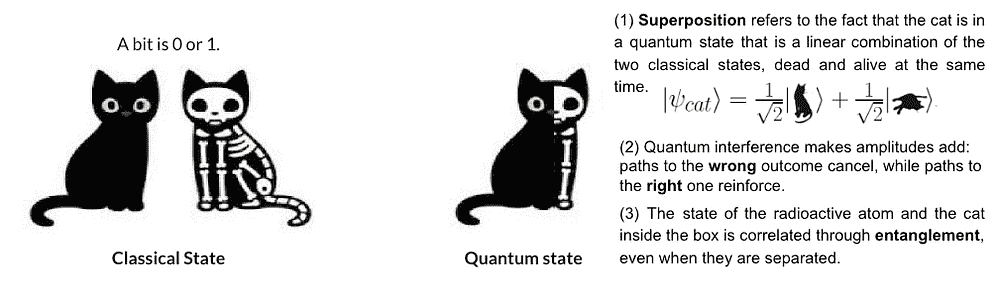
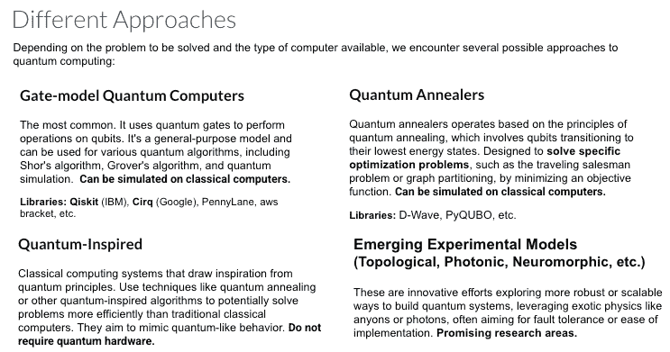
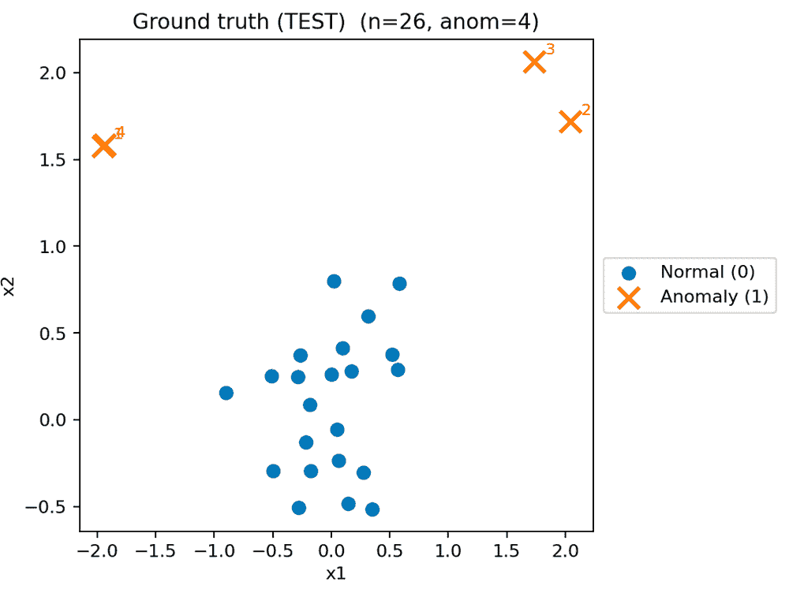
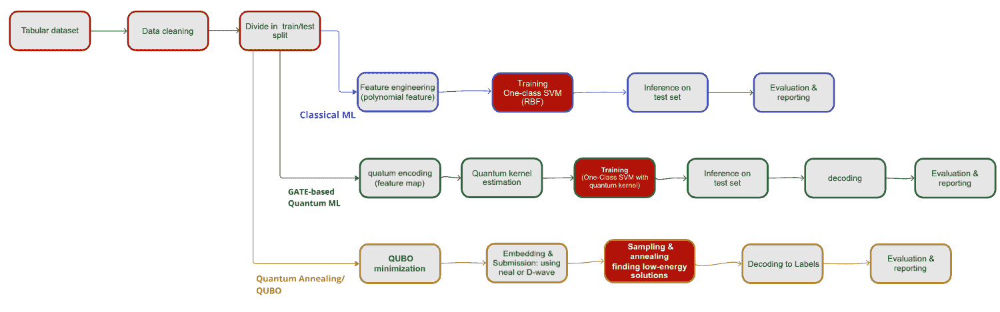
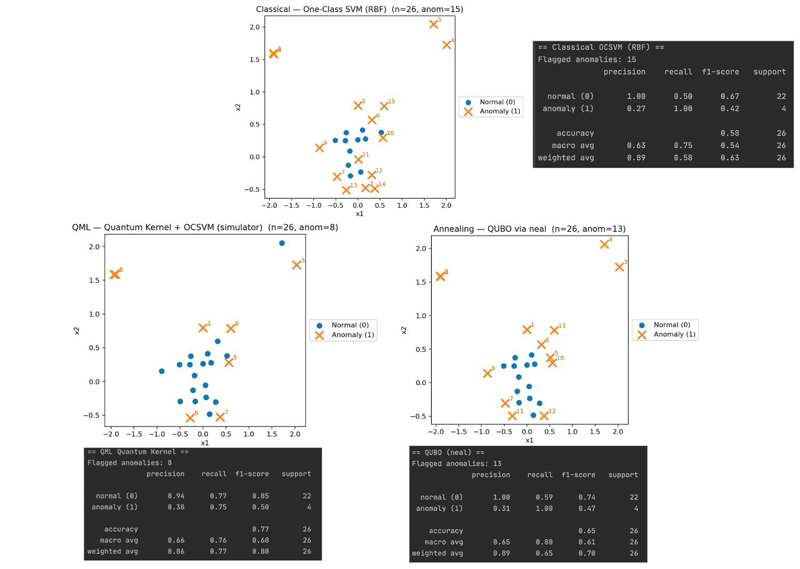

# 我们为什么要在机器学习中关注量子计算？

> 原文：[`towardsdatascience.com/why-should-we-bother-with-quantum-computing-in-ml/`](https://towardsdatascience.com/why-should-we-bother-with-quantum-computing-in-ml/)
> 
> 当黑猫徘徊，南瓜闪耀时，万圣节之夜愿你幸运。（未知）

<mdspan datatext="el1761104784033" class="mdspan-comment">近年来</mdspan>，关于量子计算的会议、研讨会、文章和书籍数量激增，开辟了新的信息处理方式，并重新思考了**经典系统的限制**。经典与量子研究之间的相互作用也推动了结合熟悉技术与量子资源的混合算法。本文介绍了量子计算的基本知识，并试图进一步阐述其在数据科学中的应用。

[随着 2025 年诺贝尔物理学奖](https://www.nobelprize.org/prizes/physics/2025/summary/) [1]认可量子隧穿方面的进展，很明显，量子技术将在未来几年中更加普遍。这个自 1980 年代以来发展起来的关键思想是，**量子隧穿**使得将叠加、纠缠和干涉（参见图 1 的定义）转化为我们可以工程化的工具成为可能，这意味着我们可以在真实的芯片上运行真实的算法，而不仅仅是模拟，并探索更有效地从高维数据中学习的新方法。

在深入探讨基础知识之前，值得问一问为什么我们需要在**工作流程**中引入量子计算。问题是：

> 当前的方法中存在哪些限制，迫使我们必须重新思考我们的方法，并考虑使用我们已使用的工具之外的替代方案？

### 摩尔定律的局限性：

1965 年提出的摩尔定律预测，芯片上的晶体管数量以及计算能力大约每两年翻一番。这一预期推动了数十年的进步，通过稳定的晶体管小型化：芯片每两年大约可以容纳两倍的晶体管，使计算更便宜、更快[2]。

然而，随着工程师将晶体管尺寸推进到原子尺度，他们遇到了令人畏惧的物理限制：在相同区域内迅速**增加**更多、更小的设备，这不仅**增加了**热量产生和功率密度，使得冷却和稳定性变得更加难以管理。在微小尺度上，电子会泄漏或逃逸出其预定路径，导致功率损失，并使芯片表现出不可预测的行为，这可能导致错误或性能下降。此外，电线、内存和输入/输出系统不像晶体管那样高效地扩展，这导致整体系统性能出现严重瓶颈[2]。

所有这些障碍都清楚地表明，摩尔定律预测的**指数级增长不能无限期地持续**；仅仅依靠缩小尺寸的方法已经不再可行。相反，现在的进步依赖于更好的算法、专用硬件，以及在适用的情况下，利用量子方法解决选定的高影响子问题的最优算法（当适用时）。

随着数据量的持续增长和计算需求的增加，深度学习和其他现代人工智能方法在时间、能量和内存效率方面达到了实际极限。**量子计算提供了一条不同的途径**，它通过叠加、纠缠和干涉处理信息，允许某些计算更有效地扩展。**量子机器学习（QML）**的目标是使用**量子比特**而不是比特来表示和转换数据，可能比经典系统更有效地处理高维或不确定的问题。尽管今天的硬件仍在发展，但 QML 的概念基础已经指向一个未来，在那里量子资源和经典资源共同工作以克服计算瓶颈。

### 安全范式

传统**加密方法依赖于经典计算机难以解决的复杂数学问题**。然而，量子计算机通过利用像 Shor 算法（量子计算优势的例子之一）这样的量子算法，威胁要迅速破解许多这些系统。许多基于量子安全的创新越来越多地从理论转向在需要最高数据保护标准行业中的实际应用。

这种风险的具体例子被称为**“先收集，后解密”**：攻击者今天捕获并存储加密数据，即使他们现在还无法解密。一旦大规模量子计算机变得可用，他们可以使用量子算法**事后解密**这些信息，暴露敏感数据，如健康记录、金融交易或机密通信[4]。

**为了应对这一挑战**，Google Chrome 浏览器包括

量子抗性。自版本 116 以来，Chrome 实现了**混合密钥协商算法（X25519Kyber768）**，它将传统的椭圆曲线密码学与**Kyber**算法相结合，Kyber 是**NIST**为量子抗性加密标准化的算法之一。这种方法可以保护数据免受**经典和未来量子攻击**。

### 数学复杂性

使用量子原理可以帮助比传统方法更有效地探索广阔的解决方案空间。这使得量子方法在优化、机器学习和具有高计算复杂性的模拟问题（如[Big-O](https://www.geeksforgeeks.org/dsa/analysis-algorithms-big-o-analysis/)或工作量如何随问题规模而变化）方面特别有前景。例如，**大整数的分解在计算上很困难，主要是因为数学复杂性，而不是内存或穷举限制**。这意味着对于非常大的数字，例如在加密系统中使用的数字，**在经典计算机上对大数进行分解实际上是不可能的**。

* * *

## 理解基础

要了解这些主题的更多内容，有必要掌握量子力学的基本规则以及它们与我们今天使用的经典观点有何不同。

在经典计算中，数据以比特的形式表示，可以具有 0 或 1 的值。这些比特通过逻辑运算或逻辑门（与、或、非、异或、同或）的组合和操作来进行计算和解决问题。然而，经典计算机可以存储和处理的信息量受其拥有的比特数限制，这些比特只能表示 0 和 1 的有限组合。因此，像分解大数这样的计算对于传统计算机来说非常困难。

另一方面，在量子计算中，数据以量子比特或 qubit 的形式表示，由于叠加、干涉和纠缠的原理，可以同时具有 0 和 1 的值。这些原理允许量子系统并行处理信息，并快速解决某些问题。这被称为“量子**猫**状态”或薛定谔的**猫**状态。

**图 1**：使用薛定谔的猫类比说明经典和量子状态之间的差异。在经典状态（左），猫要么活着要么死了，对应于比特为 0 或 1。在量子状态（右），猫同时存在于两种状态的叠加中。量子干涉和**纠缠**进一步定义了这些状态如何相互作用并保持相关性。图片由作者提供。

这个想法可以用薛定谔的猫实验（图 1）来解释，在这个实验中，一个**假设的放射性原子被用于一个封闭的机制中，如果被触发，可能会结束被关在里面的猫的生命 🙀🙀🙀**。这个想法是原子处于一种叠加态，要么激活要么不激活机制，同时与猫的状态纠缠在一起，所以直到原子的状态实现，猫的状态才会保持在同时活着 😺 和死去 ☠️ 的叠加态。薛定谔实验中的猫的状态不是真实的物质状态，而是一个**用于解释量子系统奇怪行为的理论概念**。

类似的概念可以用量子硬币（一个更好的例子，可以保护猫咪 🐱）来解释。一枚普通的硬币总是有一面朝上，要么是正面要么是反面，但量子硬币可以同时存在于两种可能性的叠加态，直到被观察。当有人检查时，叠加态会坍缩成确定的结果。硬币还可以与测量它的设备或系统纠缠在一起，这意味着知道一个立即确定另一个（无论初始的经典条件如何）。干涉进一步修改了概率：有时波会相加，使某个结果更有可能，而在其他情况下它们会相互抵消，使结果不太可能。甚至启动、翻转和落地的动作都可能涉及量子相位，并创建叠加态或纠缠。

建立在这些想法的基础上，一个 n 量子位的寄存器存在于有*2^n*可能状态的时空中，这意味着它可以表示量子振幅的复杂模式。然而，这并不意味着*n*量子位存储*2^n*经典比特，或者所有答案都可以一次性读取。当系统被测量时，状态会坍缩，并且每次运行只能获得有限经典信息，大约*n*比特。量子计算的强大之处在于设计算法，准备和操作叠加态和相位，使得干涉使正确的结果更有可能，错误的结果更不可能。叠加态和纠缠是基本资源，但**真正的量子优势取决于如何在特定的算法或问题中使用这些效果**。

* * *

## 不同的方法

量子计算有几种不同的方法，它们在使用的量子位、控制方式、所需条件以及擅长解决的问题上有所不同。**图 2**总结了主要选项，并且随着该领域的成熟，更多高级技术持续涌现。

**图 2**. 量子计算不同方法的概述。每种方法在目的、可扩展性和量子优势程度上都有所不同。图片由作者提供。

在门模型量子计算机和量子退火器中，随着量子系统变得庞大（例如，具有许多 qubits 或复杂问题，如大数的分解），在经典计算机上进行模拟变得不切实际，因为资源需求呈指数增长。需要真正的量子硬件来观察真正的量子加速。然而，经典计算机在今天仍然发挥着至关重要的作用，它允许研究人员和实践者**模拟小型量子电路并实验量子启发的算法，这些算法模仿量子行为而不需要量子硬件**。

当你需要真正的量子设备时，通常通过云平台（IBM Quantum、Rigetti、Azure Quantum、D-Wave）来访问。像**Qiskit**或**PennyLane**这样的库让你可以在**经典模拟器**上原型设计，并且有了凭证，**可以将工作提交到硬件上**。模拟对于开发至关重要，但它并不能完美地捕捉物理限制（噪声、连接性、排队、设备大小）。

### 门模型：

在**门模型**硬件上，第一步通常是设置一个电路，该电路编码了你需要解决该问题的量子状态。因此，我们所知道的信息被编码到量子状态中，使用量子位或 qubits，这些位由量子门控制。**这些门类似于经典计算中的逻辑运算**，但它们作用于 qubits，并利用量子特性，如叠加、纠缠和干涉。有许多方法可以将量子状态编码到电路中，而且根据你的做法，**错误率可能会有很大差异**。这就是为什么使用纠错技术来纠正错误并使计算更准确。在所有操作和计算完成后，结果需要被**解码回**，这样我们才能在正常经典世界中理解它们。

在量子机器学习（QML）或量子机器学习（quantum ML）的情况下，使用核和变分算法来编码和构建模型。这些技术与在经典机器学习中使用的那些有所不同。

+   **变分算法（VQAs）**：定义一个参数化电路，并使用经典优化来调整参数以对抗损失（例如，用于分类）。例子包括**量子神经网络（QNNs）**、**变分量子本征值求解器（VQE）**和**量子近似优化算法（QAOA）**。

+   **量子核方法**：构建**量子特征映射**并测量相似性以供经典分类器或聚类器使用。例子包括**量子支持向量机（QSVM）**、**量子核估计（QKE）**和**量子 k-means**。

QML 算法，如基于核的方法和变分算法，在优化和图像识别等领域已经显示出**有希望的结果，并有可能革命性地改变各个行业**，从医疗保健到金融和网络安全。然而，许多挑战仍然存在，例如需要鲁棒的纠错技术，量子硬件的高成本，以及量子专家的短缺。

### 量子退火

许多现实世界的问题都是组合性的，可能性呈阶乘增长（例如，10!，20!等），使得穷举搜索不切实际。这些问题通常自然映射到图上，可以表述为二次无约束二进制优化（QUBO）或伊辛模型。量子退火器加载这些问题表述并搜索低能量（最优或近似最优）状态，为具有图结构的优化任务提供了一种替代启发式方法。当在相同的时间约束下与强大的经典基线公平比较时，量子退火可以显示出具有竞争力的性能。

在 QML 中，量子退火可以应用于优化机器学习模型中的参数，发现模式，或通过寻找代表解决方案的最小能量配置来执行聚类。尽管量子退火器是硬件特定的和专业的，但它们在机器学习和优化中的实际应用使它们成为门模型 QML 的重要补充方法。

量子退火器通常作为启发式求解器，在类似的时间约束下与经典强基线进行比较。通常通过云服务（如 D-Wave）访问，它们的噪声和硬件限制使它们与门模型量子计算机区分开来。

### 量子启发的

这些是**经典**算法，它们模仿了量子计算中的想法（例如，退火式搜索，张量方法）。它们在 CPU/GPU 上运行（**无需量子硬件**）并建立了强大的基线。您可以使用标准的 Python 堆栈或专门的包在规模上尝试它们。

量子启发的算法通过在经典计算中利用量子原理提供了一个实用的桥梁，为某些问题类提供了潜在的速度提升，而无需昂贵的量子硬件。然而，它们并不提供真正量子计算的全部优势，并且它们的性能提升在很大程度上取决于问题和实现细节。

## 示例：

今天的量子优势仍然处于萌芽阶段，并且高度依赖于问题。最大的收益预计将出现在量子算法可以利用结构的高复杂性问题上。本节中提供的玩具示例纯粹是说明性的，突出了方法之间的差异，但真正的优势更有可能在目前对经典计算机来说困难或难以处理的问题上出现。

在这个 [示例](https://github.com/erikapat/quantum-experiments/blob/master/quatum.py) 中，我们使用了一个表格和模拟数据集，其中大多数点是正常的，一小部分是异常的（图 3）。在这个演示中，**正常性**对应于原点周围的密集簇，而异常点形成了一些远离的小簇。

**图 3**。*正常点和异常点（测试集）的真实分布*。图片由作者提供。

**图 4**。*用于异常检测的三个建模方法的概述*。

从同一个表格数据集开始，工作流程分为三条路径：（1）**经典 ML（基线）**，（2）**基于门的量子 ML** 和（3）**量子退火（QUBO）**。图片由作者提供。

图 4 的示意图说明了使用三种不同的方法在同一表格数据集上进行异常检测的统一工作流程：（1）**经典机器学习（单类 SVM）**[7]，（2）基于门的量子机器学习（量子核方法）[8]，和（3）量子退火启发的优化。首先，数据集被清理、缩放，并分为训练集、验证集和测试集。对于经典路径，在训练单类 SVM 和评估预测之前，应用多项式特征工程。基于门的量子 ML 选项使用量子映射编码特征，并估计训练和推理的量子核，然后进行解码和评估。退火路径将任务表述为 QUBO，使用模拟退火求解，解码结果并评估性能。每种方法都产生自己的异常预测输出和评估指标，提供了对数据的补充视角，并展示了如何将经典和量子启发的工具集成到在经典计算机上运行的单一分析管道中。

**图 5**。*三种异常检测方法的比较*。

使用 (A) **经典单类 SVM**，(B) **量子核 OCSVM（使用 PennyLane 的量子门模型 QML 模拟）**，和 (C) **基于 QUBO 的模拟退火方法（量子启发式）** 在测试数据集上对结果进行可视化。每个图表显示了正常点（蓝色）和预测的异常点（橙色）。图片由作者提供。

在这个微小、不平衡的测试集（22 个正常点，4 个异常点）上，三种方法表现不同。**量子核 OCSVM** 实现了最佳平衡：通过捕获大多数异常（召回率 0.75）而将误报率保持在低于其他方法的水平，从而提高了整体准确率（约 0.77）。**经典 OCSVM（径向基函数）** 和 **退火风格的 QUBO** 都达到了召回率 1.0（它们找到了所有 4 个异常），但过度标记了正常点，因此它们的准确率下降（≈0.58 和 0.65）。

此处的目标是演示，而不是性能：这个例子展示了如何使用这些方法，结果并不是重点。它还说明了特征映射或表示可能比分类器更重要。

任何量子优势的声明最终都取决于可扩展性：问题大小和结构、电路深度和宽度、特征映射中的纠缠，以及能够在真实量子硬件上运行以利用干涉而不是仅仅模拟的能力。我们在这里不声称量子优势；这是一个经典计算机可以解决的简单问题，即使使用量子启发的想法。

* * *

## 何时进行量子化

有意义的是**从模拟器开始**，只有在有明确的收益信号时才转向**真实量子硬件**。模拟器速度快、成本低、可重复：你可以在相同的**时间/成本预算**下，与强大的经典基线一起原型化量子风格的方法（例如，量子内核、QUBOs）。这让你可以调整特征映射、超参数和问题编码，并查看任何方法是否显示出更好的准确性、找到好解的时间、鲁棒性或扩展趋势。

当有正当理由时，你才**使用硬件**：例如，当模拟器建议有希望的扩展性时，当问题结构与设备匹配时（例如，良好的 QUBO 嵌入或浅层门电路），或者当利益相关者需要硬件证据时。在硬件上，你测量**质量-时间-成本**，考虑噪声和连接性限制，应用错误缓解，并与调整后的经典方法进行公平比较。简而言之：**先模拟，然后进行量子化**以验证实际性能；只有当硬件结果和曲线真正证明需要时才采用量子。

如前所述，今天的量子优势仍然处于萌芽阶段，并且高度依赖于问题。真正的挑战和机遇是将有希望的模拟转化为在经典计算仍然困难的问题上的硬件验证收益，随着问题规模的增加，在质量、时间和成本方面显示出明显的改进。

量子机器学习有可能在模型压缩和可扩展性方面超越经典方法，尤其是在数据丰富的领域，如网络安全。挑战在于处理庞大的数据集，包含数百万的正常交互和非常少的攻击。量子模型可以使用叠加和纠缠将复杂模式压缩成紧凑的量子表示，即使在数据不平衡的情况下也能实现更有效的异常检测。混合量子-经典和联邦量子学习方法旨在提高可扩展性和隐私性，使实时入侵检测更加可行。尽管当前硬件存在限制，但研究表明量子压缩可以使未来的模型更有效地管理更大的、复杂的网络安全数据流，为强大的实际防御铺平道路。

## 参考文献

[1] 2025 年诺贝尔物理学奖。*诺贝尔奖官网*。诺贝尔奖传播部（2025）。“摘要”。访问日期：2025 年 10 月 19 日。[`www.nobelprize.org/prizes/physics/2025/summary/`](https://www.nobelprize.org/prizes/physics/2025/summary/?utm_source=chatgpt.com)

[2] DataCamp. （未注明日期）。摩尔定律：它是怎么回事，它死了吗？2025 年 10 月 2 日检索，来源：[`www.datacamp.com/tutorial/moores-law`](https://www.datacamp.com/tutorial/moores-law)

[3] Classiq. (2022, July 19). *量子密码学—Shor 算法解析*. Classiq 洞察。[`www.classiq.io/insights/shors-algorithm-explained`](https://www.classiq.io/insights/shors-algorithm-explained?utm_source=chatgpt.com)

[4] Gartner. (2024, March 14). *现在开始过渡到后量子密码学.* 2025 年 10 月 10 日检索，来源：[`www.gartner.com/en/articles/post-quantum-cryptography`](https://www.gartner.com/en/articles/post-quantum-cryptography?utm_source=chatgpt.com)

[5] The Quantum Insider. (2023, August 14). *Google 在 Chrome 浏览器中推进抗量子密码学努力.* 2025 年 10 月 10 日检索，来源：[`thequantuminsider.com/2023/08/14/google-advances-quantum-resistant-cryptography-efforts-in-chrome-browser/`](https://thequantuminsider.com/2023/08/14/google-advances-quantum-resistant-cryptography-efforts-in-chrome-browser/?utm_source=chatgpt.com)

[6] “Schrodinger’s Cat Coin (Antique Silver)” by BeakerHalfFull（访问日期：2025 年 10 月 16 日）。**来源：** Etsy：[`www.etsy.com/listing/1204776736/schrodingers-cat-coin-antique-silver`](https://www.etsy.com/listing/1204776736/schrodingers-cat-coin-antique-silver?utm_source=chatgpt.com)

[7] Scikit-learn 开发者。 “具有非线性核（RBF）的单类 SVM。” scikit-learn 文档，[`scikit-learn.org/stable/auto_examples/svm/plot_oneclass.html`](https://scikit-learn.org/stable/auto_examples/svm/plot_oneclass.html)。访问日期：2025 年 10 月 21 日。

[8] Schuld, Maria. “基于核的量子模型训练与 scikit-learn.” PennyLane Demos, [`pennylane.ai/qml/demos/tutorial_kernel_based_training`](https://pennylane.ai/qml/demos/tutorial_kernel_based_training). 发布于 2021 年 2 月 2 日。最后更新于 2025 年 9 月 22 日。访问日期：2025 年 10 月 21 日。

[9] Augey, Axel. “Quantum AI: Ending Impotence!” *Saagie Blog*, 12 June 2019, [`www.saagie.com/en/blog/quantum-ai-ending-impotence/`](https://www.saagie.com/en/blog/quantum-ai-ending-impotence/?utm_source=chatgpt.com).
