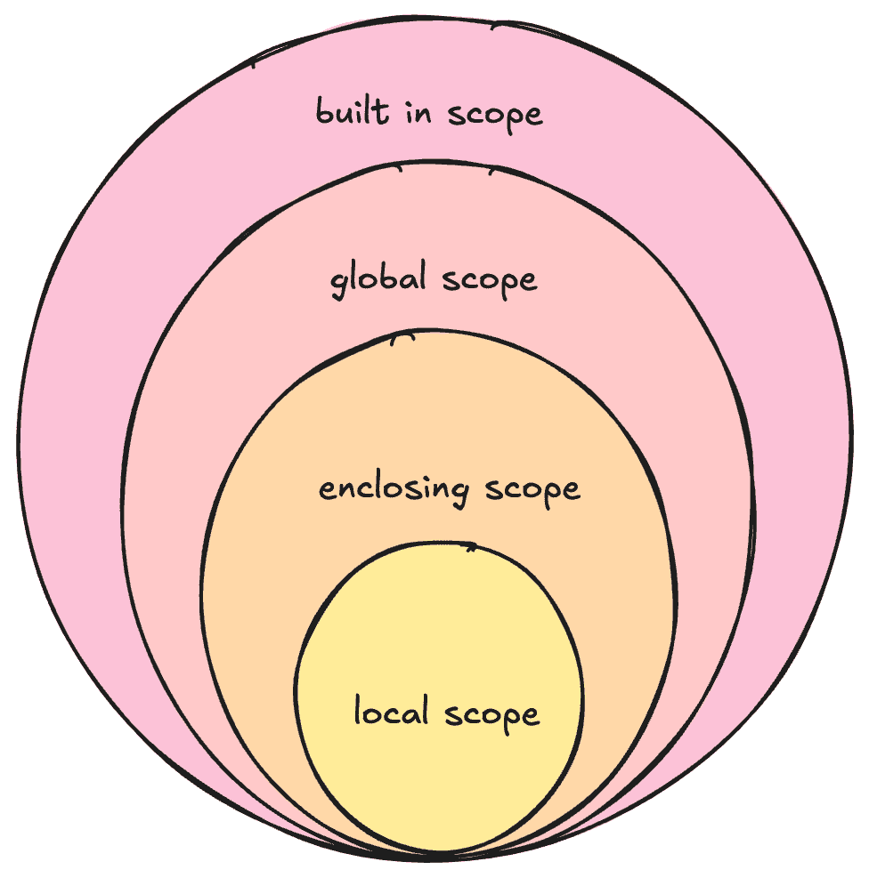

# 为什么变量范围可能会影响你的数据科学工作流程

> 原文：[`towardsdatascience.com/why-variable-scoping-can-make-or-break-your-data-science-workflow-5b449291ac73/`](https://towardsdatascience.com/why-variable-scoping-can-make-or-break-your-data-science-workflow-5b449291ac73/)


图片由 [Swello](https://unsplash.com/@getswello) 来自 [Unsplash](https://unsplash.com/)

当你沉浸在快速原型设计之中时，很容易跳过清晰的范围界定或重用常见的变量名（比如，`df`！），认为这样可以节省时间。但这样做可能会导致一些隐蔽的 bug，破坏你的工作流程。

好消息是？一旦你理解了基本原理，编写清晰、范围良好的代码并不需要额外的努力。

让我们将其分解。

## 什么是变量范围？

> 将变量想象成一个容器，它将存储一些信息。**范围指的是变量在你的代码中可访问的区域**。

范围通过限制变量可以被读取或修改的位置来防止意外的更改。如果每个变量都可以从任何地方访问，你将不得不跟踪所有变量以避免意外覆盖。

在 Python 中，范围由 **LEGB 规则** 定义，代表：**局部、封闭、全局和内置**。



Python 中的范围，称为 LEGB（作者命名）

## Python 中的范围：LEGB 规则

让我们用一个例子来说明这一点。

```py
# Global scope, 7% tax
default_tax = 0.07 

def calculate_invoice(price):
    # Enclosing scope
    discount = 0.10  
    total_after_discount = 0

    def apply_discount():
        nonlocal total_after_discount

        # Local scope
        tax = price * default_tax  
        total_after_discount = price - (price * discount)
        return total_after_discount + tax

    final_price = apply_discount()
    return final_price, total_after_discount

# Built-in scope
print("Invoice total:", round(calculate_invoice(100)[0], 2)) 
```

### 1. 局部范围

**函数内部的变量位于局部范围。**它们只能在函数内部访问。

在示例中，`tax` 是 `apply_discount` 函数内部的局部变量。它在这个函数外部不可访问。

### 2. 封闭范围

这些指的是函数中包含的**嵌套**函数中的变量。这些变量不是全局的，但可以被内部（嵌套）函数访问。在这个例子中，`discount` 和 `total_after_discount` 是 `apply_discount` 封闭范围内的变量。

**`nonlocal` 关键字：**

`nonlocal` 关键字用于**修改**封闭范围内的变量，**而不仅仅是读取它们**。

例如，假设你想更新位于函数封闭范围内的变量 `total_after_discount`。如果没有 `nonlocal`，在内部函数中对其赋值，Python 将将其视为一个新的局部变量，实际上**遮蔽**了外部变量。这可能会引入 bug 和意外的行为。

### 3. 全局范围

定义在所有函数**外部**且在整个程序中可访问的变量。

**`global` 语句**

当你在函数内部声明一个变量为 `global` 时，Python 会将其视为对函数外变量的引用。这意味着对它的更改将影响全局范围内的变量。

使用 `global` 关键字，Python 将创建一个新的局部变量。

```py
x = 10  # Global variable

def modify_global():
    global x  # Declare that x refers to the global variable
    x = 20    # Modify the global variable

modify_global()
print(x)  # Output: 20\. If "global" was not declared, this would read 10
```

### 4. 内置范围

指的是 Python 用于其内置函数的保留关键字，例如`print`、`def`、`round`等。这可以在任何级别访问。

## 关键概念：全局与非局部关键字

这两个关键字对于修改不同作用域中的变量至关重要，但它们的用法不同。

+   **`global`**：用于修改全局作用域中的变量。

+   **`nonlocal`**：用于修改封闭（非全局）作用域中的变量。

## 变量遮蔽

> 变量遮蔽发生在内部作用域中的变量隐藏外部作用域中的变量时。

在内部作用域内，所有对变量的引用都将指向内部变量，而不是外部变量。如果不小心，这可能会导致混淆和意外的输出。

一旦执行返回到外部作用域，内部变量就会停止存在，并且对变量的任何引用都将指向外部作用域变量。

这里有一个快速示例。`x`在每个作用域中被遮蔽，根据上下文产生不同的输出。

```py
#global scope
x = 10

def outer_function():
    #enclosing scope
    x = 20  

    def inner_function():
        #local scope
        x = 30  
        print(x)  # Outputs 30

    inner_function()
    print(x)  # Outputs 20

outer_function()
print(x)  # Outputs 10
```

## 参数遮蔽

> 这与变量遮蔽类似，但发生在局部变量重新定义或覆盖传递给函数的参数时。

```py
def foo(x):
    x = 5  # Shadows the parameter `x`
    return x

foo(10)  # Output: 5
```

`x`被传递为 10。但是它立即被`x=5`遮蔽并覆盖。

## 递归函数中的作用域

> 每次递归调用都有自己的**执行上下文**，这意味着该调用中的局部变量和参数与之前的调用是独立的。

然而，如果一个变量被全局修改或显式作为参数传递，其变化可能会影响后续的递归调用。

+   **局部变量**：这些是在函数内部定义的，并且只影响**当前**递归级别。它们在调用之间不会持续存在。

+   **显式传递给下一个递归调用的参数**保留了从上一个调用中继承的值，允许递归在各个层级上累积状态。

+   **全局变量**：这些在**所有递归级别**之间共享。如果修改，变化将对所有递归级别可见。

让我们用一个例子来说明这一点。

### **示例 1：使用全局变量（不推荐）**

```py
counter = 0  # Global variable

def count_up(n):
    global counter
    if n > 0:
        counter += 1
        count_up(n - 1)

count_up(5)
print(counter)  # Output: 5
```

`counter`是一个在所有递归调用之间共享的全局变量。它在递归的每个级别上递增，并在递归完成后打印其最终值（5）。

### **示例 2：使用参数（推荐）**

```py
def count_up(n, counter=0):
    if n > 0:
        counter += 1
        return count_up(n - 1, counter)
    return counter

result = count_up(5)
print(result)  # Output: 5
```

+   `counter`现在是函数的**参数**。

+   `counter`从一个递归级别传递到下一个级别，其值在每个级别上更新。`counter`在每个调用中不会被重新初始化，而是将**当前状态传递到下一个递归级别**。

+   函数现在是**纯函数** - 没有副作用，并且它只在其自己的作用域内操作。

+   当递归函数返回时，`counter`“冒泡”到顶级，并在基本情况下返回。

## 最佳实践

### 1. 使用描述性的变量名称

避免使用模糊的名称，如`df`或`x`。为了清晰起见，使用描述性的名称，例如`customer_sales_df`或`sales_records_df`。

### 2. 使用大写字母为常量命名

这是 Python 中常量的标准命名约定。例如，`MAX_RETRIES = 5`。

### 3. 尽可能避免使用全局变量

全局变量引入了错误，并使代码更难测试和维护。最好在函数之间显式传递变量。

### 4. 尽可能编写纯函数

**什么是纯函数？**

1.  **确定性**：对于相同的输入，它总是产生相同的输出。它不受外部状态或随机性的影响。

1.  **无副作用**：它不会修改任何外部变量或状态。它仅在本地作用域内操作。

使用`nonlocal`或`global`会使函数变得不纯。

然而，如果你正在处理**闭包**，你应该使用`nonlocal`关键字来修改封装（外部）作用域中的变量，这有助于防止变量遮蔽。

当一个嵌套函数（内部函数）捕获并引用其封装函数（外部函数）中的变量时，就会发生**闭包**。这允许内部函数“记住”其创建的环境，包括访问外部函数作用域中的变量，即使外部函数已经执行完毕。

**闭包的概念可以非常深入，所以请在评论中告诉我，这是否是我应该在下一篇文章中深入探讨的内容！ :)**

### 5. 避免变量遮蔽和参数遮蔽

如果你需要引用外部变量，避免在内部作用域中重用其名称。使用不同的名称来清楚地区分变量。

## 总结

就这样！感谢你一直陪伴我到最后。

你在自己的工作中遇到过这些挑战吗？在下面的评论中分享你的想法！

我经常写关于 Python、软件开发和我构建的项目，所以请关注我，以免错过。下篇文章再见 :) 
