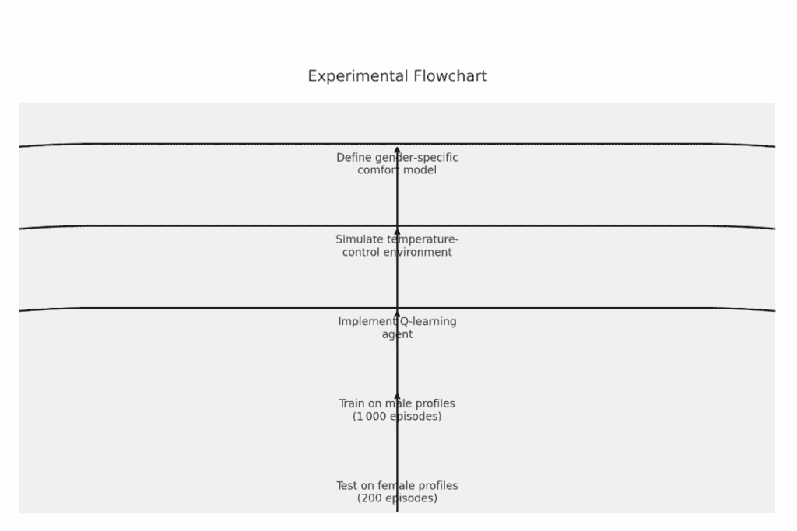
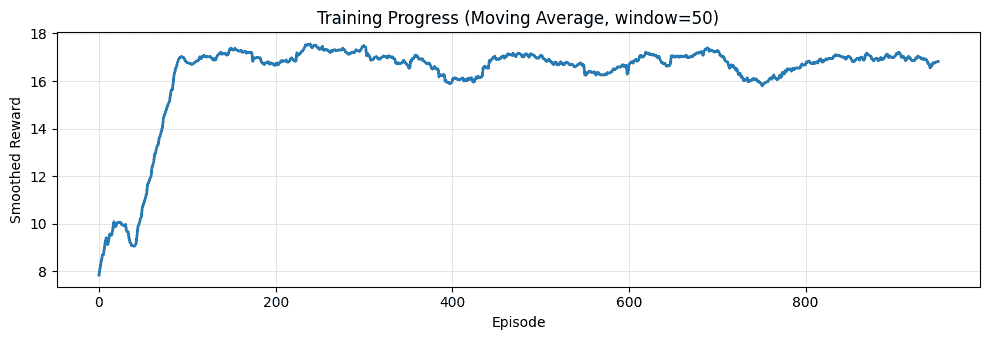
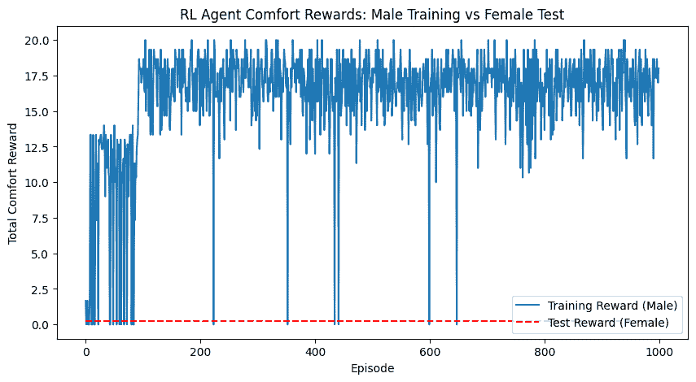

# 我们为什么应该关注女性的人工智能

> 原文：[`towardsdatascience.com/why-we-should-focus-on-ai-for-women/`](https://towardsdatascience.com/why-we-should-focus-on-ai-for-women/)

# <mdspan datatext="el1751395776247" class="mdspan-comment">引言</mdspan>

这个故事始于上周日我与女友的一次对话。她对医学研究感兴趣，提到女性往往在中风诊断中被低估。由于最初的中风研究主要是在男性受试者身上进行的，因此女性中常常存在许多假阴性病例。结果，女性观察到的症状——通常与男性观察到的症状不同——在临床上无法被识别。

在皮肤癌诊断中也观察到了类似的问题。肤色较深的人被正确诊断的机会更少。

这样的例子表明，数据收集和研究设计中的偏差可能导致有害的结果。我们生活在一个几乎每个领域都存在人工智能的时代——将这些有偏差的数据输入这些系统是不可避免的。我甚至亲眼看到医生在写处方时使用聊天机器人工具作为医疗助手。

从这个角度来看，在将不同群体（如基于性别或种族的群体）对某个主题或课题的研究结果应用到人工智能系统之前，其不完整的研究结果可能带来重大的科学和伦理风险。人工智能系统不仅倾向于继承现有的人类认知偏差，还可能无意中在其技术结构中放大和固化这些偏差。

在这篇帖子中，我将通过我个人的案例研究来探讨：在考虑男性和女性的不同热舒适度水平的情况下，如何确定办公大楼的最佳温度。

## 案例研究：热舒适度

两年前，我参与了一个项目，旨在在保持热舒适度的同时优化建筑物的能源效率。这引发了一个基本问题：热舒适度究竟是什么？在许多办公楼或商业中心，答案是固定的温度。然而，研究表明，在相似的热条件下，女性比男性报告的满意度显著更低（Indraganti & Humphreys，2015）。除了严肃的科学调查之外，我以及其他女性同事都报告说在办公时间内感到寒冷。

我们现在将设计一个模拟实验，以展示性别包容性在定义热舒适度以及其他现实世界场景中的重要性。



作者提供的图片：实验流程图

### 模拟设置

现在，我们模拟两个群体——男性和女性——具有略微不同的热偏好。这种差异乍一看可能不太重要，但我们将看到它确实在下一章中变得很重要，在那里我们介绍了一个强化学习（RL）模型来学习最佳温度。我们看到如果智能体仅用男性数据进行训练，它如何满足女性居住者的需求。

我们首先定义了一个理想化的热舒适度模型，该模型受预测平均投票（PMV）框架的启发。每个温度都分配一个舒适度评分，定义为 max(0, 1 – dist / zone)，基于其值与性别特定舒适范围中心的接近程度：

男性：21–23°C（中心在 22°C）

女性：23–25°C（中心在 24°C）

根据定义，温度越偏离这个范围的中心，舒适度评分就越低。

接下来，我们模拟一个简化的房间环境，其中智能体控制温度。三种可能的行为：

+   降低温度 1°C

+   维持温度

+   提高温度 1°C

环境相应地更新温度并返回基于舒适度的奖励。

智能体的目标是最大化这个奖励，并学习为居住者设置最佳温度。请参阅下面的代码以了解环境模拟。

### 强化学习智能体：Q 学习

我们实现了一种 Q 学习方法，让智能体与环境互动。

它通过更新 Q 表来学习最优策略，其中存储了每个状态-动作对的预期舒适度奖励。智能体在学习温度控制策略时，通过最大化奖励来平衡探索——即尝试随机动作——和利用——即选择已知最佳动作。

```py
class QLearningAgent:
    def __init__(self, state_space, action_space, alpha=0.1, gamma=0.9, epsilon=0.2):
        self.states = state_space
        self.actions = action_space
        self.alpha = alpha
        self.gamma = gamma
        self.epsilon = epsilon
        # Initialize Q-table with zeros: states x actions
        self.q_table = np.zeros((len(state_space), len(action_space)))

    def choose_action(self, state):
        if random.random() < self.epsilon:
            return random.choice(range(len(self.actions)))
        else:
            return np.argmax(self.q_table[state])

    def learn(self, state, action, reward, next_state):
        predict = self.q_table[state, action]
        target = reward + self.gamma * np.max(self.q_table[next_state])
        self.q_table[state, action] += self.alpha * (target - predict)
```

我们通过让智能体选择基于当前环境的最佳已知行为或随机行为来更新我们的 Q 表。我们通过一个小的 epsilon 值——这里为 0.2——来控制权衡，代表我们想要的的不确定性水平。

### 偏差训练和测试

如前所述，我们仅使用男性数据来训练智能体。

我们让智能体与环境互动 1000 个回合，每个回合 20 步。它逐渐学会如何将期望的温度水平与男性的高舒适度评分相关联。

```py
def train_agent(episodes=1000):
    env = TempControlEnv(sex='male')
    agent = QLearningAgent(state_space=env.state_space, action_space=env.action_space)
    rewards = []

    for ep in range(episodes):
        state = env.reset()
        total_reward = 0
        for step in range(20):
            action_idx = agent.choose_action(state - env.min_temp)
            action = env.action_space[action_idx]
            next_state, reward, done = env.step(action)
            agent.learn(state - env.min_temp, action_idx, reward, next_state - env.min_temp)
            state = next_state
            total_reward += reward
        rewards.append(total_reward)
    return agent, rewards
```

代码展示了 Q 学习的标准训练过程。以下是学习曲线的图表。



作者提供的图片：学习曲线

现在，我们可以评估当男性训练的智能体被放置在女性舒适环境中时，其表现如何。测试在相同的环境设置中进行，但舒适度评分模型略有不同，反映了女性的偏好。

### 结果

实验结果显示以下结果：

智能体在男性舒适度方面实现了每个回合平均 16.08 的舒适度奖励。我们看到它成功地学会了如何维持男性最佳舒适度范围（21–23°C）的温度。

在女性舒适度方面，代理的性能下降到每集平均奖励 0.24。这表明，不幸的是，男性训练的策略无法推广到女性舒适需求。



图片由作者提供：奖励差异

因此，我们可以这样说，仅在一个群体上训练的模型，当应用于另一个群体时，即使群体间的差异看似很小，也可能表现不佳。

## 结论

这只是一个微小且简单的例子。

但这可能会突出一个更大的问题：当 AI 模型仅从一组或几组数据中训练时，它们存在无法满足其他群体需求的风险——即使群体间的差异看似很小。您可以看到上述男性训练的代理未能满足女性舒适需求，这证明了训练数据中的偏差直接反映在结果上。

这不仅限于办公室温度控制案例。在医疗保健、金融、教育等许多领域，如果我们基于一些非代表性数据进行模型训练，我们可以预见对于代表性不足的群体会有不公平或有害的结果。

对于读者来说，这意味着质疑我们周围的 AI 系统是如何构建的，并推动其设计和透明度以及公平性。这也意味着认识到“一刀切”解决方案的限制，并倡导考虑多样经验和需求的方法。只有这样，AI 才能真正公平地为每个人服务。

然而，我总是觉得在我们的社会中同情心非常难以实现。种族、性别、财富和文化的差异使得我们中的大多数人很难站在他人的立场上。AI 作为一个数据驱动系统，不仅容易继承现有的人类认知偏差，还可能将这些偏差嵌入其技术结构中。因此，那些已经不太被认可的群体可能会得到更少的关注，或者更糟，进一步被边缘化。
