# 为什么在 Power BI 中不应该用 0 替换空值

> 原文：[`towardsdatascience.com/why-you-should-not-replace-blanks-with-0-in-power-bi/`](https://towardsdatascience.com/why-you-should-not-replace-blanks-with-0-in-power-bi/)

<mdspan datatext="el1750452522766" class="mdspan-comment">不久前，我正在</mdspan>观看[Jeffrey Wang 作为 Reid Havens 的直播嘉宾](https://www.youtube.com/watch?v=KI2eYBI0lF0&list=WL&index=3)，Jeffrey 与观众分享的十二个精彩观点之一是关于 DAX 引擎在为我们的度量创建最佳查询计划时执行的优化列表。

而引起我注意的是关于所谓的“稀疏度量”：

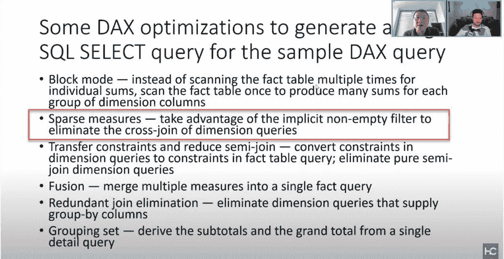

YouTube 直播的截图

为了简化，一旦你定义了度量，[VertiPaq 的公式引擎](https://data-mozart.com/vertipaq-brain-muscles-behind-power-bi/)就会在查询中添加一个隐式的 NonEmpty 过滤器，这应该能够使优化器避免对维度表进行完全交叉连接，并且只扫描那些确实存在你的维度属性组合的记录的行。对于来自 MDX 世界的人，NonEmpty 函数可能看起来很熟悉，但让我们看看它在 DAX 中是如何工作的。

最引起我共鸣的是当 Jeffrey 建议在 Power BI 计算中不要用零（或任何其他显式值）替换 BLANK 时。我已经写了[如何处理 BLANK 并将它们替换为零](https://data-mozart.com/handling-blanks-in-power-bi/)，但在这篇文章中，我想关注这个决定可能带来的性能影响。

## 设置场景

在我们开始之前，有一个重要的免责声明：不建议用 0 替换 BLANK 只是一个建议。如果业务需求是显示 0 而不是 BLANK，这并不一定意味着你应该拒绝这样做。在大多数情况下，你可能甚至不会注意到性能下降，但这将取决于多个不同的因素…

让我们从编写我们的简单 DAX 度量开始：

```py
Sales Amt 364 Products =
CALCULATE (
    [Sales Amt],
    FILTER ( ALL ( 'Product'[ProductKey] ), 'Product'[ProductKey] = 364 )
)
```

使用这个度量，我想计算 ProductKey = 364 的产品总销售额。而且，如果我把这个度量的值放入卡片视觉中，并打开性能分析器来检查处理这个查询的时间，我会得到以下结果：

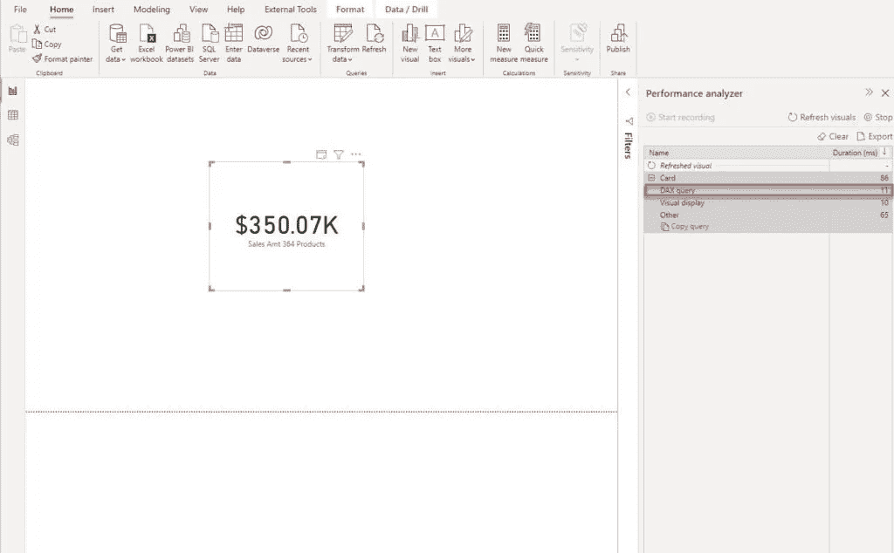


DAX 查询仅用了 11 毫秒来执行，一旦我切换到 DAX Studio，公式引擎生成的 xmSQL 相当简单：

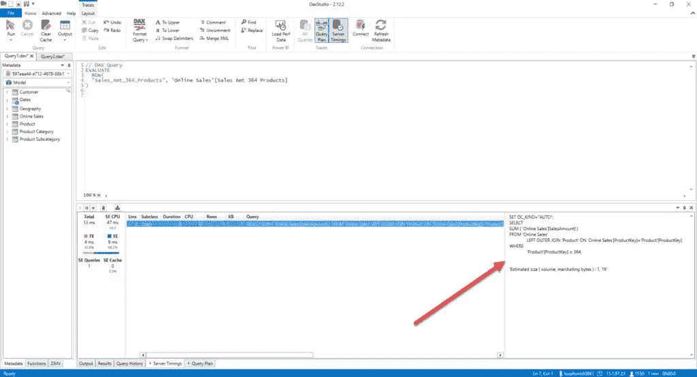


而且，如果我查看查询计划（物理），我可以看到存储引擎只找到了一个现有的值组合来返回我们的数据：

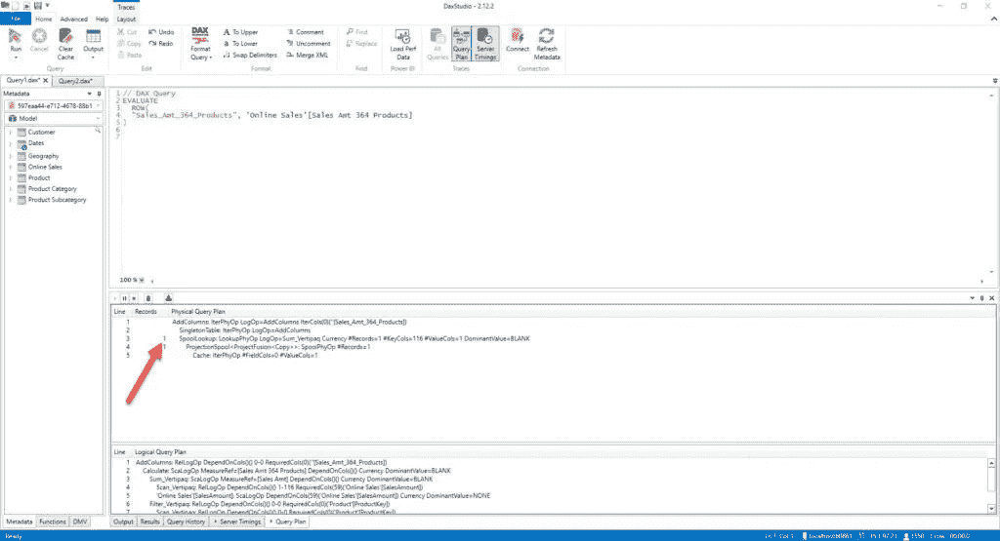


## 添加更多配料…

然而，假设业务请求是按日级别分析产品键 364 的数据。让我们给我们的报告添加日期：

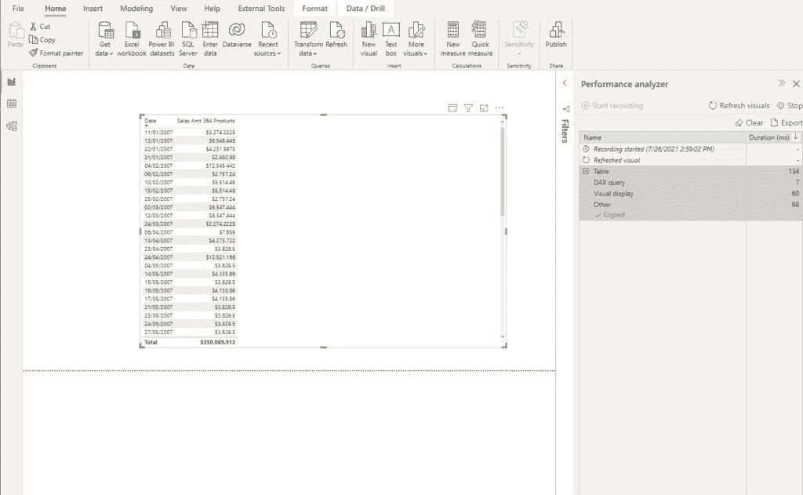

图片由作者提供

这又非常快！我现在将检查 DAX Studio 中的指标：

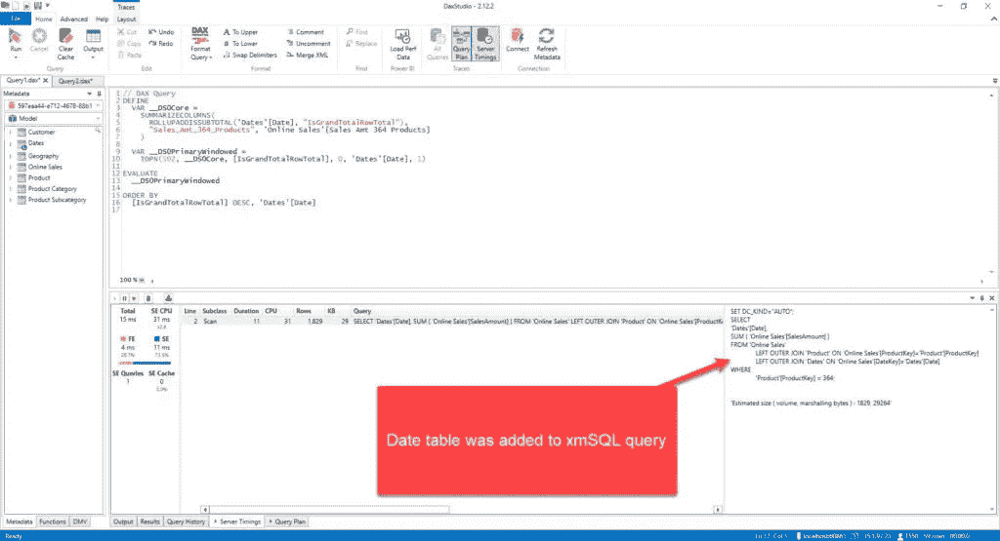

图片由作者提供

这次，查询已扩展到包括日期表，这影响了存储引擎需要执行的工作，因为现在不是只找到 1 行，这次数字不同：

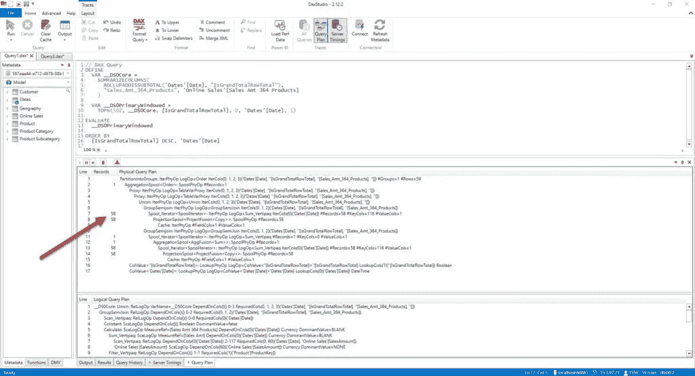

图片由作者提供

当然，您在这两种场景之间不会注意到任何性能差异，因为差异只有几毫秒。

但这只是开始；我们只是在预热我们的 DAX 引擎。在这两种情况下，如您所见，我们只看到“填充”的值——满足我们两个要求的那一行组合——产品键是 364，以及只有那些我们销售了该产品的日期——如果您仔细查看上面的插图，日期不是连续的，有些日期缺失，例如 1 月 12 日，1 月 14 日至 1 月 21 日等等。

这是因为公式引擎足够聪明，能够使用非空过滤器消除产品 364 没有销售记录的日期，这就是为什么记录数是 58：我们有 58 个不同的日期，其中产品 364 的销售记录不为空：

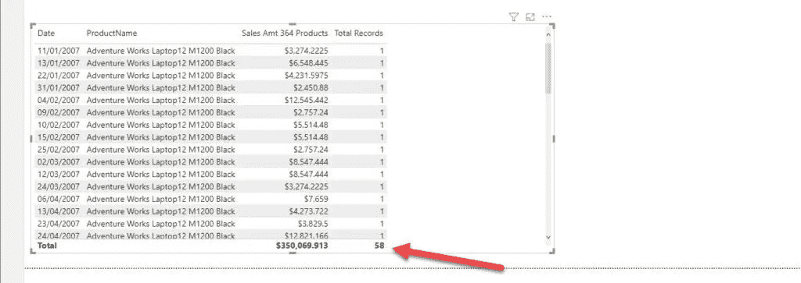

图片由作者提供

现在，假设商业用户也想看到那些产品 364 没有销售记录的日期。所以，想法是显示所有这些日期的金额为 0 美元。如前文所述，有多种不同的方法可以将空白替换为零，我将使用`COALESCE()`函数：

```py
Sales Amt 364 Products with 0 = COALESCE([Sales Amt 364 Products],0)
```

基本上，`COALESCE`函数将检查提供的所有参数（在我的情况下，只有一个参数）并将第一个空白值替换为您指定的值。简单地说，它将检查销售金额 364 产品的值是否为空白。如果不是，它将显示计算值；否则，它将用 0 替换空白。

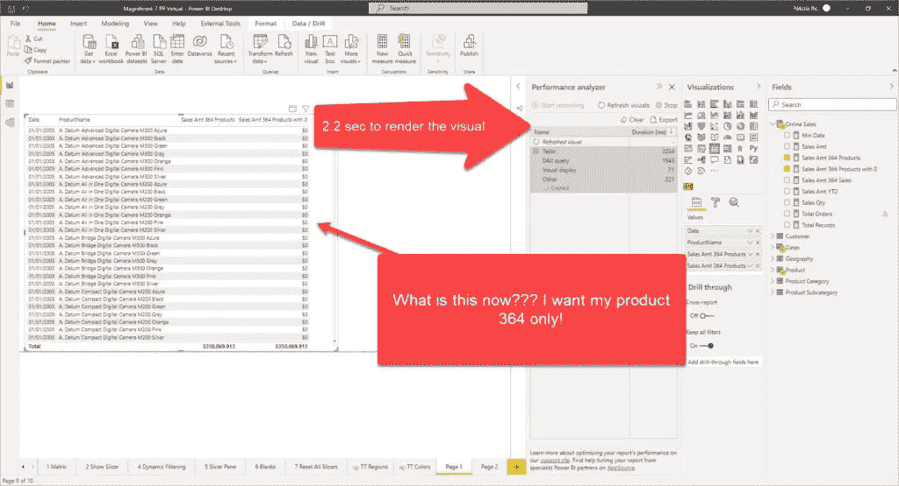

图片由作者提供

等等！为什么我看到所有产品，当我过滤掉除了产品 364 之外的所有产品时？更不用说，我的表格现在需要超过 2 秒才能渲染！让我们检查后台发生了什么。

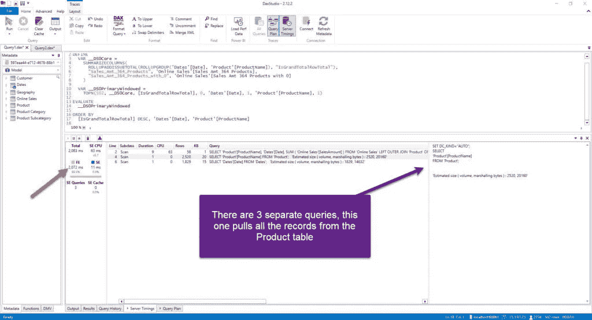

图片由作者提供

现在不是生成一个单一的查询，而是有 3 个查询。第一个与上一个案例完全相同（58 行）。然而，剩余的查询针对产品和日期表，从两个表中拉取所有行（产品表包含 2517 行，而日期表有 1826 行）。不仅如此，看看查询计划：

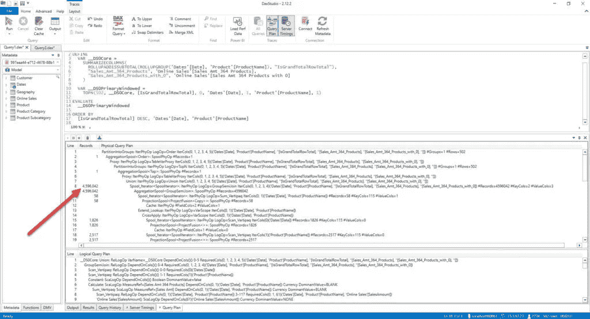

图片由作者提供

460 万条记录？！这究竟是怎么回事？！让我为你算一下：**2.517 * 1.826 = 4.596.042**…所以，这里我们在产品和日期表之间执行了完全的交叉连接，迫使每个单个元组（日期-产品的组合）都被检查！这是由于我们迫使引擎为每个本应返回 BLANK（并随后被排除在扫描之外）的元组返回 0！

这是对所发生事情的一个简单概述：

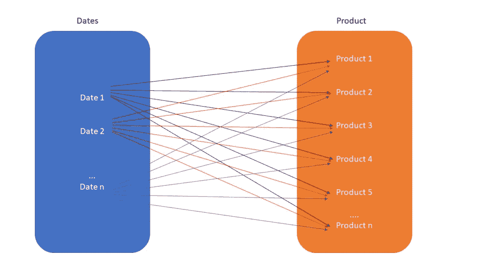

图片由作者提供

信不信由你，有一个优雅的解决方案可以显示空白值（但不是用 0 代替 BLANK），你只需简单地点击日期字段，并选择显示*无数据的项*：

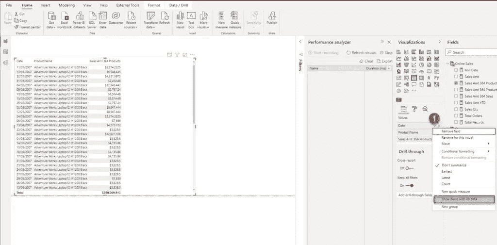

图片由作者提供

这将显示空白单元格，但不会在产品和日期表之间执行完全交叉连接：

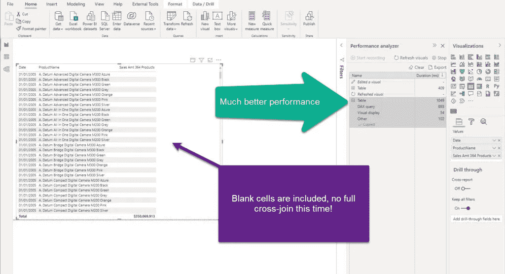

图片由作者提供

我们现在可以看到所有的单元格（包括 BLANKs），而这个查询只用了之前查询时间的一半！让我们检查公式引擎生成的查询计划：

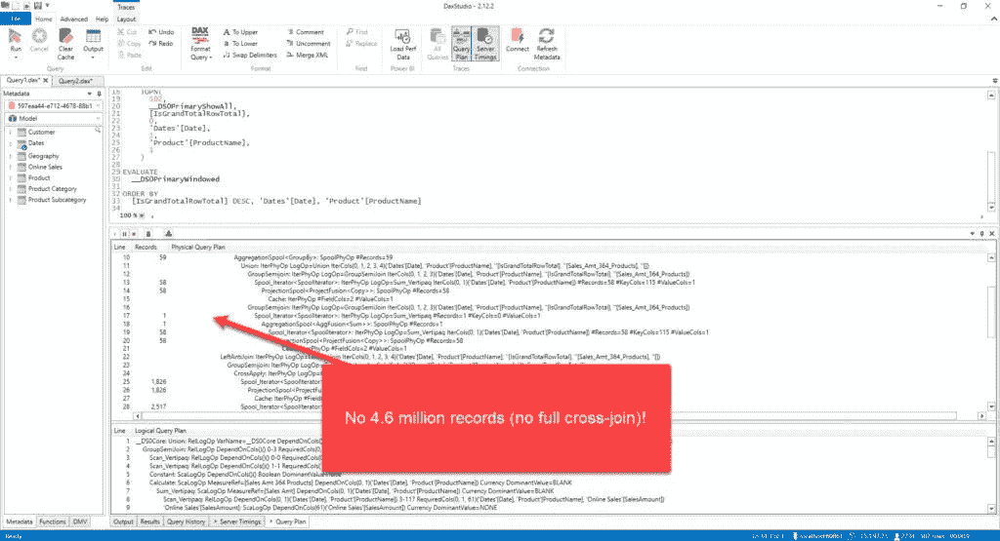

图片由作者提供

## 并非所有情况都是灾难性的！

老实说，我们本可以重写我们的测量值来排除一些不想要的记录，但这仍然不是引擎消除空记录的最佳方式。

此外，在某些情况下，用零替换 BLANKs 不会导致显著的性能下降。

让我们分析以下情况：我们正在显示每个单一品牌的总销售额数据。我将添加我的产品 364 的销售金额测量值：

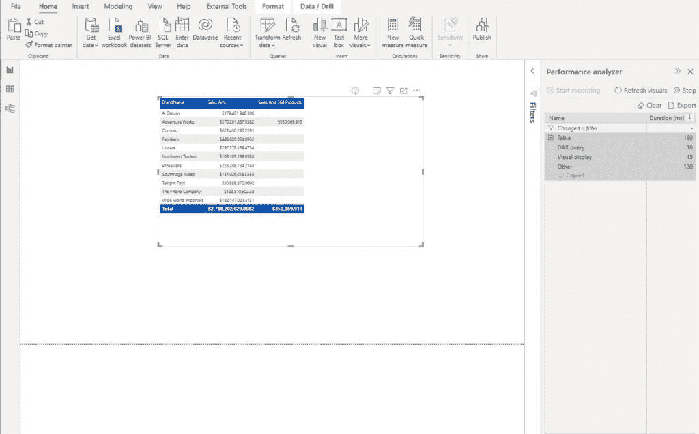

图片由作者提供

如你所预期的那样，这相当快。但是，当我添加我的测量值，用 0 替换 BLANKs 时，会发生什么，这在之前的场景中造成了混乱：

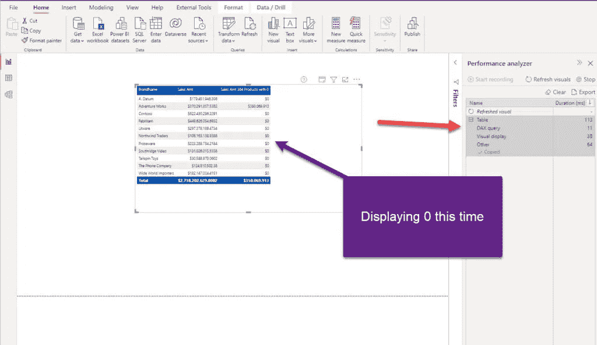

图片由作者提供

嗯，看起来我们在这方面并没有付出任何性能上的代价。让我们检查这个 DAX 查询的查询计划：

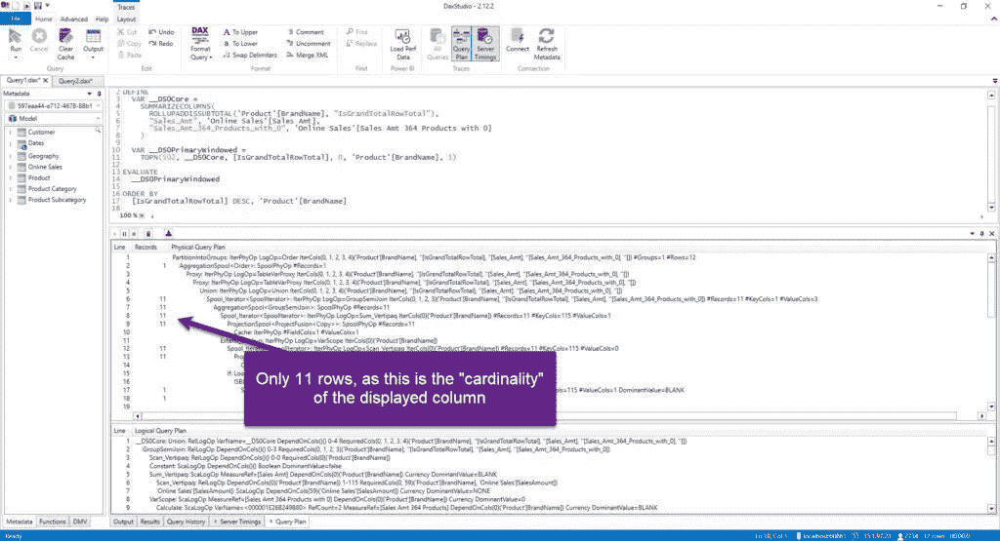

图片由作者提供

## 结论

正如 Jeffrey Wang 建议的那样，你应该避免用零（或任何其他显式值）替换 BLANKs，因为这会显著影响查询优化器消除不必要数据扫描的能力。然而，如果你出于任何原因需要用一些有意义的值替换 BLANKs，请小心何时以及如何进行替换。

如同往常，这取决于许多不同的方面——对于低基数列，或者当你不是从多个不同的表中显示数据（例如在我们的例子中，当我们需要从产品和日期表中合并数据时），或者不需要显示大量不同值的视觉类型（即卡片视觉）——你可以不付出性能代价而逃脱。另一方面，如果你使用显示大量不同值的表格/矩阵/条形图，确保在将报告部署到生产环境之前检查指标和查询计划。

感谢阅读！
