# 为什么你的下一个大型语言模型可能没有分词器

> 原文：[`towardsdatascience.com/why-your-next-llm-might-not-have-a-tokenizer/`](https://towardsdatascience.com/why-your-next-llm-might-not-have-a-tokenizer/)

## <mdspan datatext="el1750792303041" class="mdspan-comment">引言</mdspan>

[在我的上一篇文章中](https://towardsdatascience.com/can-ai-truly-develop-a-memory-that-adapts-like-ours/)，我们深入探讨了谷歌的 Titans——一个通过引入动态内存模块来推动长上下文回忆边界的模型，这个模块可以动态适应，有点像我们自己的记忆工作方式。

这是一个奇怪的悖论。我们有能够分析一百万字文档的 AI，但它仍然会犯像：“单词*strawberry*中有多少个‘r’？”这样的错误。

问题不在于 AI 的大脑；而是眼睛。这些模型阅读的第一步，即分词，本质上是为它们预处理语言。在这个过程中，它剥离了字母如何形成单词的丰富、混乱的细节；整个子词信息的世界就这样消失了。

* * *

## 1. 分词中的迷失：子词语义消亡之处

对人类来说，语言开始于声音，在书写之前就已经被说出。然而，正是通过书写和拼写，我们开始理解语言的组合结构。字母形成音节，音节形成单词，然后我们构建对话。这种字符级理解使我们能够在文本嘈杂或含糊不清的情况下进行纠正、解释和推断。相比之下，语言模型完全跳过了这一阶段。它们从未直接接触到字符或原始文本；相反，它们对语言的整个感知都是由分词器介导的。

这个分词器，讽刺的是，在整个流程中是唯一一个没有学习到的组件。它是愚蠢的、固定的，完全基于启发式方法，尽管它位于一个旨在深度适应的模型的开头。实际上，分词为学习设定了舞台，但没有自己的学习。

此外，分词极其脆弱。一个小的错误，比如“strawverry”而不是“strawberry”，可以产生完全不同的标记序列，尽管对任何人类读者来说，语义意图仍然很明显。这种敏感性，而不是立即处理，被传递到下游，迫使模型解释一个损坏的输入。更糟糕的是，最优的分词高度依赖于领域。在普通英语文本上训练的分词器可能对自然语言表现良好，但在遇到源代码时可能会失败，为变量名如`user_id_to_name_map`产生长且语义上尴尬的标记链。

就像“脊髓”，即语言管道，它越是被破坏，对下游的影响就越大。位于最顶部，一个有缺陷的分词器在模型开始推理之前就扭曲了输入。无论架构多么智能，它都是从一开始就处理被破坏的信号。

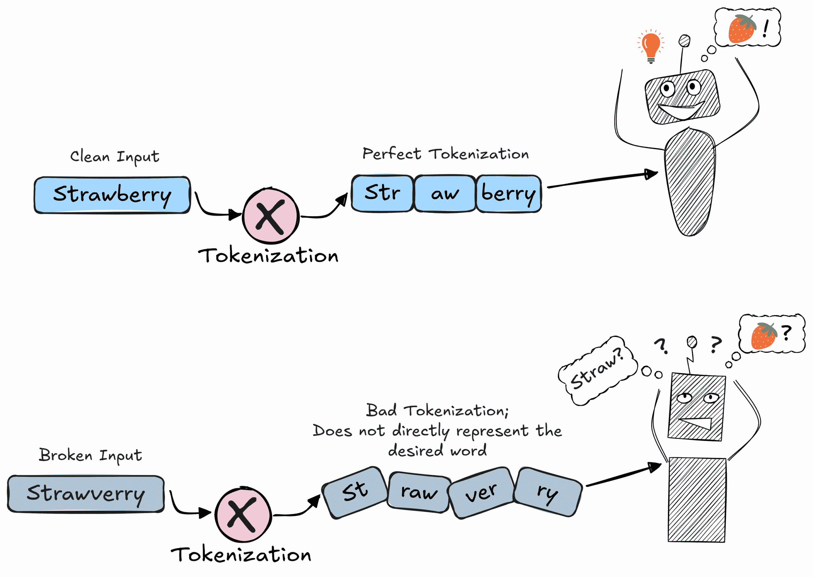

(来源：作者)

一个简单的拼写错误如何可能浪费 LLM 的“思考能力”来纠正它

* * *

## 2\. 哇！Byte Latent Transformer

如果分词是阻碍现代大型语言模型发展的脆弱基础，那么自然而然的问题是：为什么不完全消除它呢？这正是 Meta AI 研究人员采取的激进方向，他们提出了 Byte Latent Transformer (BLT) ([Pagnoni 等人 2024](https://arxiv.org/abs/2412.09871))¹。BLT 模型不是在单词、子词甚至字符上操作，而是从原始字节——数字文本的最基本表示——来建模语言。这使得大型语言模型能够从头开始学习语言，而无需分词器来侵蚀子词语义。

但直接建模字节远非易事。一个简单的字节级 Transformer 会因为输入长度比分词文本长几倍而无法处理——一百万个单词几乎变成了五百万个字节（平均每个单词 = 4.7 个字符，每个字符 = 1 个字节），这使得由于二次扩展而无法进行注意力计算。BLT 通过引入一个动态的两层系统来规避这个问题：易于预测的字节段被压缩成潜在的“块”，显著缩短了序列长度。然后，全容量模型被选择性地应用，将计算资源集中在语言复杂度要求的地方。

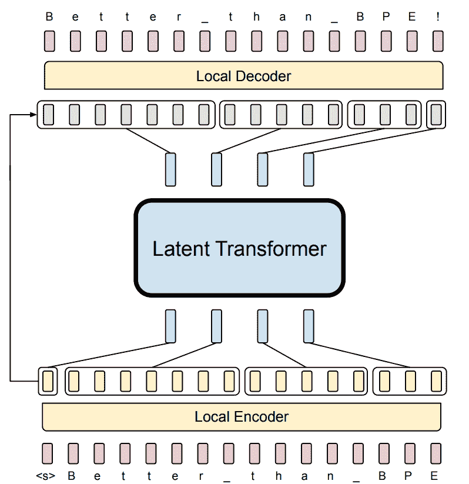

(来源：改编自 [Pagnoni 等人 2024](https://arxiv.org/abs/2412.09871)，图 2)

整个 Byte Latent Former 架构的缩略视图

### 2.1 它是如何工作的？

该模型可以从概念上分为三个主要组件，每个组件都有独特的职责：

### 2.1.1 本地编码器：

本地编码器的主要功能是将一个长序列的原始字节 **N[bytes]**（b = (b[1], b[2],…, b[N_bytes]））转换成一个更短的序列，即 **N[patches]** 的潜在块表示，p = (p[1], p[2],…, p[N_patches])。

#### 步骤 1：输入分割和初始字节嵌入

输入序列根据预定义的策略（如基于熵的分割）分割成块。这提供了块边界信息，但不会改变输入序列本身。这些块边界信息将在以后派上用场。

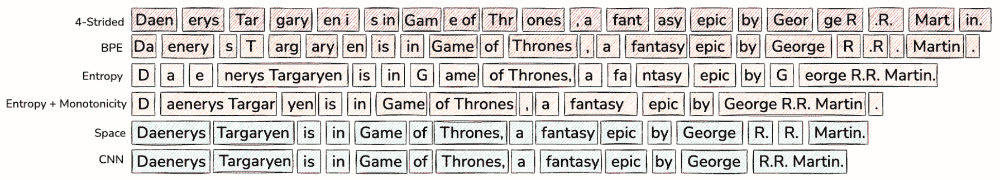

(来源：[Pagnoni 等人 2024](https://arxiv.org/abs/2412.09871)，图 3)

不同补丁策略的可视化

编码器内部的第一步操作是将每个离散的字节值（0-255）映射到一个连续的向量表示。这是通过一个可学习的嵌入矩阵 **E[byte]**（形状：*[256, h[e]]*）实现的，其中 ***h[e]*** 是局部模块的隐藏维度。

**输入**：形状为 *[B, N[bytes]]* 的字节 ID 张量，其中 **B** 是批大小。

**输出**：字节嵌入张量 **X**（形状：*[B, N[bytes], h[e]]*）。

#### 步骤 2：通过 n-gram 哈希进行上下文增强

为了丰富每个字表示的局部上下文，研究人员采用了一种基于哈希的 n-gram 嵌入技术。对于位置* **i***上的每个字 ***b[i]***，构建了一组前缀 n-gram，* **g[i,n] = {b[i-n+1],…, b[i]}***，其中 ***n*** **∈ *{3,…,8}***。

这些 n-gram 通过哈希函数映射到第二个独立的嵌入表中的索引， **E[hash]** (形状：*[V[hash], h[e]]*), 其中 *V[hash]* 是一个固定的大词汇量（即哈希桶的数量）。

结果 n-gram 嵌入与原始字嵌入相加以产生增强表示， ***e[i]***。此操作定义为：

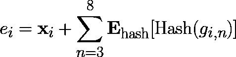

(来源：作者)

说明：在嵌入表中查找 n-gram 的哈希值并将其添加到相应的字嵌入中，对于所有 n ∈ [3,8]。

其中 ***x[i]*** 是字 ***b[i]*** 的初始嵌入。

张量 ***E = {e[1], e[2],…,e[N_bytes]}*** 的形状保持为 *[B, N[bytes], h[e]]*。

#### 步骤 3：使用 Transformer 和交叉注意力层的迭代细化

局部编码器的核心是由 ***l[e]*** 个相同的层堆叠而成。每个层执行一个两阶段过程来细化字表示并将它们蒸馏成补丁表示。

**步骤 3a：局部自注意力**：

输入通过一个标准的 Transformer 块进行处理。此块使用具有有限注意力窗口的因果自注意力机制，这意味着每个字表示仅通过关注固定数量的先前字表示来更新。这确保了计算效率，同时仍然允许进行上下文细化。

**输入**：如果是第一层，输入是经过上下文增强的字嵌入 ***E***；否则，它接收来自前一个局部自注意力层的输出。

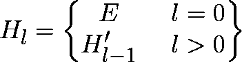

(来源：作者)

***H[l]***：当前自注意力层的输入

**E**：第二步的上下文增强字嵌入

**H^‘[l-1]**：前一个自注意力层的输出

**输出**：更具有上下文意识的字表示，**H^‘[l]** (形状：

*[B, N[bytes], h[e]]*)

**步骤 3b：多头交叉注意力**：

交叉注意力的目的是从字表示中提取精细的、上下文信息并将其注入到更抽象的补丁表示中，使它们对其构成子词结构有丰富的认识。这是通过补丁“查询”它们所包含的字来实现交叉注意力机制的。

**查询 (Q)**：使用简单的线性层将补丁嵌入投影以形成查询。

对于任何后续层 (*l>*0)，补丁嵌入仅仅是前一层交叉注意力块输出的精细化的补丁表示， ***P[(l−1)]***。

然而，对于第一层（*l*=0），这些补丁嵌入必须从头开始创建。这个初始化是一个三步过程：

1.  **收集：**使用在**步骤 1**中获得的补丁边界信息，模型从 H[0]收集属于每个补丁的字节表示。对于单个补丁，这会导致一个形状为* (N[bytes_per_patch], h[e]*)*的张量。在将每个补丁表示填充到相同长度后，如果有***J***个补丁，整个连接张量的形状变为：

    *(B, J, N[bytes_per_patch], h[e]*)*.

1.  **池化：**为了汇总每个补丁的向量，在*N[bytes_per_patch]*维度上应用池化操作（例如，最大池化）。这有效地汇总了补丁中最显著的字节级特征。

    +   输入形状： *(B, J, N[bytes_per_patch], h[e]*)*

    +   输出形状： *(B, J, h[e]*)*

1.  **投影：**这个汇总的补丁向量，仍然在小局部维度*h[e]*，然后通过一个专门的线性层传递到全局维度，h[g]，其中 h[e] <<< h[g]。这个投影就是连接局部和全局模块的桥梁。

    +   输入形状：*(B, J, h[e]*)*

    +   输出形状：*(B, J, h[g]*)*

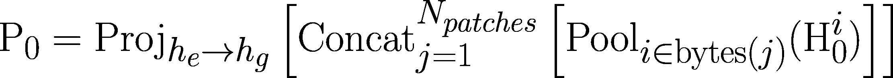

（来源：作者）

获取第一层补丁嵌入的 3 步过程总结：

1. 收集和汇总每个补丁的字节。

2. 将补丁连接成一个单一的张量。

3. 将补丁嵌入张量投影到全局维度。

补丁表示，无论是从上一个交叉注意力块的输出获得还是从头开始初始化，然后被输入到一个线性投影层以形成查询。

+   输入形状：*(B, J, h[g]*)*

+   输出形状：*(B, J, d[a]*)，其中*d[a]*是“注意力维度”。

**键和值：**这些是从**步骤 3a**的字节表示*H[l]*中派生出来的。它们通过独立的线性层从维度*h[e]*投影到一个中间注意力维度*d[a]*：

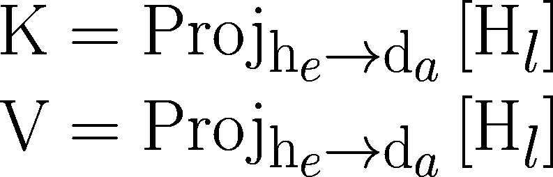

（来源：作者）

将第 3a 步的自注意力输出投影到键和值。

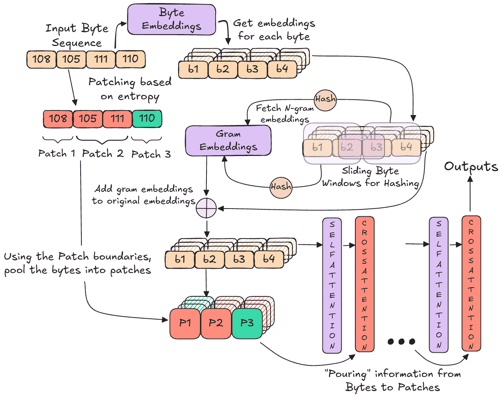

（来源：作者）

局部编码器中信息流的概述

### 2.1.2 潜在全局变换器

由局部编码器生成的补丁表示序列传递到**潜在全局变换器**。该模块作为 BLT 模型的主要推理引擎。它是一个标准的、高容量的自回归变换器，由*l[g]*个自注意力层组成，其中*l[g]*远大于局部模块中的层数。

在补丁向量（形状：*[B, J, h[g]]*）上操作，这个 Transformer 在所有补丁上执行全自注意力，使其能够有效地建模复杂的长距离依赖关系。它的唯一功能是根据所有前面的补丁预测下一个补丁的表示 *o[j]*（形状：*[B, 1, h[g]]*），在序列中。输出是一系列预测的补丁向量 *O[j]*（形状：*[B, J, h[g]]*），这些向量编码了模型的高级预测。

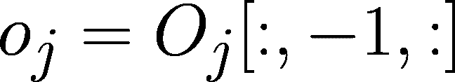

（来源：作者）

***o[j]*** 是包含下一个预测信息的补丁。

### 2.1.3 局部解码器

最终的架构组件是 *局部解码器*，这是一个轻量级的 Transformer，它将预测的补丁向量 *o[j]*，全局模型输出的最后一个标记 *O[j]*，解码回一系列原始字节。它以自回归的方式操作，一次生成一个字节。

设计为编码器逆过程的生成过程，从编码器输出的最后一个字节隐藏状态 *H[l]* 开始。然后，对于解码器生成的每个后续字节 (*d’[k]*)，以典型的自回归方式，它使用预测字节的隐藏状态作为输入来引导生成。

**交叉注意力**：编码器输出的最后一个字节状态 *H[l]*[:,-1,:]（作为查询，形状：*[B, 1, h[e]]*）关注目标补丁向量 o[j]（作为键和值）。这一步将补丁概念的高级语义指令注入到字节流中。

查询向量被投影到一个注意力维度，*d[a]*，而补丁向量被投影以创建键和值。这种对齐确保生成的字节在全局预测的上下文中是相关的。

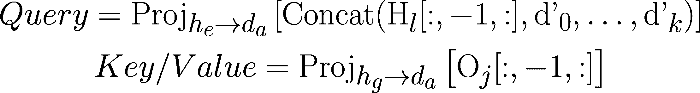

（来源：作者）

包含查询、键和值的一般方程。

***d’[k]***：解码器中 k+1^(th) 预测字节的隐藏状态。

**局部自注意力**：然后，通过因果自注意力机制处理生成的补丁感知字节表示。这允许模型考虑当前补丁中已生成的字节序列，强制执行局部顺序一致性和正确的字符顺序。

在通过所有 ***l[d]*** 层后，每层都包括上述两个阶段，序列中最后一个字节的隐藏状态通过一个最终的线性层投影到一个 256 维的 logit 向量。softmax 函数将这些 logits 转换为字节词汇表上的概率分布，从其中采样下一个字节。然后，这个新字节被嵌入并附加到输入序列中，以便进行后续的生成步骤，直到补丁完全解码。

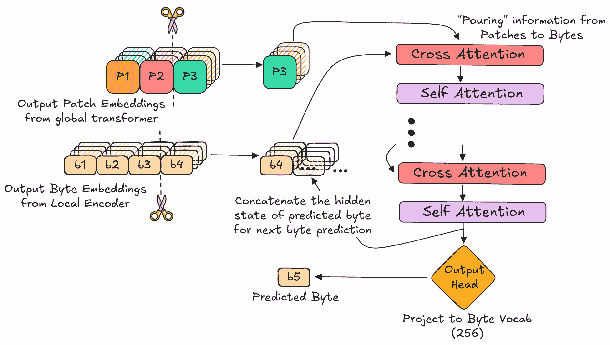

（来源：作者）

局部解码器信息流概述

***

## 3. 结论：字节比标记更好！

字节潜在变换器（Byte Latent Transformer）可能真正是规模上常规的基于标记的 Transformer 的替代品。以下是支持这一论点的几个令人信服的理由：

**1. 字节级模型可以与基于标记的模型相匹配。**

本工作的主要贡献之一是，字节级模型，首次，能够匹配最先进的基于标记的架构（如 LLaMA 3）的扩展行为[(Grattafiori 等人 2024)²](https://arxiv.org/abs/2407.21783)。当在计算最优的条件下进行训练时，字节潜在变换器（BLT）表现出与使用字节对编码（BPE）的模型相当的性能扩展趋势。这一发现挑战了长期存在的假设，即字节级处理本质上是不高效的，反而表明，通过正确的架构设计，无标记器模型也有机会。

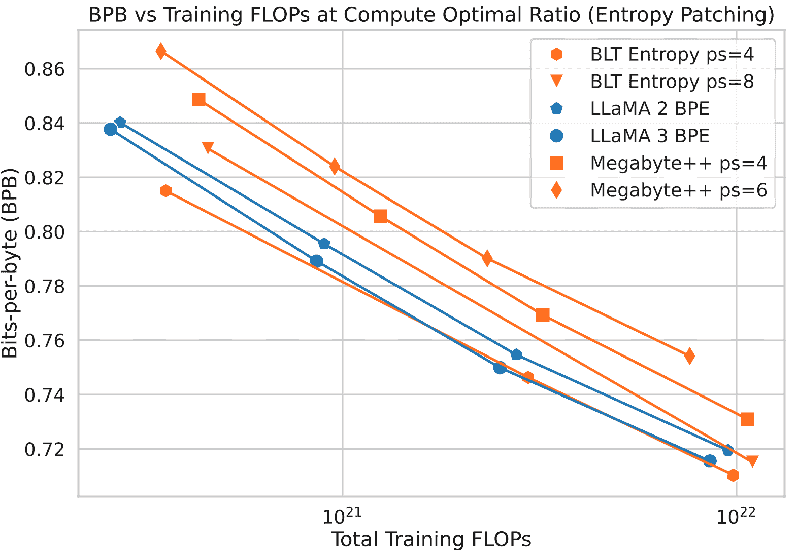

（来源：改编自[Pagnoni 等人 2024](https://arxiv.org/abs/2412.09871)，图 6）

BLT 在展示具有竞争力的 BPB（字节模型的困惑度等效）和与基于标记的 LLaMA 模型相似的扩展规律

**2. 新的扩展维度：以模型大小换取补丁大小。**

BLT 架构以基于标记的模型无法实现的方式将模型大小与序列长度解耦。通过动态地将字节分组到补丁中，BLT 可以使用更长的平均补丁来节省计算。这些节省的计算可以重新分配以增加主要潜在全局变换器的大小和容量，同时保持总推理成本（FLOPs）不变。论文表明，这种新的权衡非常有益：在固定推理预算下，操作于较长补丁的大模型始终优于操作于较短标记/补丁的小模型。

这意味着你可以拥有更大、更强大的模型——而无需额外的计算成本！

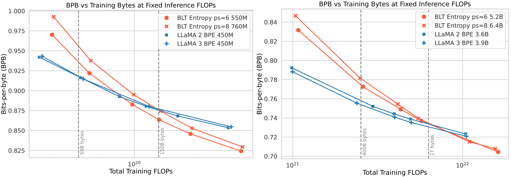

（来源：改编自[Pagnoni 等人 2024](https://arxiv.org/abs/2412.09871)，图 1）

较大 BLT 模型的更陡峭的扩展曲线使它们在交叉点之后超越了基于标记的 Llama 模型的性能。

**3. 通过字节级建模实现子词意识**

通过直接处理原始字节，BLT 避免了由分词引入的信息损失，从而能够访问单词的内部结构——它们的拼写、形态学和字符级组成。这导致对子词模式的高度敏感性，这在多个基准测试中得到了模型的展示。

在**CUTE**（字符级理解和文本评估）[(Edman 等人，2024)³](https://arxiv.org/abs/2409.15452)上，BLT 在涉及细粒度编辑的任务上表现出色，如字符交换或替换，在拼写任务上几乎达到完美准确率，而像 LLaMA 3 这样的模型则完全失败。

类似地，在添加了拼写错误和大小写变化的噪声 **HellaSwag** [(Zellers et al, 2019)⁴](https://arxiv.org/abs/1905.07830) 上，BLT 在保留推理能力方面比基于标记的模型更有效得多。这些结果表明 BLT 的固有鲁棒性，即使数据量显著增加，基于标记的模型也无法获得。

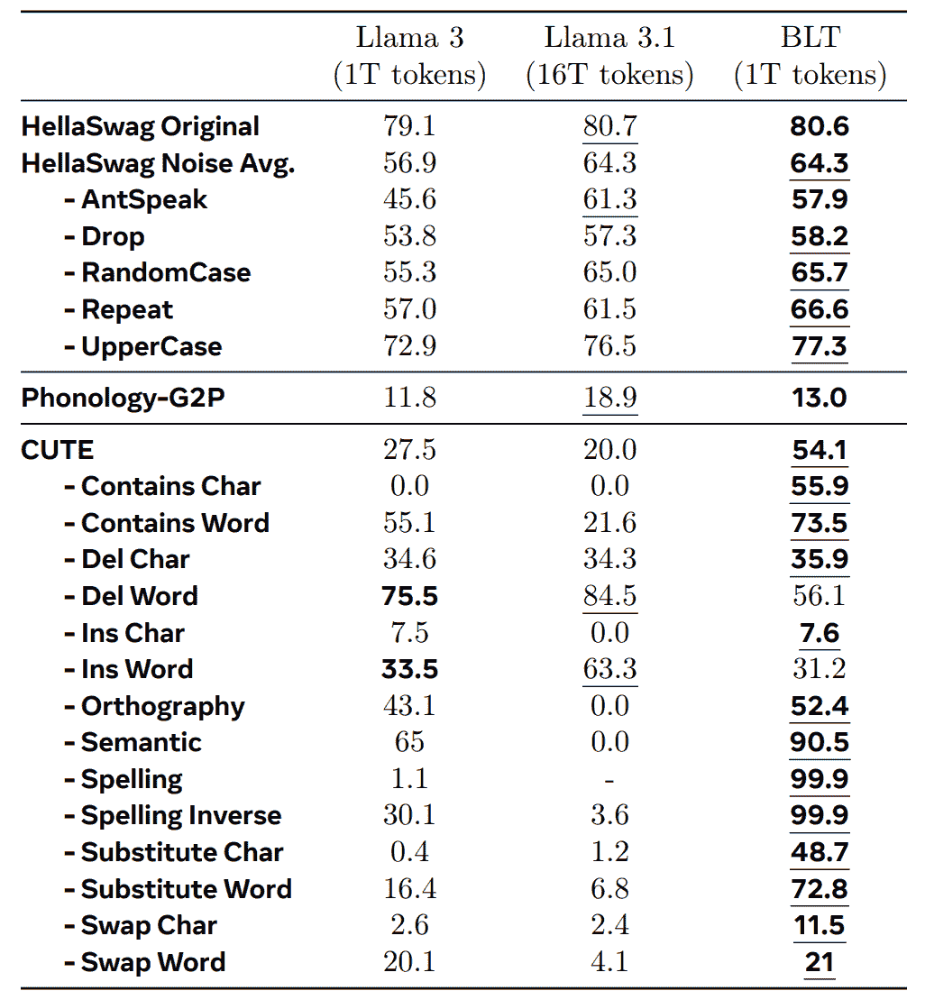

(来源：[Pagnoni et al. 2024](https://arxiv.org/abs/2412.09871)，表 3)

模型的直接字节级处理导致在字符操作 **(CUTE)** 和噪声鲁棒性 **(HellaSwag Noise Avg.)** 方面取得了巨大进步，这些任务对基于标记的架构构成了挑战。

**4. BLT 在低资源语言上表现出更强的性能。**

固定标记器，通常在大多数英语或高资源语言数据上训练，对于低资源语言可能效率低下且不公平，通常将单词分解成单个字节（称为“字节回退”现象）。由于 BLT 本质上是基于字节的，它从一开始就平等地对待所有语言。结果显示，这导致机器翻译性能得到改善，尤其是在标准 BPE 词汇表中表现不佳的脚本和形态学语言中。

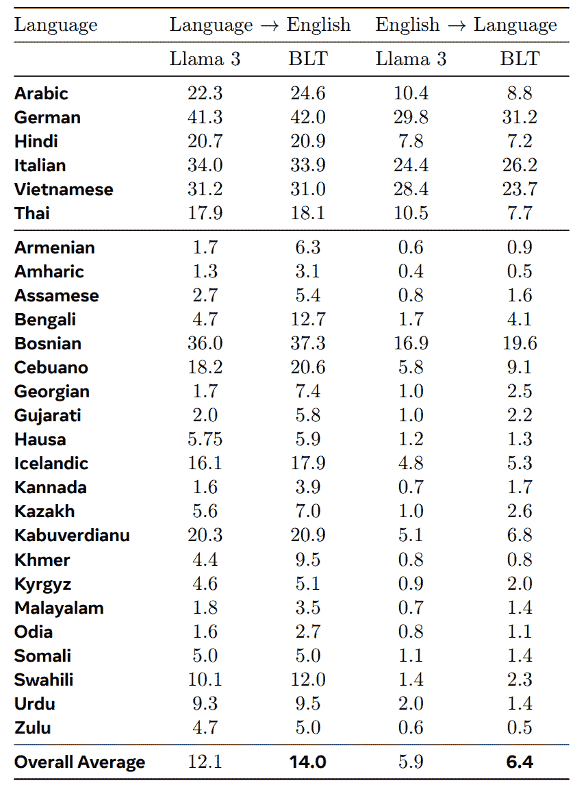

(来源：[Pagnoni et al. 2024](https://arxiv.org/abs/2412.09871)，表 4)

在 FLORES-101 基准测试上的机器翻译性能 [(Goyal et al., 2022)⁵](https://direct.mit.edu/tacl/article/doi/10.1162/tacl_a_00474/110993/The-Flores-101-Evaluation-Benchmark-for-Low)。在高资源语言上的性能相当，但在低资源语言上表现更优，优于 LLaMA 3 模型。

**5. 计算资源的动态分配：并非每个单词都值得同等对待**

BLT 架构的关键优势在于其根据输入复杂度动态分配计算的能力。与传统的模型不同，传统的模型对每个标记消耗固定数量的计算量——将简单单词如“the”和复杂单词如“antidisestablishmentarianism”视为同等成本——BLT 将其计算努力与其学习补丁的结构相关联。高容量的全局 Transformer 只适用于补丁，这使得 BLT 能够在可预测的低复杂度序列上形成更长的补丁，在需要更深层推理的区域形成更短的补丁。这使得模型能够将其最强大的组件集中在最需要的地方，同时将常规的字节级解码卸载到更轻的本地解码器，从而实现资源分配的更高效和适应性。

* * *

## 4. 总结与结论

对于我来说，BLT（字节语言技术）之所以令人兴奋，不仅仅是因为基准测试或新颖之处，更在于一个模型能够超越我们称之为“语言”的表面包装——英语、日语，甚至是 Python ——并直接从所有通信的基本基础——原始字节——中学习。我喜欢这一点。一个不依赖于固定词汇，而是从底层学习结构的模型？这感觉像是朝着更普遍的方向迈出的真正一步。

当然，这样不同寻常的事物不可能一夜之间被广泛接受。分词器已经融入了方方面面——我们的模型、我们的工具、我们的直觉。摒弃它们意味着重新思考整个 AI 生态系统的根本基础。但这里的优势是难以忽视的。也许，我们不会看到完整的架构，而是会看到其中的一些特性被整合到我们未来看到的新的系统中。

* * *

## 5. 参考文献

[1] Pagnoni, Artidoro, 等人. [“Byte latent transformer: Patches scale better than tokens.”](https://arxiv.org/abs/2412.09871) *arXiv 预印本 arXiv:2412.09871* (2024).

[2] Grattafiori, Aaron, 等人. [“The llama 3 herd of models.”](https://arxiv.org/abs/2407.21783) *arXiv 预印本 arXiv:2407.21783* (2024).

[3] Edman, Lukas, Helmut Schmid, 和 Alexander Fraser. [“CUTE: Measuring LLMs’ Understanding of Their Tokens.”](https://arxiv.org/abs/2409.15452) *arXiv 预印本 arXiv:2409.15452* (2024).

[4] Zellers, Rowan, 等人. [“Hellaswag: Can a machine really finish your sentence?.”](https://arxiv.org/abs/1905.07830) *arXiv 预印本 arXiv:1905.07830* (2019).

[5] Goyal, Naman, 等人. [“The flores-101 evaluation benchmark for low-resource and multilingual machine translation.”](https://direct.mit.edu/tacl/article/doi/10.1162/tacl_a_00474/110993/The-Flores-101-Evaluation-Benchmark-for-Low) *计算语言学协会学报* 10 (2022): 522-538.
