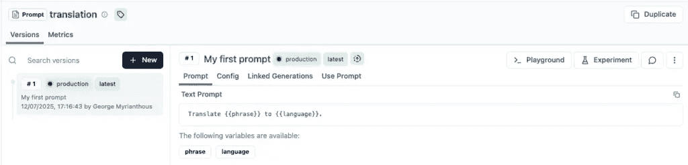
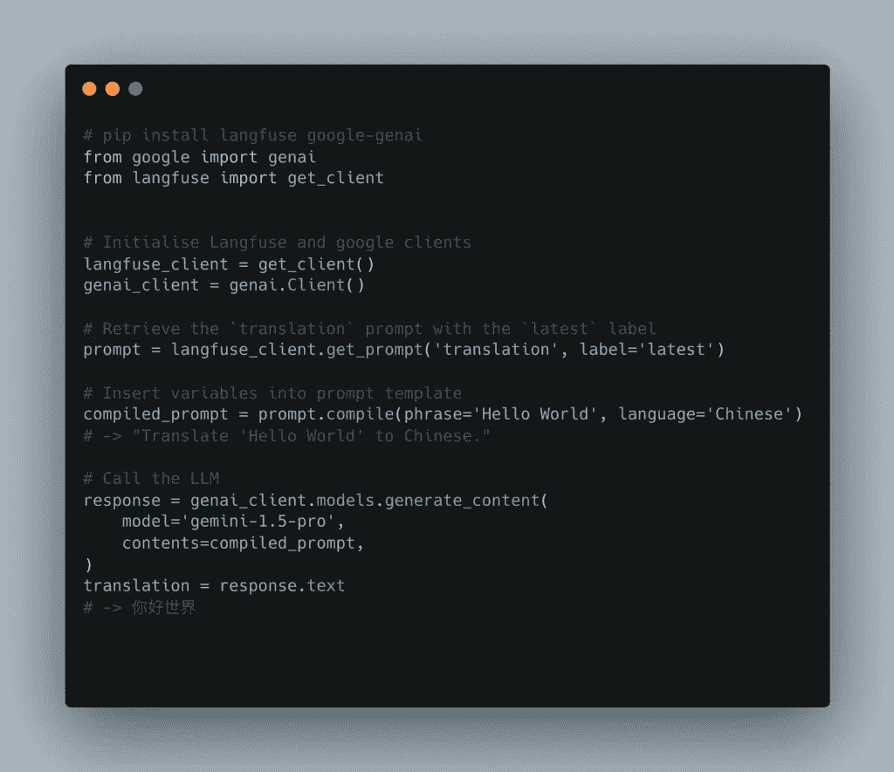

# 为什么你的提示不属于 Git

> 原文：[`towardsdatascience.com/why-your-prompts-dont-belong-in-git/`](https://towardsdatascience.com/why-your-prompts-dont-belong-in-git/)

<mdspan datatext="el1756156485455" class="mdspan-comment">这是我一段时间后的第一次发帖，我想从一些早期就触动我的事情开始讲起。

当我构建和发布我的第一个**生成式 AI**产品时，我做了我们大多数人都会做的事情。我硬编码了提示。它一直有效，直到它不再有效。每次我想调整语气、改进措辞或修复幻觉时，就意味着要推送代码并重新部署服务。

这使得快速迭代几乎不可能，并且让产品人员完全脱离了循环。最终我意识到，提示应该像内容一样被对待，而不是代码。

* * *

## 提示存在于代码中时会发生什么

起初它感觉就像你后端中的另一个字符串。但提示不是静态配置。它们是行为，而行为需要空间来发展。

当你的提示与代码一起发布时，每一个小的改变都变成了一个过程。你需要创建一个分支。

提交一个 commit。打开一个 pull request。等待 CI 管道运行。合并。然后重新部署。所有这些摩擦可能只是为了改变你的助手与用户交流时的一句话。

你失去了快速迭代的能力。你阻止了产品人员或非工程师的贡献。最糟糕的是，你的提示最终继承了你的后端部署过程的所有摩擦。

它也几乎不可能理解发生了什么变化以及原因。Git 可能会显示差异，但不会显示结果。

+   ***这改变减少了幻觉吗？***

+   ***这使完成变得更短了吗？***

+   ***用户更满意吗？***

没有跟踪和实验，你只是在猜测。你不会在源代码或营销文案中硬编码客户支持回复。提示应享有相同的灵活性。

* * *

## 提示管理实际上是什么样的

提示管理不是某种新潮的实践。

这只是应用我们已经在产品的其他动态部分使用的相同原则，比如 CMS 内容、功能标志或翻译。

一个好的提示管理设置给你一个地方，你的提示可以在那里生活、发展，并且随着时间的推移进行跟踪。

这并不需要复杂。你只需要一个简单的方法来存储、版本控制和更新提示，而不需要触及你的应用程序代码。

一旦你将提示与代码解耦，一切都会变得简单。你可以更新提示而不需要重新部署。如果出现问题，你可以回滚到之前的版本。

你可以让非工程师安全地做出更改，并且你可以开始将提示版本与结果连接起来，这样你实际上可以学习到哪些是有效的，哪些是不行的。

一些工具提供了内置的版本控制和提示分析。其他工具可以集成到你的现有堆栈中。重要的是*不是*你使用什么工具，而是你停止将提示视为代码中埋藏的静态字符串。

* * *

## 使用 Langfuse 进行提示管理

我使用并推荐的一个工具是[***Langfuse***](https://www.langfuse.com/)。它是开源的，对开发者友好，旨在支持在生产环境中使用 LLM 应用程序的团队。

提示管理只是它帮助解决的事情之一。LangFuse 还让你能够全面了解应用程序的跟踪、延迟和成本。

但对我来说，管理并迭代提示的方法是一个转折点。

Langfuse 为你提供了一个干净的界面，你可以在代码库之外创建和更新提示。

你可以对其进行版本控制，跟踪随时间的变化，并在出现问题的情况下回滚。

你还可以对同一提示的不同版本进行 A/B 测试，并查看每个版本在生产中的表现，而你无需重新部署你的应用程序。

> *这不是一个赞助提及。这只是基于我在自己的项目中取得良好效果的个人推荐。*

它还使非工程师更容易做出贡献。

Langfuse 控制台让产品团队或作家可以安全地调整提示，而无需接触代码库或等待发布。它非常适合现代生成 AI 堆栈。

你可以使用它与***LangChain***、***LlamaIndex***或你自己的自定义设置，由于它是开源的，如果你想完全控制，你可以自行托管。

* * *

## 快速了解其工作原理

为了让你有个感觉，这里有一个 Lang-fuse 在实际中如何进行提示管理的基本示例。

我们可以通过用户界面简单地创建一个新的带有变量的提示，**（你还可以通过编程方式创建或更新提示**[***https://langfuse.com/docs/prompts/get-started#message-placeholders***]）。*

注意分配给特定提示版本的`production`和`latest`标签。你可以使用标签来检索提示的具体版本。

这使得在预发布或开发环境中测试新的提示版本以及进行 A/B 测试变得超级简单。

我们现在可以拉取提示的最新版本，并使用 Google 的 GenAI SDK 在简单的生成管道中使用它。

* * *

## 我今天会做不同的事情

如果我再次开始，我绝不会将提示硬编码到我的应用程序中。这会减慢你的速度，隐藏那些可能帮助的人，并将每一个微小的变化变成一个发布。

在第一次迭代瓶颈出现之前，提示管理听起来像是一个锦上添花的功能。

然后，这一点就变得明显了。尽早解耦你的提示。你会更快地移动，构建得更好，并让你的团队保持同步。
