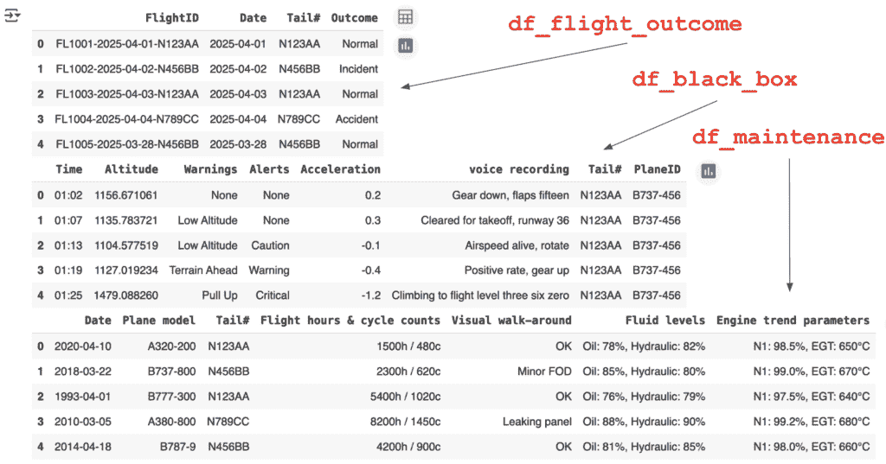
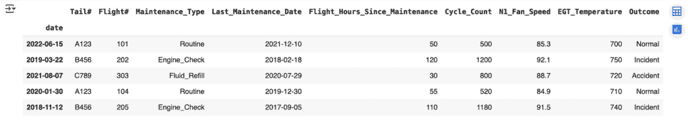
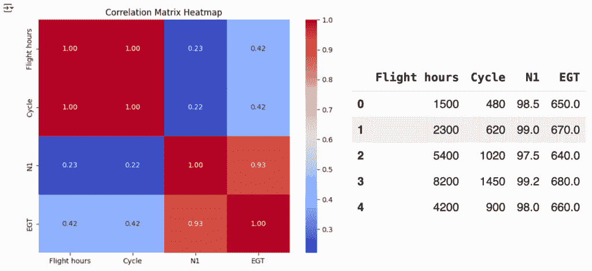

# 你能发现泄露吗？一个数据科学挑战

> 原文：[`towardsdatascience.com/will-you-spot-the-leaks-a-data-science-challenge/`](https://towardsdatascience.com/will-you-spot-the-leaks-a-data-science-challenge/)

## 不是另一个解释

你可能听说过数据泄露，你可能对这两种类型都很熟悉：**目标变量**和**训练-测试集分割**。但你能否发现我错误逻辑中的漏洞，或者我乐观代码中的疏忽？让我们来看看。

我看过很多关于数据泄露的文章，我认为它们都很有洞察力。然而，我注意到它们往往侧重于理论方面。我发现它们在针对导致过度乐观模型的代码行或精确决策的示例方面有些不足。

我在这篇文章中的目标不是理论上的；而是真正地测试你的数据科学技能。看看你是否能发现我做出的所有可能导致真实世界示例中数据泄露的决定。

> *解决方案在最后*

## 可选的回顾

### 1. 目标（标签）泄露

**当特征包含关于你试图预测的信息时**。

+   **直接泄露：** 直接从目标计算的特征 → *示例：* 使用“逾期天数”来预测贷款违约 → *修复：* 删除特征。

+   **间接泄露：** 作为目标代理的特征 → *示例：* 使用“保险赔偿金额”来预测医院再入院 → *修复：* 删除特征。

+   **事件后聚合：** 使用预测点之后的数据 → *示例：* 对于 7 天流失模型，包括“前 30 天的总通话次数” → *修复：* 在线计算聚合

### 2. 训练-测试（分割）污染

**当测试集信息泄露到你的训练过程中**。

+   **数据分析泄露：** 在分割之前分析完整数据集 → *示例：* 检查整个数据集的相关性或协方差矩阵 → *修复：* 仅在训练数据上执行探索性分析

+   **预处理泄露：** 在分割数据之前拟合转换 → *示例：* 在整个数据集上计算协方差矩阵、缩放、归一化 → *修复：* 首先分割，然后在训练数据上仅拟合预处理

+   **时间泄露：** 忽略时间依赖数据中的时间顺序 → *修复：* 在分割中保持时间顺序。

+   **重复泄露：** 训练集和测试集中有相同/相似的记录 → *修复：* 确保实体的变体完全保留在一个分割中

+   **交叉验证泄露：** CV 折叠之间的信息共享 → *修复：* 将所有转换保留在每个 CV 循环内部

+   **实体（标识符）泄露：** 当高基数 ID 同时出现在训练集和测试集中时，模型“学习”了 → *修复：* 删除列或查看 Q3

## 游戏开始

总共有 17 个点。游戏规则很简单。在每个部分的结尾选择你的答案，然后再继续前进。评分很简单。

+   +1 分识别出导致数据泄露的列。

+   +1 分识别出有问题的预处理。

+   +1 分。识别没有数据泄露发生的情况。

在旅途中，当你看到


这就是要告诉你上述部分有多少可用点。

### 列中的问题

假设我们受雇于十六进制航空公司，创建一个机器学习模型，以识别在旅行中最有可能发生事故的飞机。换句话说，这是一个带有目标变量**Outcome**在**df_flight_outcome**中的监督分类问题。



这是关于我们数据的了解：维护检查和报告是在任何出发前早上最早进行的。我们的黑盒数据为每架飞机和每趟航班持续记录。这监控了关键飞行数据，如高度、警告、警报和加速度。驾驶舱内的对话甚至被记录下来，以帮助在发生事故时的调查。每次飞行的最后都会生成一份报告，然后更新**df_flight_outcome**。

**问题 1**：基于这些信息，我们可以立即从考虑中移除哪些列？


* * *

### 一个方便的分类

现在，假设我们回顾我们从十六进制航空公司收到的原始.csv 文件，并意识到他们已经完成了将数据分成 2 个文件的工作**（no_accidents.csv 和 previous_accidents.csv）**。将有过事故历史的飞机与没有事故历史的飞机分开。相信这些数据是有用的，我们将其添加到数据框中作为一个分类列。

**问题 2**：是否发生了数据泄露？


* * *

### 需要在干草堆里找针

现在假设我们将数据按**日期**和**尾号**连接起来。为了得到结果**data_frame**，我们将使用它来训练我们的模型。总共有 12,345 条记录，超过 10 年的观测数据，558 个独特的尾号，以及 6 种维护检查类型。这些数据没有缺失项，并且已经使用 SQL 正确连接，因此没有时间泄露发生。



+   **尾号**是飞机的唯一标识符。

+   **航班号**是航班的唯一标识符。

+   **上次维护日**总是在过去。

+   **自上次维护以来的飞行小时数**是在起飞前计算的。

+   **循环计数**是完成起飞和降落的次数，用于跟踪机身应力。

+   **N1 风扇转速**是发动机前风扇的旋转速度，以最大 RPM 的百分比表示。

+   **EGT 温度**代表排气温度，用于测量发动机燃烧热输出。

**问题 3**：这些特征中的任何一个可能是数据泄露的来源吗？

**问题 4**：是否有缺失的预处理步骤可能导致数据泄露？


> **提示** — 如果有缺失的预处理步骤或问题列，我 **不会** 在下一节中修复它们，即错误会延续下去。

* * *

### 分析和管道

现在我们将分析的重点放在 **df_maintenance** 中的数值列上。我们的数据显示（Cycle、飞行小时数）与（N1、EGT）之间存在高度的相关性，因此我们记录下来使用主成分分析（PCA）来降低维度。

我们将数据分为训练集和测试集，对分类数据使用 **OneHotEncoder**，应用 **StandardScaler**，然后使用 **PCA** 来降低数据的维度。



```py
# Errors are carried through from the above section

import pandas as pd
from sklearn.pipeline import Pipeline
from sklearn.preprocessing import StandardScaler, OneHotEncoder
from sklearn.decomposition import PCA
from sklearn.compose import ColumnTransformer

n = 10_234

# Train-Test Split
X_train, y_train = df.iloc[:n].drop(columns=['Outcome']), df.iloc[:n]['Outcome']
X_test, y_test = df.iloc[n:].drop(columns=['Outcome']), df.iloc[n:]['Outcome']

# Define preprocessing steps
preprocessor = ColumnTransformer([
    ('cat', OneHotEncoder(handle_unknown='ignore'), ['Maintenance_Type', 'Tail#']),
    ('num', StandardScaler(), ['Flight_Hours_Since_Maintenance', 'Cycle_Count', 'N1_Fan_Speed', 'EGT_Temperature'])
])

# Full pipeline with PCA
pipeline = Pipeline([
    ('preprocessor', preprocessor),
    ('pca', PCA(n_components=3))
])

# Fit and transform data
X_train_transformed = pipeline.fit_transform(X_train)
X_test_transformed = pipeline.transform(X_test)
```

**问题 5**：是否发生了数据泄露？


* * *

## 解决方案

**答案 1**：从 **df_flight_outcome** 中删除所有 4 列，从 **df_black_box** 中删除所有 8 列，因为这些信息仅在飞机着陆后可用，而在起飞时（预测时）不可用。包含这些飞行后的数据将导致 *时间泄露*。（12 分）

> 简单地将数据插入模型是不够的，我们需要知道这些数据是如何生成的。

**答案 2**：将文件名作为列添加是一个数据泄露的来源，因为我们实际上可能通过添加一个告诉我们飞机是否发生事故的列来给出答案。（1 分）

> 作为一项经验法则，你应该始终对包括文件名或文件路径持极其批判的态度。

**答案 3**：尽管所有列出的字段在起飞前都可用，但高基数标识符 **(Tail#、Flight#**) 导致了 *实体（ID）泄露*。模型只是简单地记住“飞机 X 从不坠毁”，而不是学习真正的维护信号。为了防止这种泄露，你应该完全删除这些 ID 列，或者使用组感知拆分，以确保没有单个飞机同时出现在训练集和测试集中。（2 分）

**Q3 和 Q4 的修正代码**

```py
df['Date'] = pd.to_datetime(df['Date'])
df = df.drop(columns='Flight#')

df = df.sort_values('Date').reset_index(drop=True)

# Group-aware split so no Tail# appears in both train and test
groups = df['Tail#']
gss = GroupShuffleSplit(n_splits=1, test_size=0.25, random_state=42)

train_idx, test_idx = next(gss.split(df, groups=groups))

train_df = df.iloc[train_idx].reset_index(drop=True)
test_df = df.iloc[test_idx].reset_index(drop=True)
```

**答案 4**：如果我们仔细观察，我们会发现日期列没有按顺序排列，我们没有按时间顺序排序数据。如果你在拆分之前随机打乱时间顺序的记录，那么“未来的”航班最终会出现在你的训练集中，让模型学习到它在实际预测时不会有的模式。这种信息泄露会夸大你的性能指标，并无法模拟现实世界的预测。（1 分）

**答案 5**：由于我们查看了 **df_maintenance** 的协方差矩阵，其中包括了训练数据和测试数据，因此发生了数据泄露。（1 分）

> 总是在训练数据上进行分析。假装测试数据不存在，将其完全放在玻璃后面，直到测试模型的时候。

* * *

## 结论

核心原则听起来很简单——永远不要使用预测时不可用的信息——然而，其应用却证明非常难以捉摸。最危险的数据泄露在部署前未被察觉，将有潜力的模型变成了代价高昂的失败。真正的预防不仅需要技术保障，还需要对实验完整性的承诺。通过以严格的怀疑态度来处理模型开发，我们将数据泄露从一种无形的威胁转变为一种可管理的挑战。

> *关键要点：要发现数据泄露，仅仅有理论上的理解是不够的；必须批判性地评估代码和处理决策，实践，并对每个决策进行批判性思考。*

所有图片除非另有说明，均为作者所有。

* * *

我的下一篇文章：

Tallarico, M. H. (2025, June 2). 语法作为可注射物：作为 NLP 的特洛伊木马：机器如何理解句子结构：组合范畴语法。走向数据科学。[链接](https://towardsdatascience.com/grammar-as-a-trojan-horse-to-nlp-and-computer-science/)。[谷歌学术](https://scholar.google.com/citations?view_op=view_citation&hl=en&user=uCZbo_kAAAAJ&citation_for_view=uCZbo_kAAAAJ:zYLM7Y9cAGgC).

我的前一篇文章：

Tallarico, M. H. (2025, May 2). 从点到 L∞：AI 如何使用距离：人工智能和损失项。走向数据科学。[链接](https://towardsdatascience.com/from-a-point-to-l%e2%88%9e/). [谷歌学术](https://scholar.google.com/citations?view_op=view_citation&hl=en&user=uCZbo_kAAAAJ&citation_for_view=uCZbo_kAAAAJ:qjMakFHDy7sC).

* * *

[网站](https://marcoheningtallarico.com/) | [领英](https://www.linkedin.com/in/marco-hening-tallarico/) | [GitHub](https://github.com/marco-hening-tallarico?tab=repositories)


作者
