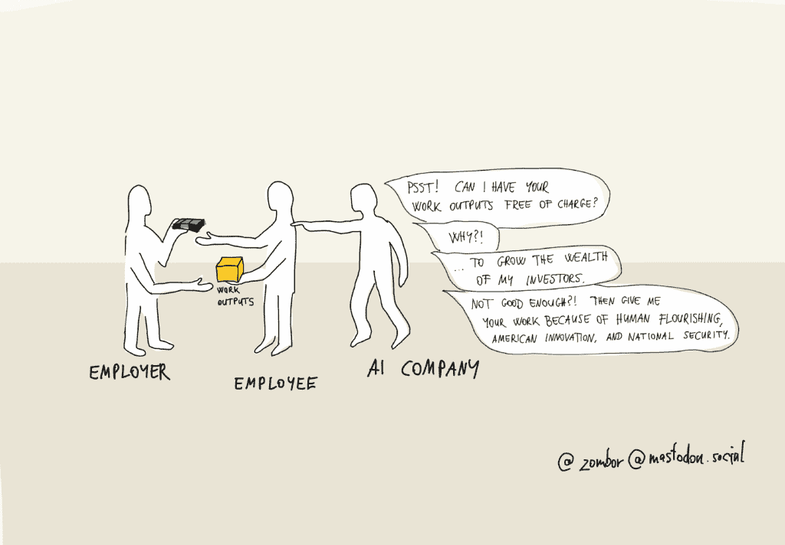
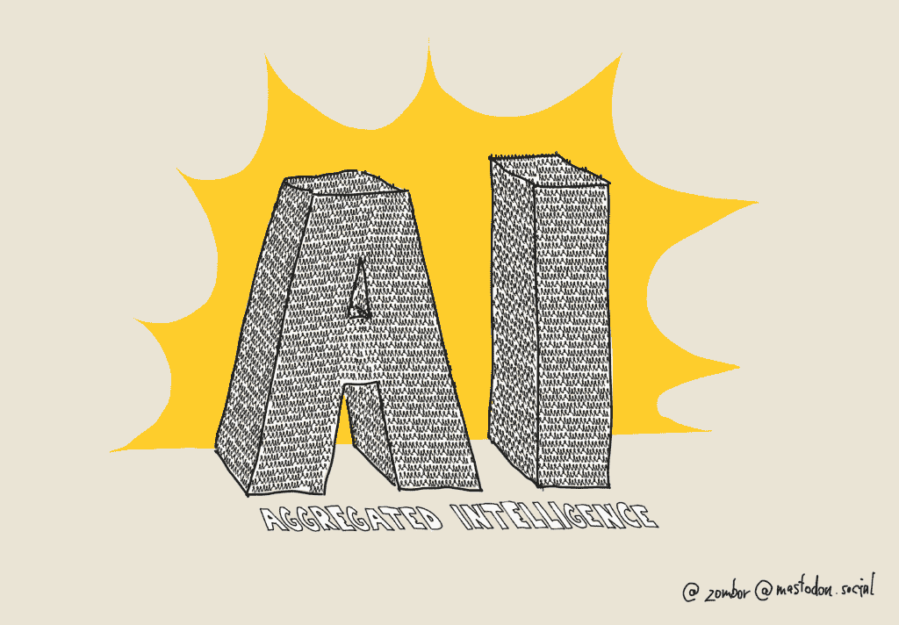

# 工作数据是生成式 AI 的下一个前沿

> 原文：[`towardsdatascience.com/work-data-is-the-next-frontier-for-genai/`](https://towardsdatascience.com/work-data-is-the-next-frontier-for-genai/)

*<mdspan datatext="el1752081619822" class="mdspan-comment">工作数据</mdspan>，知识工作者的工作产出，是 LLM 训练中最有价值的数据来源，独特地能够推动 LLM 性能达到前所未有的高度。在这篇文章中，我将提出支持这一论断的九个论据。然后，我将反思工作数据所有者与想要使用这些数据进行训练的 AI 公司之间的当前利益冲突。然后，我将讨论可能的解决方案和双赢的局面。>

虽然公开可访问的训练数据预计将耗尽[`www.educatingsilicon.com/2024/05/09/how-much-llm-training-data-is-there-in-the-limit/`](https://www.educatingsilicon.com/2024/05/09/how-much-llm-training-data-is-there-in-the-limit/)，但仍有大量未被开发的私有数据。在私有数据中，最大的最佳机会——我认为——是工作数据：知识工作者的工作产出，从开发者的代码，到支持代理人的对话，再到销售人员的提案演示。

许多这些见解都源自 Dara B Roy 的《知识工作者关于生成式 AI 的清醒谈话要点》*，该文广泛讨论了在工作数据在 LLM 训练中的应用以及其对知识工作者劳动力市场的影响。

那么，为什么工作数据对 LLM 训练如此有价值？有 9 个原因。

## 工作数据是人类历史上质量最好的数据

工作数据显然比我们的公共互联网内容质量要好得多。

事实上，如果我们看看用于预训练的公开互联网内容：最佳质量来源（你会在训练中对其进行上采样）是那些人的工作产出：纽约时报的文章，专业作者的书籍。

为什么工作数据的质量比非工作互联网内容要好得多？

+   **更真实、更可信**。我们在工作中所说和所生产的内容既更真实、更可信。毕竟，作为员工，我们对此负责，我们的生计也依赖于它。

+   **由经过审查的专业人士生产**：公共互联网内容是由自称为专家的人生产的。然而，工作数据是由在多轮工作面试、测试和背景审查中从大量人才中精心挑选的专业人士生产的。想象一下，如果互联网内容也是如此：你只能在 Reddit 上发帖，前提是一个专业评审团首先评估了你的资历和技能。

+   **反映经过审查的知识**：工作产出反映了经过实战检验的想法和行业最佳实践，这些想法在现实商业条件下证明了其价值。相比之下，互联网内容通常只旨在吸引读者的注意，包含听起来聪明但最终未经检验的想法。

+   **更紧密地反映人类偏好**：我们在工作产品中表达自己的方式更加流畅、更加深思熟虑、更加得体。我们只是额外努力去遵循我们文化的规范（即人类偏好）。如果预训练完全基于工作数据，我们可能根本不需要 RLHF（Reinforcement Learning from Human Feedback）和对齐训练，因为所有这些都渗透到了训练数据中。

+   **反映更复杂的模式，揭示更深层次的联系**：公共互联网内容通常只是触及任何话题的表面。毕竟，它是面向公众的。在公司的专业讨论中，讨论的深度要大得多，揭示了概念之间更深层次的联系。这是一种更好的思维质量，更好的推理，对事实和可能性的更全面考虑。如果当前的基础模型能够在糟糕的公共互联网数据上变得如此之好，那么想象一下，它们从包含更多复杂性、细微差别、意义和模式的工作数据中能学到什么。

更重要的是，工作数据通常按质量进行标注。在某些情况下，有关于工作是由初级还是高级人员产生的数据。在某些情况下，工作成果按绩效指标进行标注，因此可以清楚地知道哪个样本在训练目的上更有价值。例如，你可能拥有关于哪些营销内容导致了更多的转化；你可能拥有关于哪些客服人员的响应产生了更高的客户满意度评分。

总体而言，我认为，工作数据可能是人类有史以来产生的最佳质量数据，因为激励是统一的。工人实际上会因为他们的工作成果的表现而得到奖励。

换句话说：

> 在公开互联网上，高质量内容是例外。在工作世界中，高质量内容是规则。

有关于 YOLO（You Only Live Once）训练的传奇故事，当大型模型在天文数字的预算上训练时，你希望训练样本足够好，以免误导你的模型并耗尽预算。也许，在工怍数据上训练将结束 YOLO 训练的时代，使 AI 训练对资金较少的公司来说更加可预测和财务可行。

## 工作数据体现了最宝贵的人类知识

大型语言模型（LLMs）可以通过阅读《纽约时报》或练习数学测试来提取有价值的技能。像《纽约时报》专栏作家一样写作是一项很好的技能；通过 AP 微积分考试是一次伟大的成就。

但真正的商业价值在于真实企业愿意为之付费的技能。显然，这些技能最好从包含它们的数據中提取：工作成果。

## 工作数据对于 AI 训练来说是易于获取的

如果你为一家帮助特定知识工作者完成任务的服务软件公司工作，那么自然地，他们的工作成果就存储在你的云存储中。

技术上，这些数据对于 AI 训练来说是易于获取的。但是，你是否拥有合法依据来将其用于此目的，则是另一个问题。

## 工作数据比公共互联网内容大得多

直观地讲，如果你考虑你的公共互联网足迹（例如你在网上发布或发布的内容量），它与你为工作产生的内容量相比相形见绌。至少对我来说，我可能为工作产生的文字是我公共互联网存在的 100 倍。

工作数据量巨大。需要注意的是，任何 SaaS 产品只能访问其工作数据的一部分。这可能对于微调来说已经足够，但对于预训练通用模型来说可能就不够了。

自然地，既得利益者具有优势：你拥有的用户越多，你可供使用的数据就越多。

一些公司特别适合利用工作数据：微软、谷歌以及一些其他通用工作软件提供商（邮件、文档、表格、消息等）能够访问大量的工作数据。

## 工作数据揭示了独特的见解

由于企业就像森林中的树木，每棵都在努力在茂密的树冠中找到一个阳光充足的空隙，一个它们可以独特填补的地方，因此他们产生的数据是独特的。企业称之为“差异化”。从数据的角度来看，这意味着企业的数据包含只有该特定企业才能获得的见解。

这也是为什么企业如此保护他们的数据的原因之一：它反映了他们的商业机密以及使他们与竞争对手区别开来的见解。如果他们放弃这些数据，他们的竞争对手可能会迅速填补他们的空缺。

## 工作数据中隐藏着宝藏

不时地，人类工作者会有顿悟，并认识到一直摆在面前但未曾注意到的模式。

如果 AI 能够访问相同的数据，它就能识别出迄今为止没有人识别出的模式。

这，再次强调，是公共互联网内容的一个重要区别。在互联网上，只有人类已经识别并付出努力将其发布出去的见解。工作数据包含的是迄今为止尚未被发现的见解。

## 工作数据（相对而言）更干净、更有结构

它具有多少结构，取决于领域，但它肯定比互联网内容更有结构。

至少在表面上，工作产品被组织得井井有条，文件命名也恰当。毕竟，工作是协作努力的结果，因此工作者会努力为他们的同事润滑这种协作。

一些工作数据甚至结构化和清理得更好：它是通过严格的流程生成的，经过多轮审批，直到被放入标准格式。想想数据库架构，从粗糙的草图到 Terraform 配置文件。

如果这还不够，你的公司会制定规则。如果你想的话，你可以引导甚至强迫用户遵循某些惯例。你拥有所有实现这一目标的工具：你可以限制他们的输入，你可以引导他们的工作流程，你还可以激励他们提供额外的数据点，以便使你的数据清理更加容易。

## 在许多情况下，工作数据是明确标记的

在许多情况下，工作数据以输入-输出对的形式出现。挑战-解决方案。

例如。

+   翻译：原文 -> 翻译文本

+   客户支持：客户查询 -> 支持人员的解决方案。

+   销售：潜在客户的数据 -> 赢得销售提案和最终交易细节。

+   软件工程：待办事项 + 现有代码 -> 仓库中的新代码。

+   界面设计：待完成的工作 + 个性 + 设计系统 -> 新设计。

如果工作是在 LLM（大型语言模型）的帮助下创建的，那么甚至包括提示、LLM 的回答以及人类修正后的最终版本。LLM 难道不希望有一个比成千上万的给定领域专家更好的个人训练师吗？

## 工作数据是基础数据

工作输出通常由业务指标和 KPI（关键绩效指标）来标记。有一种方法可以判断哪些客户支持解决方案倾向于产生最高的客户终身价值。有一种方法可以判断哪些销售提案产生最高的转化率或最短的交货时间。有一种方法可以判断一段代码是否导致了事件或性能问题。

KPI 和指标是业务对外界的传感器，它们为业务提供了一个反馈循环，评估其工作输出的性能。这比人类评分更好。例如，它不是像人类试图猜测其他人会喜欢一则营销信息这样的“软数据”。这是“硬数据”，它直接反映了营销文案转化人的程度。

## 对于 AI 来说，工作数据比工人想象的更有价值。

尽管有上述所有好处，但根据我的经验，知识工作者大大低估了他们工作的价值。这些误解包括：

+   **如果不是原创，那就没有价值**：他们不知道机器学习更喜欢带有微小变化的重复，因为这是它提取潜在模式、表面噪声下的不变特征的方式。

+   **如果工作简单，那就没有价值**：人们很难理解，如果一项技能对他们来说很容易，并不意味着对 AI 来说也很容易。这些技能对我们来说感觉自然，只是因为它们通过我们数百万年的进化历史，或者数十年的养育和教育，成为了我们的第二天性。

+   **如果不是最佳表现，那就没有价值**：只有当员工超越自己的极限时，他们才会得到表扬和奖金。这让他们认为，只有他们的最佳表现才是重要的。他们似乎忘记了，像简单地回复同事信息这样的日常行为，同样是运营业务和创造利润的重要组成部分——这是 AI 需要学习的一项非常宝贵的技能。

## 伦理考量

不幸的是，使用工作数据为 AI 训练带来了附加条件。

+   **那些数据是某人的付费工作**：使用这些作品为第三方谋取利润可能被视为无偿工作或劳动剥削。

+   **不公平使用**：公平使用的定义因素之一是，由此产生的作品不应在市场上与原始作品竞争。我不是法律专家，但一个在数据贡献者所在市场上提供相同服务的软件即服务（SaaS）提供者是明显构成竞争性报价的案例。这不属于公平使用。

+   **生产这些数据对它的所有者来说需要真实的金钱**。一家公司雇佣了所有人来生产这些数据。知识工作者投入了多年的学习、学生贷款和大量努力。即使我们抛开 AI 使工人失业的恐惧，仅仅关注资本家的自我利益：工人不太可能愿意免费放弃他们宝贵的资产，只为 SV 的一些私人股东的利益。

+   **这些数据揭示了企业的商业机密和专有见解**。哪个企业愿意训练人工智能来处理其流程，然后将其交给竞争对手？哪个企业愿意为挑战者创造公平的竞争环境？!

+   **这些数据是某人的知识产权**。通常情况下，这是公司的知识产权。公司有律师团队来保护他们的利益。

## 接下来：你现在的机会

如果你是一名软件工程师或数据专业人士，你有一个非常独特的机会，可以改变 AI 与人类更好的未来。

**作为你公司的代表**，作为理解公司在 AI 努力中数据作用的人，以及作为努力打造最好和最伟大的人，你可以推动获取正确类型的数据：工作数据。

另一方面，当你致力于自动化用户的任务时，有些人正在努力自动化你的任务**作为知识工作者**。他们希望理所当然地接受你的努力和辛苦赚来的技能，以便进一步增加投资者的财富。

**总的来说，你坐在谈判桌的两侧**。但不仅如此：鉴于你的知识和洞察力，你可能是这个利益冲突中实现双赢解决方案的关键人物。

是否存在一种商业模式，其中 AI 模型都能获得所需的数据，而知识工作者也能因其宝贵的贡献而获得公平的份额，而不仅仅是被挤压然后被抛弃？

## 沉思双赢场景

目前，我们看到 AI 公司和数据所有者之间有很多争斗。AI 公司声称没有训练数据就无法运营和创新。数据所有者认为 AI 破坏了他们的业务并夺走了他们的工作。围绕使用数据为 AI 训练的权利存在法律问题，还有社区在动员人们完全退出 AI 训练。这是一个真正的战场，这对任何人都没有好处。我们应该知道得更多！

理想的情况会是什么样的呢？从 AI 公司的角度来看，我们应该想象一个数据所有者愿意将他们的数据贡献给 AI 模型的世界，而且他们还会超越这个范围，通过提供额外的数据点、可能的数据标注和清洗，以及确保数据质量真正良好，来满足 AI 训练的数据需求。

什么能够促成这种场景呢？这似乎很明显。**如果 AI 公司的成功就是数据所有者的成功，他们就会乐意做出贡献**。换句话说，数据所有者必须在 AI 模型中拥有一定的股份，他们必须拥有模型的一部分，并参与 AI 模型带来的利润。

为了激励高质量的贡献，数据所有者的股份应与其贡献的价值成比例。

实质上，我们将把数据视为资本，并将数据贡献视为资本投资。毕竟，训练数据就是：它是物理资本，是一种人造资产，用于商品和服务的生产。

有趣的是，这种将数据贡献视为资本投资的模式也解决了知识工作者最大的担忧：失去他们的生计给 AI。白领工人依靠他们的人力资本（知识和技能）的回报为生。如果模型从他们的作品中提取了他们的人力资本（知识和技能），那么他们的人力资本就会失去其市场价值，因为 AI 将更快、更便宜地执行这些技能和任务。然而，如果知识工作者通过他们的数据贡献获得股权，他们实际上是将他们的人力资本交换成了股权资本，这会持续为他们产生回报，从而保证他们的生计。

这是一个积极的正反馈循环的机会。作为一名知识工作者，你的工作有助于提高 AI 模型的质量，这增加了 AI 公司的收入，进而增加了你的回报，因此你更有动力做出贡献。同时，改进你工作软件中的 AI 模型直接提高了你工作输出的数量和质量，进一步提高了你的贡献，从而也提高了 AI 模型。这是一个双重正反馈循环，有可能演变成一个失控的过程，导致赢家通吃的动态。

将数据视为资本不仅能够解锁更多更好的训练数据，还能实现快速且低成本地实验。比如说，你想要尝试一个以 AI 模型为核心的新创新产品。如果你将训练数据视为一种投资，你就不需要提前支付这些数据费用。只有当你的产品开始盈利时，你才需要支付分红，并且支付的比例与盈利成正比。如果你的想法失败了，没问题，没有人受伤或损失金钱。创新成本低且无风险。

### 保密信息与 AI 训练

现在，让我们转向 AI 公司与雇主之间的利益冲突：那些由知识工作者生产训练数据的公司。

如果雇主能够以换取 AI 服务的方式，获得与人类相同但更好、更便宜的工作，他们似乎并不介意将员工的工作交给 AI 公司。

真正的利益冲突源于 AI 模型会将雇主的商业机密和专有技术分发给其竞争对手。如果 AI 公司允许任何其他公司，从小型初创公司到大型竞争对手，以与现有公司相同的质量、速度和规模执行相同的策略和流程，那么这意味着它消除了现有公司的许多竞争优势。

在每家公司，都有一些[“不会让他们的啤酒味道更好”](https://www.acquired.fm/episodes/the-playbook-lessons-from-200-company-stories)的知识和流程，它们只是常见的流程。我敢打赌，如果公司能够以这些流程的数据（在知识工作者的同意和参与下）换取所有权股份，他们一定会愿意这样做。这是一个互惠互利的选择。至于那些区分雇主与竞争对手的知识和流程，他们的竞争优势，唯一的选择是定制模型训练或白标 AI 开发，其中 AI 公司帮助创建和运营 AI 模型，但该模型仅由雇主及其知识工作者使用和完全拥有。

我希望这篇文章激发了您对积极 AI 训练数据场景的兴趣。也许您会为这个谜题贡献下一部分。

感谢您的阅读，

Zsombor

我的其他文章：

[GenAI 是工人向资本所有者转移财富](https://medium.com/design-bootcamp/genai-is-wealth-transfer-from-workers-to-capital-owners-ce33069444f7)。AI 模型是将人力资本（知识和技能）转化为传统资本的工具：一个公司可以拥有的对象（模型）。

[SAP 没有自愿将我的数据提供给 Figma AI，我为 SAP 感到自豪](https://medium.com/design-bootcamp/sap-is-not-volunteering-my-data-to-figma-ai-and-i-am-proud-of-sap-for-that-66b2cf128095) UX 设计师应该将他们的设计贡献给 Figma 以帮助他们构建更好的 AI 功能吗？这将惠及谁？Figma 的投资者？设计师？设计师的雇主？

[劳动量谬误不能拯救人类工作免受生成式 AI 的影响](https://medium.com/@zombor/the-lump-of-labor-fallacy-does-not-save-human-work-from-genai-94f7d8ce2a5a) 谬论只表明工作总是会有更多。它并没有表明人类会做这些工作——这是一个重要的细节。

[生成式 AI 的 80/20 问题——一个用户体验研究洞察](https://towardsdatascience.com/the-80-20-problem-of-generative-ai-a-ux-research-insight-445e8aa3bbd3/)。当一个大型语言模型解决一个任务 80%正确时，这通常只占用户价值的 20%。
