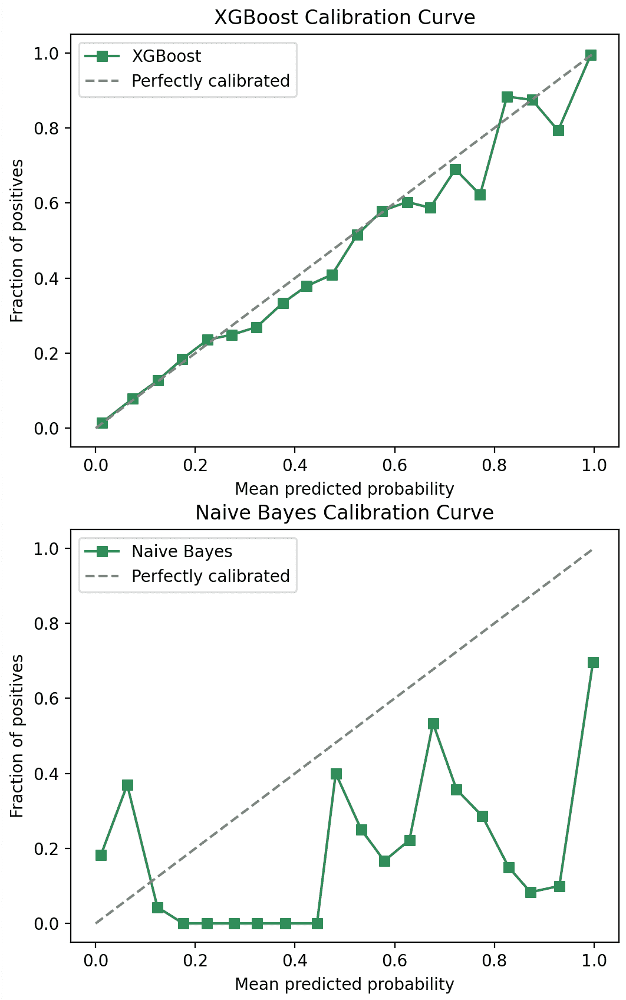
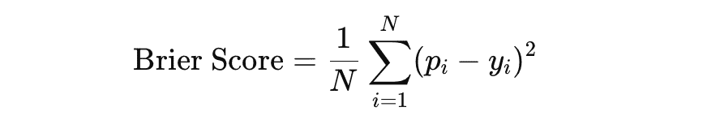
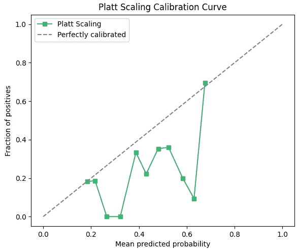
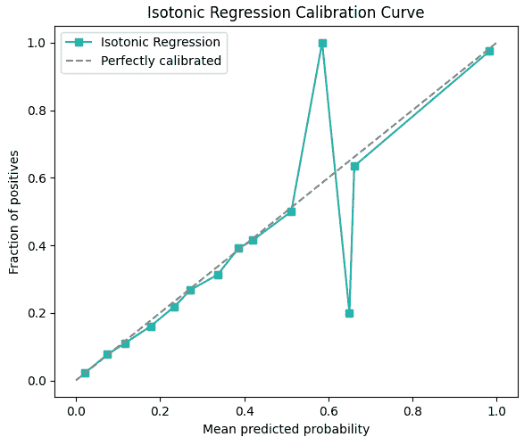
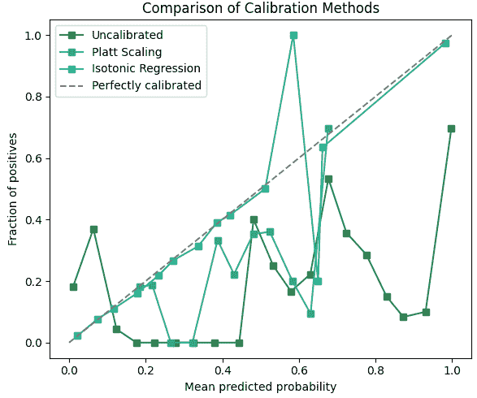

# 你认为 80%就是 80%？为什么预测概率需要再仔细看看

> 原文：[`towardsdatascience.com/you-think-80-means-80-why-prediction-probabilities-need-a-second-look-ebc8b650cf21/`](https://towardsdatascience.com/you-think-80-means-80-why-prediction-probabilities-need-a-second-look-ebc8b650cf21/)


现实世界事件与模型置信度分数的比较。图像由作者使用 Dall·E 创建。

**机器学习模型预测的概率有多可靠？80%的预测概率意味着什么？它是否类似于事件发生的 80%的可能性？在这篇面向初学者的帖子中，你将学习预测概率、校准的基础知识，以及如何在实际情境中解释这些数字。我将通过演示如何评估和改进这些概率以做出更好的决策。**

* * *

## 预测概率代表什么？

你可能没有使用`model.predict(data)`，这会给你一个 0 或 1 的预测，用于二元分类问题，而是使用了`model.predict_proba(data)`。这将给出概率而不是 0 和 1。在许多数据科学案例中，这很有用，因为它提供了更多的见解。但这些概率实际上意味着什么？

0.8 的预测概率意味着模型有 80%的信心认为一个实例属于正类。让我们重复一下：*模型有 80%的信心认为一个实例属于正类*。这并不意味着：*事件发生的现实可能性为 80%*。这是两件不同的事情。在概率驱动用例中，例如在欺诈检测、医疗诊断或风险评估中，这个区分很重要。

> 这触及了我写这篇帖子的动机：我注意到很多人容易犯这个错误。作为一个数据科学家，如果你的模型“有罪”，解释这个差异可能很重要，因为业务利益相关者可能会假设 80%的预测概率意味着事件发生的现实可能性为 80%。

## 将模型置信度分数解释为概率的问题

为什么将`predict_proba`的分数解释为现实世界可能性可能是一个问题？

一些模型过于自信：过于自信的模型会给出高置信度分数，但并不正确。其他模型则过于不自信：它们给出低置信度分数，但却是正确的。如果模型置信度分数没有校准，这可能会产生误导。

另一点需要记住的是，置信度分数是基于从训练数据中学习到的模式。如果数据不平衡或存在偏差，置信度分数可能不会反映现实场景中的真实概率。

让我们看看一个例子。可能发生的情况是，当你的 XGBoost 模型预测 80%的概率时，实际上，当模型输出 80%时，事件发生的频率只有 65%。当然，我们希望看到如果模型对 100 个案例预测 80%，事件在大约 80 个案例中发生。否则，我们无法信任这些概率。

我们如何确定一个模型是否校准良好，即模型的置信度分数与事件的真实可能性相匹配？让我们看看校准及其改进方法。

## 校准模型置信度分数

首先，我们想要可视化模型置信度分数与测试集中真实结果之间的对齐情况。这非常简单：

1.  将预测概率分组到箱中，以下我使用了 20 个箱。

1.  计算每个箱中正例的分数。这对应于该箱中事件发生的真实概率。

1.  将这些真实概率与预测概率进行对比。

当然，如果模型完全校准，点将位于对角线上。例如：在 10%的箱中，所有案例中真实概率（正例的分数）大约为 10%。下面你可以看到相当好的校准 XGBoost 模型的示例，以及不太完美的校准朴素贝叶斯模型。这些模型是在[成人数据集](https://www.openml.org/search?type=data&status=active&sort=nr_of_likes&id=1590)上训练的。



在成人数据集的测试集上绘制 XGBoost 和朴素贝叶斯预测分数的校准曲线。图片由作者提供。

另一种检查模型校准程度的方法是使用 Brier 分数。这也非常简单！它衡量预测概率与实际结果之间的平均平方差（因此越低越好）：



如果我们计算上述两个模型的 Brier 分数，我们得到以下结果：

```py
Brier scores for adult dataset:
XGBoost:       0.10849946433956742
Naive Bayes:   0.1920520011951727
```

从校准图中我们可以得出结论，XGBoost 模型的校准相当好。朴素贝叶斯模型的校准远非完美，因为曲线偏离了对角线，Brier 分数也较高（几乎是 XGBoost 模型 Brier 分数的两倍）。让我们继续使用朴素贝叶斯模型来展示我们如何改进校准！有几种不同的方法可以改进它，在这篇文章中，我们将探讨 Platt 缩放和等调回归。

校准曲线和 Brier 分数在 scikit-learn 中实现，你可以通过以下代码导入和创建它们：

```py
from sklearn.calibration import calibration_curve
from sklearn.metrics import brier_score_loss
from sklearn.naive_bayes import GaussianNB

# fit model on training data
model = GaussianNB()
model.fit(X_train, y_train)

# calculate predicted probabilities with pred_proba on the test set
probs = model.predict_proba(X_test)[:, 1]

brier_score = brier_score_loss(y_test, model_probs)
prob_true, prob_pred = calibration_curve(y_test, model_probs, n_bins=20, strategy='uniform')
```

### Platt 缩放

Platt Scaling 是一种简单而有效的校准预测概率的方法。它通过拟合逻辑回归模型到未校准模型概率的输出来实现。具体来说，它最小化验证集上的对数损失，确保校准后的概率更好地反映事件的真正可能性。

要应用 Platt Scaling，你需要将你的数据分为训练集和验证集。第一步是在训练集上训练你的模型，并为验证集生成未校准的概率。然后，你可以使用这些概率作为输入特征来拟合一个逻辑回归模型，以调整预测。这种方法对于产生连续分数的模型特别有效，例如 SVM 或朴素贝叶斯。有一点需要注意：Platt Scaling 假设预测概率和真实结果之间存在单调关系，这并不总是成立。

在这里，你可以看到应用 Platt Scaling 的代码，以及如果我们将 Platt Scaling 应用于成人数据集上的朴素贝叶斯分类器，新的校准曲线：

```py
from sklearn.calibration import CalibratedClassifierCV
from sklearn.naive_bayes import GaussianNB

# first, make sure you have fitted your model on the train set 
model = GaussianNB()
model.fit(X_train, y_train)

# apply Platt Scaling 
# cv='prefit' makes sure that the method uses the already trained model
platt_model = CalibratedClassifierCV(model, method='sigmoid', cv='prefit')
platt_model.fit(X_train, y_train)
platt_probs = platt_model.predict_proba(X_test)[:, 1]
```



### 等调回归

另一种常见的校准技术是等调回归。这是一种用于校准概率的非参数技术。这意味着与 Platt Scaling 不同，它不做出假设，使其更加灵活，但也可能在处理较小数据集时容易过拟合。这种方法创建了一个逐步函数，调整预测概率，使其更好地与实际结果对齐。调整确保概率保持顺序，这意味着较高的预测值仍然代表事件发生的较高可能性，与较低的预测值相比。

要实现等调回归，你再次将数据分割，并在训练集上训练基础模型。验证集上的预测概率被用作输入来拟合一个等调回归模型，该模型调整概率。它倾向于在真实概率分布不规则的情况下产生比 Platt Scaling 更好的校准效果，例如在我们的例子中。但要注意，对于小数据集，等调回归可能会引入校准曲线中的尖锐跳跃或下降等伪影。

下面再次提供代码和校准曲线。你可以清楚地看到在平均预测概率 0.6 处的跳跃和下降！除此之外，曲线看起来很漂亮。

```py
from sklearn.calibration import CalibratedClassifierCV
from sklearn.naive_bayes import GaussianNB

# first, make sure you have fitted your model on the train set 
model = GaussianNB()
model.fit(X_train, y_train)

# apply isotonic regression, with method='isotonic'
iso_model = CalibratedClassifierCV(model, method='isotonic', cv='prefit')
iso_model.fit(X_train, y_train)
iso_probs = iso_model.predict_proba(X_test)[:, 1]
```



### 比较校准方法

如果我们将成人数据集上朴素贝叶斯模型的全部图表（未校准模型、Platt Scaling 和等调回归）合并起来进行比较，这就是结果：



未校准的朴素贝叶斯模型、Platt Scaling 和等调回归。图片由作者提供。

观察这个图，等调回归校准图似乎在这个例子中拟合得最好。它只在前文提到的 0.6 平均预测概率处有这个奇怪的跳跃和下降。我们可以通过计算 Brier 分数进行额外的检查：

```py
Brier scores for adult dataset and Naive Bayes model:
Uncalibrated:        0.1920520011951727
Platt Scaling:       0.15621506274566171
Isotonic Regression: 0.12849532236356562
```

的确！等调回归具有最佳的分数。

> 你可能已经注意到未校准的 XGBoost 模型具有更好的 Brier 分数和校准图，你说得对。我们可以省去校准朴素贝叶斯模型结果的不便，直接使用 XGBoost 处理这个数据集！当然，如果你在自己的数据上实际测试，并不能保证这种情况一定会发生 🙂

* * *

## 结论和进一步阅读

校准通常被忽视，但在决策敏感的应用中可能至关重要。许多模型，包括基于树的集成模型如 XGBoost 和 LightGBM，在训练过程中使用间接技术来提高校准，例如最小化 log 损失。这*并不直接解决概率校准*（特别是对于不平衡数据集或包含噪声标签的数据集）。通常，使用图表和如 Brier 分数等指标来验证校准是良好的实践。

如果使用概率进行决策而不是排名，校准结果至关重要。例如，在医疗保健领域，校准概率可以帮助更准确地估计风险，从而实现更好的资源分配。如果这篇帖子激起了你的兴趣，相关主题包括不确定性量化的贝叶斯方法、高级集成技术以及预测概率置信区间的深入洞察。你可能对其他校准方法也感兴趣，例如[逻辑校正](https://arxiv.org/pdf/1207.1403)。关于这些主题的一些有趣的研究论文：

+   [使用监督学习预测良好的概率](https://www.cs.cornell.edu/~alexn/papers/calibration.icml05.crc.rev3.pdf)

+   [超越 Sigmoid：如何使用 beta 校准从二元分类器中获得良好校准的概率](https://projecteuclid.org/journals/electronic-journal-of-statistics/volume-11/issue-2/Beyond-sigmoids--How-to-obtain-well-calibrated-probabilities-from/10.1214/17-EJS1338SI.full)

+   [将分类器分数转换为准确的多类概率估计](https://www.researchgate.net/publication/2571315_Transforming_Classifier_Scores_into_Accurate_Multiclass_Probability_Estimates)

+   [关于机器学习模型不确定性量化的贝叶斯方法综述：提高预测准确性和模型可解释性](https://ieeexplore.ieee.org/document/10696308)

+   [在集成学习中准确的不确定性估计和分解](https://arxiv.org/abs/1911.04061)

### 相关

> [**如何有效地比较机器学习解决方案？**](https://towardsdatascience.com/how-to-compare-ml-solutions-effectively-28384e2cbca1)
> 
> [**模型无关的机器学习模型解释方法**](https://towardsdatascience.com/model-agnostic-methods-for-interpreting-any-machine-learning-model-4f10787ef504)
> 
> [**解码蒙特卡洛方法**](https://towardsdatascience.com/monte-carlo-methods-decoded-d63301bde7ce)
