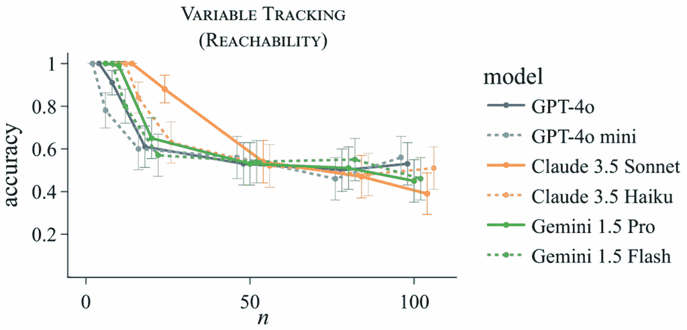

# 您的 1M+ 上下文窗口 LLM 比您想象的要弱

> 原文：[`towardsdatascience.com/your-1m-context-window-llm-is-less-powerful-than-you-think/`](https://towardsdatascience.com/your-1m-context-window-llm-is-less-powerful-than-you-think/)

<mdspan datatext="el1752736287261" class="mdspan-comment">最先进的 LLM</mdspan>现在能够处理大量的输入——它们的上下文窗口介于 200K（Claude）和 2M 令牌（Gemini 1.5 Pro）之间。这相当于 280 到 2800 页的文本！这些巨大的上下文窗口表明，在大多数实际场景中，我们不必过于担心触及 LLM 的输入限制。然而，我们的最新研究表明，这并不正确。对于许多具有复杂上下文的问题，LLM 的有效**工作记忆**可能会因为相对较小的输入而超载——**远在**触及上下文窗口限制之前。

我们的文章介绍了一种新的计算理论模型来解释为什么会发生这种情况，并在实验中表明我们理论的预测与实际结果相符。我们的发现最终可以**解释**之前报道的**LLM 失败**，例如 LLM 如何[无法检测到情节漏洞](https://arxiv.org/abs/2504.11900)，[难以理解长故事](https://arxiv.org/abs/2406.16264)，或者[在文档相似时错误回答问题](https://arxiv.org/pdf/2404.06654)。

下面我们将通过回答以下问题来详细说明：

1.  如果我们超过了一个 LLM 的工作记忆会发生什么？

1.  我的任务是否需要大量的工作记忆？

1.  如果我的任务需要大量的工作记忆，我能做什么？

1.  为什么某些任务需要大量的工作记忆？

## 如果我们超过了一个 LLM 的工作记忆会发生什么？

直观地说，需要大量上下文来正确回答问题的任务也要求 LLM 跟踪大量信息。随着正确推理答案所需的“工作集”的大小增加，LLM 出现错误的可能性也越大，因为它无法在其有限的工作记忆中保留相关信息。

考虑以下例子。假设我们想要调试某人的代码的一部分，并想弄清楚变量 `x7` 的最终值是“a”还是“b”：

```py
x6 = "a"
x4 = "b"
x0 = x6
x2 = x4
x3 = x0
x8 = x2
x9 = x3
x7 = x3
```

这个变量跟踪任务需要大量的上下文来计算答案，因为忽略代码中的一行可能会导致得出错误答案。在多个前沿模型上进行的实验表明，随着变量数量的增加，它们都会回归到在两个答案之间随机猜测：



随着需要跟踪的变量数量的增加，LLM 的性能会迅速下降。

这个实验表明，这些大型语言模型在超过其工作记忆容量之前最多可以跟踪 n = 5 到 10 个变量。之后，性能会迅速下降到 50-50 的随机猜测。

## 我的任务是否需要大量的工作记忆？

因此，你现在可能很好奇，工作记忆限制是否可能是你试图解决的任务的一个问题。我们首先建议的是检查手头的任务是否与我们论文中理论上分析的任何任务相似。如果我们根据 BAPO 模型认为任务需要大量工作记忆，我们将其称为**BAPO-困难**（下文将详细讨论）。我们知道理论上很难的任务包括：

+   图可达性：出现在复杂摘要、实体跟踪、变量跟踪或逻辑推理中

+   大多数：出现在审查分类、寻找共识意见等场景。

+   在三元组上进行推理：例如，从知识图中构建答案

同样，你可以看看你的任务是否是 BAPO-简单：

+   索引或针在草丛中：例如，找出是否讨论了某个主题

+   相等性：例如，检查两个文档是否不同

直观来说，只需要追踪一小部分信息就能回答问题的难题，其工作记忆需求较低（例如，针在草丛中）。如果答案需要几乎所有的输入标记，且没有简短摘要存在，那么工作记忆需求就很高。

如果你的任务不在上述列表中，你可以用你的判断力来确定是否存在一个不需要太多内存的简单解决方案，例如，LLM 可以执行一些简单的基于注意力的查找来回答问题，或者有某种方式总结上下文（不知道先验问题），以便你的问题可以从摘要中得到回答。如果没有，你的问题可能需要大量的工作记忆。在这种情况下，LLMs 在执行你的任务时可能会失败，尤其是随着任务规模的增加（例如，变量的数量，相关信息），不要假设因为答案可以从上下文中计算出来，LLM 就可以计算出它。

## 如果我的任务需要大量工作记忆，我能做什么？

如果你意识到你手头的任务需要大量工作记忆并且经常失败，这里有一些理论上旨在提高你良好表现机会的多种解决方案：

+   使用一个推理能力模型（并希望它不会耗尽标记）。我们表明，从理论上讲，推理标记使 LLMs 能够解决任何 BAPO-困难任务，然而，克服工作记忆限制所需的推理标记数量可能非常大（正如我们论文中的实验所示）。在实践中，即使是最好的推理模型[仍然会犯错误](https://arxiv.org/abs/2507.07313)。

+   根据我们的理论结果，你可以将你的问题分解为一个具有更**紧凑**的中间表示形式的问题，这种表示形式不太可能超过工作记忆的限制。例如，不是要求 LLM 对整个网页的 HTML 进行推理，而是提供一个简化的语法，如仅提供的渲染文本。同样，对于 RAG 场景，预先注释或预先组合数据可能是有用的，这样可以从较小的摘要中轻松获得最终答案。[预注释或预组合数据](https://arxiv.org/pdf/2404.16130)。

+   最后，你可以将工作记忆密集的部分外包给外部求解器或工具，例如，不是直接询问多数意见，而是分别对每个意见进行分类（BAPO 简单），然后在 Python 中汇总结果，而不是询问 LLM。

请记住，这些修复可能不适用于所有任务，尤其是在不清楚如何将任务分解为工作记忆密集度较低子任务的情况下。这正是未来研究有望填补的空白。

## 为什么某些任务需要大量的工作记忆？

对于感兴趣的人来说，本节将深入探讨我们工作中的一些理论。为了分析哪些任务需要大量工作记忆，我们首先开发了一个关于变压器如何计算解决方案的抽象模型。然后我们使用该模型来证明一个任务是否困难或容易。

作为说明，考虑一下阅读一本新发布的长篇书籍并回答关于它的提问的任务。人类在阅读后大约有两种策略可以使用。如果一个人有较大的工作记忆并且能够回忆起书中所有关键信息，他可以直接从脑海中回答问题。如果一个人不能，只能回忆起大致的概念，他可以利用这些概念在书中找到相关信息的大致位置，然后翻回到相应的页面（们）去找到答案。

现在，考虑一个基于变压器的 LLM 如何处理相同的任务。它将阅读书籍的内容，然后在阅读问题后在其最后位置计算答案。在处理书籍内容时，LLM 可以关注几个相关位置来计算答案（相当于翻阅页面）。或者它可以使用书籍的上下文嵌入来存储重要事实，并直接从它们中回答问题（相当于回忆）。它不能带着问题重新阅读整本书，因为因果注意力只允许信息通过上下文窗口向前流动。

在这种情况下，对于人类和 AI 来说，更大的工作记忆意味着有更好的机会存储信息，从而能够计算出正确的答案，尤其是在事情变得复杂时。好吧，但我们如何更正式地定义 LLM 任务中需要的工作记忆是什么？在我们的论文中，我们通过**有界注意力前缀预言机（BAPO）**模型来实现这一点。

BAPO 模型提供了一个简化的计算特征，我们可以从理论上分析以证明哪些问题需要更多或更少的带宽（即，工作记忆）来支持 LLM。为了计算答案，BAPO 模型使用（类似于）上面的两种策略：

+   BAPO 模型可以使用前缀预言机 *f* 来发送 *a* 比特信息向前 ↔ 在阅读时记忆信息

+   BAPO 模型还可以使用注意力预言机 *g* 来关注来自过去标记的 *b* 个标记 ↔ 回到页面

我们定义一个任务的**工作记忆**需求为两个 BAPO 带宽参数（a, b）的组合——第一个参数指的是预先计算并传递的信息量（带宽 a），第二个参数指的是事后可以查询的信息量（带宽 b）。为什么工作记忆是两个参数的组合？这是因为存在权衡：一个人记忆的信息越多，他可以查询的信息就越少。

如果一个任务具有恒定的带宽需求（即，a,b 在 O(1)），那么该任务可能不会超过 LLM 的工作记忆大小，但如果一个任务的带宽需求取决于输入的大小（例如，序列或字母表长度），那么它最终会超过工作记忆限制并导致失败。

## 结论

**工作记忆**是基于转换器（transformer）的 LLM（大型语言模型）中的一个**重要瓶颈**。在信息量超过上下文窗口大小之前，转换器在窗口内有效表示和传递这些信息的能力就已经超过了。当前的长期上下文基准测试[强烈依赖于“大海捞针”问题](https://arxiv.org/pdf/2502.05167)，我们已经证明这些问题是 BAPO-easy 的。这意味着当前的基准性能无法准确捕捉到长期上下文推理任务的全范围性能。

根据我们的理论模型，复杂摘要、代码跟踪或不一致性检测等任务对 LLM 来说很难。它们可能包含导致高工作记忆需求的**BAPO-hard 子任务**，这反过来又会在实践中**导致失败**。尽管上下文窗口长度的最近进展已经扩大了 LLM 的应用范围，但使用更长的上下文也增加了相关任务复杂性。这可能会增加 BAPO-hard 任务的发生频率，并导致更多 LLM 失败。

我们概述了降低任务工作记忆需求的一些策略，例如**推理标记**。然而，它们也有自己的局限性，例如，一些任务可能需要大量的推理标记来克服实际中的带宽限制。我们希望未来的研究能够提供更通用的解决方案，甚至可能提供超越转换器的新架构。

### *参考文献*

+   论文：[`arxiv.org/abs/2505.08140`](https://arxiv.org/abs/2505.08140)

+   代码：[`github.com/microsoft/bapo`](https://github.com/microsoft/bapo)

### *脚注*

你可能会想知道，先有问题是会改变工作记忆的要求吗？不——请参阅论文以获取更多详细信息。
