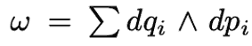
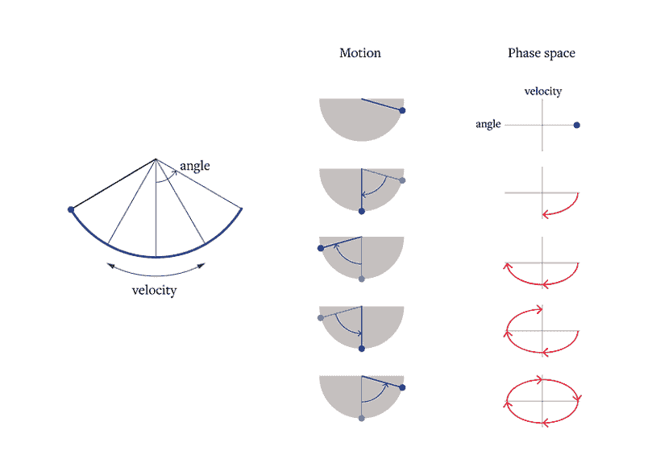
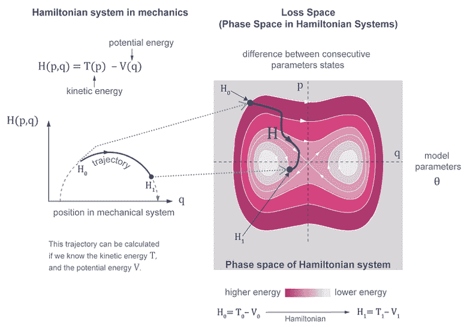
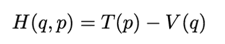
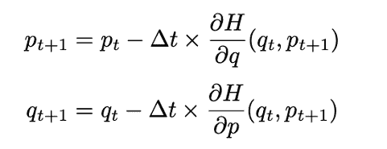
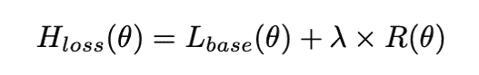
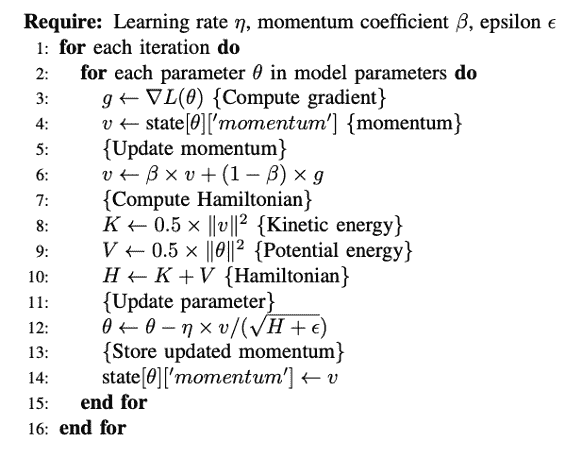
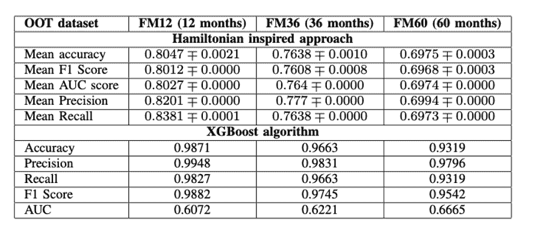
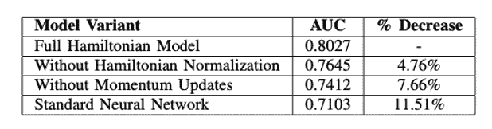

# 当你的信用风险模型今天有效，但六个月后失效时，你应该怎么做

> 原文：[`towardsdatascience.com/your-credit-risk-model-works-today-it-breaks-in-six-months/`](https://towardsdatascience.com/your-credit-risk-model-works-today-it-breaks-in-six-months/)

<mdspan datatext="el1762226535799" class="mdspan-comment">信用风险建模</mdspan>有一个棘手的秘密。组织部署了在验证中实现 98%准确率的模型，然后安静地看着它们在生产中退化。团队称之为“概念漂移”并继续前进。但如果是这种优化方式的一个可预测后果，而不是一个神秘现象呢？

我是在看到另一个生产模型失败后开始问这个问题的。答案引导到了一个意想不到的地方：我们用于优化的几何形状决定了模型在分布变化时是否保持稳定。不是数据。不是超参数。空间本身。

我意识到信用风险本质上是一个**排序问题**，而不是一个分类问题。你不需要以 98%的准确率预测“违约”或“不违约”。你需要按风险对借款人进行排序：借款人 A 是否比借款人 B 风险更高？如果经济恶化，谁会首先违约？

标准方法完全忽略了这一点。以下是在[Freddie Mac 单家庭贷款级数据集](https://www.freddiemac.com/research/datasets/sf-loanlevel-dataset)（涵盖 1999-2023 年的 692,640 笔贷款）上，梯度提升树（该领域的首选工具[XGBoost](https://xgboost.readthedocs.io/en/stable/)）实际上实现了什么：

+   **准确率：** 98.7% ← 看起来很令人印象深刻

+   **AUC (排序能力)：** 60.7% ← 仅仅略好于随机

+   **12 个月后：** 96.6%的准确率，但排名退化

+   **36 个月后：** 93.2%的准确率，AUC 为 66.7%（基本上没有用）

XGBoost 实现了令人印象深刻的准确率，但在实际任务中失败了：风险排序。并且它**可预测地退化**。

现在比较一下我所开发的（在 IEEE DSA2025 接受的论文中展示）：

+   **初始 AUC：** 80.3%

+   **12 个月后：** 76.4%

+   **36 个月后：** 69.7%

+   **60 个月后：** 69.7%

**差异：** XGBoost 在 60 个月内损失了 32 个 AUC 点。我们的方法？AUC 仅下降 10.6 点——([曲线下面积](https://developers.google.com/machine-learning/crash-course/classification/roc-and-auc))将告诉我们我们的训练算法如何预测未见数据的风险。

为什么会发生这种情况？这归结于一些意想不到的事情：优化的几何本身。

## 这为什么很重要（即使你不是金融从业者）

这不仅仅关乎信用评分。任何排名比精确预测更重要的系统都会面临这个问题：

+   **医疗风险分层** — 谁需要优先紧急护理？

+   **客户流失预测** — 我们应该关注哪些客户的保留工作？

+   **内容推荐** — 我们接下来应该展示什么内容？

+   **欺诈检测** — 哪些交易需要人工审核？

+   **供应链优先级** — 应该先解决哪些中断？

当你的上下文逐渐变化——哪个人不会呢？——准确度指标会欺骗你。一个模型可以保持 95%的准确率，同时完全打乱实际风险最高的人的顺序。

那不是一个模型退化问题。那是一个优化问题。

### 物理学教给我们关于稳定性的东西

想想 GPS 导航。如果你只优化“当前最短路线”，你可能会引导某人进入即将关闭的道路。但如果你保留了交通流动的结构——路线之间的关系——即使条件发生变化，你也能保持良好的引导。这就是信用模型所需要的。但如何保持结构呢？

美国宇航局多年来一直面临这个问题。在模拟数百万年的行星轨道时，标准的计算方法使行星缓慢漂移——不是由于物理原因，而是由于累积的数值误差。水星逐渐螺旋进入太阳。木星向外漂移。他们通过**辛积分器**解决了这个问题：保留系统几何结构的算法。轨道保持稳定，因为这种方法尊重物理学家所说的“相空间体积”——它保持位置和速度之间的关系。

现在到了令人惊讶的部分：信用风险具有相似的结构。

## 排名的几何

标准的梯度下降在欧几里得空间中进行优化。它为你的训练分布找到局部最小值。但欧几里得几何在分布发生变化时并不保持**相对顺序**。

什么是？

辛流形

在[哈密顿力学](https://en.wikipedia.org/wiki/Hamiltonian_mechanics)（物理学中使用的正式方法）中，守恒系统（无能量损失）在辛流形上演化——具有 2 形式结构的空间，它保持相空间体积（[刘维定理](https://en.wikipedia.org/wiki/Liouville%27s_theorem_(Hamiltonian)))）。

标准辛 2 形式

在这个相空间中，辛变换保持相对距离。不是绝对位置，而是顺序。这正是我们在分布变化下进行排名所需要的。当你使用标准的积分方法模拟无摩擦摆时，能量会漂移。图 1 中的摆会慢慢加速或减速——不是由于物理原因，而是由于数值近似。辛积分器没有这个问题，因为它们精确地保留了哈密顿结构。同样的原理可以应用于神经网络优化。

**图 1**：无摩擦摆是哈密顿力学最基本例子。摆与空气没有摩擦，因为它会耗散能量。物理学中的哈密顿正则形式适用于具有能量守恒的保守或非耗散系统。左边的图像显示了摆的相空间轨迹，表示为速度和角度（中央图像）。图片由作者提供。

蛋白质折叠模拟面临着相同的问题。你正在模拟成千上万的原子在微秒到毫秒的时间尺度上相互作用——数十亿次的积分步骤。标准积分器累积能量：分子会人为地变热，不应该断裂的键会断裂，模拟会爆炸。

**图 2**：物理系统中的“哈密顿量”与其在神经网络优化空间中的应用之间的等价性。位置 q 等价于神经网络参数 θ，动量向量 p 等价于连续参数状态的差。尽管我们可以称之为“物理启发”，但这应用了微分几何辛形式、刘维定理、结构保持积分。但我认为哈密顿类比在普及目的上更有意义。图片由作者提供。

## 实现：结构保持优化

这里是我实际所做的事情：

**神经网络哈密顿框架**

我将神经网络训练重新表述为一个哈密顿系统：

机械系统的哈密顿方程

在机械系统中，T(p) 是动能项，V(q) 是“势能”。在这个类比中，T(p) 代表改变模型参数的成本，V(q) 代表当前模型状态的损失函数。

**辛欧拉优化器（不是 Adam/SGD）：**

对于优化，我使用了一种辛积分而不是 Adam 或 SGD：

我使用辛欧拉法对一个具有位置 q 和动量 p 的哈密顿系统进行了处理

其中：

+   H 是哈密顿量（从损失函数导出的能量函数）

+   Δt 是时间步长（类似于学习率）

+   q 是网络权重（位置坐标），并且

+   p 是动量变量（速度坐标）

注意到 p_{t+1} 出现在两次更新中。这种耦合很重要——它就是保持辛结构的东西。这不仅仅是动量；这是结构保持积分。

**哈密顿约束损失**

此外，我基于哈密顿正则形式创建了一个损失函数：

其中：

+   L_base(θ) 是二元交叉熵损失

+   R(θ) 是正则化项（权重的 L2 惩罚），并且

+   λ 是正则化系数

正则化项惩罚了能量守恒的偏差，将优化约束在参数空间中的低维流形上。

## 工作原理

该机制有三个组成部分：

1.  **辛结构** → 体积保持 → 有界参数探索

1.  **哈密顿约束** → 能量守恒 → 稳定的长期动力学

1.  **耦合更新** → 保持与排名相关的几何结构

这种结构在以下算法中得以体现

**图 3**：算法同时使用了动量更新和哈密顿优化。

## 结果：3 倍更好的时间稳定性

正如解释的那样，我使用[弗雷迪麦克单家庭贷款级数据集](https://www.freddiemac.com/research/datasets/sf-loanlevel-dataset)——这是唯一一个跨越经济周期的适当时间分割的长期信用数据集——测试了这个框架。

逻辑告诉我们，三个数据集（从 12 个月到 60 个月）的准确率必须下降。长期预测通常不如短期预测准确。但我们看到的是，XGBoost 并不遵循这种模式（AUC 值从 0.61 到 0.67——这是优化在错误空间中的特征）——我们的辛优化器，尽管准确性较低，却做到了（AUC 值从 0.84 下降到 0.70）。例如，什么能保证 36 个月的预测将更加现实？XGBoost 的 0.97 准确率，还是哈密顿启发式方法的 0.77 AUC 值？XGBoost 在 36 个月内的 AUC 值为 0.63（非常接近随机预测）。

**每个组件的贡献**

在我们的消融研究中，所有组件都有贡献，其中辛空间中的动量提供了更大的收益。这与理论背景相一致——辛 2-形式通过耦合位置-动量更新得以保持。

表. 消融研究。使用 Adam 优化器的标准 NN 与我们的方法（完整哈密顿模型）对比

## 何时使用这种方法

当以下情况发生时，使用辛优化作为梯度下降优化器的替代方案：

+   排名比分类准确率更重要

+   分布偏移是渐进和可预测的（经济周期，不是黑天鹅事件）

+   时间稳定性至关重要（金融风险，随时间推移的医疗预测）

+   重新训练成本高昂（监管验证，审批开销）

+   你可以承担 2-3 倍的训练时间以实现生产稳定性

+   你有<10K 个特征（在~10K 维上表现良好）

不使用的情况：

+   分布偏移是突然的/不可预测的（市场崩溃，制度变革）

+   你需要可解释性以符合法规（这并不有助于可解释性）

+   你处于超高维度（>10K 个特征，成本变得难以承受）

+   实时训练约束（比 Adam 慢 2-3 倍）

## 这实际上对生产系统意味着什么

对于部署信用模型或类似挑战的组织：

**问题**：你每季度重新训练一次。每次，你都在保留数据上验证，看到 97%以上的准确率，部署，然后观察 AUC 在 12-18 个月内下降。你把责任归咎于“市场条件”，然后再次重新训练。

**解决方案：** 使用辛优化。为了换取 3 倍更好的时间稳定性（80%对 98%），接受略微降低的峰值精度。您的模型保持可靠的时间更长。您需要重新训练的频率更低。监管解释更简单：*“我们的模型在分布变化下保持排名稳定性。”*

**成本：** 2-3 倍的更长训练时间。对于每月或每季度的重新训练，这是可接受的——您是在用计算小时换取数月的稳定性。

这是一门工程，而不是魔法。我们正在优化一个保持对业务问题真正重要的空间。

## 更大的图景

模型退化并非不可避免。它是优化错误空间的结果。标准梯度下降找到适用于您当前分布的解决方案。辛优化找到保持结构的解决方案——决定排名的示例之间的关系。我们提出的方法不会解决机器学习中的每个问题。但对于关注其生产模型退化的从业者——对于面临关于模型稳定性的监管问题的组织——这是一个今天可行的解决方案。

## 下一步

**代码可用：** [[link](https://github.com/Javihaus/Hamiltonian-Neural-Network-Optimization)]

**完整论文：** 将很快可用。如果您有兴趣获取它，请联系我 ([[email protected]](/cdn-cgi/l/email-protection))

**问题或合作：** 如果您正在处理具有时间稳定性要求的排名问题，我很想了解您的用例。

* * *

**感谢阅读——并分享！**

**需要帮助实施此类系统？**

Javier Marin

**应用人工智能顾问 | 生产人工智能系统 + 监管合规**

[[email protected]](/cdn-cgi/l/email-protection#355f54435c5047755f5854475c5b1b5c5b535a)

* * *
