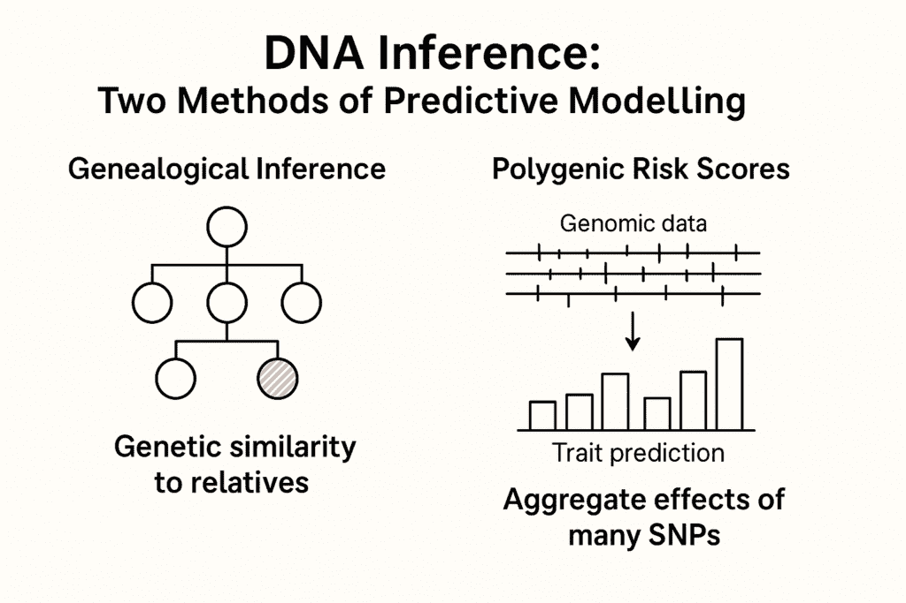
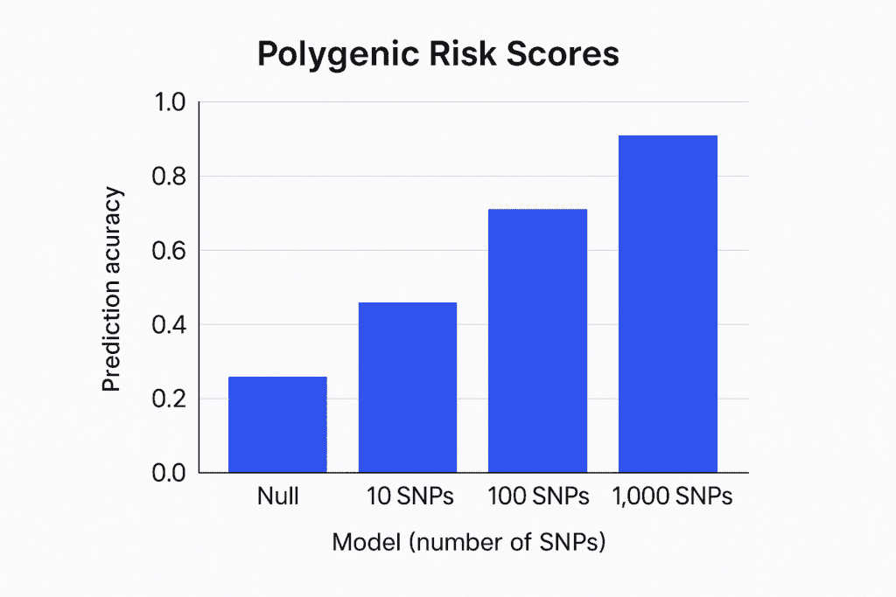

# 你的 DNA 是一个机器学习模型：它已经在外面了

> 原文：[`towardsdatascience.com/your-dna-is-a-machine-learning-model-its-already-out-there/`](https://towardsdatascience.com/your-dna-is-a-machine-learning-model-its-already-out-there/)

<mdspan datatext="el1748891641539" class="mdspan-comment">你可能认为</mdspan>避免使用像 23andMe 或 Ancestry 这样的 DNA 检测服务可以帮助你保护你最机密的数据。然而，实际上，这种控制已经逐渐减弱。

有了今天的基因组数据和高级推断方法，人们可以在不要求你输入的情况下重建你的遗传档案。这不是可能发生的事情；它正在发生。这是机器学习在大规模家族相关数据集上应用的一个典型结果。

现在，基因组系统更像是共同工作的团队，而不是独立的档案。当数据中有足够多的基因亲近的人，包括远亲和第二度亲属时，模型可以推测你的特征、你面临的风险甚至你 DNA 的一部分。发生的事情不是数据的盗窃，而是数据在统计学上的分组方式。

这篇文章解释了使这成为可能的技术变化，将它们与常见的机器学习方法联系起来，并讨论了当生物学变得像行为一样可预测时意味着什么。

## 金州杀手被预测，而非找到

当警方在 2018 年逮捕了[金州杀手](https://journals.sagepub.com/doi/pdf/10.1177/10887679231201801)时，他们并没有将他的 DNA 与数据库中的任何东西匹配。作为替代，他们将犯罪现场 DNA 上传到 GEDmatch，并识别了一个亲戚，一个第三代表亲。之后，他们构建了一个部分家谱，并使用遗传三角化和家系推断发现了嫌疑人。

导致逮捕的不是数据的出现，而是数据的存储方式。当足够多的亲属分享了他们的遗传数据时，研究人员能够重建目标者的基因组可能的样子。本质上，这是一个图搜索问题，其中生物网络标签很少，搜索受到重组和遗传模式限制。

这个案例不是建立在找到精确匹配的基础上。它应用了最近邻分类的思想，即相似性是基于共享的哈普洛型块和关系数据的概率谱系来确定的。

这不仅仅是在法医学上的重大进步。它也提醒人们，你的 DNA 现在以你可能不同意的方式与其他人的数据相连。

### DNA 推断是生物约束超维空间中的最近邻搜索

在机器学习中，我们通常将最近邻（k-NN）分类想象为具有清晰、数值特征的欧几里得空间中的点。基因组推断遵循相同的模式，只不过特征空间还包括生物联系。

在人类基因组学中，每个人都被表示为包含数百万个单核苷酸多态性（SNPs）的列表，这些 SNPs 通常编码为 0、1 或 2，以表示每个等位基因的数量。尽管原始数据可以包括超过 100 万个特征，但 PCA 和 IBD 被用来减少数据，确保遗传相似性得到保留。

实际上，这个空间作为一个在生物学上重要的结构，受到人口组织、共享历史和进化压力的影响。遗传相似度评分，包括血缘系数、IBD 片段或 F[ST]距离，现在取代了欧几里得距离。

在这种情况下，调查员在 GEDmatch 的基因型空间中执行最近邻查询，通过检查共享的哈普洛型块和重组模式来衡量相似性，而不是使用余弦距离或 L2 范数。

当找到一个堂表亲时，搜索会沿着家谱图使用生物学规则回溯，以识别可能与未知人物连接的可能的基因组。

该过程通过结合约束 k-NN 搜索、图遍历和概率过滤来实现。

+   k-NN 找到遗传上最接近的节点

+   家系图概述了搜索的限制。

+   统计插补模型替换缺失的变异。

而不是给出一个分类，结果是新的基因型。

这不仅仅是标准的推理。这种工程方法利用家族关系来理解表型。这意味着即使你之前没有进行过基因组测序，你的 DNA 也可以几乎完全重建，因为周围的遗传区域充满了数据。

在数据科学中，这被称为由潜在图邻近性引起的特征泄漏。与密码或电子邮件地址不同，无法重置你的基因组。

DNA 推理：两种统计方法。（图片由作者提供）

## 多基因风险评分是基因组集合

在我研究预测模型的工作中，我发现了[多基因风险评分（PRS）](https://www.nature.com/articles/s41598-025-02903-1）。当时，我的团队正在研究通过行为进行风险分类。然而，我发现 PRS 与我们的方法相似，只是它不是使用调查或可穿戴设备，而是利用了散布在整个基因组中的大量单核苷酸多态性（SNPs）。

PRS 是一组大量但稀疏的特征加权值的总和。大多数时候，这些分数是通过使用 LASSO 或弹性网络惩罚回归技术，利用 GWAS 汇总统计来产生的。一些模型，如贝叶斯收缩或考虑连锁不平衡（例如，LDpred 或 PRS-CS）的方法，旨在解决 SNP 相关性的问题。

对于那些不在遗传学领域工作的人来说，往往被忽视的是，训练好的模型能够自行进行泛化。如果你的亲属的基因组数据存在并且与健康结果相关联，该模型将能够估算你的基因组风险，而无需对其进行检查。

换句话说，PRS 就像一支由生物学家组成的团队推荐音乐。遗传上相似的个人被用来帮助你找到在性状空间中的位置。如果模型发现你周围有许多患有特定疾病的人，并且他们具有相同的基因型，它将开始警告你该风险，即使你没有参与这项研究。

但一旦预测进入循环，它不仅打开了科学洞察的大门，也打开了操纵的大门。那些提供信息的模型也可以被利用。

## 当对抗性行为者进入循环时会发生什么？

当我们将 DNA 数据库视为预测系统时，我们也继承了它们的脆弱性。一旦基因组变得可查询、可推断，并且可以在公共和商业平台之间连接，对抗性行为就成为一种建模风险，而不仅仅是道德风险。

### 基因组反演作为逆向建模

假设你的足够多的亲属已经将他们的基因组上传到公开数据库中。在这种情况下，攻击者可以执行逆向推理，根据共享的易感性和已知的遗传模式重建你 DNA 的可能片段。这不是假设：研究人员已经证明，使用第三堂兄弟级别的数据，可以以超过 60% 的准确度近似一个人的基因组。

这与机器学习中的模型反演攻击并不遥远，在那里有人从模型输出中重建训练数据。但在这里，“模型”是人群的关系结构。

### 影子评分和风险定价

保险公司和数据经纪人可能无法访问你的原始 DNA，但通过访问人口统计数据和公共血缘关系图，他们可以通过代理建模预测你的多基因风险评分。即使不违反 GINA（美国遗传信息非歧视法案），他们也可以使用外部推断来无声地重新排列你的排名，影响信用、健康产品或资格档案。

这是一种基于基因信息的算法红线的版本，它可以无意识地操作。

### 对抗性亲属和基因组中毒

如果有人故意上传被操纵的基因组来毒害目标推断档案会怎样？因为这些系统依赖于亲属之间的统计一致性，改变或伪造片段可能会偏置推理引擎。想象一下有人轻轻推动你的推断基因组，以提高你患某种疾病的风险，或者错误地将你与犯罪现场序列对齐。

在推理、评分和数据完整性方面的对抗性建模风险。**（图片由作者提供）**

## 结论

这篇文章的写作是为了揭示一个容易忽视的现实，即使对于那些在我们机器学习领域工作的人来说也是如此：基因组数据不需要直接收集就可以被准确建模。

在整篇文章中，我探讨了基因组推断如何像最近邻分类那样运作，如何将多基因风险评分与集成回归相似，以及如何通过关系图结构使用统计邻近性来重建你的 DNA。如果你曾经构建过协同过滤系统，你已经理解了这些方法背后的逻辑，但你可能没有预料到它们会应用到像你的基因组这样个人化的东西上。

这才是更深层次的要点。这不仅仅是一个隐私故事。这是一个关于生物数据结构如何使得推断不仅成为可能，而且变得不可避免的建模故事。无论你是否已经测序了自己的 DNA，你现在已经成为模型的一部分，因为与你相连的人已经向其中输入了足够的信息。

在大规模推断系统时代，仅仅询问谁拥有数据已经不再足够。我们必须问谁拥有模式，因为模式具有概括性，而概括性不需要许可。
