# 您的个人分析工具箱

> 原文：[`towardsdatascience.com/your-personal-analytics-toolbox/`](https://towardsdatascience.com/your-personal-analytics-toolbox/)

<mdspan datatext="el1751927291102" class="mdspan-comment">模型的好坏取决于提供给它们的上下文。即使是最先进的模型，如果没有访问所需数据或工具来获取更多信息，也不会很有帮助**。**这就是为什么工具和资源对任何 AI 代理都至关重要。

我注意到我一直在重复做同样的任务：编写类似的提示或反复开发相同的工具。软件工程中有一个基本原理叫做**DRY**，代表“*不要重复自己*”。

因此，我开始思考是否有避免重复所有这些工作的方法。幸运的是，GenAI 行业已经有一个现成的解决方案。**MCP（模型上下文协议**）是一个开源协议，它使 AI 应用程序能够连接到外部工具和数据源。其主要目标是标准化此类交互，类似于 REST API 如何标准化 Web 应用程序和后端服务器之间的通信。

使用 MCP，您可以轻松地将 GitHub、Stripe 甚至 LinkedIn 等第三方工具集成到您的 AI 代理中，而无需自己构建工具。

> *您可以在[这个精选仓库中找到 MCP 服务器的列表。](https://github.com/modelcontextprotocol/servers)然而，重要的是要注意，您应该只使用受信任的 MCP 服务器，以避免潜在的问题。*

同样，如果您想将您的工具暴露给客户（即允许他们通过他们的 LLM 代理访问您的产品），您可以简单地构建一个 MCP 服务器。然后客户将能够从他们的 LLM 代理、AI 助手、桌面应用程序或 IDE 中与之集成。这非常方便。

MCP 从根本上解决了重复工作的问题。想象一下，您有 M 个应用程序和 N 个工具。没有 MCP，您将需要构建 M * N 个集成来连接它们。

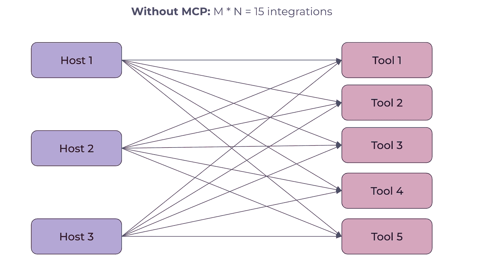

图片由作者提供

通过 MCP 和标准化，您可以将这个数字减少到仅 M + N。

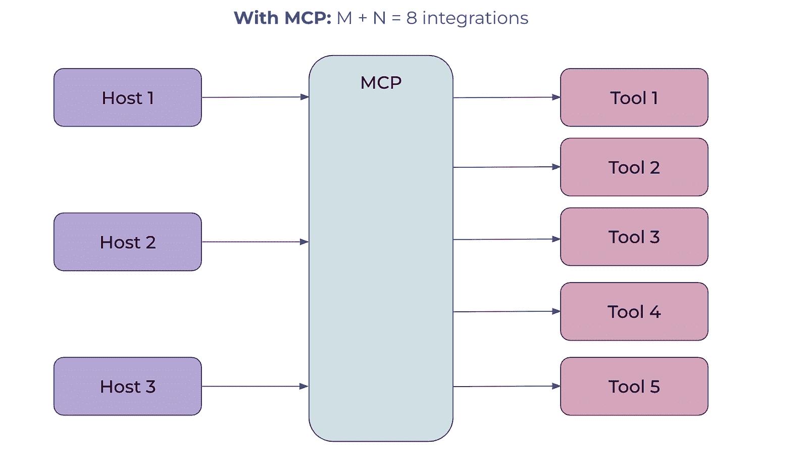

图片由作者提供

在这篇文章中，我将使用 MCP 为分析师开发一个工具包。阅读完这篇文章后，您将

+   了解 MCP 实际上是如何工作的，

+   构建您的第一个带有实用工具的 MCP 服务器，

+   充分利用您自己的 MCP 服务器和本地 AI IDE（如 Cursor 或 Claude Desktop）中的参考服务器的能力，

+   启动一个可供社区访问的远程 MCP 服务器。

在接下来的文章中，我们将更进一步，学习如何将 MCP 服务器集成到您的 AI 代理中。

这需要涵盖很多内容，所以让我们开始吧。

## MCP 架构

我认为在实践之前了解基本原理是值得的，因为这将帮助我们更有效地使用工具。所以，让我们讨论一下这个协议的基本原理。

### 组件

此协议使用客户端-服务器架构：

+   **服务器**是一个通过 MCP 协议公开功能的外部程序。

+   **主机**是面向客户端的应用程序（如 Claude 桌面应用程序、AI IDE 如 Cursor 或 Lovable，或自定义 LLM 代理）。主机负责存储 MCP 客户端并维护与服务器之间的连接。

+   **客户端**是用户界面应用程序的一个组件，它与单个 MCP 服务器保持一对一的连接。他们通过 MCP 协议定义的消息进行通信。


图片由作者提供

MCP 允许 LLM 访问不同的功能：工具、资源和提示。

+   **工具**是 LLM 可以执行的功能，例如获取某个城市的当前时间或将货币从一种货币转换为另一种货币。

+   **资源**是服务器公开的只读数据或上下文，例如知识库或变更日志。

+   **提示**是 AI 交互的预定义模板。

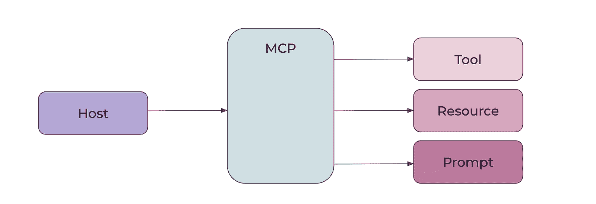

图片由作者提供

MCP 允许您用[许多不同的语言](https://huggingface.co/learn/mcp-course/unit1/sdk#mcp-sdks)编写服务器和工具。在这篇文章中，我们将使用 Python SDK。

### 生命周期

现在我们已经了解了 MCP 中定义的主要组件，让我们看看 MCP 客户端和服务器之间交互的完整生命周期是如何工作的。

第一步是**初始化**。客户端连接到服务器，他们交换协议版本和功能，最后，客户端通过通知确认初始化已完成。

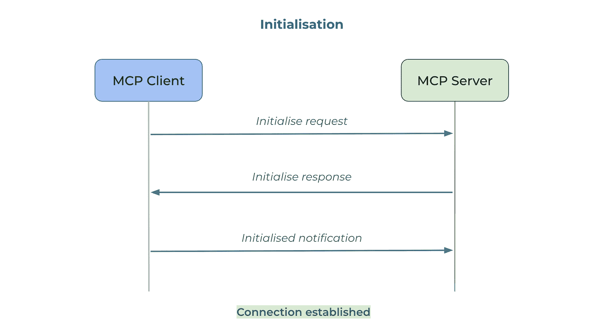

图片由作者提供

然后，我们进入**消息交换阶段**。

+   客户端可能会以**发现**开始交互。MCP 允许动态功能发现，当客户端可以通过如`tools/list`之类的请求向服务器请求支持的工具列表，并会收到暴露的工具列表作为响应。此功能允许客户端在与其他 MCP 服务器协同工作时进行适应。

+   此外，客户端可以调用功能（调用工具或访问资源）。在这种情况下，它不仅可以从服务器获得响应，还可以获得进度通知。

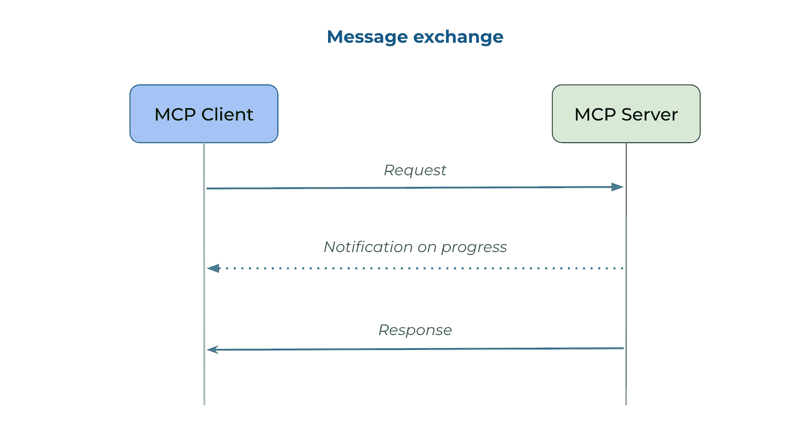

图片由作者提供

最后，客户端通过向服务器发送请求来启动**连接终止**。

### 传输

如果我们稍微深入探讨 MCP 架构，讨论传输也是值得的。传输定义了客户端和服务器之间消息的发送和接收方式。

在其核心，MCP 使用[JSON-RPC 协议](https://en.wikipedia.org/wiki/JSON-RPC)。有两种传输选项：

+   **stdio**（标准输入和输出）用于客户端和服务器在同一台机器上运行的情况，

+   **HTTP + SSE**（服务器端事件）或**可流式 HTTP**用于需要通过网络进行通信的情况。这两种方法的主要区别在于连接是否是状态性的（HTTP + SSE）或也可以是无状态的（可流式 HTTP），这对于某些应用程序可能至关重要。

当我们在本地运行服务器时，我们将使用标准 I/O 作为传输。客户端将作为子进程启动服务器，它们将使用标准输入和输出进行通信。

这样，我们已经涵盖了所有理论，并准备好继续构建我们的第一个 MCP 服务器。

## 将你的工具包作为本地 MCP 服务器创建

我想构建一个服务器，其中包含我经常使用的标准工具，并且利用我们上面讨论的所有 MCP 功能：

+   **提示模板**用于查询我们的 ClickHouse 数据库，概述了数据模式和 SQL 语法的细微差别（*每次重复都相当繁琐*），

+   **工具**用于查询数据库并获取一些关于最近 GitHub PR 的信息，

+   我们将变更日志作为**资源**。

> *你可以在[仓库](https://github.com/miptgirl/mcp-analyst-toolkit/blob/main/src/mcp_server/server.py)中找到完整的代码，以下我将只展示主服务器代码的快照，省略所有业务逻辑。* 

我们将使用 MCP 的 Python SDK。创建 MCP 服务器相当直接。让我们从一个骨架开始。我们导入了 MCP 包，初始化了服务器对象，并在程序直接执行时（而不是导入）运行了服务器。

```py
from mcp.server.fastmcp import FastMCP
from mcp_server.prompts import CLICKHOUSE_PROMPT_TEMPLATE
from mcp_server.tools import execute_query, get_databases, get_table_schema, get_recent_prs, get_pr_details
from mcp_server.resources.change_log import get_available_periods, get_period_changelog
import os

# Create an MCP server
mcp = FastMCP("Analyst Toolkit")

# Run the server
if __name__ == "__main__":
    mcp.run()
```

现在，我们需要添加功能。我们将通过注释函数来完成这项工作。我们还将编写详细的文档字符串，并包含类型注解，以确保 LLM 拥有所有必要的信息来正确使用它们。

```py
@mcp.prompt()
def sql_query_prompt(question: str) -> str:
    """Create a SQL query prompt"""
    return CLICKHOUSE_PROMPT_TEMPLATE.format(question=question)
```

接下来，我们将类似地定义工具。

```py
# ClickHouse tools

@mcp.tool()
def execute_sql_query(query: str) -> str:
    """
    Execute a SQL query on the ClickHouse database.

    Args:
        query: SQL query string to execute against ClickHouse

    Returns:
        Query results as tab-separated text if successful, or error message if query fails
    """
    return execute_query(query)

@mcp.tool()
def list_databases() -> str:
    """
    List all databases in the ClickHouse server.

    Returns:
        Tab-separated text containing the list of databases
    """
    return get_databases()

@mcp.tool()
def describe_table(table_name: str) -> str:
    """
    Get the schema of a specific table in the ClickHouse database.

    Args:
        table_name: Name of the table to describe

    Returns:
        Tab-separated text containing the table schema information
    """
    return get_table_schema(table_name)

# GitHub tools
@mcp.tool()
def get_github_prs(repo_url: str, days: int = 7) -> str:
    """
    Get a list of PRs from the last N days.

    Args:
        repo_url: GitHub repository URL or owner/repo format
        days: Number of days to look back (default: 7)

    Returns:
        JSON string containing list of PR information, or error message
    """
    import json
    token = os.getenv('GITHUB_TOKEN')
    result = get_recent_prs(repo_url, days, token)
    return json.dumps(result, indent=2)

@mcp.tool()
def get_github_pr_details(repo_url: str, pr_identifier: str) -> str:
    """
    Get detailed information about a specific PR.

    Args:
        repo_url: GitHub repository URL or owner/repo format
        pr_identifier: Either PR number or PR URL

    Returns:
        JSON string containing detailed PR information, or error message
    """
    import json
    token = os.getenv('GITHUB_TOKEN')
    result = get_pr_details(repo_url, pr_identifier, token)
    return json.dumps(result, indent=2)
```

现在，是时候添加资源了。我添加了两种方法：一种用于查看我们有哪些变更日志周期可供使用，另一种用于提取特定周期的信息。此外，正如你可能已经注意到的，我们使用了 URI 来访问资源。

```py
@mcp.resource("changelog://periods")
def changelog_periods() -> str:
    """
    List all available change log periods.

    Returns:
        Markdown formatted list of available time periods
    """
    return get_available_periods()

@mcp.resource("changelog://{period}")
def changelog_for_period(period: str) -> str:
    """
    Get change log for a specific time period.

    Args:
        period: The time period identifier (e.g., "2025_q1" or "2025 Q2")

    Returns:
        Markdown formatted change log for the specified period
    """
    return get_period_changelog(period)
```

代码部分就到这里。最后一步是设置环境。我将使用[uv 包管理器](https://github.com/astral-sh/uv)，这是 MCP 文档中推荐的。

如果你还没有安装它，你可以从 PyPI 获取。

```py
pip install uv
```

然后，我们可以初始化一个 uv 项目，创建并激活虚拟环境，最后安装所有必需的包。

```py
uv init --name mcp-analyst-toolkit # initialise an uv project
uv venv # create virtual env 
source .venv/bin/activate # activate environment
uv add "mcp[cli]" requests pandas typing requests datetime 
# adding dependencies
uv pip install -e . # installing package mcp_server
```

现在，我们可以在本地运行 MCP 服务器。我将使用开发者模式，因为它还会启动 MCP Inspector，这对于调试非常有用。

```py
mcp dev server.py

# Starting MCP inspector...
# ⚙️ Proxy server listening on 127.0.0.1:6277
# 🔑 Session token: <...>
# Use this token to authenticate requests or set DANGEROUSLY_OMIT_AUTH=true to disable auth

# 🔗 Open inspector with token pre-filled:
#   http://localhost:6274/?MCP_PROXY_AUTH_TOKEN=<...>

# 🔍 MCP Inspector is up and running at http://127.0.0.1:6274 🚀
```

现在，我们的服务器和 MCP Inspector 已在本地上运行。本质上，MCP Inspector 是为调试而设计的 MCP 客户端的便捷实现。让我们使用 Inspector 来测试我们的服务器如何工作。Inspector 允许我们看到服务器暴露的所有功能并调用其工具。我首先从功能发现开始，请求服务器共享工具列表。客户端发送了之前讨论过的 `tools/list` 请求，如屏幕底部的历史记录日志所示。然后，我执行了一个简单的 SQL 查询 `select 1` 并收到了工具调用结果。

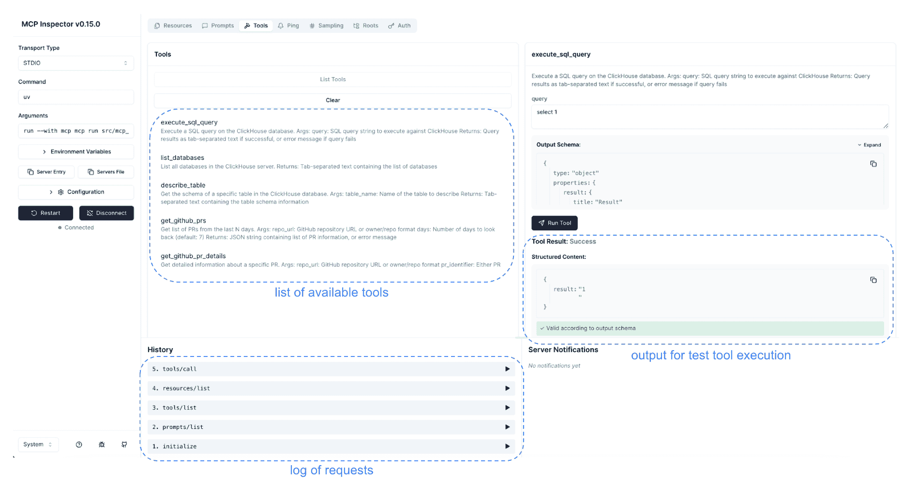

图片由作者提供

太好了！我们的第一个 MCP 服务器已在本地启动并运行。因此，现在是时候开始在实际中使用它了。

## 在 AI 工具中使用 MCP 服务器

正如我们讨论的那样，MCP 服务器的强大之处在于标准化，这使得它们可以与不同的 AI 工具一起工作。我将把我自己的工具集成到 Claude Desktop 中。由于 Anthropic 开发了 MCP，我预计他们的桌面客户端将对该协议提供最佳支持。然而，您可以使用其他客户端，如 Cursor 或 Windsurf ([其他示例客户端](https://modelcontextprotocol.io/clients))。

我不仅想利用我的工具，还想利用他人的工作。社区开发了大量的 [MCP 服务器](https://github.com/modelcontextprotocol/servers)，我们可以在需要常用功能时使用它们，而不是重新发明轮子。然而，请记住，MCP 服务器可以访问您的系统，因此请仅使用受信任的实现。我将使用两个参考服务器（用于演示 MCP 协议的功能和官方 SDK）：

+   [文件系统](https://github.com/modelcontextprotocol/servers/tree/main/src/filesystem) — 允许处理本地文件，

+   [Fetch](https://github.com/modelcontextprotocol/servers/tree/main/src/fetch) — 帮助 LLMs 获取网页内容并将其从 HTML 转换为 markdown 以提高可读性。

现在，让我们继续进行设置。您可以在[这里](https://modelcontextprotocol.io/quickstart/user)找到如何设置 Claude Desktop 的详细说明。所有这些工具都有配置文件，您可以在其中指定 MCP 服务器。对于 Claude Desktop，此文件将位于：

+   macOS: `~/Library/Application Support/Claude/claude_desktop_config.json`，

+   Windows: `%APPDATA%\Claude\claude_desktop_config.json`。

让我们更新配置以包括三个服务器：

+   对于 `analyst_toolkit`（我们的 MCP 服务器实现），我指定了 `uv` 命令、存储库路径和运行服务器的命令。我还添加了一个 `GITHUB_TOKEN` 环境变量，用于 GitHub 认证。

+   对于参考服务器，我只是从文档中复制了配置。由于它们是用不同的语言（TypeScript 和 Python）实现的，因此需要不同的命令（`npx` 和 `uvx`）。

```py
{
  "mcpServers": {
    "analyst_toolkit": {
      "command": "uv",
      "args": [
        "--directory",
        "/path/to/github/mcp-analyst-toolkit/src/mcp_server",
        "run",
        "server.py"
      ],
      "env": {
          "GITHUB_TOKEN": "your_github_token"
      }
    },
    "filesystem": {
      "command": "npx",
      "args": [
        "-y",
        "@modelcontextprotocol/server-filesystem",
        "/Users/marie/Desktop",
        "/Users/marie/Documents/github"
      ]
    },
    "fetch": {
        "command": "uvx",
        "args": ["mcp-server-fetch"]
      }
  }
}
```

就这样。现在，我们只需要重新启动 Claude Desktop 客户端，我们就可以访问所有工具和提示模板。

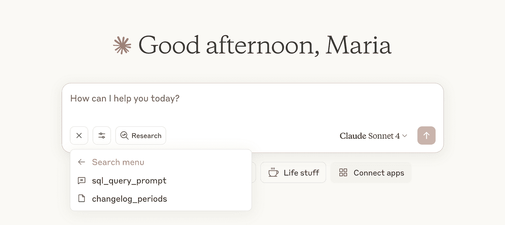

图片由作者提供

让我们尝试使用提示模板，并要求 LLM 可视化高级 KPI。

> **问题**：请展示自 2024 年初以来按月活跃客户数量和收入。请创建一个可视化，以查看动态，并将图像保存在桌面文件夹中。

我们对任务进行了相当高级的描述，没有提供有关数据架构或 ClickHouse 语言的详细信息。尽管如此，由于所有这些信息都包含在我们的提示模板中，LLM 仍然能够编写正确的 SQL 查询。

```py
select 
    toStartOfMonth(s.action_date) as month,
    uniqExact(s.user_id) as active_customers,
    sum(s.revenue) as total_revenue
from ecommerce.sessions as s 
inner join ecommerce.users as u on s.user_id = u.user_id
where s.action_date >= '2024-01-01' 
    and u.is_active = 1
group by toStartOfMonth(s.action_date)
order by month
format TabSeparatedWithNames
```

然后，代理使用我们的 `execute_sql_query` 工具获取结果，使用可视化组合 HTML 页面，并利用来自文件系统 MCP 服务器的 `write_file` 工具将结果保存为 HTML 文件。

最终报告看起来非常好。

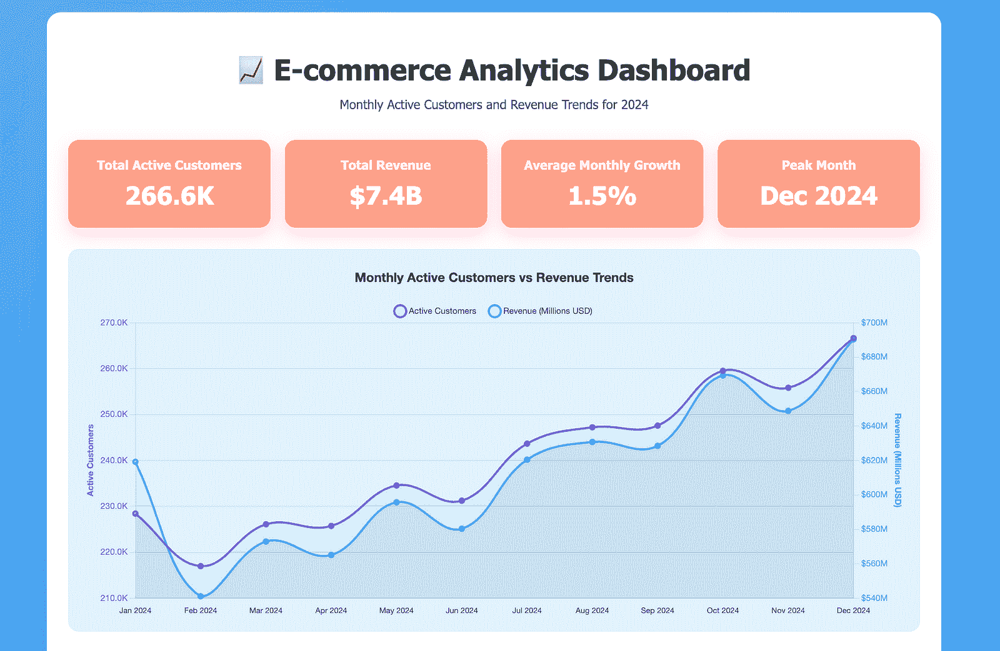

图片由作者提供

当前提示模板实现的局限性之一是您必须手动选择它。LLM 不能自动选择使用模板，即使它适合任务也是如此。我们将在即将到来的文章中尝试在我们的 AI 代理实现中解决这个问题。

另一个用例是通过询问过去一个月 llama-cookbook 仓库中的最新更新来尝试 GitHub 工具。代理成功完成了这项任务，并为我们提供了详细的摘要。

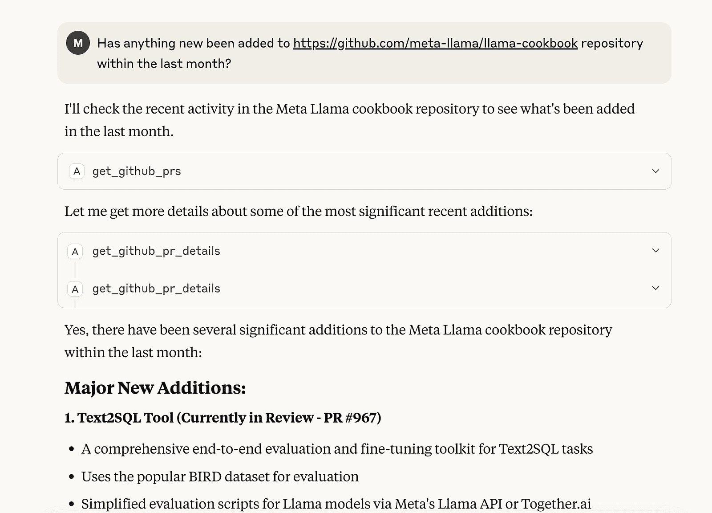

图片由作者提供

因此，我们已经学会了如何与本地 MCP 服务器协同工作。让我们讨论如果我们想更广泛地分享我们的工具，我们应该做什么。

## 与远程 MCP 服务器协同工作

我们将使用 Gradio 和 HuggingFace Spaces 来托管公共 MCP 服务器。Gradio 与 MCP 集成，使得服务器创建变得非常简单。构建 UI 和启动 MCP 服务器所需的全部代码如下。

```py
import gradio as gr
from statsmodels.stats.proportion import confint_proportions_2indep

def calculate_ci(count1: int, n1: int, count2: int, n2: int):
    """
    Calculate 95% confidence interval for the difference of two independent proportions.

    Args:
        count1 (int): Number of successes in group 1
        n1 (int): Total sample size in group 1
        count2 (int): Number of successes in group 2
        n2 (int): Total sample size in group 2

    Returns:
        str: Formatted string containing group proportions, difference, and 95% confidence interval
    """
    try:
        p1 = count1 / n1
        p2 = count2 / n2
        diff = p1 - p2

        ci_low, ci_high = confint_proportions_2indep(count1, n1, count2, n2)

        return f"""Group 1: {p1:.3f} | Group 2: {p2:.3f} | Difference: {diff:.3f}
95% CI: [{ci_low:.3f}, {ci_high:.3f}]"""

    except Exception as e:
        return f"Error: {str(e)}"

# Simple interface
demo = gr.Interface(
    fn=calculate_ci,
    inputs=[
        gr.Number(label="Group 1 successes", value=85, precision=0),
        gr.Number(label="Group 1 total", value=100, precision=0),
        gr.Number(label="Group 2 successes", value=92, precision=0),
        gr.Number(label="Group 2 total", value=100, precision=0)
    ],
    outputs="text",
    title="A/B Test Confidence Interval",
    description="Calculate 95% CI for difference of two proportions"
)

# Launch the Gradio web interface
if __name__ == "__main__":
    demo.launch(mcp_server = True)
```

我创建了一个单一的功能，用于计算两个独立比例差异的置信区间。在分析 A/B 测试结果时可能会有所帮助。

接下来，我们可以将此代码推送到 HuggingFace Spaces 以运行服务器。我在[我之前的一篇文章](https://towardsdatascience.com/understanding-retention-with-gradio-c288b48918af/)中详细介绍了如何操作。在这个例子中，我创建了此空间—[`huggingface.co/spaces/miptgirl/ab_tests`](https://huggingface.co/spaces/miptgirl/ab_tests)。它有一个简洁的界面，并公开了 MCP 工具。

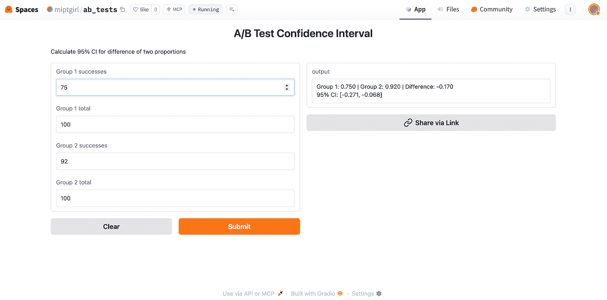

图片由作者提供

接下来，我们可以像这样将服务器添加到我们的 Claude Desktop 配置中。这次我们使用 `mcp-remote` 作为传输，因为我们现在正在连接到远程服务器。

```py
{
  "mcpServers": {
    "gradio": {
      "command": "npx",
      "args": [
        "mcp-remote",
        "https://miptgirl-ab-tests.hf.space/gradio_api/mcp/sse",
        "--transport",
        "sse-only"
      ]
    }
  }
}
```

让我们用一个简单的 A/B 测试分析问题来测试它。它运行良好。LLM 现在可以根据统计显著性做出深思熟虑的判断。

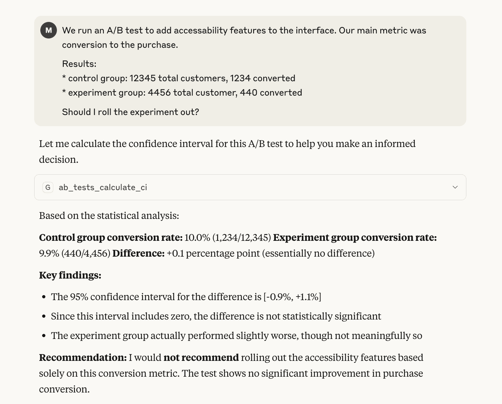

图片由作者提供

> *你还可以使用 Gradio 集成来构建 MCP 客户端—[文档](https://huggingface.co/learn/mcp-course/unit2/gradio-client)*

就这样！我们现在知道如何与更广泛的受众分享我们的工具。

## 摘要

在这篇文章中，我们探讨了 MCP 协议及其功能。让我们简要回顾一下主要观点：

+   MCP (模型上下文协议) 是由 Antropic 开发的一种协议，旨在标准化人工智能代理和工具之间的通信。这种方法将所需的集成数量从 M * N 减少到 M + N。MCP 协议使用客户端-服务器架构。

+   MCP 服务器公开能力（如资源、工具和提示模板）。你可以轻松使用 SDK 构建自己的 MCP 服务器，或者使用社区开发的服务器。

+   MCP 客户端是面向用户的程序（主机）的一部分，负责与服务器建立一对一的连接。有许多与 MCP 兼容的应用程序，例如 Claude Desktop、Cursor 或 Windsurf。

> *感谢阅读。希望这篇文章能给你带来启发。记住爱因斯坦的建议：“重要的是不要停止提问。好奇心有其存在的理由。”愿你的好奇心引导你发现下一个伟大的洞察。*

### 参考文献

本文灵感来源于 *DeepLearning.AI* 的短课程 [*“MCP: Build Rich-Context AI Apps with Anthropic”](https://www.deeplearning.ai/short-courses/mcp-build-rich-context-ai-apps-with-anthropic/) 和 *Hugging Face* 的 MCP 课程 [(https://huggingface.co/learn/mcp-course/unit0/introduction)](https://www.deeplearning.ai/short-courses/ai-agents-in-langgraph/)。
