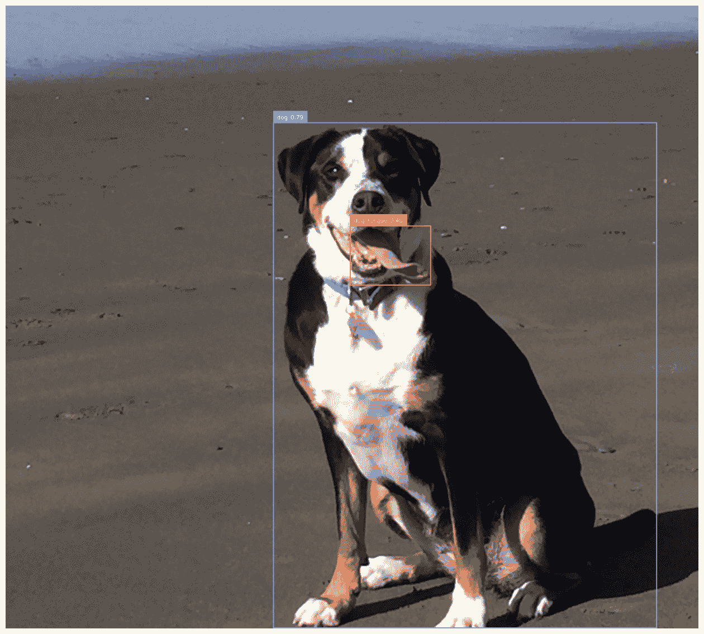
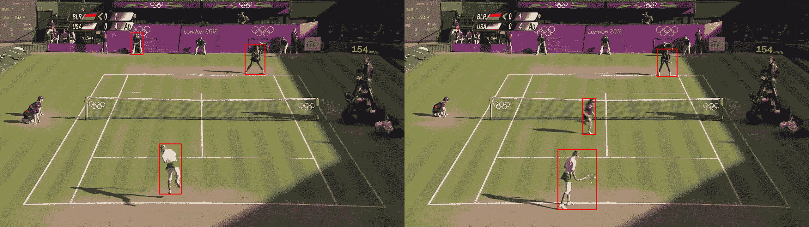
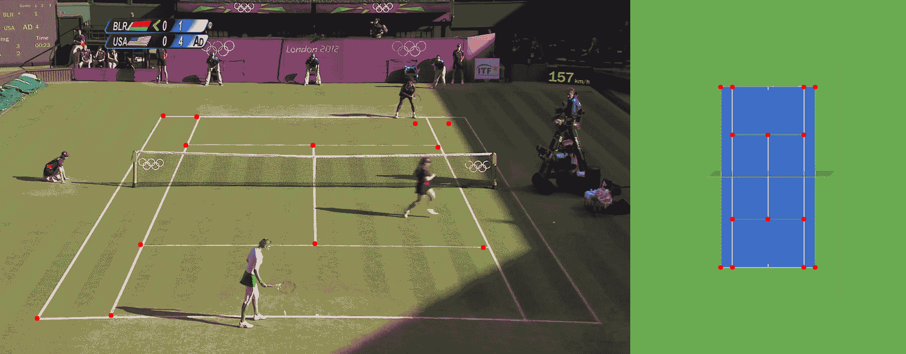
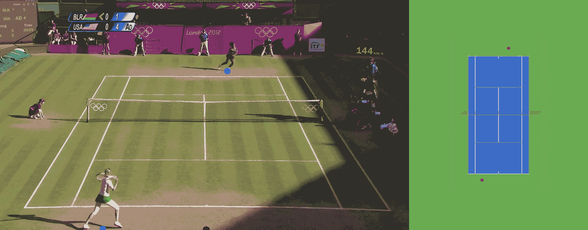

# 基于 Kalman 滤波的网球零样本球员跟踪

> 原文：[`towardsdatascience.com/zero-shot-player-tracking-in-tennis-with-kalman-filtering-80bba73a4247/`](https://towardsdatascience.com/zero-shot-player-tracking-in-tennis-with-kalman-filtering-80bba73a4247/)

随着体育跟踪项目的近期激增，许多项目受到 Skalski 流行的足球跟踪项目[Skalski’s popular soccer tracking project](https://x.com/skalskip92/status/1816162584049168389)的启发，出现了明显的转向，即使用自动球员跟踪来服务于体育爱好者。大多数这些方法遵循一个熟悉的流程：收集标记数据，训练 YOLO 模型，将球员坐标投影到场地或球场的俯视图上，并使用这些跟踪数据生成高级分析，以提供潜在的竞争洞察。然而，在这个项目中，我们提供了工具来绕过标记数据的需要，转而依靠 GroundingDINO 的零样本跟踪能力以及 Kalman 滤波器的实现来克服 GroundingDino 的噪声输出。

我们的数据集来源于一系列[广播视频](https://github.com/HaydenFaulkner/Tennis)，在 Hayden Faulkner 及其团队的 MIT 许可下公开发布。这些数据包括 2012 年温布尔登奥运会期间的各种网球比赛片段，我们专注于塞雷娜·威廉姆斯和维多利亚·阿扎伦卡之间的比赛。

对于不熟悉 GroundingDINO 的人来说，GroundingDINO 将目标检测与语言相结合，允许用户提供如“网球球员”这样的提示，然后引导模型返回符合描述的候选目标检测框。RoboFlow 有一个很好的教程[在这里](https://colab.research.google.com/github/roboflow-ai/notebooks/blob/main/notebooks/zero-shot-object-detection-with-grounding-dino.ipynb)，对于那些有兴趣使用它的人来说——但我也粘贴了一些非常基础的代码。如下所示，你可以提示模型识别那些在目标检测数据集中很少甚至从未被标记的对象，比如狗的舌头！

```py
from groundingdino.util.inference import load_model, load_image, predict, annotate

BOX_TRESHOLD = 0.35
TEXT_TRESHOLD = 0.25

# processes the image to GroundingDino standards
image_source, image = load_image("dog.jpg")

prompt = "dog tongue, dog"
boxes, logits, phrases = predict(
    model=model, 
    image=image, 
    caption=TEXT_PROMPT, 
    box_threshold=BOX_TRESHOLD, 
    text_threshold=TEXT_TRESHOLD
)
```



当提示“狗”和“狗舌头”时，GroundingDino 的输出。图片归作者所有。

然而，在职业网球场上区分球员并不像提示“网球球员”那样简单。模型经常错误地将场上的其他人员识别为球员，例如线裁判、球童和其他裁判，导致标注跳跃和不一致。此外，模型有时甚至无法在某些帧中检测到球员，导致出现间隔和非持续出现的框，这些框在每个帧中并不可靠地出现。



在第一个例子中，跟踪捕捉到了一位线球人员，在第二个例子中则是一位球人员。图像由作者制作。

为了解决这些挑战，我们应用了一些有针对性的方法。首先，我们将检测框缩小到所有可能框中概率最高的前三个。通常，线裁判的概率分数比球员高，这就是为什么我们不只过滤到两个框的原因。然而，这又提出了一个新的问题：我们如何在每一帧中自动区分球员和线裁判？

我们观察到，线和球人员的检测框通常具有较短的时间跨度，通常只持续几帧。基于这一点，我们假设通过在连续帧之间关联框，我们可以过滤掉只短暂出现的人，从而隔离球员。

那么，我们如何实现跨帧对象之间的这种关联呢？幸运的是，多目标跟踪领域已经广泛研究了这个问题。卡尔曼滤波器是多目标跟踪中的主要工具，通常与其他识别指标结合使用，例如颜色。就我们的目的而言，一个基本的卡尔曼滤波器实现就足够了。简单来说（想要深入了解，可以查看这篇[文章](https://towardsdatascience.com/what-i-was-missing-while-using-the-kalman-filter-for-object-tracking-8e4c29f6b795)），卡尔曼滤波器是一种基于先前测量对物体位置进行概率估计的方法。它在处理噪声数据时特别有效，同时在视频中关联时间跨度的物体也表现良好，即使检测不一致，例如当玩家不是每一帧都被跟踪时。我们在[这里](https://github.com/dcaustin33/kalman_filter_object_detection)实现了一个完整的卡尔曼滤波器，但将在接下来的段落中介绍一些主要步骤。

如下所示，二维卡尔曼滤波器状态相当简单。我们只需要跟踪 x 和 y 位置以及物体在两个方向上的速度（我们忽略加速度）。

```py
class KalmanStateVector2D:
    x: float
    y: float
    vx: float
    vy: float
```

卡尔曼滤波器操作分为两个步骤：它首先预测下一帧中物体的位置，然后根据新的测量值更新这个预测——在我们的例子中，来自物体检测器。然而，在我们的例子中，一个新帧可能有多个新对象，或者它甚至可能丢弃前一个帧中存在的对象，这导致了一个问题：我们如何将之前看到的框与当前看到的框关联起来？

我们选择使用马氏距离，并结合卡方检验来评估当前检测到的对象与过去对象匹配的概率。此外，我们保留了一个过去对象的队列，这样我们就有比一个帧更长的“记忆”。具体来说，我们的记忆存储了在过去 30 帧中看到的任何对象的轨迹。然后，对于我们在新帧中找到的每个对象，我们遍历我们的记忆，找到与当前对象最有可能匹配的先前对象，这是由马氏距离给出的概率确定的。然而，也有可能我们看到的是一个全新的对象，在这种情况下，我们应该将新对象添加到我们的记忆中。如果任何对象与我们的记忆中的任何框关联的概率小于 30%，我们就将其添加到我们的记忆中作为一个新对象。

对于喜欢代码的人来说，我们下面提供了完整的卡尔曼滤波器。

```py
from dataclasses import dataclass

import numpy as np
from scipy import stats

class KalmanStateVectorNDAdaptiveQ:
    states: np.ndarray # for 2 dimensions these are [x, y, vx, vy]
    cov: np.ndarray # 4x4 covariance matrix

    def __init__(self, states: np.ndarray) -> None:
        self.state_matrix = states
        self.q = np.eye(self.state_matrix.shape[0])
        self.cov = None
        # assumes a single step transition
        self.f = np.eye(self.state_matrix.shape[0])

        # divide by 2 as we have a velocity for each state
        index = self.state_matrix.shape[0] // 2
        self.f[:index, index:] = np.eye(index)

    def initialize_covariance(self, noise_std: float) -> None:
        self.cov = np.eye(self.state_matrix.shape[0]) * noise_std**2

    def predict_next_state(self, dt: float) -> None:
        self.state_matrix = self.f @ self.state_matrix
        self.predict_next_covariance(dt)

    def predict_next_covariance(self, dt: float) -> None:
        self.cov = self.f @ self.cov @ self.f.T + self.q

    def __add__(self, other: np.ndarray) -> np.ndarray:
        return self.state_matrix + other

    def update_q(
        self, innovation: np.ndarray, kalman_gain: np.ndarray, alpha: float = 0.98
    ) -> None:
        innovation = innovation.reshape(-1, 1)
        self.q = (
            alpha * self.q
            + (1 - alpha) * kalman_gain @ innovation @ innovation.T @ kalman_gain.T
        )

class KalmanNDTrackerAdaptiveQ:

    def __init__(
        self,
        state: KalmanStateVectorNDAdaptiveQ,
        R: float,  # R
        Q: float,  # Q
        h: np.ndarray = None,
    ) -> None:
        self.state = state
        self.state.initialize_covariance(Q)
        self.predicted_state = None
        self.previous_states = []
        self.h = np.eye(self.state.state_matrix.shape[0]) if h is None else h
        self.R = np.eye(self.h.shape[0]) * R**2
        self.previous_measurements = []
        self.previous_measurements.append(
            (self.h @ self.state.state_matrix).reshape(-1, 1)
        )

    def predict(self, dt: float) -> None:
        self.previous_states.append(self.state)
        self.state.predict_next_state(dt)

    def update_covariance(self, gain: np.ndarray) -> None:
        self.state.cov -= gain @ self.h @ self.state.cov

    def update(
        self, measurement: np.ndarray, dt: float = 1, predict: bool = True
    ) -> None:
        """Measurement will be a x, y position"""
        self.previous_measurements.append(measurement)
        assert dt == 1, "Only single step transitions are supported due to F matrix"
        if predict:
            self.predict(dt=dt)
        innovation = measurement - self.h @ self.state.state_matrix
        gain_invertible = self.h @ self.state.cov @ self.h.T + self.R
        gain_inverse = np.linalg.inv(gain_invertible)
        gain = self.state.cov @ self.h.T @ gain_inverse

        new_state = self.state.state_matrix + gain @ innovation

        self.update_covariance(gain)
        self.state.update_q(innovation, gain)
        self.state.state_matrix = new_state

    def compute_mahalanobis_distance(self, measurement: np.ndarray) -> float:
        innovation = measurement - self.h @ self.state.state_matrix
        return np.sqrt(
            innovation.T
            @ np.linalg.inv(
                self.h @ self.state.cov @ self.h.T + self.R
            )
            @ innovation
        )

    def compute_p_value(self, distance: float) -> float:
        return 1 - stats.chi2.cdf(distance, df=self.h.shape[0])

    def compute_p_value_from_measurement(self, measurement: np.ndarray) -> float:
        """Returns the probability that the measurement is consistent with the predicted state"""
        distance = self.compute_mahalanobis_distance(measurement)
        return self.compute_p_value(distance)
```

在过去 30 帧中跟踪了每个检测到的对象后，我们现在可以制定启发式方法来定位最有可能代表我们的玩家的框。我们测试了两种方法：选择基线中心最近的框，以及选择在我们记忆中观察历史最长的框。经验表明，第一种策略在实际玩家离开基线时经常将线裁判标记为玩家，这使得它不太可靠。同时，我们注意到 GroundingDino 倾向于在不同线裁判和球人之间“闪烁”，而真正的玩家保持了一种相对稳定的在场状态。因此，我们的最终规则是选择在我们记忆中跟踪历史最长的框作为真正的玩家。正如你在初始视频中看到的，这样一个简单的规则竟然如此有效！

现在我们已经在图像上建立了跟踪系统，我们可以转向更传统的分析，从鸟瞰角度跟踪球员。这个视角使得评估关键指标成为可能，例如总行程距离、球员速度和场地定位趋势。例如，我们可以根据点球时的位置分析球员是否经常针对对手的反手。为了完成这项任务，我们需要将球员坐标从图像投影到从上方观看的标准场地模板上，以对齐视角进行空间分析。

这就是单应性发挥作用的地方。单应性描述了两个表面之间的映射，在我们的情况下，这意味着将原始图像上的点映射到俯视图的场地。通过在原始图像中识别几个关键点——例如场上的线交点——我们可以计算出一个单应性矩阵，将任何点转换为鸟瞰视图。为了创建这个单应性矩阵，我们首先需要识别这些“关键点”。RoboFlow 等平台上的各种开源、许可模型可以帮助检测这些点，或者我们可以在参考图像上自己标记它们以用于转换。



如图所示，预测的关键点并不完美，但我们发现小的错误对最终的变换矩阵影响不大。

在标注这些关键点之后，下一步是将它们与参考场地图像上的对应点匹配，以生成单应性矩阵。然后，使用 OpenCV，我们可以用几行简单的代码创建这个变换矩阵！

```py
import numpy as np
import cv2

# order of the points matters
source = np.array(keypoints) # (n, 2) matrix
target = np.array(court_coords) # (n, 2) matrix
m, _ = cv2.findHomography(source, target)
```

手头有了单应性矩阵后，我们可以将图像中的任何点映射到参考场地上。对于这个项目，我们的重点是球员在场地上的位置。为了确定这一点，我们取每个球员边界框底部的中点，将其用作他们在鸟瞰图中的场地位置。



我们使用框底部的中间点来映射每个球员在场上的位置。插图显示了使用我们的单应性矩阵将关键点转换到从鸟瞰视角看到的网球场地上的情况。

总之，这个项目展示了我们如何利用 GroundingDINO 的无需标注数据的能力来跟踪网球运动员，将复杂的目标检测转化为可操作的球员跟踪。通过解决关键挑战——例如区分球员和其他场上的工作人员、确保帧间跟踪的一致性以及将球员动作映射到场地鸟瞰图——我们为无需显式标签的稳健跟踪流程奠定了基础。

这种方法不仅能够解锁诸如行驶距离、速度和定位等洞察，而且还打开了更深层次的比赛分析的大门，例如射击目标和战略场地覆盖。通过进一步的优化，包括从 GroundingDINO 输出中提炼 YOLO 或 RT-DETR 模型，我们甚至可以开发出与现有商业解决方案相媲美的实时跟踪系统，为网球世界的教练和粉丝提供强大的工具。

* * *

1.  [@inproceedings](http://twitter.com/inproceedings){faulkner2017tenniset, 标题={TenniSet: A Dataset for Dense Fine-Grained Event Recognition, Localisation and Description}, 作者={Faulkner, Hayden and Dick, Anthony}, 书名={2017 International Conference on Digital Image Computing: Techniques and Applications (DICTA)}, 页码={1–8}, 机构={IEEE} }
